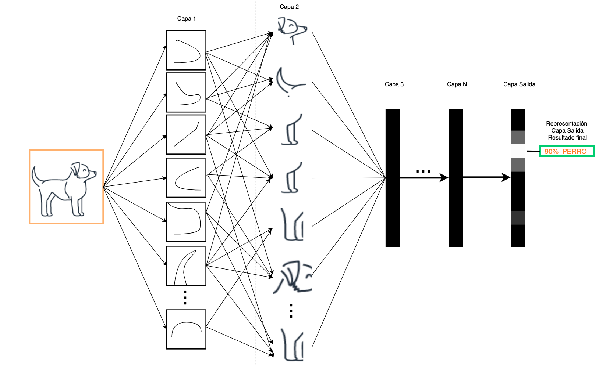

If you are a fan, like me, of applications that improve people’s quality of life, based on the latest technology, you have surely realized that what makes these applications better and more efficient is everything that involves Artificial Intelligence and Machine Learning

Some of these applications that use AI/ML are spam filtering in our email accounts, which uses ML techniques to identify and flag spam messages. Recommender systems on video streaming, ecommerce, or music platforms also use ML to suggest content that may interest us based on our interaction history, voice recognition and machine translation are also based on ML.

But have you ever wondered what is AI? What is ML? How does it learn ML? I am going to answer those questions and also explain the life phases of ML project. So that the next time you’re building an app that uses some amazingly new AI/ML-based service, you understand what’s behind it and what makes it so awesome.

Don’t worry, I’m not going to bore you with math 😉.

## What is Artificial Intelligence?

AI is the effort to automate tasks normally performed by humans, such as image pattern recognition, document classification, or a computerized chess rival.

 <h4 align="center">Fig. 1. Artificial Intelligence - Machine Learning - Deep Learning and Symbolic AI.</h4> 

AI incorporates (Fig. 1) Symbolic AI, it is what we know as traditional programming, output rules associated with inputs or decision criteria, and of course, it also incorporates ML, which in turn is sub-divided into Deep Learning (DL).

## What is Machine Learning?

ML focuses on the creation of systems or models that can learn from data and improve their performance in specific tasks, without the need to be explicitly programmed, making them learn from past experiences or examples to make decisions on new data. Unlike classical programming, where the human programmer writes the rules to be followed in code to transform the input data into the sought answers (Fig. 2).

 <h4 align="center">Fig 2. Symbolic AI vs Machine Learning.</h4> 

Now, I am going to explain the most relevant terms in ML:

|   |  |
| ------------- | ------------- |
|   | **Model:** is the representation that explains the observations. The trained model is the result of applying an ML algorithm with a data set; this trained model is used for inference with new observations.  |
|   | **Algorithm:** It is the procedure to learn a model capable of generalizing from the training data.  |
|   | **Training:** iterative processing of applying the learning algorithm. Consists in: <ul> <li> Apply the model (as is) to the variables of the observations and obtain the results according to the model. </li><li>Compare the model results with the actual values.</li><li>Establish a way to calculate the error between the model and reality.</li><li>Use the error as a basis to update the model in order to reduce the error.</li><li>Repeat until the model reaches the error levels that we have proposed and is capable of generalizing with observations that it has not seen in training.</li></ul>  |
|   | **Testing:** Measuring the performance of a data model through test data that you haven't seen.  |
|   | **Deployment:** Integration of the model into a production environment.  |
|   | **Dataset:** It is a data set, it can be images, text, numerical, everything that can be put together as relevant data.  |
---

## How does a Machine Learning model learn?

In order for the model to learn this, it must be “trained”, showing it the data so that it understands it and creates a relationship between it and the expected result. This relationship comes in the form of coefficients or parameters and is what the model learns, it is something like when we adjust a musical equalizer to obtain the best sound experience.

 

To learn these parameters, the model initially requires a definition.

For example:

 

**Model:** The relationship between Centimeters and Inches is given by the formula:

The model learning consists of applying an algorithm to obtain A and B from the observations of Cm and Inches that we may have from the data delivered. 

**Algorithm** (known as the ML algorithm) is applied iteratively over all the data (sometimes more than once) to find the parameters A and B. After several iterations of the algorithm we obtain a trained model, capable of generalizing the relationship between centimeters and inches for any new observations.

**Trained model**:

Returning to Fig. 1, we see that within ML we find a DL, a new question that answers.

## What is Deep Learning?

It is an ML technique that uses deep neural networks to learn from data.

Neural networks are a type of machine learning model, which made up of many layers of interconnected nodes that adjust as they are exposed to data.

DL is a hierarchical learning, where first layers learn elementary representations of data that transmit to the next one as input, they generate new information deliver to next one as input, and so on, processing and distilling  data through each layer, that can transform data in a relevant way for the next layer, to then learn abstractions more associated with inference or decision that must be made at output, producing the prediction.

In the example shown in Fig. 3, an image is introduced into a trained model: animal classifier. Initial layers separate image into small portions, obtaining basic representations that are increasingly abstracted, and according to their previous training, until output layer indicates result obtained: probability that it is a known animal

 <h4 align="center">Fig 3. Trained model: animal classifier.</h4> 

ML is subdivided into several types of learning, which I will explain soon below.

## Types of learning in ML:

 <h4 align="center">Fig 4. Types of learning in ML</h4> 

1. **Supervised Learning:** This istype of learning we have talked about so far. Inputs and outputs of model, also known as variables and labels respectively, are used in training to generalize model. It is able to learn from mistakes to improve predictions. It is divided into two types:

- **1.1. Regression:** It is used to predict the relationship between independent variables and a dependent variable. Is based on the idea that dependent variable can be modeled as a linear combination of independent variable and an error term.

For example, Fig. 5 shows a simple example of how values of a property increase as its surface area increases, creating a linear relationship between both characteristics.

 <h4 align="center">Fig. 5. Regression Example: Relationship between superficies of a property and its value.</h4> 

- **1.2. Classification:** Used to assign data to one of several categories (classes) based on certain characteristics. Once classifier has been altered, it can be used to make predictions about new and unknown data.

Binary classifiers deliver a value between 0 and 1 and multi-class classifiers capable of delivering a list of probability between 0 and 1, one for each class (our example of animals in Deep Learning).

2. **Unsupervised Learning:** The labels are not known, the model builds the patterns and structure of the data. It is divided into two types:

- **2.1. Clusterization**: Is a technique used to divide a data set into groups (clusters) according to certain characteristics, so data in same cluster is similar to each other, while data in different clusters is different.

Clustering is commonly used for data exploration and group analysis. For example, Fig. 6.

 <h4 align="center">Fig. 6. Clustering Example. </h4> 

- **2.2. Dimensionality Reduction:** is a technique used in machine learning to reduce the number of features (variables) in a data set, while keeping the most important information. This is achieved by removing redundant or irrelevant features, allowing machine learning models to be trained faster and with better results.

3. **Reinforcement learning:** it is a technique (Fig. 7) in which an agent interacts with its environment and receives rewards or punishments based on its actions. Agent learns through exploration and experimentation, striving to maximize the total reward received over time. This is accomplished by selecting actions that agent believes are most likely to produce a reward.

One example is [AWS Deep Racer](https://aws.amazon.com/deepracer/), where models are trained to compete in races as cars within tracks (virtual or physical).

 <h4 align="center">Fig. 7. Reinforcement Learning example. </h4> 

Now that we are more clear about what AI/ML is and how it works, we can approach an ML project by identifying phases in ML life cycle.

## Phases of life cycle of a Machine Learning project.

 <h4 align="center">Fig. 8. Phases of life cycle of a Machine Learning project. </h4> 

ML life cycle is a iterative and cyclical process (Fig. 8), adds clarity, insight into entire process, and structure to maximize  success of a ML project.

The best way to learn is with examples, putting your hands in, but in this blog we don’t have code to “get dirty”, so let’s develop phases assuming we want to build a model that evaluates bank fraud:

|  Phases | In model that evaluates bank fraud|
| ------------- | ------------- |
|**Identify commercial objective:** most important phase. We must have the idea of problem to be solved, measurable value for business and success criteria. You have to ask yourself, is it necessary to use ML?, since it is not always necessary, in addition to requirement for data, to evaluate capacities of organization and align leaders.| Business objective is reduce fraud in bank transactions. A decrease in fraud rate by X percentage points means an improvement in refund costs by Y, and an improvement in customer satisfaction by Z.|
| **Define ML solution:** If we are in this phase, it is because we have identified that our problem can be solved with ML, performance metrics and success criteria are defined.  Strategy for data collection and labeling is created.  | Supervised - Classifier model is selected, it must correctly identify 85% of fraudulent transactions to meet objective. Error of classifying a fraudulent transaction as correct must not exceed 10%. The data is going to be history of the transactions with “fraudulent” - “legal” label, and also anonymized customer information. |
|  **Data processing:** Means available to obtain data must be defined (events, time series, IoT devices, events on social networks and more). Once ingestion and aggregation have been defined, must be labeled, and prepared to introduce and use them in learning model. | Establish the data ingestion and processing processes, to build the training and test datasets|
|  **Model development - Deployment:** Trained, adjusted and evaluated ML model, we take it to production to make inferences. In this stage, deployment strategy, infrastructure on which it will operate, inference latency pattern (realtime, async or batch) and how it will be made available to applications are defined. | Focus on an infrastructure capable of supporting inferences in real time, because we want to review transactions at moment  are made and be able to block fraud before it advances. For example, web service to invoke at the time of the transaction.|
|  **Monitoring:** We define rules to detect problems and send alerts. Problems to detect in this phase include: data and model quality, bias deviation among others. If necessary,  model should be re-trained. | Check whether data that is coming to us is statistically similar to ones that trained the model, we must also deliver inferences and the final result of  transaction in form of reports, or visualization panels (that is, It is important to confirm that  project is meeting objectives). Another action at this stage is to use experts to review doubtful transactions to help effectively define level of fraud and feed back model with new data for re-training.|

---

Most important thing about these models (apart from having excellent performance) is that the people who use it believe in it, for example, what would happen if a customer is making a legal purchase and the model labels it fraudulent by blocking card? we would have an angry customer wanting to change banks.

Always think in your client, how to provide them with best service, how to improve their quality of life or simply, how to make them happy, because client is not necessarily a person from whom you receive a monetary reward or an area in your organization; A client can also be your family who will enjoy some new application that you as a developer, now with knowledge in AI / ML, created for your home.

## Conclusions

I hope you enjoyed this read and it made you curious to develop more products based on AI/ML, now that you know the answers to the questions: What is Artificial Intelligence? What is machine learning? and How does an ML model learn?

We delve into concept of ML, the types that are learned and subset of ML called Deep Learning and at the end we develop the phases of an ML project with an example of bank fraud.

From now on, every time you use an [AI/ML Service](https://aws.amazon.com/machine-learning/) in an application, you will do so knowing that there is an ML model working for you, and you will be able to venture out to identify what kind of learning it is.

## References:

- Deep Learning with Python, Second Edition - Autor François Chollet

- [AWS Well-Architected machine learning lens](https://docs.aws.amazon.com/wellarchitected/latest/machine-learning-lens/machine-learning-lens.html)

- [Architect and build the full machine learning lifecycle with AWS: An end-to-end Amazon SageMaker demo](https://aws.amazon.com/es/blogs/machine-learning/architect-and-build-the-full-machine-learning-lifecycle-with-amazon-sagemaker/)
- [SkillBuilder Machine Learning plan](https://explore.skillbuilder.aws/learn/lp/28/machine-learning-learning-plan)

- [What is ai?](https://aws.amazon.com/es/machine-learning/what-is-ai/)

- [MLU-EXPLAIN](https://mlu-explain.github.io/)
