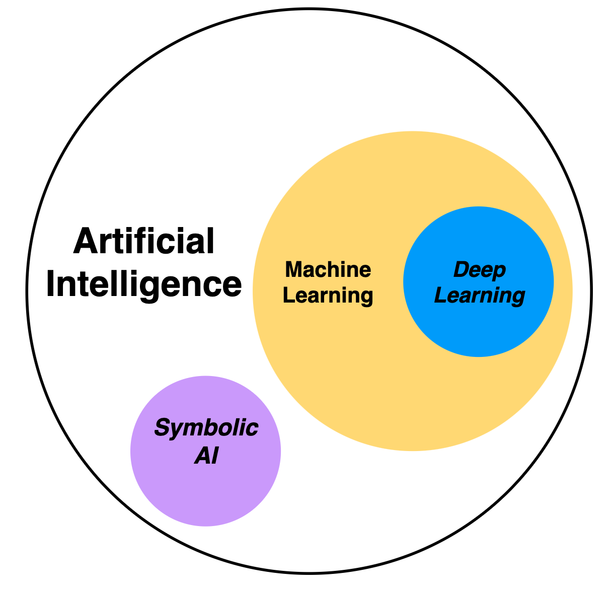

If, like me, you're a fan of applications that improve people’s quality of life, and if, like me, you're interested in what makes these apps work so well, you might've noticed a common component in many of them: Artificial Intelligence and Machine Learning.

Applications that use AI/ML include spam filtering in our email accounts, which uses ML techniques to identify and flag spam messages; recommender systems on video streaming, e-commerce, or music platforms also use ML to suggest content that may interest us based on our interaction history; voice recognition and machine translation are also based on ML.

But have you ever wondered what AI actually is? What about ML? I am going to answer those questions and also explain the life phases of ML projects, so the next time you’re building an app that uses some amazing, new AI/ML-based service, you understand what’s behind it and what makes it so awesome.

And don’t worry, I won't bore you with math 😉.

|ToC|
|---|

## What is Artificial Intelligence?

Artificial Intelligence, or AI, is the result of our efforts to automate tasks normally performed by humans, such as image pattern recognition, document classification, or a computerized chess rival.

(Fig. 1) AI encompasses various approaches: Symbolic AI, also referred to as "good old-fashioned AI" (GOFAI), uses explicitly defined rules and symbolic representations for problem-solving. It's similar to traditional programming in the sense that predefined guidelines drive the process, however it's more advanced as it permits inference and adaptation to new situations. Machine Learning (ML) is another AI approach that allows algorithms to learn from data. Deep Learning (DL) is a subset of ML that uses multi-layered, artificial neural networks.

## What is Machine Learning?

Machine Learning, or ML, focuses on the creation of systems or models that can learn from data and improve their performance in specific tasks, without the need to be explicitly programmed, making them learn from past experiences or examples to make decisions on new data. This differs from traditional programming, where human programmers write rules in code, transforming the input data into desired results (Fig. 2).

Now, I am going to explain the most relevant terms in ML:

|   |  |
| ------------- | ------------- |
|   | **Model:** A model is the representation that explains the observations. The trained model is the result of applying an ML algorithm with a data set. This trained model, now primed with specific patterns and understandings from the dataset, is subsequently used to draw inferences from new observations.  |
|   | **Algorithm:** An algorithm is a procedure implemented in code that guides a model in learning from data it's given. There are many machine learning algorithms. |
|   | **Training:** Training is the iterative process of applying the learning algorithm. Consists in:  * Applying the model (as is) to the variables of the observations and obtain the results according to the model.  * Comparing the model results with the actual values.  * Establishing a way to calculate the error between the model and reality.  * Using the error as a basis to update the model in order to reduce the error.  * Repeating until the model reaches the error levels that we have proposed and is capable of generalizing with observations that it has not seen in training.  |
|   | **Testing:** Measuring the performance of a data model using test data that it hasn't been trained on.  |
|   | **Deployment:** Integration of the model into a production environment.  |
|   | **Dataset:** The dataset is the raw material an ML model uses and interacts with. It can consist of images, text, numerical values, and anything else that can be put together as relevant data.  |
---

## How Does a Machine Learning Model Learn?

To enable the model to learn, it must undergo "training". This involves showing it data so it can understand and form a relationship between the data and the expected result. This relationship takes shape in the form of coefficients or parameters, much like how we tweak a musical equalizer to achieve optimal sound.

To learn these parameters, the model initially requires a definition.

Consider this example:

**Model:** The relationship between Centimeters and Inches is given by the formula:

The learning process of the model consists of applying an algorithm to derive the values of A and B from the observed data of Centimeters and Inches.

This **Algorithm** (known as the ML algorithm) is applied iteratively over all the data (sometimes more than once) to find the parameters A and B. After several iterations of the algorithm, we obtain a trained model capable of generalizing the relationship between centimeters and inches for any new observations.

**Trained model**:

If we refer back to Fig. 1, we observe that Deep Learning (DL) resides within ML, which raises a new question to be answered.

## What is Deep Learning?

Deep Learning is an ML technique that uses deep neural networks to learn from data.

A neural network is a type of machine learning model made up of many layers of interconnected nodes that adjust as they are exposed to data.

DL is hierarchical learning where the initial layers learn elementary representations of data that are transmitted to the next layer as input. These layers generate new information, which is delivered to the subsequent layer as input, and so on. Thus, data is processed and distilled through each layer, transforming data into a relevant form for the next layer. This enables it to learn abstractions closely associated with the inference or decision that must be made at the output, thereby producing the prediction.

In the example shown in Fig. 3, an image is introduced into a trained model: animal classifier. Initial layers separate an image into small portions, obtaining basic representations that are increasingly abstracted, and according to their previous training, until the output layer indicates the result obtained: the probability that it is a known animal.

ML is subdivided into several types of learning, which I will explain below.

## Types of Learning in ML

 ("Fig 4. Types of learning in ML.")

1. **Supervised Learning:** This is the type of learning we have talked about so far. Inputs and outputs of the model, also known as variables and labels respectively, are used in training to generalize model. It is able to learn from mistakes to improve predictions. It is divided into two types:

- **1.1. Regression:** This is used to predict the relationship between independent variables and a dependent variable. It is based on the idea that the dependent variable can be modeled as a linear combination of the independent variables and an error term.

For example, Fig. 5 shows a simple example of how values of a property increase as its surface area increases, creating a linear relationship between both characteristics.

- **1.2. Classification:** This is used to assign data to one of several categories (classes) based on certain characteristics. Once classifier has been trained, it can be used to make predictions about new and unknown data.

Binary Classification is a type of classification where each data sample is assigned into one of two mutually exclusive classes. On the other hand, Multiclass Classification is where each data sample is assigned into one of more than two classes (like our example of animals in Deep Learning).

2. **Unsupervised Learning:** The labels are not known, the model discovers the patterns and structure in the data. It is divided into two types:

- **2.1. Clusterization**: This is a technique used to divide a data set into groups (clusters) based on certain characteristics. Data in the same cluster is more similar to each other than data in different clusters.

Clustering is commonly used for data exploration and group analysis. For example, Fig. 6.

- **2.2. Dimensionality Reduction:** This is a technique used in machine learning to reduce the number of features (variables) in a data set, while keeping the most important information. This is achieved by removing redundant or irrelevant features, allowing machine learning models to be trained faster and with better results.

3. **Reinforcement learning:** This is a technique (Fig. 7) in which an agent interacts with its environment and receives rewards or punishments based on its actions. The agent learns through exploration and experimentation, striving to maximize the total reward received over time. This is accomplished by selecting actions that the agent believes are most likely to produce a reward.

One example is [AWS Deep Racer](https://docs.aws.amazon.com/deepracer/index.html?sc_channel=el&sc_campaign=datamlwave&sc_geo=mult&sc_country=mult&sc_outcome=acq&sc_content=introduction-to-artificial-intelligence-and-machine-learning), where models are trained to compete in races as cars within tracks (virtual or physical).

Now that we are more clear about what AI/ML is and how it works, we can approach an ML project by identifying phases in the ML life cycle.

## Phases of the Life Cycle of a Machine Learning Project

The ML life cycle is an iterative and cyclical process (as depicted in Fig. 8) that provides clarity and insight into the entire process, structuring it to maximize the success of an ML project.

The best way to learn is through examples and hands-on practice. While this blog doesn't provide code to "get your hands dirty", let's explore the phases of this process by assuming we want to build a model to detect bank fraud:

|  Phases | In model that evaluates bank fraud|
| ------------- | ------------- |
|**Identify commercial objective:** This is the important phase. We must have a problem to be solved, a measurable value for business, and success criteria. You have to ask yourself, is it necessary to use ML to solve this problem? Not only do ML solutions require data, but you have to evaluate the capacities of the organization and align leaders.| In this case, the business objective is to reduce fraud in bank transactions. A decrease in fraud rate by X percentage points means an improvement in refund costs by Y, and an improvement in customer satisfaction by Z.|
| **Define ML solution:** If we are in this phase, it is because we have identified that our problem can be solved with ML, and performance metrics and success criteria have been defined.  The strategy for data collection and labeling has been created.  | Supervised - Classifier model must now be selected, and it must correctly identify 85% of fraudulent transactions to meet our objective. Error of classifying a fraudulent transaction as correct must not exceed 10%. The data is going to be the history of the transactions with “fraudulent” - “legal” labels, and also anonymized customer information. |
|  **Data processing:** This means available data must be defined (events, time series, IoT devices, events on social networks and more) and obtained. Once ingestion and aggregation have been defined, they must be labeled, and prepared to introduce and use them in the learning model. | Establish the data ingestion and processing processes to build the training and test datasets.|
|  **Model Development - Deployment:** We now take the trained, adjusted, and evaluated ML model to production to make inferences. In this stage, we must define the deployment strategy, the infrastructure on which the model will operate, the inference latency pattern (realtime, async, or batch), and how it will be made available to applications. | Focus on an infrastructure capable of supporting inferences in real time, because we want to review transactions at the moment they are made and be able to block fraud before it advances. For example, web service to invoke at the time of the transaction.|
|  **Monitoring:** We define rules to detect problems and send alerts. Problems to detect in this phase include data and model quality, bias deviation, and others. If necessary, the model should be re-trained. | Check whether data that is coming to us is statistically similar to that which trained the model. We must also deliver inferences and the final result of  transaction in the form of reports or visualization panels (that is, it is important to confirm that the project is meeting objectives). Another action at this stage is to use experts to review doubtful transactions to help effectively define the level of fraud and supply the model with new data for re-training.|

---

The most important thing about these models (apart from having excellent performance) is that the people who use it believe in it. For example, what would happen if a customer is making a legal purchase and the model labels it fraudulent by blocking their card? We would have an angry customer wanting to change banks.

Always think about your client, how to provide them with best service, how to improve their quality of life or simply, how to make them happy, because client is not necessarily a person from whom you receive a monetary reward or an area in your organization; a client can also be your family who will enjoy some new application that you as a developer, now with knowledge in AI/ML, created for them.

## Conclusion

I hope you enjoyed this read and it made you curious to develop more applications - especially now that you know the answers to the questions: What is Artificial Intelligence? What is machine learning? and How does an ML model learn?

We've delved into the concept of ML, explored the types of learning, explored a subset of ML known as Deep Learning, and finally, walked through the phases of an ML project using a bank fraud detection example.

From now on, every time you use an [AI/ML Service](https://aws.amazon.com/machine-learning/?sc_channel=el&sc_campaign=datamlwave&sc_geo=mult&sc_country=mult&sc_outcome=acq&sc_content=introduction-to-artificial-intelligence-and-machine-learning) in an application, you will do so knowing that there is an ML model working for you, and you will be able to venture out to identify what kind of learning it is.

## References

- [Deep Learning with Python](https://www.goodreads.com/book/show/59714701-deep-learning-with-python), Second Edition - Author François Chollet

- [AWS Well-Architected machine learning lens](https://docs.aws.amazon.com/wellarchitected/latest/machine-learning-lens/machine-learning-lens.html?sc_channel=el&sc_campaign=datamlwave&sc_geo=mult&sc_country=mult&sc_outcome=acq&sc_content=introduction-to-artificial-intelligence-and-machine-learning)

- [Architect and build the full machine learning lifecycle with AWS: An end-to-end Amazon SageMaker demo](https://aws.amazon.com/blogs/machine-learning/architect-and-build-the-full-machine-learning-lifecycle-with-amazon-sagemaker/?sc_channel=el&sc_campaign=datamlwave&sc_geo=mult&sc_country=mult&sc_outcome=acq&sc_content=introduction-to-artificial-intelligence-and-machine-learning)
- [SkillBuilder Machine Learning plan](https://explore.skillbuilder.aws/learn/lp/28/machine-learning-learning-plan)

- [What is ai?](https://aws.amazon.com/machine-learning/what-is-ai/?sc_channel=el&sc_campaign=datamlwave&sc_geo=mult&sc_country=mult&sc_outcome=acq&sc_content=introduction-to-artificial-intelligence-and-machine-learning)

- [MLU-EXPLAIN](https://mlu-explain.github.io/)
