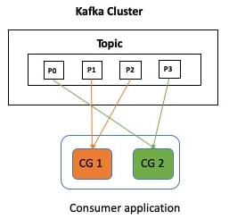

The number of myths and misconceptions associated with a technology is directly proportional to it's popularity i.e. the more tenured and widely-used a technology is, the likelihood of misnomers floating around is quite high. [Apache Kafka](https://kafka.apache.org/) is no different! It's sometimes referred to as a "queuing service" (terrible!), "pub/sub system" (acceptable, but not quite there), "messaging system" (not too bad) etc. 

> An "event streaming platform" is an accurate description by the way and [well explained in the documentation as well](https://kafka.apache.org/documentation/#intro_platform)).

But something more widespread (at least in my experience and discussion with fellow developers) is the confusion around **Whether Kafka is a Topic, or a Queue?** In addition to the "too many names" problem, what compounds this confusion is the fact that the word `topic` can be interpreted in a specific way in the the world of "messaging systems" - more on this later in the blog post. 

> In the case of Kafka, a *Topic* is a fundamental construct - think of it as something you send data to and receive data from. 

## What is a Queue?

Take a step back and recap the basic semantics of a queue.
At a high-level, the basic concepts of [Queue based systems](https://en.wikipedia.org/wiki/Message_queue) are - the queue (obviously!), worker processes (programs that get data from a queue and process it) and the distribution of the queue workload among the different worker processes.

To design a horizontally scalable system, you need to have multiple consumers processing data from the queue. The work distribution is such that each consumer gets a *different* set of items to process.

> How this is implemented, differs from system to system e.g. Kafka, Rabbit MQ, JMS (which is a specification with vendor specific implementations), etc.

### Now let's think about "Kafka as a Queue"

> **Spoiler!** Consumer Groups and topics allow Kafka to behave like a Queue. Continue reading for the details.

A typical application that needs to process data in Kafka uses the Consumer client API. It specifies which topic(s) it needs to get data from, processes it, commits offsets, etc.

> In fact, even with higher level components such as Kafka Connect or Kafka Streams, you end up using the Kafka Consumer API (indirectly) without being exposed to the underlying details

If a single consumer does not suffice i.e. it is unable to process data quickly enough to keep up with the rate of production, you can start additional consumer instances (horizontal scaling). All these instances can be categorized under a single (logical) entity known as a **Consumer Group** and Kafka will take care of distributing the workload among these individual instances. 

> The exact mechanics, protocol etc. of how this happens is outside the scope of this blog post

For fault tolerance and scalability, a Kafka topic is further divided into units called `partitions`. *Consumer Groups allow Kafka to behave like a Queue*, since each consumer instance in a group processes data from a non-overlapping set of partitions (within a Kafka topic). This is due to the default [RangeAssignor](https://kafka.apache.org/32/javadoc/org/apache/kafka/clients/consumer/RangeAssignor.html) partition assignment strategy. But you could potentially [use other strategies](https://kafka.apache.org/documentation/#consumerconfigs_partition.assignment.strategy) which adopt a different approach - for example, `CooperativeStickyAssignor` that's *maximally balanced while preserving as many existing partition assignments as possible*.

This diagram can help clarify this:

`CG1` and `CG2` stand for two Consumer Groups that are consuming from a single Kafka topic with four partitions - `P1`, `P2`, `P3` and `P4`.

The maximum number of consumers (hence the parallelism) depends on the number of topic partitions. Say you have four partitions in a topic and start with two consumers (in a group), each consumer will be allocated two partitions each. You can scale out your processing to a maximum of four instances, in which case each consumer will be assigned to one partition.

## Pub/Sub systems and Topics

Topics (sometimes also referred to as channels) are key to [Publish-Subscribe systems](https://en.wikipedia.org/wiki/Publish%E2%80%93subscribe_pattern) - they are used to broadcast information to *all* subscribers. 

> See how it's different from a queue where each consumer (assuming there are multiple consumers) instance processes a *different* set of data?

### Ok, "Kafka as a Topic"?

> **Spoiler!** Consumer Groups and topics allow Kafka to behave like a Topic (in a pub/sub system). Continue reading for the details.

Since data in Kafka is durable, it's common to use the same data in a variety of ways for different requirements. Thus you will end up building *multiple* applications, each consuming data from the *same* Kafka topic(s) but processing it in a specific (and different manner). Say, one application persists data in Kafka topics to a database (perhaps using Kafka Connect), another one simply filters data based on business rules, and yet another service executes stateful operations such as aggregations (maybe with Kafka Streams?) - it all depends on what your use-cases are.

> Diagram from the Apache Kafka [documentation](https://kafka.apache.org)

In this diagram `Consumer Group A` and `Consumer Group B` can be thought of as different applications and both will receive **all** the data from a topic - this is the key!

See how it aligns with the general pub/sub semantics that use topics to broadcast data to all the subscribers?

## To summarize...

With Kafka, you can leverage **both** Queue and Pub/Sub (or topic) based messaging semantics, thanks to a combination of Consumer Groups, Topics and Partitions.  To make the most out of Kafka, you will likely end up using both of them!

To keep things simple, I used the Kafka Consumer client API to demonstrate the concepts, but there is more. If you haven't already, I would highly recommend reading through how Sink connectors use the same paradigm on top of [Kafka Connect](https://docs.confluent.io/platform/current/connect/concepts.html#distributed-workers) to achieve their goals.

Happy Build-ing!
