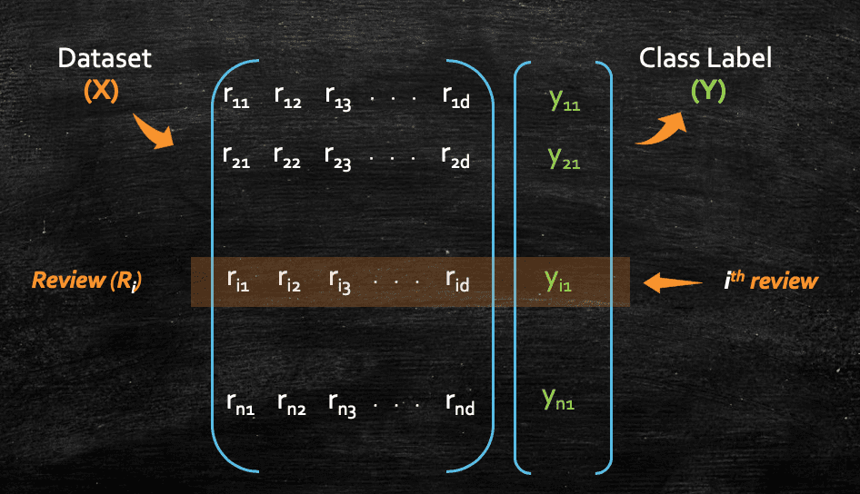
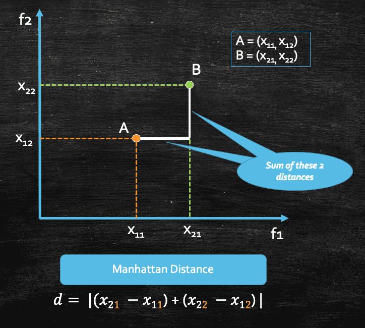
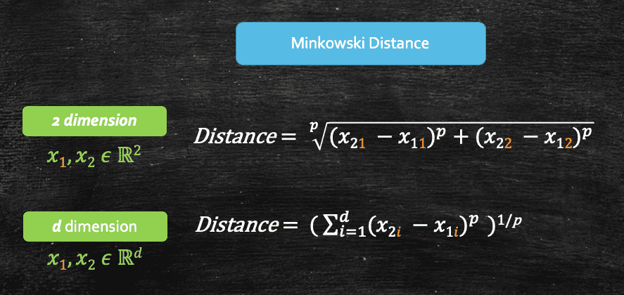

In this post, we shall delve into `k-Nearest Neighbors(k-NN)` algorithm.  One of the simplest yet very powerful algorithm, that can be used to solve very complex problems. We will start with some basic concepts, which always play an integral role irrespective of which algorithm we pick and that will help us set the premise before we dive deep into _k_-NN. We shall then proceed to solve some problems on Amazon SageMaker with the build-in _k_-NN, index based algorithm. 

However, before proceeding further, I would like to express my gratitude to, [Sachin Mittal](https://www.linkedin.com/in/mittsach/) (former Applied Scientist, Amazon) and [Srikanth Varma](https://www.linkedin.com/in/cskvarma/) (former Lead Machine Learning Scientist, Amazon). They have not only guided me but also countless other individuals worldwide. Thanks to their invaluable support, I have had the incredible opportunity to delve into the captivating fields of Data and Machine Learning.


# **Classification and Regression**

`Classification` and `Regression` can be considered as two different types of  prediction problems which comes under Supervised Machine Learning.

`Classification` are problems wherein the class/target labels have finite set of outcomes. Let's take an example of [Amazon Fine Food](https://www.kaggle.com/snap/amazon-fine-food-reviews) dataset wherein we have numerous  _customer reviews_ and each review has a class label of `positive` or `negative`. Now the problem in our hand is, we need to train a model such that, given a new _review_ text, our model should be able identify/predict whether the review is `positive` or `negative`. 


So, here if we see, the class label has a finite set of possibility (positive or negative). These type of problems are defined as a `classification` problem. 


Whereas in `regression` problems, the class/target label have infinite set of outcome, or in other words it can be any real number. For example, imagine that we have a dataset of students with input features as "Age, Gender and Race" and class/target label as `Height`. And now, we need to train a model such that, once the model is trained, it should be able to predict the `Height` of a student, given her/his _Age, Gender and Race_. 


Here if we see, `Height` could be any real number(e.g. 170 cm, 172.65 cm, and so on ...), which _cannot_ be defined by a finite set of possibilities. So, we can call these kind of problems as `regression` problem. 


# **Mathematical Notation** 

Now, let's spend some time to see how we can mathematically represent a _classification_ problem. We all know that machine learning is all about mathematics at the end of the day, so knowing a bit of it is always helpful, and we can stop before we feel dizzy :) 

Let's take the same example of Amazon Fine Review data set, where we have _n_ numbers of user reviews with class labels as `positive` or `negative`, which defines that a particular user review can be either a _positive_ review or a _negative_ review. So, the first thing that we generally do, is we convert each review into a _vector_(you can think of a _vector_ as an array of numbers), and we can always represent a vector as a `column vector` or a `row vector`. Data scientists and machine learning practitioner uses both, but if someone is simply referring a data point as vector, it's safe to assume, they are referring to a `column vector`. Having said that, most of the time we will have the context which will help us to identify that a given vector is a column vector or row vector. 


Now, let's convert each of our reviews into a vector(as I am not mentioning that it's a row vector or column vector, you can assume its a column vector). 


Let's focus on the _input feature_ only, so we can ignore the _class label_ for now. Next we would like to have all the reviews and form a _matrix_ wherein each `row` would represent `one review`. And we can do so, only after we convert each review vector into a row vector, and we know we can do so by taking a transpose of the vector. 


So, our matrix would look like this for all the _n_ reviews, where each row in the matrix represents each single review:



Here, we represented the class labels as _Y_ and each _Yi_ could be either 1 or 0 (positive or negative review). So, if we look now, we have converted the whole dataset mathematically in the form of `vector` and `matrix`. 

You might wonder, how we can convert each review into an array of number in first place as all the reviews would be in the form of plain text. There are different featurization techniques like [BOW](https://en.wikipedia.org/wiki/Bag-of-words_model), [TFIDF](https://en.wikipedia.org/wiki/Tf%E2%80%93idf), and [Word2Vec](https://en.wikipedia.org/wiki/Word2vec) one can use. For example, in BOW and TFIDF, the length of each review will be the number of unique words in the entire corpus. Whereas for Word2vec, each review will be a fixed-sized vector. We will not go into the details of those in this tutorial, but I would encourage you to explore few of these techniques, it's quite interesting. 

So, finally we can represent the data set mathematically as:


We should read the above equation as, _D_ is a set of pairs of _Xi_ and _Yi_ where _i_ goes from `1 to n`, such that _Xi_ belongs to `Rd`, thats is _Xi_ is a `d` dimensional vector where `d` can be any real values and Yi belongs to `{0, 1}`. 

# **k-Nearest Neighbors**

Now, we can finally dive into, _k-Nearest Neighbors(k-NN)_. It is also often know as _lazy learning_ algorithm, which can be used for both regression and classification problems. But before we get into the formal definition, lets try to understand k-NN algorithm from geometric prospective, and we will do so by taking a simple  binary classification example. Assume we have a dataset where each data point can belong to `class A` or `class B`.


The whole purpose of machine learning is to learn a function _f(x)_ from a given dataset so that later on, once the training is over, when we query with a new data point, and the function _f(x)_ should be able to predict which class the data points belongs to. Now, in this example, consider we have a new query point _`Q`_ which we give to the model, and we need to know which class this new query point _`Q`_ belongs to `class A` or `class B` 


Now if we intuitively think about it, we can see that geometrically, this query point _`Q`_ may belong to `class B` as all the points which are closed neighbors of the query point _`Q`_  belongs to `class B`


And we can conclude this by the intuition of closeness or proximity. And that's what _k-NN_ algorithm is all about, where _k_ denotes the no. of neighbors, and there are different techniques to find out the best possible value of _k_, which we will look into a bit later. 

Lets take a new query point _`S`_, and this time lets say we pick _`k=4`_, so now we can see below, that out of 4 neighbors of query point _`S`_, three of them belongs to `class B` and one of them belongs to `class A`, So, _k-NN_ would conclude that the query point _`S`_ belongs to `class B`, as the majority of the neighbors belongs to `class B`


So, what _k-NN_ does at high level for any _classification_ problem is:
- Finds _k_ nearest neighbors of the _query_ point _`q`_ 
- Notes the _`class labels`_ for all those neighbors 
- Takes the `majority vote` out of all the _class labels_, and whichever class gets the _maximum_ vote, it declares the same as the class label for the _query_ point _`q`_

So, it's always a great idea to have _k_ as some _odd_ number so that we can avoid ties during the majority voting. 

Similarly, in case of _k-NN_ for _regression_ problems, we do the same, but in place of `majority vote` it takes either `mean` or `median` of all the class labels, as in case of regression class labels would be any _real number_. And statistically `median` would be little less prone to outliers/noise. 

Now, let's look into how we can measure the distance of the query point from its neighbors.

# **Distance measures**

In the previous section, we learnt that we need to measure the distance of the query point from its neighbour, now let's try to understand what that distance means and how do we measure it. In fact, there are different types of distance measures, and we can use different distance measures depending on what problem we are trying to solve. 

Let's take an example. Assume we have 2 points (A and B), and we have two input features(f1 and f2).     


We can see that the distance between these two points _A_ and _B_ can be calculated using simple [_Pythagoras' Theorem_](https://en.wikipedia.org/wiki/Pythagorean_theorem) which would be the shortest distance between these two points, and we can denote it as _d_. And in machine learning or in geometry(in general) this distance is called `Euclidian Distance`. So, it's basically the shortest distance between two data points or vectors. 


Now, if we consider that our data set contains more than 2 features, lets say _d_ features, then the euclidian distance between 2 data points(x1 and x2), each with _d_ features would be this:


This above distance is also referred as `L2 Norm` of a vector, in simple terms, we generally refer them as:
- Euclidian Distance, when we consider 2 `points` 
- L2 Norm, when we consider 2 `vectors`

We will soon see, why its called L2 but important thing to remember is this, if anyone is referring to Euclidian Distance or L2 Norm, we can assume that they are referring to the same distance, but in a different context(points and vectors respectively)

There is another measure of distance called Manhattan Distance, which is geometrically represented as follows:



Again if we consider, our data set contains more than 2 features, let's say _d_ features, then for a given pair of points, the manhattan distance would be this:


And this distance is often called as `L1 Norm` of a vector. 

So far we have seen two different types of distance measures, `euclidian(L2 Norm)` and `manhattan(L1 Norm)`. We also have a generalisation of these two `L1` and `L2` Norms, which is called `Lp` Norm, also know as `Minkowski` distance, where _p_ could be any number. 



So, if we look at this we would realise that:
- When _p=1_, _Minkowski_ distance becomes _Manhattan_ distance 
- When _p=2_, _Minkowski_ distance becomes _Euclidian_ distance

There are many other types of distances we have like Hamming Distance, which is mostly used in test processing or boolean vectors, but its always important to understand these different types of distances, as these would often come as a hyperparameter while we train any models. 

So to summarise, we should remember:
- We refer to `Distance`, when we think about 2 _points_ 
- We refer to `Norm`, when we think about 2 _vectors_ 
- Manhattan Distance between 2 _points_ is same as L1 Norm of 2 _vectors_ 
- Euclidian Distance between 2 _points_ is same as L2 Norm of 2 _vectors_ 
- Minkowski Distance between 2 _points_ is same as Lp Norm of 2 _vectors_ 

We shall see later when we get into hands-on, that Amazon SageMaker's built-in k-NN Algorithm uses L2 Norm(Euclidean Distance) as the default distance measure. 

# **k-NN and its Effectiveness** 

Now that we have learnt a bit about different distance measure, let's now try to map it with our main topic _k-NN_, and put some numeric value to measure, and understand how good and effective our _k-NN_ algorithm is. Let's go back to our Amazon Fine Food review problem, and to recap quickly the problem was: Given a new food review(_Rq_), we need to predict its polarity, where polarity means whether the review is `positive` or `negative`. 

We learnt how k-NN works, it takes the _k_ nearest neighbouring points, checks their class label and takes the _majority vote_. But how do we know, how good our algorithm is ? 

Lets make a strategy:

1. Let's take the data set `D`, which has all the "_n_" no. reviews. 
2. Now, let's break the data set `D`, into two subgroups, `D_train` and `D_test`, such that any single review would be part of either `D_test` or `D_train`, but not to both. Wherein `D_train` dataset would be used during the _training_ and `D_test` would be used during _testing_
3. And after we train the k-NN with the `D_train`, we can pick each point from `D_test`, and use this data set `D_train` and `k-NN` to get its respective `class label` (prediction). 
4. Once we get the predicted class label, we can compare the prediction with the actual class label to understand the model accuracy.

But here is the funny part, `k-NN` is said to be a lazy learner. As in, there is no such training phase in real mean, unlike the machine learning algorithm. During the training phase it simply loads all the train data points into the RAM. Apart from that there's no learning. The actual task of prediction begins in the test phase. Hence we directly took the query point and measure the _k_ nearest points in the training data and then do the `majority voting` of the class labels for all those _k_ points. Hence, there is no training phase of the algorithm.  As the training phase consists of only storing the data points, we say that there's no training in KNN. 

So, we can imagine that k-NN has a large space complexity, if the data set is large, it would need a lot of memory to process. Also in terms of time complexity, its quite high as it has to measure the distance of the query point from all the points present in `D_Train`. For example, let's say we have _n_ of data points in `D_Train`, and each point is of _d_ dimension. In that case, it would take an order of `O(nd)` time to compute the k-nearest neighbour from the query point. This is dangerous if you think intuitively. Imagine, you are at amazon.com and posting a review for a product you bought. Now, lets say I am running a k-NN at the backend at amazon.com, whose task is to categorise each new review into positive or negative, and if the system takes `O(nd)` time to come up with the prediction, it might take several mins to categorise the review, and its not at all useful.

This is a limitation we have with k-NN, in its simplest form it has a large space and time complexity, when the dataset is large. Having said that, there are many techniques which helps optimising this algorithm like `KD-Tree`, `LSH(Locality Sensitive Hashing)`, etc. Although they are not perfect but these techniques can significantly reduce the space/time complexity of k-NN. 


# **How to pick the right `k` ?**

So far we have been assuming the value of k as 3, 5, 7, etc. And we learnt that it's always good to have some odd number to avoid any tie, while taking the majority vote. But what should be the right value of `k`, which would give us the best accuracy for our respective problem we are trying to solve using k-NN?

In k-NN, the value of k is a hyperparameter, meaning, we can parse the value of _k_ before we start the training. And it's important to understand how the value of k impacts our model's performance. 

- When `k=1`: This means, for a given query point, the `class` label for that query point would be same as the `class` label of its closest neighbour. So, here class label for the query point Q would be `+ve`


- When `k=5`: For this following query point the class label would be `+ve` as out of 5 closest neighbour, 4 of them have have the class label of `+ve` 


- When `k=n`: This means, let's say we have 1000 data points, and k=1000, no matter where the query point lies, k-NN would always predict the class label which have the majority of the class, e.g. if out of 1000 data points if 400 belongs to `+ve` and 600 belongs to `-ve`, no matter whats the actual class of the query point, the prediction would be always `-ve`. 

Now, we can geometrically plot the _decision surface_, and we would see something like this:


`Decision Surface` is generally used to visually see on plane where our algorithm is classifying the point as in this example as `+ve` or `-ve` class. As here for _different k_ the points on the plane will be classified into any class depending upon where the point lies on the plane from other points.

With this, we clearly see that as we increase the value of _k_, the smoothness of our decision surface increases, and when `k=n`, everything belongs to the majority class.

In machine learning we often come across these terms, `Overfit` and `Underfit`. If you consider the above plot, when `k=1`, we could classify a query point incorrectly due to some noise, in other words, if my decision surface is very rough, that actually indicates that the surface is capturing most of the noisy/outlier data point. And in those cases, we call the model as `Overfit`. 

Opposite to that, if we have a dumb model, where the model doesn't care much about the datapoint, and it classifies any new query point based on the majority class of the whole dataset, like what we have seen when `k=n`, such models are termed as `Underfit`. 

And a relatively smooth decision surface can be considered as a `Well-fit` model, like what we have seen when `k=5`, although it also makes wrong prediction, but in general that's a good and preferable model to have over an overfit model. It kind of takes the middle path between `Overfit` and `Underfit`. 


# **Need for Cross Validation**

Lastly, its worth to go over `Cross Validation` briefly before moving towards hands on, as we were discussing about `k-NN`. 

Initially the scientists used to divide the dataset into `train` and `test` datasets, which we have seen above. They just used to `fit` the model on the `train` data with different set of values of 'k' and used to check the performance on `test` data against all the models and then whichever value of 'k' used to give the best results on the `test` data, that would have been considered as the optimal value of k. But with this process we are able to fit the model on the train data and compute the hyperparameter(which is nothing but the value of `k`) using the test data, but not able to build a model that could generalise well on completely `unseen` data(ie., the data which was not used in training and cross validation phase). So far the model built works better on train and the test data as it has already seen both of them in computing the nearest neighbors and 'k' value.

So there came a new process called `Cross Validation(CV)` where the given dataset is divided into 3 parts names `train`, `cv` and `test` where they used to `fit` the model on the train data, compute the _hyperparameters_(right value of `k`) on the basis of cv data and then make the model _generalise_ to the test data(ie., checking how well the model performs on the unseen data). This way though the model has already seen both the train and cv data during the computation of Nearest neighbors(NN) and 'k' value, but it _hasn't_ seen the test data and so generalising the model using the test data have accomplished the objective of building an machine learning model. But here again there's a drawback. As we split the data into 3 parts now, Train, CV and Test, lets say in the ratio of 60%, 20% and 20% respectively, so what we are eventually doing is, we are using only 60% of the data to compute our NN(using the training data) and 20% of the data to compute `k`(using the CV data) and rest 20% for testing(using the test data, we use only 60% of the data compute NN, which is quite less and we know in general in machine learning more the training data, better is the algorithm. 

So, idea is to find some way wherein we can use more than 60% of the data for training. And here comes `k-fold cross validation` for our rescue. Don't get confused with k-fold and k-nn, both of these `k` are different. We can just think of `k` as a variable which could be any number. Let's take a quick example and understand this `k-fold cross validation`. 

To do cross validation, generally the data is split into `D(train)`, `D(CV)` and `D(test)` with 60%, 20% and 20% of data respectively(as we mentioned earlier). But to achieve a good k-NN algorithm function, more data should be use to train instead of just 60%. And since we can not do anything about the `D(test)` data, as we should not touch that and keep it as it is as _unseen_ data so that we can use the same to check the accuracy of our model. Therefore we mix the remaining 80% of the data, which comprises of `D(train)` and `D(CV)`.

Let's assume the value of `k=4` for the k-fold cross validation, we can call it as `4-fold` cross validation.  

So, this 80% data we split it into 4 equal parts(D1,D2,D3,D4) and it is done randomly. And now from these parts we try to find best NN and k by taking three parts as training the data and 1 part as CV data and it is done for each and every combination of the 4 parts and also for every value of k. For example,  D1, D2 and D3 will act as training data and D4 is used as to find accuracy from the training data(D1,D2,D3) by taking value of k = 1, and let's say we get accuracy from each iteration as a1,a2,a3 and a4. Now to find final accuracy for the value of k = 1, we take average of all accuracies.
And this same process is done for all values of k like 2,3,4.....n. From this a plot is plotted and best k can be observed.

# **Problem**

The [dataset](https://archive.ics.uci.edu/ml/datasets/covertype) we use contains information collected by the US Geological Survey and the US Forest Service about wilderness areas in northern Colorado. The features are measurements like soil type, elevation, and distance to water, and the labels encode the type of trees - the forest cover type - for each location. The machine learning task is to predict the cover type in a given location using the features. Overall there are seven cover types.

## **Amazon SageMaker Notebook** 

Before we get into the code, we need to make sure our SageMaker Notebook is ready, in case you are new to Amazon SageMaker Notebook, you may like to quickly go over [Create a Notebook Instance](https://docs.aws.amazon.com/sagemaker/latest/dg/howitworks-create-ws.html) section of the Sagemaker documentation. 

OK, we are all set now, let's go back to the problem statement we have in hand and start coding. 

### **Loading the necessary modules** 

Let's download the data set and save it in a folder 

```python
%%bash
wget 'https://archive.ics.uci.edu/ml/machine-learning-databases/covtype/covtype.data.gz'
mkdir -p /tmp/covtype/raw
mv covtype.data.gz /tmp/covtype/raw/covtype.data.gz 

```

### **Pre-Processing the Data** 
Now that we have the raw data, let's process it. 
We'll first load the data into numpy arrays, and randomly split it into train and test with a 90/10 split.

```python
import numpy as np
import os

data_dir = "/tmp/covtype/"
processed_subdir = "standardized"
raw_data_file = os.path.join(data_dir, "raw", "covtype.data.gz")
train_features_file = os.path.join(data_dir, processed_subdir, "train/csv/features.csv")
train_labels_file = os.path.join(data_dir, processed_subdir, "train/csv/labels.csv")
test_features_file = os.path.join(data_dir, processed_subdir, "test/csv/features.csv")
test_labels_file = os.path.join(data_dir, processed_subdir, "test/csv/labels.csv")

# read raw data
print("Reading raw data from {}".format(raw_data_file))
raw = np.loadtxt(raw_data_file, delimiter=',')

# split into train/test with a 90/10 split
np.random.seed(0)
np.random.shuffle(raw)
train_size = int(0.9 * raw.shape[0])
train_features = raw[:train_size, :-1]
train_labels = raw[:train_size, -1]
test_features = raw[train_size:, :-1]
test_labels = raw[train_size:, -1]
```

### **Upload to Amazon S3**

Now, since typically the dataset will be large and located in Amazon S3, let's write the data to Amazon S3 in [recordio-protobuf](https://docs.aws.amazon.com/sagemaker/latest/dg/cdf-training.html) format. We first create an io buffer wrapping the data, next we upload it to Amazon S3.

```python
import io
import boto3
import os
import sagemaker
import sagemaker.amazon.common as smac

bucket = "my-ai-bucket-suman"
prefix = "knn"
key = "recordio-pb-data"

print('train_features shape = ', train_features.shape)
print('train_labels shape = ', train_labels.shape)

buf = io.BytesIO()
smac.write_numpy_to_dense_tensor(buf, train_features, train_labels)
buf.seek(0)

boto3.resource('s3').Bucket(bucket).Object(os.path.join(prefix, 'train', key)).upload_fileobj(buf)
s3_train_data = 's3://{}/{}/train/{}'.format(bucket, prefix, key)
print('uploaded training data location: {}'.format(s3_train_data))

print('test_features shape = ', test_features.shape)
print('test_labels shape = ', test_labels.shape)

buf = io.BytesIO()
smac.write_numpy_to_dense_tensor(buf, test_features, test_labels)
buf.seek(0)

boto3.resource('s3').Bucket(bucket).Object(os.path.join(prefix, 'test', key)).upload_fileobj(buf)
s3_test_data = 's3://{}/{}/test/{}'.format(bucket, prefix, key)
print('uploaded test data location: {}'.format(s3_test_data))

```

Output:
```
train_features shape =  (522910, 54)
train_labels shape =  (522910,)
uploaded training data location: s3://my-ai-bucket-suman/knn/train/recordio-pb-data
test_features shape =  (58102, 54)
test_labels shape =  (58102,)
uploaded test data location: s3://my-ai-bucket-suman/knn/test/recordio-pb-data
```
### **Training**

Let's take a moment to explain at a high level, how Machine Learning training and prediction works in Amazon SageMaker. First, we need to train a model. This is a process that given a labeled dataset and hyper-parameters guiding the training process, outputs a model. Once the training is done, we set up what is called an endpoint. An endpoint is a web service that given a request containing an unlabelled data point, or mini-batch of data points, returns a prediction(s).

In Amazon SageMaker the training is done via an object called an estimator. When setting up the estimator we specify the location (in Amazon S3) of the training data, the path (again in Amazon S3) to the output directory where the model will be serialised, generic hyper-parameters such as the machine type to use during the training process, and kNN-specific hyper-parameters such as the index type, etc. Once the estimator is initialised, we can call its fit method in order to do the actual training.

Now that we are ready for training, we start with a convenience function that starts a training job. 

```python
import matplotlib.pyplot as plt
import time 
import sagemaker
from sagemaker import get_execution_role
from sagemaker.predictor import csv_serializer, json_deserializer
from sagemaker.amazon.amazon_estimator import get_image_uri


def trained_estimator_from_hyperparams(s3_train_data, hyperparams, output_path, s3_test_data=None):
    """
    Create an Estimator from the given hyperparams, fit to training data, 
    and return a deployed predictor
    
    """
    # set up the estimator
    knn = sagemaker.estimator.Estimator(get_image_uri(boto3.Session().region_name, "knn"),
        get_execution_role(),
        train_instance_count=1,
        train_instance_type='ml.m5.2xlarge',
        output_path=output_path,
        sagemaker_session=sagemaker.Session())
    knn.set_hyperparameters(**hyperparams)
    
    # train a model. fit_input contains the locations of the train and test data
    fit_input = {'train': s3_train_data}
    if s3_test_data is not None:
        fit_input['test'] = s3_test_data
    knn.fit(fit_input)
    return knn
```

Starting the training 

```python 
hyperparams = {
    'feature_dim': 54,
    'k': 10,
    'sample_size': 200000,
    'predictor_type': 'classifier' 
}
output_path = 's3://' + bucket + '/' + prefix + '/output'
knn_estimator = trained_estimator_from_hyperparams(s3_train_data, hyperparams, output_path, 
                                                   s3_test_data=s3_test_data)
```

Output

```
2023-07-11 11:44:55 Uploading - Uploading generated training model
2023-07-11 11:44:55 Completed - Training job completed
Training seconds: 247
Billable seconds: 247
```

### **Setting up the endpoint**

Now that we have a trained model, we are ready to run inference(prediction). The `knn_estimator` object above contains all the information we need for hosting the model. Below is a simple helper function that gives an estimator, sets up an endpoint that hosts the model. Other than the estimator object, we provide it with a name (string) for the estimator, and an `instance_type`. The `instance_type` is the machine type that will host the model. It is not restricted in any way by the parameter settings of the training job.

```python
def predictor_from_estimator(knn_estimator, estimator_name, instance_type, endpoint_name=None): 
    knn_predictor = knn_estimator.deploy(initial_instance_count=1, instance_type=instance_type,
                                        endpoint_name=endpoint_name)
    knn_predictor.content_type = 'text/csv'
    knn_predictor.serializer = csv_serializer
    knn_predictor.deserializer = json_deserializer
    return knn_predictor
```

Creating the `endpoint` 

```python
instance_type = 'ml.m4.xlarge'
model_name = 'knn_%s'% instance_type
endpoint_name = 'knn-ml-m4-xlarge-%s'% (str(time.time()).replace('.','-'))
print('setting up the endpoint..')
predictor = predictor_from_estimator(knn_estimator, model_name, instance_type, endpoint_name=endpoint_name)
```

Output:

```
setting up the endpoint..
---------------!
```

Once this is done, we can see the endpoint vis AWS Console as well, under Amazon SageMaker > Endpoints. 


### **Inference(Prediction)**

Now that we have our predictor, let's use it on our test dataset. The following code runs on the test dataset, computes the accuracy and the average latency. It splits up the data into 100 batches, each of size roughly 500. Then, each batch is given to the inference service to obtain predictions. Once we have all predictions, we compute their accuracy given the true labels of the test set.

```python
batches = np.array_split(test_features, 100)
print('data split into 100 batches, of size %d.' % batches[0].shape[0])

# obtain an np array with the predictions for the entire test set
start_time = time.time()
predictions = []
for batch in batches:
    result = predictor.predict(batch)
    cur_predictions = np.array([result['predictions'][i]['predicted_label'] for i in range(len(result['predictions']))])
    predictions.append(cur_predictions)
predictions = np.concatenate(predictions)
run_time = time.time() - start_time

test_size = test_labels.shape[0]
num_correct = sum(predictions == test_labels)
accuracy = num_correct / float(test_size)
print('time required for predicting %d data point: %.2f seconds' % (test_size, run_time))
print('accuracy of model: %.1f%%' % (accuracy * 100) )
```

Output:

```
data split into 100 batches, of size 582.
time required for predicting 58102 data point: 42.34 seconds
accuracy of model: 92.2%
```

### **Deleting the endpoint**

We're now done with the example except a final clean-up act. By setting up the endpoint we started a machine in the cloud and as long as it's not deleted the machine is still up and we are paying for it. Once the endpoint is no longer necessary, we delete it. The following code does exactly that.

```python
def delete_endpoint(predictor):
    try:
        boto3.client('sagemaker').delete_endpoint(EndpointName=predictor.endpoint)
        print('Deleted {}'.format(predictor.endpoint))
    except:
        print('Already deleted: {}'.format(predictor.endpoint))

delete_endpoint(predictor)
```

# **Reference**

You may like to visit the below mentioned books and source links which were referred to for the tutorial:

## **Amazon SageMaker:**
- [Amazon SageMaker Developers Guide](https://docs.aws.amazon.com/sagemaker/latest/dg/sagemaker-dg.pdf)
- [Amazon SageMaker Notebook Instances](https://docs.aws.amazon.com/sagemaker/latest/dg/nbi.html)

## **Books:**
- [Machine Learning by Tom Mitchell](http://profsite.um.ac.ir/~monsefi/machine-learning/pdf/Machine-Learning-Tom-Mitchell.pdf)
- [Python Machine Learning by Sebastian Raschka, Vahid Mirjalili](https://www.amazon.in/Python-Machine-Learning-scikit-learn-TensorFlow-ebook/dp/B0742K7HYF)


# **Conclusion** 

In conclusion, the k-Nearest Neighbors (k-NN) algorithm offers a versatile and intuitive approach to classification and regression problems in machine learning. Its simplicity and effectiveness make it a valuable tool for various applications. Through this blog post, we have explored the foundations of k-NN, including the geometric perspective, distance measures, and the importance of choosing an optimal value for k. Additionally, we have demonstrated the practical implementation of k-NN using Amazon SageMaker, showcasing the seamless integration of preprocessing, training, and inference. As you venture into your own machine learning projects, consider adding k-NN to your toolkit, leveraging its power to make accurate predictions based on local patterns in the data.

