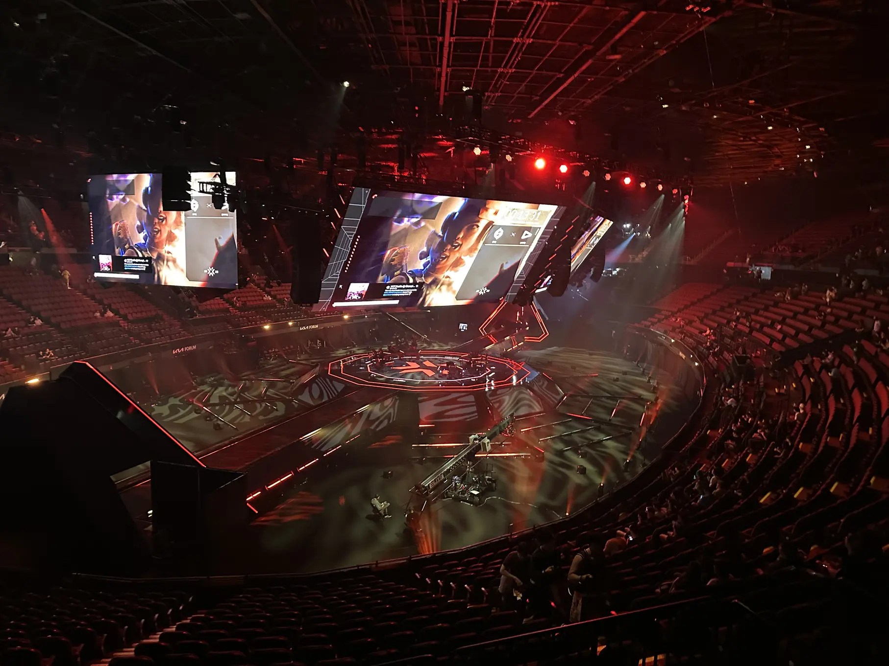
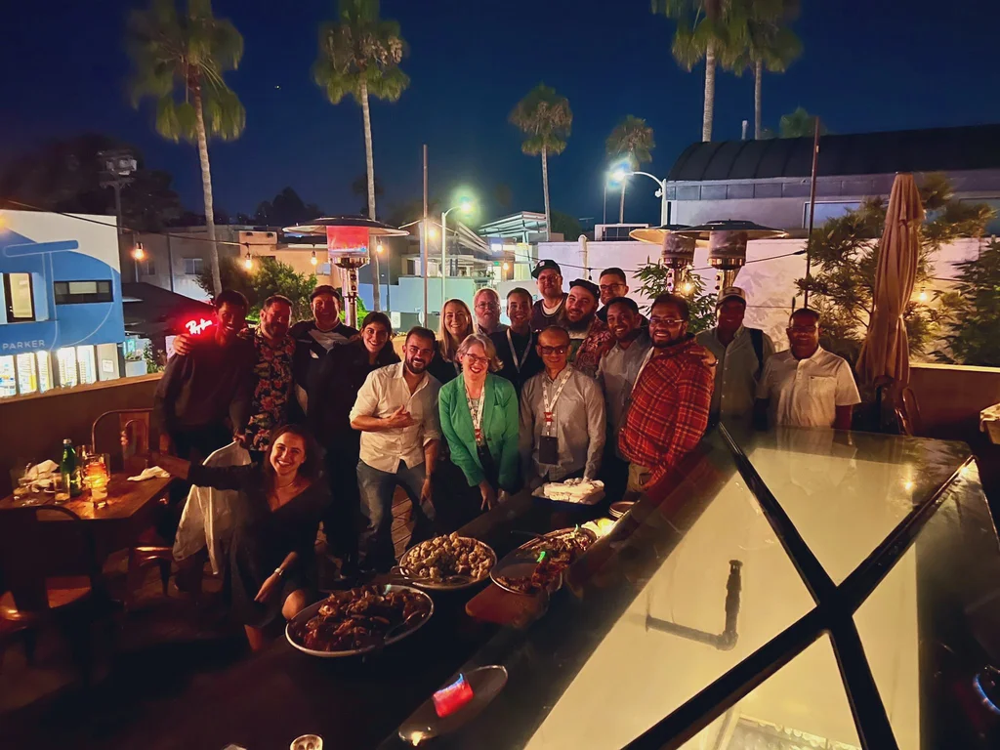

## Valorant World Championship 2023

[Valorant](https://playvalorant.com/en-us/) is a highly competitive first person shooter, with over a million players worldwide. It is a fast paced, twitchy game that requires skill, reflexes and lots of practice. The game consists of two teams of agents battling out on a map where one team is attacking and the other one is defending. With multiple different gameplay modes with different rules. While I have not played the game personally (I prefer games that allow me to have a coffee in one hand and keyboard/mouse in the other 😅), I definitely see the appeal and the thrill of winning a Multiplayer match. 

In July 2022 AWS and Riot entered into a 5 year partnership. As a Global gaming and entertainment leader, Riot offered unique opportunities for AWS to tell meaningful stories to builders and future IT leaders. This partnership lives at the intersection of data, gaming, sports and entertainment. Together, we are delivering exceptional experiences to players and bringing the drama of the game to life for fans at all levels and locales. Which brings me to this great opportunity! 👇

Late August 2023 the [Valorant World Championship](https://valorantesports.com/news/champions-los-angeles-ticket-sale-information/en-us) event was held in Los Angeles, and it featured 16 teams battling in multiple matches in a massive arena. It was such a spectacle to watch! And for any people out there stating that eSports are not sports, you should come and see one of these events, they are spectacular. 😍 The skills presented by the players, and the scale of the event blew me away.

Now, to enable such scale and also give the players a chance to build up skill. This game needs technology. Running the infrastructure needed for such a massive game is no simple feat and it requires a plethora of different technology stacks. Just think about the latencies that are required, when milliseconds can stand between you winning or losing a match. Let's not forget about the data, the MASSIVE amounts of data produced and served by Valorant. Working with, Storing and distributing this data is a huge feat in itself, and is a key component that enables players and teams to be the best they can be!

All of this is just fascinating, and I had a blast listening to experts from Riot talk about this. A few things I've learned: 
**a/:** Latency is a big challenge in the world of eSports; 
**b/:** People can do wonderful things with the data you provide them; and 
**c/:** Replicating data across the globe has its problems - do not store your data globally *unless you really need it*. 

If you wish to hear a bit about how does Valorant use the cloud, how they handle data, and what are the challenges of running such a game, here is a 30 minute video where I interview John, Gabriel and Brian from Riot where they share their stories.

https://youtu.be/JVhA7t4bP9A

## Learning from the best

Besides just enjoying a week full of Riot and eSports, I've had the absolute honor to spend some time with the absolute legends that are AWS heroes. The sheer passion to technology, the determination I see in these individuals always energizes me. Now, while a lot of the stuff we did there was fun and games, I did manage to sneak a bit of their time for them to teach me something. I've had a chance to get Two Brians from Boston (bAwston) to teach me something and discuss technology in front of a camera! 🥳

### My little coding helper

In this current world of 2023, I have a feeling that everyone is trying to build something with/on Generative AI. But I want to have Generative AI build for me! Rather, I want it to help me build stuff in the cloud. This is where AI Code generation comes into play. Namely, [Amazon CodeWhisperer](https://aws.amazon.com/blogs/aws/amazon-codewhisperer-free-for-individual-use-is-now-generally-available/?sc_channel=el&sc_campaign=datamlwave&sc_geo=mult&sc_country=mult&sc_outcome=acq&sc_content=valorant-world-championshio-learnings), and wonderful service that can use the power of Generative AI to help me write better code.

In the following video, enjoy [Brian Tarbox](https://www.linkedin.com/in/briantarbox/) and myself looking into and discussing the possibilities of Amazon CodeWhisperer and how can you use it, and how did we use it.

https://youtu.be/0jxOoGsKPls

### Happy little APIs

Taking a detour from Generative AI, [Brian Hough](https://www.linkedin.com/in/brianhhough/) has agreed to teach me how to work with GraphQL. A wonderful way to abstract a bunch of little happy (and not so happy) APIs and use GrapQL for all our data query needs. In the following video, Brian and I create a serverless application using REACT and AWS Amplify, we modify and work with AWS AppSync. Enjoy! 👏

https://youtu.be/zVttV2jKCCI
