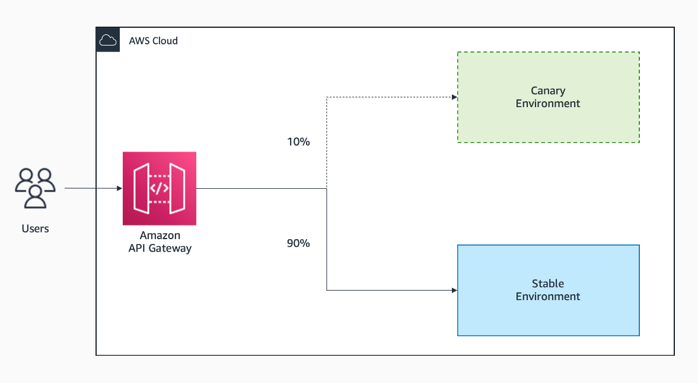

|ToC|
|---|

## Introduction to Blue/Green Deployments

Deploying to production is a critical step in the software deployment lifecycle. Given the risks, engineering teams should be careful, intentional, and decisive on the release process. Blue/green deployments reduce risk and maintain availability when deploying new features. It does this by deploying the new feature to a separate new environment, and then cutting over production traffic to the new environment. This enables a clean cut over with near zero downtime and allows for rollback. 

This post covers what you need to know for blue/green deployments, practical steps to get started on AWS, and a real-world example.

## Benefits of Blue/Green Deployments

Unlike traditional *in-place* deployments, blue/green deployments make it easy for teams to validate a new update for release, while continuing the current version of the application in parallel. This is facilitated by creating two isolated environments blue (current production environment) and green (parallel new environment). With this approach, you benefit from the ability to: 

* Validate the new update by sending test traffic (e.g. a small sample of production users)
* Run smoke tests to verify important functions prior to release
* Rollback to the previous version in the blue environment if things don’t go as planned

Ultimately, the approach simplifies operations and reduces overall deployment risks through automation.

## Key Considerations for Blue/Green Deployments

**Align your organisation on its benefits:** Adopting blue/green deployments can impact a broad stakeholder group including product and business teams. It is important that you articulate the benefits for each set of stakeholders. For example, for the engineering team, it may mean greater satisfaction through greater confidence around deployments. For the product team, it may mean improved cycle time and a new approach on how to engage with new releases.  

**Scope your environment boundary and testing process:** Adopting blue/green deployments require scoping and testing. Depending on the architecture, the implementation can vary. For example, for a microservices architecture, you implement gradually and limit the blast radius to individual services. For a monolithic application, you may be required implement across the entire application, which  involves more extensive testing.

**Handle database schema changes:** A common approach is to decouple database schema changes from application code changes. In other words, you treat the database as outside of the blue/green environment boundary. Consider the following approaches:

* **Before deployment (additive):** The schema is changed first, before the blue/green deployment. Here, database schema changes must be backwards compatible, whereby the previous version of the application can still interact with the database without any errors. For example, this may be where you add new fields, entities or relationships to the database. 

* **After deployment (deletive):** The schema is changed last, after the blue/green deployment. Here, application code changes must be backwards compatible, whereby the application can interact with both the previous and new version of the database schema. For example, this may be where you remove fields, entities or relationships from the database. After executing the schema change, the previous version of the application will no longer be operational.

For more information, see [Best Practices for Managing Data Synchronization and Schema Changes](https://docs.aws.amazon.com/whitepapers/latest/blue-green-deployments/best-practices-for-managing-data-synchronization-and-schema-changes.html?sc_channel=el&sc_campaign=resiliencewave&sc_content=levelling-up-your-releases-a-deep-dive-into-blue-green-deployments&sc_geo=mult&sc_country=mult&sc_outcome=acq).

## Practical Steps to Get Started

### Managed Blue/Green Deployments

To quickly get started, AWS provides a number of fully managed blue/green deployment options. These fully managed capabilities help you take care of the heavy-lifting associated with implementation, so you can better focus building your application.

If you are getting started with a container-based application, [AWS App Runner](https://docs.aws.amazon.com/apprunner/latest/dg/what-is-apprunner.html?sc_channel=el&sc_campaign=resiliencewave&sc_content=levelling-up-your-releases-a-deep-dive-into-blue-green-deployments&sc_geo=mult&sc_country=mult&sc_outcome=acq) automates deployment using blue/green under the hood. 

If you are building a container-based application with Amazon Elastic Container Service (ECS) or a serverless application with AWS Lambda, you use [AWS CodeDeploy](https://aws.amazon.com/codedeploy/?sc_channel=el&sc_campaign=resiliencewave&sc_content=levelling-up-your-releases-a-deep-dive-into-blue-green-deployments&sc_geo=mult&sc_country=mult&sc_outcome=acq):

  * For Amazon ECS, you use [blue/green deployment with CodeDeploy](https://docs.aws.amazon.com/AmazonECS/latest/developerguide/deployment-type-bluegreen.html?sc_channel=el&sc_campaign=resiliencewave&sc_content=levelling-up-your-releases-a-deep-dive-into-blue-green-deployments&sc_geo=mult&sc_country=mult&sc_outcome=acq).

  * For AWS Lambda, you use [AWS Serverless Application Model (SAM) which comes built-in with CodeDeploy](https://docs.aws.amazon.com/serverless-application-model/latest/developerguide/automating-updates-to-serverless-apps.html?sc_channel=el&sc_campaign=resiliencewave&sc_content=levelling-up-your-releases-a-deep-dive-into-blue-green-deployments&sc_geo=mult&sc_country=mult&sc_outcome=acq).

With CodeDeploy, you can:

- Configure how traffic is shifted. As per the links above, this includes *all-at-once* where you shift all traffic to the new version, *linear* where you shift traffic in equal increments, or *canary* where traffic is shifted in two increments enabling you to test with a small percentage of traffic prior to full release. 
    
* Integrate to your CI/CD pipeline. For example, [Github Actions](https://github.com/aws-samples/aws-codedeploy-github-actions-deployment) or [Amazon CodePipeline](https://docs.aws.amazon.com/codepipeline/latest/userguide/action-reference-CodeDeploy.html?sc_channel=el&sc_campaign=resiliencewave&sc_content=levelling-up-your-releases-a-deep-dive-into-blue-green-deployments&sc_geo=mult&sc_country=mult&sc_outcome=acq). 
    
* Test automation using [lifecycle event hooks](https://docs.aws.amazon.com/codedeploy/latest/userguide/reference-appspec-file-structure-hooks.html#appspec-hooks-ecs?sc_channel=el&sc_campaign=resiliencewave&sc_content=levelling-up-your-releases-a-deep-dive-into-blue-green-deployments&sc_geo=mult&sc_country=mult&sc_outcome=acq). For example, you incorporate smoke tests into the `BeforeAllowTraffic` hook. 

If you are building an API, consider [Amazon API Gateway](https://docs.aws.amazon.com/apigateway/latest/developerguide/canary-release.html?sc_channel=el&sc_campaign=resiliencewave&sc_content=levelling-up-your-releases-a-deep-dive-into-blue-green-deployments&sc_geo=mult&sc_country=mult&sc_outcome=acq). API Gateway supports [canary releases](https://docs.aws.amazon.com/apigateway/latest/developerguide/canary-release.html?sc_channel=el&sc_campaign=resiliencewave&sc_content=levelling-up-your-releases-a-deep-dive-into-blue-green-deployments&sc_geo=mult&sc_country=mult&sc_outcome=acq) natively in addition to API management capabilities such as throttling and authorization. To get started, see sample code and patterns on [Serverless Land](https://serverlessland.com/patterns/apigw-canary-deployment-cdk).

### Using the Routing Layer 

If you require more advanced and granular controls over deployments, consider implementing blue/green deployment at the routing layer of your architecture. For example, you use [Amazon Route 53](https://docs.aws.amazon.com/whitepapers/latest/blue-green-deployments/update-dns-routing-with-amazon-route-53.html?sc_channel=el&sc_campaign=resiliencewave&sc_content=levelling-up-your-releases-a-deep-dive-into-blue-green-deployments&sc_geo=mult&sc_country=mult&sc_outcome=acq) where DNS is used as a mechanism for shifting traffic. Alternatively, you [swap the Auto Scaling Group behind an Elastic Load Balancer](https://docs.aws.amazon.com/whitepapers/latest/blue-green-deployments/swap-the-auto-scaling-group-behind-elastic-load-balancer.html?sc_channel=el&sc_campaign=resiliencewave&sc_content=levelling-up-your-releases-a-deep-dive-into-blue-green-deployments&sc_geo=mult&sc_country=mult&sc_outcome=acq) as illustrated by the diagram below. The diagram  shows a blue group carrying the production load, while a green group is staged and deployed with the new version of the application. When it’s time to deploy, you attach the green group to the existing load balancer to introduce traffic to the new environment.

While there are many ways to implement, the goal is to automate the process and ultimately reduce errors and costs. Overall, you should choose the appropriate implementation based on your architecture, the nature of your application, and goals for your organisation.

## A Real-World Experience

As a Solutions Architect, I advise CTOs, technical leaders and engineering teams on applying best-practices to get the most out of AWS. I worked with a scaling startup who dreaded their release process and was fearful of deployments. They experienced a number of incidents whereby intended production releases were not successful. The team was scarred by the painful experiences. 

As a result, both the application developers and platform team tend to stay back outside of business hours in order to deploy. They also developed step-by-step playbooks for rollbacks and risk mitigation. They believed that the impact to users will be minimal as most will use the platform during business hours. However, over time, they realised that it’s not full-proof: there were a number of customers that had a critical use the platform outside business hours. After switching their release windows to accommodate and going through the cumbersome release process numerous times, they decided to explore a better way. 

With curiosity to learn from Amazon’s engineering practices, I directed them to [Amazon Builders Library](https://aws.amazon.com/builders-library/going-faster-with-continuous-delivery/?sc_channel=el&sc_campaign=resiliencewave&sc_content=levelling-up-your-releases-a-deep-dive-into-blue-green-deployments&sc_geo=mult&sc_country=mult&sc_outcome=acq), a collection of resources based on Amazon’s own experience building software. They studied the post on continuous delivery and educated themselves on deployment approaches. They then championed the approach across the organisation and figured out a way to safely test a component of their application to minimise blast radius. They tested their rollback processes and adjusted their process for database schema changes to be suitable with the new process. With increased conviction, they rolled out the process across their entire application over time. 

Since implementing the approach, they noticed that they were able to release with confidence. Moreover, they iterated on their automated deployment process transitioning from initial manual tests to automated tests. They incorporated other best-practices such as using feature flags. They now release multiple times a day during business hours which allowed them to better coordinate with their product, sales and risk teams. Ultimately, the process helped drove greater innovation on behalf of their customers.

## Conclusion

Blue/green deployments offer much more than reducing risks and increasing confidence. The approach has been a game-changer for many AWS customers: from improving developer experience, culture and satisfaction, to greater agility and speed to release features and updates with confidence. If you haven’t tried blue/green deployments yet, give it a go and tell us what you think. Key resources and relevant documentation for the different approaches are linked throughout the post. 