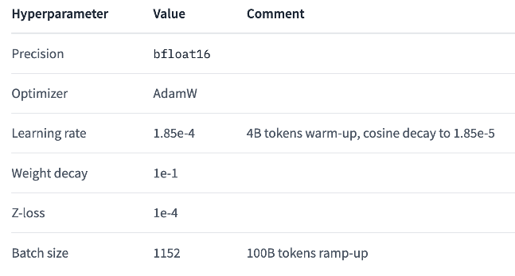

 
In this guide, we'll delve into deploying Falcon-40B, an open-source Large Language Model with 40 billion parameters, using Amazon SageMaker.

We'll describe three deployment options:

- SageMaker JumpStart - with sensible defaults.
- SageMaker JumpStart - using the SageMaker SDK.
- SageMaker Studio Notebook - a hands-on approach, allowing for detailed configuration and granular control.

But before we proceed, let's acquaint ourselves with the foundational aspects of Falcon-40B from the [model card published on Hugging Face](https://huggingface.co/tiiuae/falcon-40b).

## 1. Falcon-40B Open Source LLM Overview

Falcon-40B is one of a family of models that range in size from 7 billion, 40 billon, and 180 billion parameters.  The 40B denotes the 40 billon parameters version.  These models are causal decoder-only model built by the Technology Innovation Institute (TII) of the United Arab Emirates and are some of a very small number of genuinely open-source LLMs, made available under the Apache 2.0 license.  At one point Falcon-40B topped the (ever shifting) [Hugging Face LLM Benchmark](https://huggingface.co/spaces/HuggingFaceH4/open_llm_leaderboard) leader board.

Behind the scenes, Falcon-40B uses a variety of techniques to improve training efficiency, such as 3D parallelism and ZeRO optimization. The model also uses an advanced architecture, including flash attention and multi-query attention. These techniques enable the model to better 'understand' long-distance dependencies in texts.

### 1.1 Training data

Falcon-40B has been trained using 1000 billion tokens from [RefinedWeb](https://huggingface.co/datasets/tiiuae/falcon-refinedweb), a filtered and deduplicated high-quality web dataset. It's worth mentioning that the Falcon team considered the data quality of this dataset to be very good, so they also wrote a [paper](https://arxiv.org/pdf/2306.01116.pdf) for this high-quality dataset, as shown below.


Falcon-40B is trained mostly on English, German, Spanish, French, with limited capabilities also in in Italian, Portuguese, Polish, Dutch, Romanian, Czech, Swedish. The Falcon team say that it will not generalize well to other languages, and you should be aware that it could carry the stereotypes and biases commonly encountered online.

### 1.2 Training parameters

Falcon-40B was trained using Amazon SageMaker, using 384 A100 40GB GPUs on the [p4d instances](https://aws.amazon.com/ec2/instance-types/p4/). During training, the model used a 3D parallel strategy, with model states partitioned across all the GPUs (ZeRo). Model training began in December 2022 and took two months. The main training parameters are as follows:



### 1.3 Model architecture

Falcon-40B is a causal decoder-only model, trained on a causal language modeling task (i.e., predict the next token). The architecture is broadly adapted from the GPT-3 paper ([Brown et al., 2020](https://arxiv.org/abs/2005.14165)), with the following differences:

- **Positional embeddings**: rotary ([Su et al., 2021](https://arxiv.org/abs/2104.09864));
- **Multi-query attention** ([Shazeer et al., 2019](https://arxiv.org/abs/1911.02150)) and **Flash Attention** ([Dao et al., 2022](https://arxiv.org/abs/2205.14135));
- **Decoder-block**: parallel attention/MLP with two-layer norms.

## 2. Deploying Falcon-40B

> **!! Cost Warning !!** - While Falcon-40B may not be the biggest LLM out there, it is still a production scale LLM.  Running a model such as this in your account requires large compute instances to be run, such as the `ml.g5.12xlarge` (or larger). Before deploying any resources in your account always be sure to [check the pricing first](https://aws.amazon.com/pricing), and plan how you will decommission the resources when they are no longer needed.  Note that ALL the methods described in this post deploy large compute instances.

> **AWS Service Quotas** - Your AWS account has region-specific quotas for each AWS service. These quotas help protect the account from unexpected costs caused by unintended usage. You can request [increases for quotas](https://docs.aws.amazon.com/servicequotas/latest/userguide/request-quota-increase.html), and may have to, for the large instances used in this post.

The next few sections describe how to deploy Falcon-40B.  A prerequisite for ALL of these methods is to have Amazon SageMaker Studio up and running in your account. If you're an individual setting up this environment for experimentation, or a small project, this is easy to do and you can follow the instructions [here](https://docs.aws.amazon.com/sagemaker/latest/dg/gs-studio-onboard.html).  If you are part of a larger team, the setup is still straight forward, but will require a little planning to integrate with your existing workflows.  

Once you're up and running with Amazon SageMaker Studio, deploying Falcon-40B with sensible defaults is incredibly easy.  

### 2.1 Deploying Falcon-40B quickly, with sensible defaults

1. Navigate to JumpStart - First from the home page of SageMaker Studio, or from the left hand menu, select 'JumpStart':


2. Search for 'Falcon' - Now using the search box, search for `Falcon`:


3. Choose a version - There are a few versions of Falcon available in JumpStart, with different sizes and some that are instruction fine tuned.  Instruction fine-tuning is where the model has been further refined from it's base training to follow instructions or to chat. Developers deploying and using a model may well want to choose this version, where as ML engineers looking to further refine the model (fine-tune) will probably want to start from the non-instruction tuned model.  As well as that, JumpStart has a 7 and a 180 billion parameter version as well as the 40 billion parameter version we are using.  To deploy and use the Falcon-40B right now, select 'Falcon 40B Instruct BF16'.

4. You can review the deployment configuration options (see next), and or just click the deploy button - That's it.  You're done! _(Deployment may take between 15 and 20 minutes.)_


5. But wait, what sensible defaults were used? If you navigate to the `Deployment Configuration` you will see the options. The main default to be aware of, is the instance size used to deploy the model.  As you can see here, you can change this, but the minimum size is `mlg5.12xlarge`, which is quite a large instance.


6. You will see how to use the deployed SageMaker model endpoint later in this post.  In the meantime, to review what has been deployed, and when the time comes to shut down the endpoint when, use the left side menu to navigate to `SageMaker JumpStart` > `Launched JumpStart assets` then select the `Endpoints` tab.  From there select the endpoint that was deployed, scroll down and select `Delete`.

### 2.2 Deploying Falcon-40B, using the SageMaker SDK

Clicking buttons in SageMaker Studio is a great way to become familiar with some of the options available, but deploying models with code gives you more flexibility, and repeatability.

This section demonstrates how to quickly deploy Falcon-40B using Amazon SageMaker JumpStart via the SageMaker Python SDK.

1. As per the instructions above, navigate to the Falcon-40B model card in SageMaker JumpStart.

2. This time, rather than clicking `Deploy`, scroll down and select `Open notebook` from the 'Run in notebook' section.  This will open a Jupyter notebook up in SageMaker Studio with all the code ready to be used, reused or modified.


    - If you are prompted to 'Set up notebook environment' then selecting the default options will be fine. This instance being run here is to run the SDK code, the model itself will launch in a different container.  
    
    
    - You may need to wait for the notebook to start the kernel.    
    

3. When the notebook is up and running, you will see that the code is split into 3 main parts with `Deploy Falcon model for inference` being the section we want, to use the SDK for deploying Falcon-40B as a SageMaker endpoint.

4. Review the code and configuration in each of the cells, and run the code to deploy the endpoint.


### 2.3 Generating text with Falcon-40B deployed to via SageMaker JumpStart

Weather you deployed Flacon-40B through either of the methods above, we will now review how to use the endpoint, in code, to create generations.

1. If it's not already loaded, follow the steps above to open up the Falcon-40B notebook. 

2. Scroll through the notebook and find the section `1.3 About the model`.  In there you will see cells to query the endpoint using the `predictor` object. If you have just used this notebook to create the endpoint then the `predictor` object will be set.  If you created the endpoint in another session, or you created the endpoint using the JumpStart deploy button, we will need to create a `predictor` object ourselves.  

3. To create a `predictor` object we need to locate the name of the endpoint we have deployed.  To do this, navigate to `Launched JumpStart assets` in the left hand menu. Select `Model endpoints` from the tab, and note the `Title` of the deployed endpoint.


4. Beck in the notebook, to create a `predictor` add a new cell just before the cell that defines the `query_endpoint` function, and add the following code, making sure to use the name of the endpoint that is deployed in your account:

```python
from sagemaker.predictor import Predictor
from sagemaker.deserializers import JSONDeserializer
from sagemaker.serializers import JSONSerializer

endpoint_name = "jumpstart-dft-hf-llm-falcon-40b-instruct-bf16"

predictor = Predictor(
    endpoint_name, 
    serializer = JSONSerializer(), 
    deserializer = JSONDeserializer()
)
```

You can now use the code in the notebook to make text generations. For reference, this is sample code you can run (copied from the notebook):

```python
def query_endpoint(payload):
    """Query endpoint and print the response"""
    response = predictor.predict(payload)
    print(f"\033[1m Input:\033[0m {payload['inputs']}")
    print(f"\033[1m Output:\033[0m {response[0]['generated_text']}")

# Code generation
payload = {"inputs": "Write a program to compute factorial in python:", "parameters":{"max_new_tokens": 200}}
query_endpoint(payload)
```

Output:
````text
Input: Write a program to compute factorial in python:
 Output: 
You can compute factorial in Python using the built-in function `math.factorial()`. Here's an example:

```
import math

n = 5
factorial = math.factorial(n)
print(factorial)
```

This will output `120`, which is the factorial of 5.
````

## 3. Deploy Falcon-40B from Hugging Face into a SageMaker Endpoint

This section will detail how to deploy Falcon-40B to a SageMaker endpoint, and can be customized to deploy many other LLMs from Hugging Face in a similar way. To follow along with these instructions you will need a Python environment where you can install libraries etc.  Amazon SageMaker Studio would be great for this, but you can use any number of alternatives such as Visual Studio Code.  The following code assumes that you are developing a SageMaker Studio notebook (`File` > `New` > `Notebook`)

> The content of this section is partly based on Philipp Schmid's [blog](https://www.philschmid.de/sagemaker-falcon-llm). Philipp is a Technical Lead at Hugging Face, and an [AWS Machine Learning Hero](https://aws.amazon.com/developer/community/heroes/philipp-schmid/).

### 3.1 Setup development environment

We'll use the Amazon SageMaker Python SDK to deploy the Falcon-40B to the endpoint for model inference. We first need to make sure that the Amazon SageMaker Python SDK is properly installed. This is shown in the following code:

```python
# install supported sagemaker SDK
!pip install "sagemaker>=2.175.0" --upgrade –quiet

import sagemaker
import boto3

sess = sagemaker.Session()

# sagemaker session bucket -> used for uploading data, models and logs
# sagemaker will automatically create this bucket if it not exists
sagemaker_session_bucket=None
if sagemaker_session_bucket is None and sess is not None:
    # set to default bucket if a bucket name is not given
    sagemaker_session_bucket = sess.default_bucket()

try:
    role = sagemaker.get_execution_role()
except ValueError:
    iam = boto3.client('iam')
    role = iam.get_role(RoleName='sagemaker_execution_role')['Role']['Arn']

sess = sagemaker.Session(default_bucket=sagemaker_session_bucket)

print(f"sagemaker role arn: {role}")
print(f"sagemaker session region: {sess.boto_region_name}")
```

For more detailed IAM role configuration instructions for the permissions required by Amazon SageMaker, you can refer to [this document](https://docs.aws.amazon.com/sagemaker/latest/dg/sagemaker-roles.html).

### 3.2 Retrieve the Hugging Face LLM DLC

The Hugging Face LLM DLC is a dedicated inference container that makes it easy to deploy LLMs in a secure hosting environment. The DLC is powered by Text-Generative Inference ([TGI](https://github.com/huggingface/text-generation-inference)), an open source, purpose-built solution for deploying and servicing large language models (LLM). TGI uses tensor parallelism and dynamic batching to enable high-performance text generation for the most popular open source LLM. With the Hugging Face LLM Inference DLC launched on Amazon SageMaker, developers can get an LLM experience that supports high concurrency and low latency.

To deploy the model with the Hugging Face LLM DLC, first of all, we need to retrieve the container `uri` and provide it to the `HuggingFaceModel` model class, and point to that image using `image_uri`.

To retrieve the Hugging Face LLM DLC in Amazon SageMaker, we can use the `get_huggingface_llm_image_uri` method provided by the Amazon SageMaker SDK. This method allows us to retrieve the URI of the required Hugging Face LLM DLC based on the specified `backend`, `session`, `region`, and `version`. The example code is as follows:

```python
from sagemaker.huggingface import get_huggingface_llm_image_uri

# retrieve the llm image uri
llm_image = get_huggingface_llm_image_uri(
  "huggingface",
  version="0.9.3"
)

# print ecr image uri
print(f"llm image uri: {llm_image}")

```

For information on all the Hugging Face LLM DLC available, you can refer to the [documentation](https://github.com/aws/deep-learning-containers/blob/master/available_images.md#huggingface-text-generation-inference-containers).

### 3.3 Deploy Falcon-40B to Amazon SageMaker Endpoint

To deploy the Falcon-40B LLM to Amazon SageMaker endpoint, first of all, we need to create a `HuggingFaceModel` model class and define related endpoint configurations, including the `hf_model_id`, `instance_type`, etc. For this demo, we'll be using the `g5.12xlarge` instance type with 4 NVIDIA A10G GPUs and 96GB of GPU memory.

The example code for deploying the model to the endpoint is as follows.

```python
import json
from sagemaker.huggingface import HuggingFaceModel

# sagemaker config
instance_type = "ml.g5.12xlarge"
number_of_gpu = 4
health_check_timeout = 300

# TGI config
config = {
  'HF_MODEL_ID': "tiiuae/falcon-40b-instruct", # model_id from hf.co/models
  'SM_NUM_GPUS': json.dumps(number_of_gpu), # Number of GPU used per replica
  'MAX_INPUT_LENGTH': json.dumps(1024),  # Max length of input text
  'MAX_TOTAL_TOKENS': json.dumps(2048),  # Max length of the generation (including input text)
  # 'HF_MODEL_QUANTIZE': "bitsandbytes", # comment in to quantize
}

# create HuggingFaceModel
llm_model = HuggingFaceModel(
  role=role,
  image_uri=llm_image,
  env=config
)
```

Note the line of code commented out in the example code above.

```python
# 'HF_MODEL_QUANTIZE': "bitsandbytes", # comment in to quantize
```

This relates to **model quantification**. Full precision representations of these very large models often don’t fit into memory on a single or even several GPUs. To support an interactive notebook environment to fine-tune models of this size, we use a technique known as [Quantized LLMs with Low-Rank Adapters](https://arxiv.org/abs/2305.14314) (**QLoRA**). The QLoRA paper explores different data types, `4-bit Float` and `4-bit NormalFloat`. QLoRA is an efficient fine-tuning approach that reduces memory usage of LLMs while maintaining solid performance.

If you are interested in in-depth research on using the `bitsandbytes` library to do **4-bit quantization** based on QLoRA technology, you can check out this [blog post](https://huggingface.co/blog/4bit-transformers-bitsandbytes).

After creating the `HuggingFaceModel`, we can deploy it to the Amazon SageMaker endpoint using the `deploy` method. We'll deploy the model with the `ml.g5.12xlarge` instance type. [Text Generative Inference (TGI)](https://github.com/huggingface/text-generation-inference) will automatically distribute and shard the model across all GPUs, as shown in the following code.

TGI is a Rust, Python, and gRPC server for text-generated inference, used in Hugging Face's production environment. It provides support for Hugging Chat, the inference API, and inference endpoint.

The code for deploying the model to the Amazon SageMaker endpoint is shown below.

```python
# Deploy model to an endpoint
# https://sagemaker.readthedocs.io/en/stable/api/inference/model.html#sagemaker.model.Model.deploy

llm = llm_model.deploy(
  initial_instance_count=1,
  instance_type=instance_type,
  # volume_size=400, # If using an instance with local SSD storage, volume_size must be None, e.g. p4 but not p3
  container_startup_health_check_timeout=health_check_timeout, # 10 minutes to be able to load the model
)
```

After submitting and running the above code, Amazon SageMaker will now create the endpoint and deploy the model to it. This will take about 10 minutes to execute.

### 3.4 Run Inference and Chat with the Model

Once the endpoint is deployed, we can use the `predict` method from the `predictor` to begin model inference.

We can use different parameters to control the generation, which can be defined in the payload's `parameters` attribute. The Hugging Face LLM Inference Container supports various generation parameters, including `top_p`, `temperature`, `stop`, and `max_new_token`. You can find the full list of supported parameters [here](https://huggingface.co/blog/sagemaker-huggingface-llm#4-run-inference-and-chat-with-our-model). 

Because the **tiiuae/falcon-40b-instruct model** we deployed is a conversational chat model, we can chat with the model using the following prompts:

```python
# define payload
prompt = """You are an helpful Assistant, called Falcon. Knowing everyting about AWS.

User: Can you tell me something about Amazon SageMaker?
Falcon:"""

# hyperparameters for llm
payload = {
  "inputs": prompt,
  "parameters": {
    "do_sample": True,
    "top_p": 0.9,
    "temperature": 0.8,
    "max_new_tokens": 1024,
    "repetition_penalty": 1.03,
    "stop": ["\nUser:","<|endoftext|>","</s>"]
  }
}

# send request to endpoint
response = llm.predict(payload)

# print assistant respond
assistant = response[0]["generated_text"][len(prompt):]
```

It will generate a sentence describing “Amazon SageMaker”. To make it easier for readers to read, I have copied the Falcon-40B model’s output as follows:

```txt
Amazon SageMaker is a fully managed platform that enables developers and data scientists to quickly build, train, and deploy machine learning models in the cloud. It provides a wide range of tools and services, including Jupyter notebooks, algorithms, pre-trained models, and easy-to-use APIs, so you can quickly get started building machine learning applications.
```

We can continue to ask the Falcon-40B model question, such as:

```python
new_prompt = f"""{prompt}{assistant}
User: How would you recommend start using Amazon SageMaker? If i am new to Machine Learning?
Falcon:"""
# update payload
payload["inputs"] = new_prompt

# send request to endpoint
response = llm.predict(payload)

# print assistant respond
new_assistant = response[0]["generated_text"][len(new_prompt):]
print(new_assistant)

```

The answers given to me by the Falcon-40B model is as follows:

```txt
If you're new to machine learning, you can start with pre-built algorithms and pre-trained models available in Amazon SageMaker. You can also use Jupyter notebooks to create and run your own experiments. Additionally, you can take advantage of the AutoPilot feature to automatically build and train machine learning models based on your data. The best way to get started is to experiment and try different things to see what works best for your specific use case.
```

### 3.5 Delete the Model and Endpoint

We've deployed the Falcon-40B open-source LLM to the Amazon SageMaker endpoint and successfully performed model inference. Once you've completed all the codes, remember to delete resources and clean up the environment, including models and endpoints, to avoid unnecessary costs.

Example code for deleting resources and cleaning up the environment is as follows:

```python
llm.delete_model()
llm.delete_endpoint()
```

## Conclusion

In this post we have reviewed a number of methods for deploying the Flacon-40B open-source large language model on AWS.  

First, we used Amazon SageMaker JumpStart to deploy without any code, using sensible defaults. This method allows you to get up and running extremely quickly without any prior knowledge of AL/ML coding.

Next we deployed the model using minimal code, using the Amazon SageMaker SDK. This approach allows us to deploy the model in a repeatable code driven way with a greater amount of customization. 

Finally we deployed the model into a Amazon SageMaker container, pulling the model from HuggingFace. This method offers a great amount of flexibility (such as deployment instance types, image version, TGI parameters, etc.), and can be used to deploy many different models from the HuggingFace hub.

In the next post, we'll explore using Amazon SageMaker Notebook to quickly and efficiently fine-tuning LLMs in an interactive environment. We will use the **QLoRA** and **bitsandbtyes 4-bits quantization library** to fine-tuning the Falcon-40B model using Hugging Face PEFT on Amazon SageMaker. This topic is currently a cutting-edge topic in the field of LLMs, so stay tuned.

## About the Author

### Haowen Huang

Haowen is a Senior Developer Advocate at AWS based in Hong Kong. He has over 20 years of experience in the cloud computing, internet and telecom industries. He focuses on the promotion and application of AI, machine learning and data science.  

### Mike Chambers

Mike is a Senior Developer Advocate at AWS based in Meanjin (Brisbane), Australia. He has been in the ICT industry for 20 years. As a trainer Mike has entertained and educate over a quarter of a million students with his unique style, and has traveled the world teaching and evangelizing cloud, serverless and machine learning.
