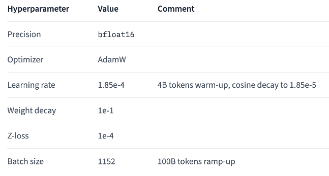
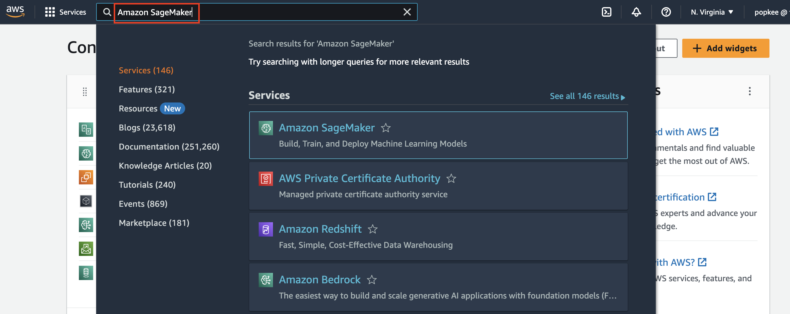
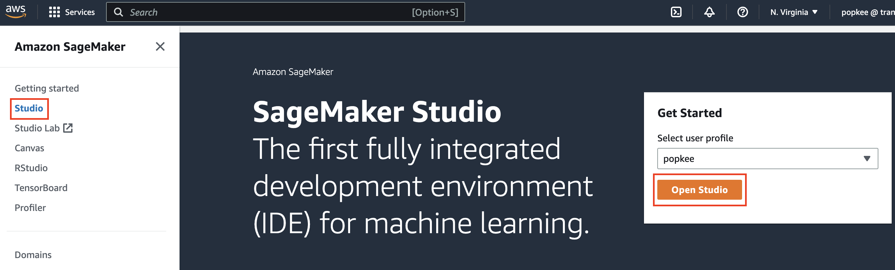
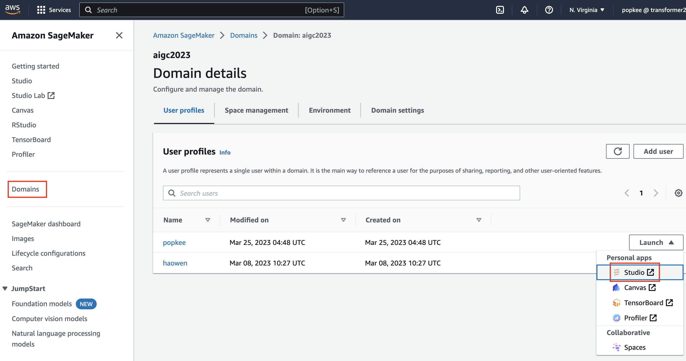
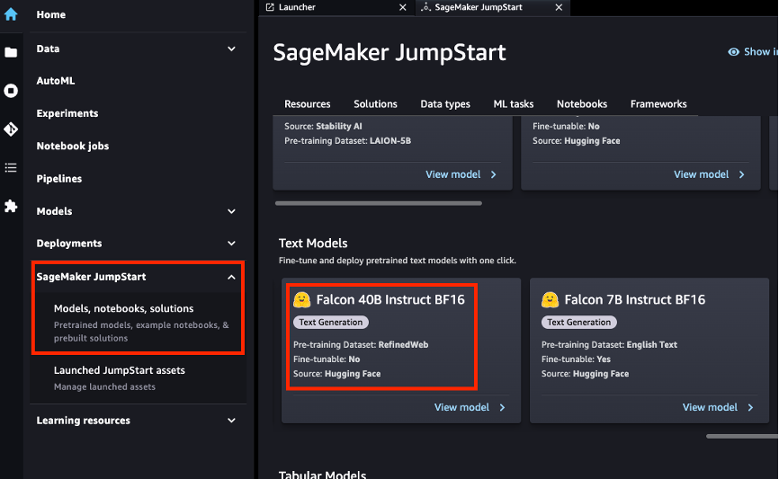
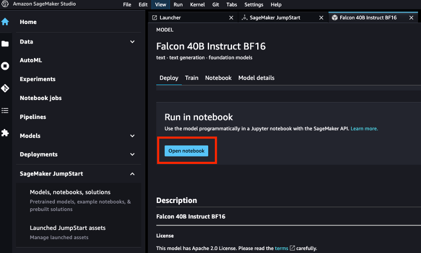
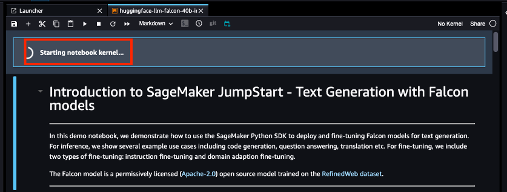
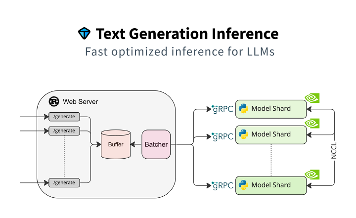

 
In this guide, we'll delve into deploying Falcon-40B, an open-source Large Language Model with 40 billion parameters, on Amazon SageMaker.

We'll describe two distinct deployment avenues:

- SageMaker JumpStart: A direct and user-friendly deployment route.
- SageMaker Notebook: A hands-on approach, allowing for detailed configuration and granular control.

But before we proceed, let's acquaint ourselves with the foundational aspects of the Falcon-40B LLM.

## 1. Falcon-40B Open Source LLM Overview

Falcon-40B is a 40B parameter causal decoder-only model built by the Technology Innovation Institute (TII) of the United Arab Emirates. It was trained on 1,000B tokens of [RefinedWeb](https://huggingface.co/datasets/tiiuae/falcon-refinedweb) dataset enhanced with curated corpora. It is one of a very small number of genuine open-source LLMs, and is made available under the Apache 2.0 license.

### 1.1 Features

The Falcon-40B LLM has many powerful features including:

- **Large size**: Falcon-40B has 40 billion parameters, which allows it to learn more complex relationships between words and concepts.
- **Efficient training**: Falcon-40B uses a variety of techniques to improve training efficiency, such as 3D parallelism and ZeRO optimization.
- **Advanced architecture**: Falcon-40B LLM uses an advanced architecture, including flash attention and multi-query attention. These techniques enable the model to better 'understand' long-distance dependencies in texts.
- **Open Source**: Flacon 40B LLM is truly open-source, allowing researchers and developers to experiment and improve it.

### 1.2 Training data

Falcon-40B has been trained using 1000 billion tokens from RefinedWeb, a filtered and deduplicated high-quality web dataset. It's worth mentioning that the Falcon team considered the data quality of this dataset to be very good, so they also wrote a [paper](https://arxiv.org/pdf/2306.01116.pdf) for this high-quality dataset, as shown below.


### 1.3 Training parameters

Falcon-40B was trained using Amazon SageMaker, using 384 A100 40GB GPUs on the p4d instances. During training, the model used a 3D parallel strategy, with model states partitioned across all the GPUs (ZeRo). Model training began in December 2022 and took two months. The main [training parameters](https://huggingface.co/tiiuae/falcon-40b) are as follows:



### 1.4 Model architecture

Falcon-40B is a causal decoder-only model, trained on a causal language modeling task (i.e., predict the next token). The architecture is broadly adapted from the GPT-3 paper ([Brown et al., 2020](https://arxiv.org/abs/2005.14165)), with the following differences:

- **Positional embeddings**: rotary ([Su et al., 2021](https://arxiv.org/abs/2104.09864));
- **Multi-query attention** ([Shazeer et al., 2019](https://arxiv.org/abs/1911.02150)) and **Flash Attention** ([Dao et al., 2022](https://arxiv.org/abs/2205.14135));
- **Decoder-block**: parallel attention/MLP with two-layer norms.

TODO: Consider taking this out and repositioning.
### 1.5 Bias, Risks, and Limitations

Falcon-40B is trained mostly on English, German, Spanish, French, with limited capabilities also in in Italian, Portuguese, Polish, Dutch, Romanian, Czech, Swedish. It will not generalize appropriately to other languages. Furthermore, as it is trained on a large-scale corpora representative of the web, it will carry the stereotypes and biases commonly encountered online.

## 2. Use Amazon SageMaker JumpStart to deploy Falcon-40B

This section demonstrates how to deploy Falcon-40B using Amazon SageMaker JumpStart via the SageMaker Python SDK.

- Setup development environment
- Select the Falcon-40B model you want to deploy ("huggingface-llm-falcon-40b-instruct-bf16")
- Deploy Falcon-40B LLM to Amazon SageMaker endpoint using the JumpStartModel function
- Run inference and chat with the model
- Clean up the environment (delete the model and endpoint)

Please refer to the screenshot below for details.

1) Go to **Amazon SageMaker**.



2) Click on **Studio** and then **Open Studio**.



3) Or click on **Launch** -> **Studio**. You may need to wait for a few moments and then hit a refresh button to see the **Launch** button.



4) Wait a few moments…


5) Welcome to SageMaker Studio! Click on **SageMaker JumpStart** -> **Models, notebooks, solutions**, then choose **Text Models -> Falcon-40B Instruct BF16**.



6) Click on **Run in notebook** -> **Open notebook**.



7) After “**Starting notebook kernel...**” has been completed, you can execute the example code for deploying the Falcon-40B open-source model.



The full code for this section can be found in the Amazon SageMaker examples GitHub repository. The link is [here](https://github.com/aws/amazon-sagemaker-examples/blob/main/introduction_to_amazon_algorithms/jumpstart-foundation-models/text-generation-falcon.ipynb).

## 3. Use Amazon SageMaker Notebook to deploy Falcon-40B LLM

This section will show an example of how to deploy an open-source LLM, such as the Falcon-40B, to Amazon SageMaker for inference using the Hugging Face LLM inference container. The example includes the following steps:

- Setup development environment
- Retrieve the Hugging Face LLM DLC
- Deploying Falcon-40B to Amazon SageMaker endpoint
- Run inference and chat with the model
- Clean up the environment (delete the model and endpoint)

The content of this section is partly based on Philipp Schmid's [blog](https://www.philschmid.de/sagemaker-falcon-llm). Some sections have been expanded to inspire readers and developers to think and learn more deeply. For example, content such as **model quantization**, etc.

### 3.1 Setup development environment

We'll use the Amazon SageMaker python SDK to deploy the Falcon-40B to the endpoint for model inference. We first need to make sure that the Amazon SageMaker python SDK is properly installed. This is shown in the following code:

```python
# install supported sagemaker SDK
!pip install "sagemaker>=2.175.0" --upgrade –quiet

import sagemaker
import boto3

sess = sagemaker.Session()

# sagemaker session bucket -> used for uploading data, models and logs
# sagemaker will automatically create this bucket if it not exists
sagemaker_session_bucket=None
if sagemaker_session_bucket is None and sess is not None:
    # set to default bucket if a bucket name is not given
    sagemaker_session_bucket = sess.default_bucket()

try:
    role = sagemaker.get_execution_role()
except ValueError:
    iam = boto3.client('iam')
    role = iam.get_role(RoleName='sagemaker_execution_role')['Role']['Arn']

sess = sagemaker.Session(default_bucket=sagemaker_session_bucket)

print(f"sagemaker role arn: {role}")
print(f"sagemaker session region: {sess.boto_region_name}")
```

For more detailed IAM role configuration instructions for the permissions required by Amazon SageMaker, you can refer to [this document](https://docs.aws.amazon.com/sagemaker/latest/dg/sagemaker-roles.html).

### 3.2 Retrieve the Hugging Face LLM DLC

The Hugging Face LLM DLC is a new dedicated inference container that makes it easy to deploy LLM in a secure hosting environment. The DLC is powered by Text-Generative Inference ([TGI](https://github.com/huggingface/text-generation-inference)), an open source, purpose-built solution for deploying and servicing large language models (LLM). TGI uses tensor parallelism and dynamic batching to enable high-performance text generation for the most popular open source LLM. With the Hugging Face LLM Inference DLC launched on Amazon SageMaker, developers can get an LLM experience that supports high concurrency and low latency.

Deploying model with the Hugging Face LLM DLC, first of all, we need to retrieve the container `uri` and provide it to the `HuggingFaceModel` model class, and point to that image using `image_uri`.

To retrieve the Hugging Face LLM DLC in Amazon SageMaker, we can use the `get_huggingface_llm_image_uri` method provided by the Amazon SageMaker SDK. This method allows us to retrieve the URI of the required Hugging Face LLM DLC based on the specified `backend`, `session`, `region`, and `version`. The example code is as follows:

```python
from sagemaker.huggingface import get_huggingface_llm_image_uri

# retrieve the llm image uri
llm_image = get_huggingface_llm_image_uri(
  "huggingface",
  version="0.9.3"
)

# print ecr image uri
print(f"llm image uri: {llm_image}")

```

For information on all the Hugging Face LLM DLC available, you can refer to the [documentation](https://github.com/aws/deep-learning-containers/blob/master/available_images.md#huggingface-text-generation-inference-containers).

### 3.3 Deploy Falcon-40B to Amazon SageMaker Endpoint

To deploy the Falcon-40B LLM to Amazon SageMaker endpoint, first of all, we need to create a `HuggingFaceModel` model class and define related endpoint configurations, including the `hf_model_id`, `instance_type`, etc. For this demo, we'll be using the `g5.12xlarge` instance type with 4 NVIDIA A10G GPUs and 96GB of GPU memory.

Also, Amazon SageMaker quotas may vary from account to account. If you exceed your quota, you can increase your quota through the following service quota console, link is [here](https://console.aws.amazon.com/servicequotas/home/services/sagemaker/quotas).

The example code for deploying the model to the endpoint is as follows.

```python
import json
from sagemaker.huggingface import HuggingFaceModel

# sagemaker config
instance_type = "ml.g5.12xlarge"
number_of_gpu = 4
health_check_timeout = 300

# TGI config
config = {
  'HF_MODEL_ID': "tiiuae/falcon-40b-instruct", # model_id from hf.co/models
  'SM_NUM_GPUS': json.dumps(number_of_gpu), # Number of GPU used per replica
  'MAX_INPUT_LENGTH': json.dumps(1024),  # Max length of input text
  'MAX_TOTAL_TOKENS': json.dumps(2048),  # Max length of the generation (including input text)
  # 'HF_MODEL_QUANTIZE': "bitsandbytes", # comment in to quantize
}

# create HuggingFaceModel
llm_model = HuggingFaceModel(
  role=role,
  image_uri=llm_image,
  env=config
)
```

Some readers may find a line of code commented out in the example code above:

```python
# 'HF_MODEL_QUANTIZE': "bitsandbytes", # comment in to quantize
```

This relates to the knowledge category of **model quantification**. Typically, the full precision representations of these very large models don’t fit into memory on a single or even several GPUs. To support an interactive notebook environment to fine-tune and run inference on models of this size, we use a new technique known as [Quantized LLMs with Low-Rank Adapters](https://arxiv.org/abs/2305.14314) (**QLoRA**). The QLoRA paper explores different data types, `4-bit Float` and `4-bit NormalFloat`. QLoRA is an efficient fine-tuning approach that reduces memory usage of LLMs while maintaining solid performance.

If you are interested in in-depth research on using the `bitsandbytes` library to do **4-bit quantization** based on QLoRA technology, you can check out this [blog post](https://huggingface.co/blog/4bit-transformers-bitsandbytes).

After creating the `HuggingFaceModel`, we can deploy it to the Amazon SageMaker endpoint using the `deploy` method. We'll deploy the model with the `ml.g5.12xlarge` instance type. [Text Generative Inference (TGI)](https://github.com/huggingface/text-generation-inference) will automatically distribute and shard the model across all GPUs, as shown in the following code.

TGI is a Rust, Python, and gRPC server for text-generated inference, used in HuggingFace's production environment. It provides support for Hugging Chat, the inference API, and inference endpoint. As shown in the image below.



The code for deploying the model to the Amazon SageMaker endpoint is shown below.

```python
# Deploy model to an endpoint
# https://sagemaker.readthedocs.io/en/stable/api/inference/model.html#sagemaker.model.Model.deploy

llm = llm_model.deploy(
  initial_instance_count=1,
  instance_type=instance_type,
  # volume_size=400, # If using an instance with local SSD storage, volume_size must be None, e.g. p4 but not p3
  container_startup_health_check_timeout=health_check_timeout, # 10 minutes to be able to load the model
)
```

After submitting and running the above code, Amazon SageMaker will now create the endpoint and deploy the model to it. This will take about 10 minutes to execute.

### 3.4 Run Inference and Chat with the Model

Once the endpoint is deployed, we can use the `predict` method from the `predictor` to begin model inference.

We can use different parameters to control the generation, which can be defined in the payload's `parameters` attribute. The HuggingFace LLM Inference Container supports various generation parameters, including `top_p`, `temperature`, `stop`, `max_new_token`, etc.

You can find the full list of supported parameters [here](https://huggingface.co/blog/sagemaker-huggingface-llm#4-run-inference-and-chat-with-our-model). As of today, TGI supports the following parameters:

- `temperature`: Controls randomness in the model. Lower values will make the model more deterministic and higher values will make the model more random. Default value is 1.0.
- `max_new_tokens`: The maximum number of tokens to generate. Default value is 20, max value is 512.
- `repetition_penalty`: Controls the likelihood of repetition, defaults to null.
- `seed`: The seed to use for random generation, default is null.
- `stop`: A list of tokens to stop the generation. The generation will stop when one of the tokens is generated.
- `top_k`: The number of highest probability vocabulary tokens to keep for top-k-filtering. Default value is null, which disables top-k-filtering.
- `top_p`: The cumulative probability of parameter highest probability vocabulary tokens to keep for nucleus sampling, default to null
- `do_sample`: Whether or not to use sampling; use greedy decoding otherwise. Default value is false.
- `best_of`: Generate best_of sequences and return the one if the highest token logprobs, default to null.
- `details`: Whether or not to return details about the generation. Default value is false.
- `return_full_text`: Whether or not to return the full text or only the generated part. Default value is false.
- `truncate`: Whether or not to truncate the input to the maximum length of the model. Default value is true.
- `typical_p`: The typical probability of a token. Default value is null.
- `watermark`: The watermark to use for the generation. Default value is false.

Because the **tiiuae/falcon-40b-instruct model** we deployed is a conversational chat model, we can chat with the model using the following prompts:

```python
# define payload
prompt = """You are an helpful Assistant, called Falcon. Knowing everyting about AWS.

User: Can you tell me something about Amazon SageMaker?
Falcon:"""

# hyperparameters for llm
payload = {
  "inputs": prompt,
  "parameters": {
    "do_sample": True,
    "top_p": 0.9,
    "temperature": 0.8,
    "max_new_tokens": 1024,
    "repetition_penalty": 1.03,
    "stop": ["\nUser:","<|endoftext|>","</s>"]
  }
}

# send request to endpoint
response = llm.predict(payload)

# print assistant respond
assistant = response[0]["generated_text"][len(prompt):]
```

It will generate a sentence describing “Amazon SageMaker”. To make it easier for readers to read, I have copied the Falcon-40B model’s output as follows:

```txt
Amazon SageMaker is a fully managed platform that enables developers and data scientists to quickly build, train, and deploy machine learning models in the cloud. It provides a wide range of tools and services, including Jupyter notebooks, algorithms, pre-trained models, and easy-to-use APIs, so you can quickly get started building machine learning applications.
```

We can continue to ask the Falcon-40B model question, such as:

```python
new_prompt = f"""{prompt}{assistant}
User: How would you recommend start using Amazon SageMaker? If i am new to Machine Learning?
Falcon:"""
# update payload
payload["inputs"] = new_prompt

# send request to endpoint
response = llm.predict(payload)

# print assistant respond
new_assistant = response[0]["generated_text"][len(new_prompt):]
print(new_assistant)

```

The answers given to me by the Falcon-40B model is as follows:

```txt
If you're new to machine learning, you can start with pre-built algorithms and pre-trained models available in Amazon SageMaker. You can also use Jupyter notebooks to create and run your own experiments. Additionally, you can take advantage of the AutoPilot feature to automatically build and train machine learning models based on your data. The best way to get started is to experiment and try different things to see what works best for your specific use case.
```

### 3.5 Delete the Model and Endpoint

We've deployed the Falcon-40B open-source LLM to the Amazon SageMaker endpoint and successfully performed model inference. Once you've completed all the codes, remember to delete resources and clean up the environment, including models and endpoints, to avoid unnecessary costs.

Example code for deleting resources and cleaning up the environment is as follows:

```python
llm.delete_model()
llm.delete_endpoint()
```

## Conclusion

In this post, we have divided it into two chapters and deployed the Falcon-40B open-source large language model in two ways.

First, we used Amazon SageMaker JumpStart to deploy the model. The main core code is as follows:

```python
model_id, model_version = "huggingface-llm-falcon-40b-instruct-bf16", "*”

from sagemaker.jumpstart.model import JumpStartModel
my_model = JumpStartModel(model_id=model_id)
predictor = my_model.deploy()
```

Second, we used the Amazon SageMaker Notebook to deploy the model. The main core code is as follows:

```python
# Retrieve the new Hugging Face LLM DLC
from sagemaker.huggingface import get_huggingface_llm_image_uri

# retrieve the llm image uri
llm_image = get_huggingface_llm_image_uri(
  "huggingface",
  version="0.8.2"
)

# print ecr image uri
print(f"llm image uri: {llm_image}")
#  Deploy Falcon-40B Model
from sagemaker.huggingface import HuggingFaceModel

# instance config
instance_type = "ml.g5.12xlarge"
number_of_gpu = 4
health_check_timeout = 300

# TGI config
config = {
      'HF_MODEL_ID': "tiiuae/falcon-40b-instruct", 
      ……
}

# create HuggingFaceModel
llm_model = HuggingFaceModel(
  role=role,
  image_uri=llm_image,
  env=config
)
llm = llm_model.deploy(
      ……
)
```

As seen from the comparison of the amount of core code described above, if you are a beginner and want to use it right out of the box, you can choose Amazon SageMaker JumpStart as a quick and simple deployment method.

If you already know about Amazon SageMaker and want more granular control (such as deployment instance types, image version, TGI parameters, etc.) during LLM deployment, you can choose Amazon SageMaker Notebook, which has more complete control over how configuration parameters are deployed.

In the next post, we'll explore using Amazon SageMaker Notebook to quickly and efficiently fine-tuning LLMs in an interactive environment. We will use the **QLoRA** and **bitsandbtyes 4-bits quantization library** to fine-tuning the Falcon-40B model using HuggingFace PEFT on Amazon SageMaker. This topic is currently a cutting-edge topic in the field of LLMs, so stay tuned.

## About the Author

### Haowen Huang

Haowen is a Senior Developer Advocate at AWS based in Hong Kong. He has over 20 years of experience in the cloud computing, internet and telecom industries. He focuses on the promotion and application of AI, machine learning and data science.  

### Mike Chambers

Mike is a Developer Advocate at AWS based in Meanjin (Brisbane), Australia. He has been in the ICT industry for 20 years. As a trainer Mike has entertained and educate over a quarter of a million students with his unique style, and has traveled the world teaching and evangelizing cloud, serverless and machine learning.
