|ToC|
|---|

Lightsail offers a range of virtual private servers with Wordpress installed. A frequent question is which size instance would be best for my application. Wordpress is used in many different ways ranging from relatively static sites, personal blogs, photography, and e-commerce. The flexibility of Wordpress complicates the choice of which Lightsail Wordpress instance to use. One key website metric is responsiveness. The amount of time a person has to wait before a site renders a page greatly affects whether they stay on the site or if they move on (bounce) to another site. According to [studies](https://www.hobo-web.co.uk/your-website-design-should-load-in-4-seconds/), if page load time increases from 1 second to 3 seconds, the probability of bounce increase by 32%. If the page time load increases from 1 second to 5 seconds, the likelihood of bounce increases by 90%. Although there are many factors that affect page speed load, we’re interested in how the volume of requests affects page load speed. In this article, we will setup a Lightsail Wordpress site and test the site's responsiveness under multiple users making multiple requests using a load testing tool.

## Website Characteristics

For a realistic test, we’ll take statistics from [State of the Web Report](https://httparchive.org/reports/state-of-the-web?lens=wordpress&start=2018_03_15&end=latest&view=list) by [webarchive.org](http://webarchive.org/). The report includes data from 2010 to the present and it segments the data by type of site including word press. We’ll statistics based on data from January 2020 to the August 2023.

Here are the benchmarks of a typical Wordpress site from 2020 to 2023 based on a sample of 4,184,009 URLs.

* desktop page weight, comprised of image and html bytes combined, represents the number of bytes sent over the network. Images account for 1316 KB and HTML 37KB
* the total number of desktop requests 83/second
* number of desktop connections as a proxy for users 12

For comparison, we can use the [Wikimedia Foundation’s statistics](https://www.wikimediastatus.net/#month) as a high end benchmark. Note that Wikimedia has over [1,000 servers spread across five data centers](https://www.stackscale.com/blog/wikipedia-20-anniversary/).

* total request volume is approximately 140,000 requests/second depending time of day
* response time is typically sub second

We will configure a Wordpress to return a combined total of 3700 kb comprised of an image and text. Lightsail Wordpress instances use t3 EC2 instances and the instance Plan corresponds to a t3 instance.

> Tip: To find the type of instance type of a Lightsail VPS, login to the instance with the browser based SSH client and run this command:
> ```bash
> TOKEN=`curl -X PUT "http://169.254.169.254/latest/api/token" -H "X-aws-ec2-metadata-token-ttl-seconds: 21600"`
> curl -H "X-aws-ec2-metadata-token: $TOKEN" -v http://169.254.169.254/latest/meta-data/instance-type
> ```

Here is a list of Lightsail instance types and the corresponding EC2 types.

| Lightsail instance size | EC2 instance type | vCPUs | Memory (GiB) |
|-------------------------|-------------------|-------|--------------|
| $3.50 | t3.nano | 2 | 0.5 |
| $5.00 | t3.micro | 2 | 1 |
| $10.00 | t3.small | 2 | 2 |
| $20.00 | t3.medium | 2 | 4 |
| $40.00 | t3.large | 2 | 8 |
| $80.00 | t3.xlarge | 4 | 16 |
| $160.00 | t3.2xlarge | 8 | 32 |

We will use the $10.00/month instance for the test Wordpress server. This is a frequently used instance for sites with a moderate amount of traffic.

## Building a test Wordpress site

Let’s create an example Wordpress instance. From the AWS home console, open the Lightsail console. You can use the search bar to find the Lightsail console.

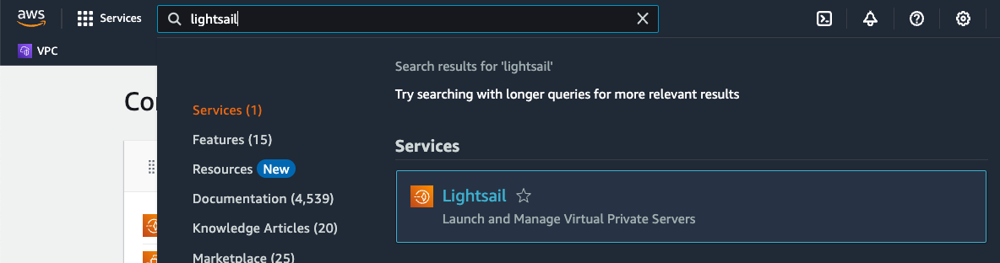

Choose **Create instance**.

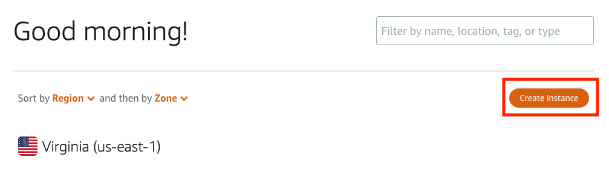

Next, choose the Linux/Unix instance with the Wordpress blueprint.

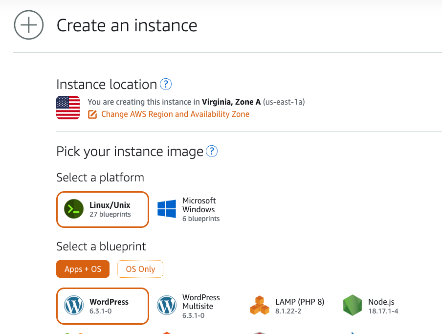

For this example, we will use a the $10/month instances (t3.small).

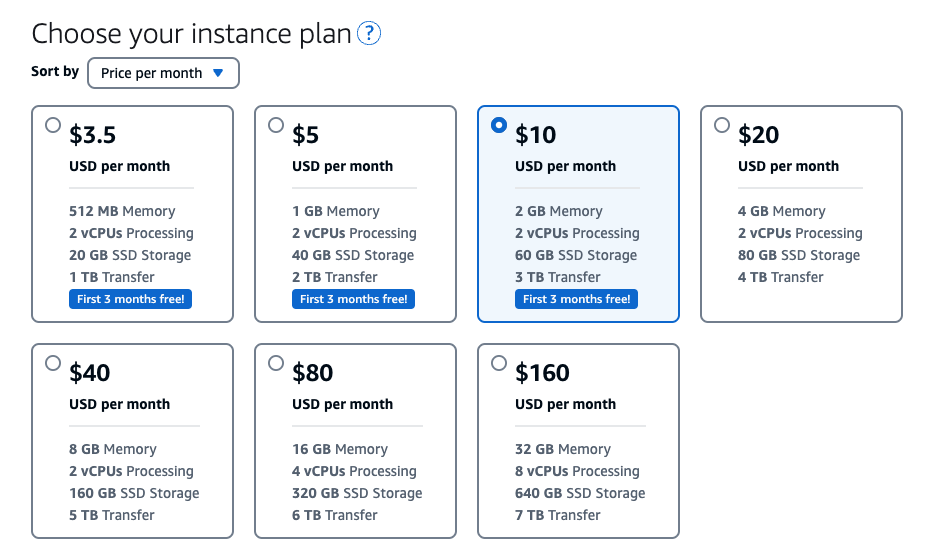

Name the instance, then choose **Create instance**.

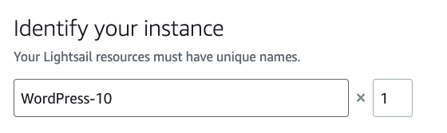

### Create a test page

The next step is to create a test page that can emulate a typical page weight. For convenience, we will use the default administrator account. Open a terminal with the browser-based SSH client.

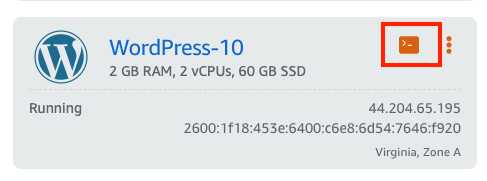

In the terminal, get the default account password.

```bash
bitnami@ip-172-26-7-95:~$ ls
bitnami_application_password bitnami_credentials htdocs stack
bitnami@ip-172-26-7-95:~$ cat bitnami_application_password
defaultpassword
```

Using the public IP address, sign into Wordpress. You can find the public IP in the Wordpress instance console.

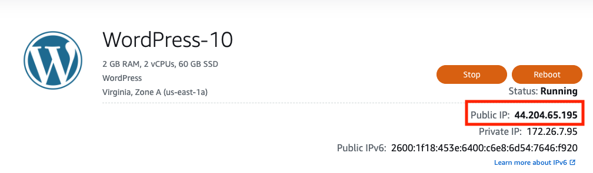

Next, sign in to Wordpress. Open a browser window to `http://<your-ip-address>/wp-login.php`.

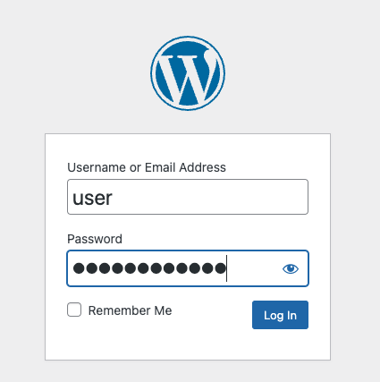

Next, we create a new page in the `user` account. In the dashboard menu on the left, choose **Pages**, then **Add New**.


In the new page, add an image and text with the Wordpress editor and publish it.


In this example, the page has an image and text with a total page weight of 3.7 mb.


When the page is published, the URL of the page will be the title of page, e.g., `http://<your-ip-address>/load-test-page`.

## Installing and Configuring Locust for Generating Loads

[Locust](https://docs.locust.io/en/stable/what-is-locust.html) is a performance testing tool. It uses Python to programmatically create load tests for requesting Wordpress pages. Locust is capable of using a single process to generate requests for thousands of concurrent users with a minimum of hardware. Another nice feature of Locust is a web-based UI in addition to a command-line client.

Let’s start by creating an OS only Lightsail $3.5/month (t3.nano) instance.

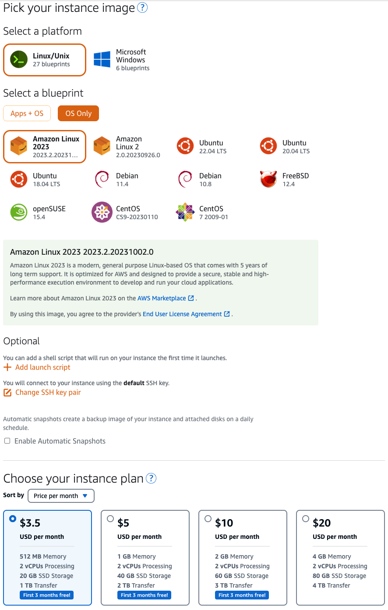

Sign into the instance using the browser-based SSH client to install Locust.

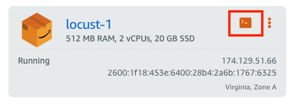

In the terminal, check if Python is installed.

```bash
$ which python3
/usr/bin/python3
```

Next, install locust. First, we’ll create a directory to hold the configuration files. Locust is distributed as a Python package, and it’s good practice to create a virtual environment for packages with [venv](https://docs.python.org/3/library/venv.html) and activate it. Use the Python package manager, [pip](https://pip.pypa.io/en/latest/#), to install locust. Check the installation by displaying the version.

```bash
$ mkdir locust 
$ cd ./locust
$ python -m venv venv
$ source ./venv/bin/activate
(venv)$ pip install locust
(venv)$ locust —version
```

We can write a simple test for our Wordpress instance that requests the home page and the test page we created earlier. Save the test as `locustfile.py`.

```python
from locust import HttpUser, task

class HelloWorldUser(HttpUser):
    @task
    def hello_world(self):
        self.client.get("/")
        self.client.get("/load-test-page")
```

The locust web-ui uses port 8089. Before we can use it, we will need to open the port. In the instance page, choose **Networking**. Then under IPv4 Firewall, choose **Add Rule**. Select `Custom Rule` from the drop down, enter `8089` for the `Port or range` field. Choose **Create** to add the rule and open the port.

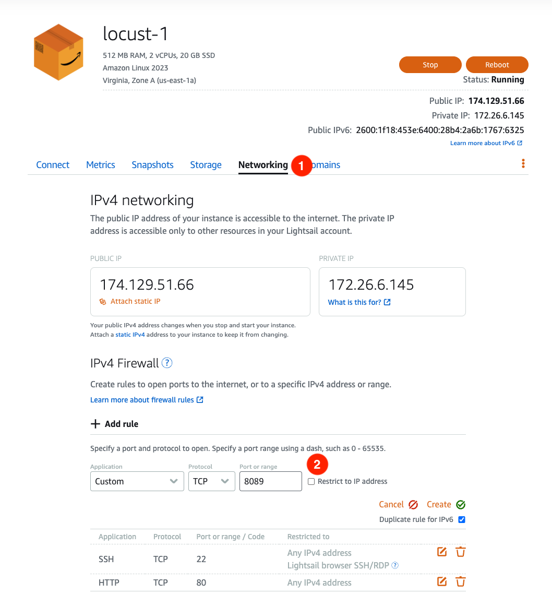

Now we’re ready to run the test plan with the web-ui. In the terminal, we want to run locust in the background so it will continue to run if the terminal closes.

```bash
(venv)$ screen -d -m locust
```

Open a browser window to `http://<your-ip-address>:8089/`. We'll set the load to 12 users and 83 requests/second to match the typical Wordpress load. The test will run for 30 minutes. Choose **Start swarming** to begin the load test.

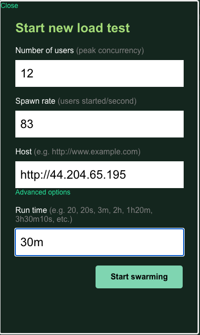

We’ll let the load test run for 30 minutes and we’ll review the results.

## Understanding the Results

Locust provides both statistics and charts from the load test. Let’s take a look at the chart.

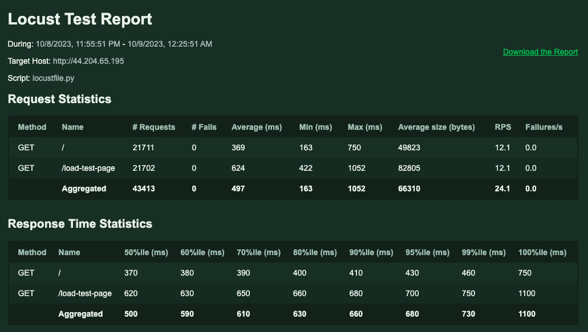

We’re interested in the aggregate statistics. During the 30 minute load testing run, Locust sent 43,413 requests or 24 requests per second (RPS) split between the two tasks specified in the script.

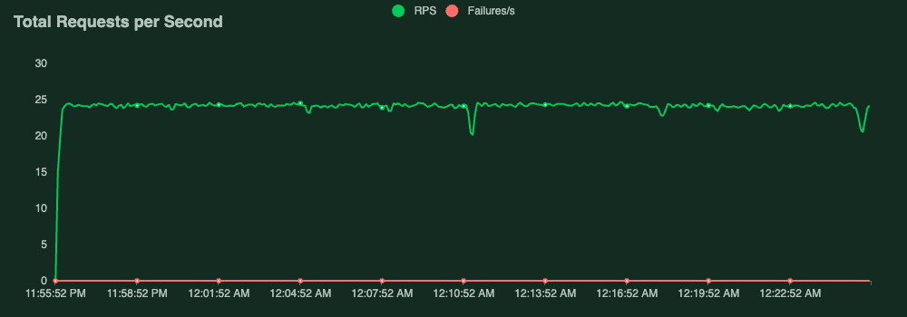

This is much lower than the 83 requests/second and is a function of the locust server’s resources. To achieve a higher request rate, we would need more locust workers in a [distributed mode](https://docs.locust.io/en/v0.8.1/running-locust-distributed.html).

Although the request rate is lower than specified, the response time produces interesting results. At 24 requests/second the Wordpress server’s response time is within 1 second with zero failures 100% of the time. The chart shows that the aggregate response time is approximately 700 millisecond 95% of the time.

_1696836559.png)

These results look promising, but that’s only part of the story. Wordpress sites typically do not run at full capacity and CPU utilization occurs in spikes. This Lightsail Wordpress instance is deployed on a t3 instance. [T3 instances](https://aws.amazon.com/ec2/instance-types/t3?sc_channel=el&sc_campaign=post&sc_content=load-testing-wordpress-lightsail-instance&sc_geo=mult&sc_country=mult&sc_outcome=acq) have a baseline CPU performance and are capable of bursting above the baseline. The baseline is designed to meet the requirements of general purpose workloads such as web servers, small and medium databases, and microservices.

Lightsail instances provide [instance metrics](https://lightsail.aws.amazon.com/ls/docs/en_us/articles/amazon-lightsail-resource-health-metrics?sc_channel=el&sc_campaign=post&sc_content=load-testing-wordpress-lightsail-instance&sc_geo=mult&sc_country=mult&sc_outcome=acq) for monitoring the performance. Lightsail divides CPU utilization into a sustainable zone where there is no impact to performance and a burstable zone to handle larger workloads for a limited period of time. In the graph below of Average CPU Utilization per 5 Minutes, the sustainable zone is at 20% utilization because we are using a $10/month instance. During the 30 minute load test, the Wordpress server used 100% CPU capacity.

However, the server can run in the burstable zone for a limited amount of time before it will drop back to the sustainable zone. In the second graph, Remaining CPU Burst Capacity (Percentage), the load test consumed roughly 50% of available burst capacity. Burst capacity consumption is relatively linear, and it is possible that running the load test longer or increasing the number of requests could consume all the burst capacity. In that case, the server would drop to the sustainable zone and would increase the response time or even fail to respond under the increased workload.

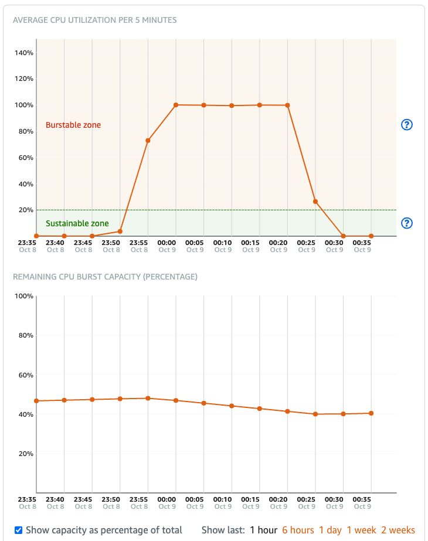

To see how many minutes of burst capacity available to the server, we can look at the Remaining CPU Burst Capacity metric. In this example, the server can run in the burstable zone for quite some time. A realistic Wordpress test plan would access a variety of pages including creating new pages, and may even vary the the number of requests over a period of time.

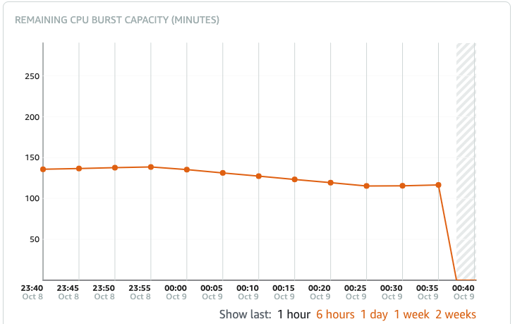

These metrics can assist in determining which Lightsail instance to use based on the expected workload. Lightsail provides additional metrics for instances and other Lightsail services, which are described in this [document](https://lightsail.aws.amazon.com/ls/docs/en_us/articles/amazon-lightsail-resource-health-metrics?sc_channel=el&sc_campaign=post&sc_content=load-testing-wordpress-lightsail-instance&sc_geo=mult&sc_country=mult&sc_outcome=acq). For a deep dive into instance burst capacity and how it is calculated and consumed, checkout [Viewing instance burst capacity in Amazon Lightsail](https://lightsail.aws.amazon.com/ls/docs/en_us/articles/amazon-lightsail-viewing-instance-burst-capacity#identifying-instance-burst?sc_channel=el&sc_campaign=post&sc_content=load-testing-wordpress-lightsail-instance&sc_geo=mult&sc_country=mult&sc_outcome=acq).

## Summary

We’ve looked Wordpress from both the output performance side and from the server instance side. We created a example Wordpress site and ran a simple load test with locust. The metrics from locust shows server performance, i,e,. what user experiences, and the Lightsail  metrics shows the resources that the Wordpress server consumes and whether you have sufficient resources for your expected workload. Explore these resources to build a load testing plan for your Wordpress deployments:

* [Distributed Load Generation on AWS](https://aws.amazon.com/blogs/devops/using-locust-on-aws-elastic-beanstalk-for-distributed-load-generation-and-testing?sc_channel=el&sc_campaign=post&sc_content=load-testing-wordpress-lightsail-instance&sc_geo=mult&sc_country=mult&sc_outcome=acq)
* [Resource metrics in Amazon Lightsail](https://lightsail.aws.amazon.com/ls/docs/en_us/articles/amazon-lightsail-resource-health-metrics?sc_channel=el&sc_campaign=post&sc_content=load-testing-wordpress-lightsail-instance&sc_geo=mult&sc_country=mult&sc_outcome=acq)
* [Viewing instance metrics in Amazon Lightsail](https://lightsail.aws.amazon.com/ls/docs/en_us/articles/amazon-lightsail-viewing-instance-health-metrics?sc_channel=el&sc_campaign=post&sc_content=load-testing-wordpress-lightsail-instance&sc_geo=mult&sc_country=mult&sc_outcome=acq)
* [Notifications in Amazon Lightsail](https://lightsail.aws.amazon.com/ls/docs/en_us/articles/amazon-lightsail-notifications?sc_channel=el&sc_campaign=post&sc_content=load-testing-wordpress-lightsail-instance&sc_geo=mult&sc_country=mult&sc_outcome=acq)
