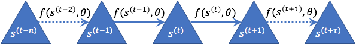
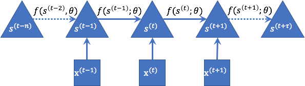
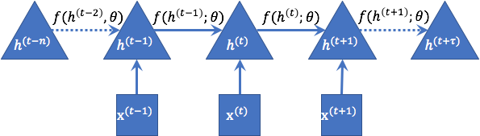
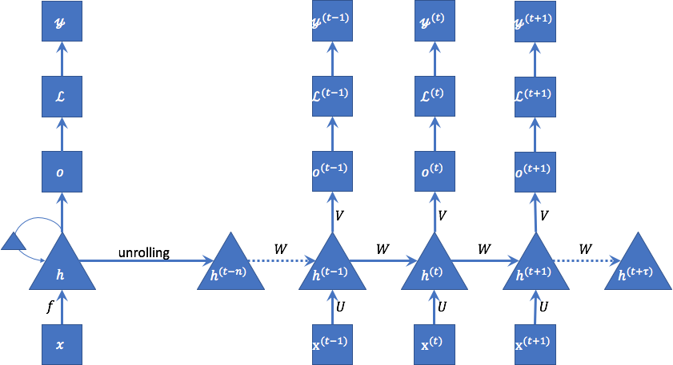
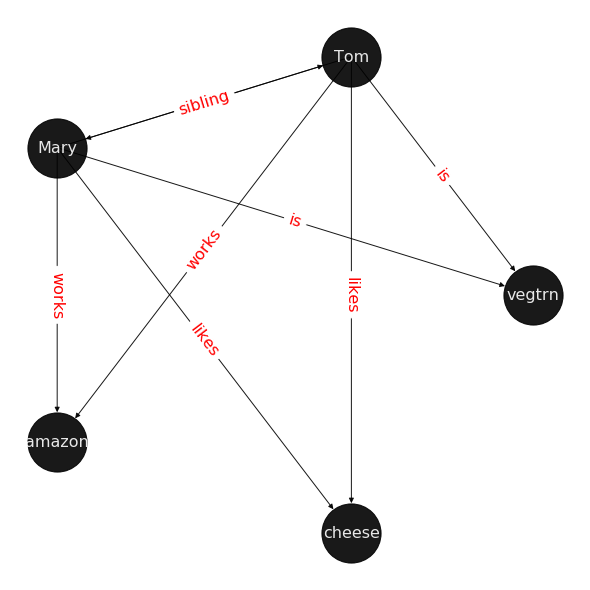

---
title: Motivation for using graphs
description: This post provides an intuitive understanding of why we need graphs and how they differ from sequential models. In a way we could see graphs as a general form that superceede sequential models.
tags:
  - graphml
  - graph-neural-networks
  - gnn
  - dgl
  - graph
  - ai-ml
authorGithubAlias: cyrusmvahid
authorName: Cyrus Vahid
date: 2022-07-08
additionalAuthors: 
  - authorGithubAlias: kirannsa
    authorName: Sai Kiran Jukanti
---

|ToC|
|---|

Graph neural networks (GNN) have gained prominence in the past few years. It is predominantly due to their ability to capture sparse and non-Euclidean data, while breakthroughs in parallel computation of large scale graphs has made it possible to take advantage of this versatile data-structure. This blog series is an introductory series for those who are new to graphs and graph neural networks, and moves onto knowledge embedding through graph completion. The final part in this series provides an example of application of knowledge embedding in drug repurposing solutions, published by AWS science team in order to create a proposal for potential effective drugs on COVID. Future publications will branch off into applications of GNNs in different fields, starting with personalization. The current series entries are:

|SeriesToC|
|---------|

## Motivation for Graph Neural Networks

In order to understand MPNN (Message-passing neural networks) better, let us take a walk back in history and begin with Recurrent Neural Networks or RNN. RNNs were developed in order to conduct sequence modeling. An example of sequence is a 1-D temporal sequence. To get a better feeling about what a 1-D temporal sequence is, let's consider an example? I give a sequence of numbers such as: 0, 1, 1, 2, 3, 5, 8, 13, .... What do you expect the next number in the series is?

Well, if you are familiar with Fibonacci series, then you can guess that the next number is 13+8 = 22. How is it achieved? We simply sample sequences of different length, find a pattern, and then apply the pattern on the appropriate sequence length and make a prediction.

Let's  try a different example from NLP: "Recently, the king of Spain abdicated in favour of his son, Felipe. Felipe is now the new ... king". We unfailingly infer that the next word in indeed "Spanish."

How did we do that? Firstly we used a reference to an earlier part of the sentence. It was after all, the king of *Spain*, who abdicated. It is not hard to images this as a system that the previous state of the system is being carried forward.

There is another more hidden complexity, inferring *Spain* from *Spanish*. There is a higher dimension relationship, which is related to the inflection. Generally, we seem to be able to infer grammar. I will come back to this point a little later. For now, we are interested in 1-D sequential systems.

$$\large s^{(t+1)} = f(s^{(t)}; \theta)\qquad\large (1)$$

where $s$ is representing state of a system at timestep $(t)$. $f$ is a function and $\theta$ is the model parameters. 

We can observe that the system is always the same, what differs is that the input to the systems is state of the previous run of the system.

This exhibits a recursiveness, which is inherent in dynamical systems and is captured in equation (1); For instance expanding equation 1 for $t=3$, we have:

$$
\large
s^{(3)}=f(s^{(2)}, \theta)=f(f(s^{(1)}, \theta), \theta)=f(f(s^{(0)}, \theta), \theta), \theta)
\large
$$.

If initial state of the system is none, then:

$$
\large
s^{(3)}=f(0, \theta), \theta), \theta)
$$.

Outside factors could affect a system. If such outside influence at timestep $t$ is $x_t$, then state of a dynamical systems is a function of its previous state, the external factor, and system parameters. Equation 1, is then expanded to include $X=\{x_i\}_{i=0}^{\tau}$

$$
\large
s^{(t+1)} = f(s^{(t)}, x^{(t+1)}; \theta)\qquad(2)
$$

## Recurrent Neural Networks

The above dynamical system can be modeled using RNNs. RNN is their simplest form work on the same principle, where the state of the system is the value of its hidden units and model parameters are weights. in Equation 2 we can simply exchange $s$ with $h$ and we have the fundamental description of an RNN.

$$
\large
h^{(t+1)} = f(h^{(t)}, x^{(t+1)}; \theta)\qquad(3)
$$

And unrolling remains the same conceptually.

### RNN characteristics 

RNNs do have a few interesting characteristics.

1. They produce an output at each timestep,
1. The connection are directional from each timestep to the next, and take and entire sequence and generate a single output.

As we unroll the graph in time, the computational graph provide us what is akin to a feed forward network. We can then use back propagation in time in order to train the network and learn parameters $ \theta $.
The propagation equations are defined as:

$$
\large
a^{(t+1)} = b+Wh^{(t)} + Ux^{(t+1)} \qquad(4); \\
h^{(t+1)} = tanh(a^{(t+1)}) \qquad(5); \\
o^{(t+1)} = c+Vh^{(t+1)} \qquad(6); \\
\hat{y}^{(t+1)}=softmax(o^{(t+1)}) \qquad(7);
$$

$a$ $b$, and $c$ are bias vectors. $U$, $V$, and $W$ are weight vectors for input-to-input, hidden-to-output, and hidden-to-hidden connections. $\hat{y}$ is the prediction.

This model can perhaps capture patterns of  1-D sequential systems such as Fibonacci series, however this is not the case for more complicated problems such as NLP. Take the following example, for instance,

$$
\textit{Teddy Roosevelt was the president of the United States.} \\
\textit{Teddy Bears are popular toys for small children.}
$$

In order to understand who or what the word "Teddy" means in the above example, we need a new type of RNN, a type of RNN that not only can pass the state forward, but also backwards.
Enters bidirectional RNN, which uses a forward pass from left to right and another forward pass from right to left. Training is performed as BPTT (back propagation though time) in both directions.

I want to take you back the example in which inflections were determined, where we inferred Felipe had become the king of **Spain**. In order to enrich RNN to pick out grammatic and other sorts of relationships, embedding and deep RNNs were introduced.

After all of such additions we still can only consume and train data that is sequential and each layer has connections to specif layers. For  instance skip layers are used in forecasting. (ref LSTNet paper)

Most of the rest of the world in not so neatly organized. Relationships are irregular and messy. Tom is a friend of Joe. Joe loves Mary. Mary likes apple. Tom is Mary's brother. Tom and Mary are vegetarians. Potato is a vegetable. Tom and Mary, and Joe like melted cheese. Poutine is made of gravy, potato, and melted cheese. Is it likely that next time Tom visits Mary and Joe they would make some Poutine? Well... I hope not. We can see that two of our protagonists are vegetarians, poutine contains gravy and gravy contains meat.

This simple body of knowledge describes intricate relationships between the entities it describes, namely Mary, Joe, Tom, potato, cheese, and poutine. There are several types of relationships. Love, siblings, containments, and liking.

There are also assumptions that are not included in the body of knowledge. Does Mary know that Joe loves her? Does she reciprocate Joe's feelings? Are they a couple? Can we infer from similar connections from others, whom are not describes in this body of knowledge, anything about Joe and Mary based on similarities in the mesh of relationships they have with one another?

### Modeling the knowledge graph

Let us try to model the world that describes Tom, Marry, Joe, and their preferences and relationships.

Sadly major branches of deep learning do not have a good answer to this problem as deep learning models accept structures and mostly fixed size input data. The more structured the data, the more the models excel.

Despair not, rejoice, all is not lost. Amidst the sound of lyre and roars of thunder, riding a donkey and wielding a proverbial hammer and anvil, enters the new Olympian to rescue, enters Deep Learning on Graphs.

## Why should we care about graphs

There are several reasons that we should be interested in graph data structure. We summarize them in the following categories:

### Eclidean vs non-ecliean data structures

Most deep learning models either require fixed sized euclidean dataset such as image data for computer vision that comes cube form or they break up the data in classes that support up to a certain fix size such as bucketing and zero-padding. The reality is however very different. Consider the very simple toy example of World of Mary we saw earlier. If we want to create a 2D tabular data for the example we end up with a sparse table with the vast majority of the features are empty. Cheese has different properties that humans and the way the nodes are connected are very different. Now if we expand this toy example to social networks, we end up having prohibitively large sparse tables with a feature set that is somehow a union of all features of all nodes and most of them are just empty. Same applies to recommendation engines. The user-item-rating tables that are used fundamentally in methods based on matrix factorization has to grapple with the same sparcity issues. There is no surprise one of the first industrial implementation of GNNs is personalization for interest.

Once again in our toy example we can see how the links differ from one another. An edge property captures "sibling" relationship, while another represents existential "is" or "works at" relations. We have the sparcity problem capturing the relationships and could end up with massive one-hot vectors or sparse matrices.

There are many other examples of non-Euclidean data in the literature, amongst them are hierarchies such as [tree structures](https://arxiv.org/pdf/1705.08039.pdf) and [molecular structure used in drug discovery](https://academic.oup.com/bib/article-pdf/22/6/bbab159/41087478/bbab159.pdf).

### Structural information

Binding of molecules, details of the content of a book, context of a text, relationships amongst people, and similar examples demonstrate how variation in connection between objects can present an internal structure in a system. If two people *work* in the same company, then they are *co-workers*. If two people are *siblings* of a third person, then, they too are *siblings*. If a food *contains* meat, then it is not a *vegetarian* dish and then a *vegetarian* person would not like to eat it. The Drug repurposing heavily relies on identifying novel interactions among biological entities like genes and compounds. Using structural similarities in these subsegments helps us automate hypothesis phase of drug repurposing and save lives. Substructural similarities can also give us insights into behaviour of a drug; for instance, isolated substructures very often indicate toxicity.

***Heterogeneous graphs*** allow up to capture graph structures where nodes and edges have different properties without a need for flattening the data into super large euclidean data structures.

## What tasks can we solve using GNN

- **Node classification:** We can solve classification problems by predicting what kind of a node, an unlabeled node is. For instance we can identify a node as a "human" due to similarities to other humans.
- **Graph classification**: We classify a graph as a whole, or a subgraph. For instance based on substructural similarities we can identify toxicity in a drug molecule.
- **Edge Prediction:** We can predict there has to be an edge between two nodes and what properties that edge should have. In the case of recommendation and ranking systems, we can predict that a user is likely to like an item. Edge prediction is the task that is involved in knowledge embedding. In later sections we dive deep into knowledge embedding.

In the following sections we will explore GNN and its variants; but before proceeding with GNNs, let us review some of the fundamentals of graph theory and the glossary that is required in order to sail smoothly though GNN literature.

## What's Next?

In the following sections we will explore GNN and its variants; but before proceeding with GNN, let us review some of the fundamentals of graph theory and the glossary that is required in order to sail smoothly though GNN literature. Next we explore [A theoretical minimum of graph theory to understand graph concepts](../02-graph-theory).
