|ToC|
|---|

In the [previous post](../machine-learning-graphs/01-motivation-for-graph-ml), we learn why we need to pay attention to GNNs. Before we can actually learn about GNNs, we need to learn some of the basics of graph theory to be able to understand parameters of the GNN methods as well as technical aspects of the papers. If you are familiar with graph theory, please skip to [next part](../machine-learning-graphs/03-message-passing-neural-networks).

This is the first of a 5-part series to gently introduce the reader to Graph Neural Networks. Part 1 intends to provide the basic terminology of graph theory as well as an brief introduction of networkX, a popular graph computation library, to the readers that are new to graphs. The next 4 parts describe

|SeriesToC|
|---------|

## The basics

A graph $\mathcal{G}$ consists of a pair $(V, E)$, where $V$ is a set of vertices and $E$ is a set of edges.  
$$V=\large {\{v_i\}}_{i=0}^{n}\ and\ E=\{(v, w)|v, w\in V\}$$
For instance: $V=\{1,2,3\}$ and $E=\{(1,2), (1,3), (2,3)\}$ represents an undirected complete and simple graph with three vertices.  
Below is an example of a few graphs.

Let us implement this simple graph using networkX. We shall draw a complete and simple bi-directional graph. The definitions are explained later in this blog.

```python
import networkx as nx #importing the main library
import matplotlib.pyplot as plt


plt.figure(3,figsize=(5,5))
nx.draw_networkx(nx.complete_graph(3), #nx,completegraph(3) returns a complete graph with 3 nodes
                 node_color='black', 
                 font_color='w', 
                 font_weight='bold', 
                 node_size=1200)
```

## A few basic definitions

- A ***complete graph*** is a simple-undirected graph in which every pair of distinct vertices is connected by a unique edge.
- A ***simple grapah*** is a graph with no loops or multiple edges.
- ***Defree of a vertex*** $v$, $d(v)$, is the number of times it appears as an endpoint of an edge.
- A ***path*** of length n is a graph with two nodes of degree 1 and the other n-2 nodes have a degree of 2.
- A ***cycle*** is a subset of the edge set of G that forms a path such that the first node of the path corresponds to the last.

The code below create a complete graph with 5 nodes, a path graph with 5 nodes, a 2d grid, and a cycle. Then using general graph drawing function, it draws the graphs using `matplotlib`.

```python
G = [nx.complete_graph(n=5), nx.path_graph(n=5), nx.grid_2d_graph(4, 4), nx.cycle_graph(n=5)]
plt.subplot(221)
nx.draw_networkx(G[0], node_color='black', font_color='w', font_weight='bold') #complete graph

plt.subplot(222)
nx.draw_networkx(G[1], node_color='black', font_color='w', font_weight='bold') #path graph

plt.subplot(223)
nx.draw_networkx(G[2], node_color='black', font_color='w', font_weight='bold', with_labels=False) #grid

plt.subplot(224)
nx.draw_networkx(G[3], node_color='black', font_color='w', font_weight='bold') #cycle

plt.show()
```

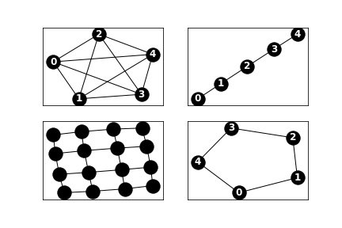


## Formal definitions

***Complete Graph***.
$K_n$ is a complete graph on $v_1, v_2, \cdots, v_n$ in which every two distinct vertices are joined by an edge.

A ***path*** is a graph $P_n$, on vertices $v_1, v_2, \cdots, v_n$, with edged ${v_i, v_{i+1}}$ for $ 1 \leq i \leq n$, and no other edges.

A **cycle** is a graph $C_n$ on vertices $v_1, v_2, \cdots, v_n$ with edges ${v_i, v_{1 +(i\ mod\ n)}}$ for $1 \leq i \leq n$, and no other edges.

- A ***bipartite*** graph is a graph that can be split into two sets of nodes with no edges between the nodes in each set. More formally A graph $G$ is ***bipartite*** if its vertices can be partitioned into two parts, say ${v_1, v_2, \cdots, v+n}$ and ${w_1, w_2, \cdots, w_n}$ so that all edges join some $v_i$ to some $w_j$; no two vertices $v_i$ and $v_j$ are adjacent. 
The code below uses `networkx` in order to create a *bipartite* graph with `n=4` nodes in the fist partition, `m=7` nodes in the second, and `p=0.6` or 60% probability of edge creation using `networkx.bipartite.random_graph(n, m, p)`.

```python
from networkx.drawing.nx_agraph import graphviz_layout
BPG = nx.bipartite.random_graph(4,7, .60)
pos = pos = graphviz_layout(BPG, prog='dot')
nx.draw(BPG, pos=pos, with_labels=True, font_color='w', font_weight='bold')
```

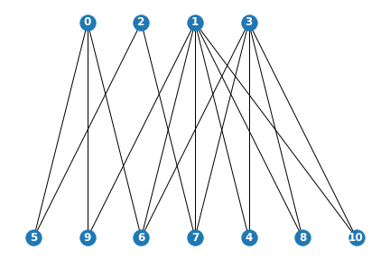

In the example below From left to right we first create a bipartite graph with `(n,m,p)=(2,4,1)`. This is obviously a bipartite graph. We then remove some of the edges. We remove edges `[(0,2), (0,3), (0,4), (0,5)]` from the original graph, The resulting graph is still a bipartite graph since since we can arrange it in two sets with no connection within each set. All the edges are interset, Please take a note that node 0 has no connection but it does not break the bipartite property of the graph. Finally we add an edge between nodes`0` and `1`. We can no longer split the graph to two sets that satisfy bipartite condition.

Please note that the second graph is bipartite but since it is a disconnected graph, bipartite sets cannot be determined.

We are using a `graphviz` layout here. If your graph is bipartite and you can determine an unambiguous set, you can use `pos = nx.bipartite_layout(G, top)` for a more intuitive drawing. for more information please do consult [networkx documentation](https://networkx.github.io/documentation/stable/reference/generated/networkx.drawing.layout.bipartite_layout.html).

```python
is_bipartite=[]
sets = []
graphs = []
#Creating a complete bipartite graph
graphs.append(nx.bipartite.complete_bipartite_graph(2,4))
#making sure we are usings a copy of the grpah and not the reference so the instances are independent of one 
#another.
g = graphs[0].copy()
#Removing some of the edges. Please note that all source nodes are from the same node, so we expect the resulting graph
#to be bipartite.
g.remove_edges_from([(0,2), (0,3), (0,4), (0,5)])
graphs.append(g)
g =  graphs[1].copy()
#Adding an edge from 0 to 1. 
g.add_edges_from([(0,1)])
graphs.append(g)
g = graphs[2].copy()
#Adding an edge from 3 to 4. 3 and 4 are both nodes in the second set of a bipartite graph and the resulting
#graph is not bipartite.
g.add_edges_from([(3,4)])
graphs.append(g)

f, axs = plt.subplots(1,4,figsize=(15,5))
for i,g in enumerate(graphs):
    plt.subplot(140+i+1)
    nx.draw(g, pos=graphviz_layout(g, prog='dot'), with_labels=True, font_color='w', font_weight='bold')
    #is_bipartite.append(nx.bipartite.is_bipartite(G=g))
    ibp = 'is' if nx.bipartite.is_bipartite(G=g) else "is not"
    verdict = "graph {} {} bipartite; edges={}".format(i+1, ibp, g.edges())
    try:
        sets = nx.bipartite.basic.sets(G=g)
    except Exception as e:
        sets = e
    if nx.bipartite.is_bipartite(g):
        print("{} and sets are: {}".format(verdict, sets))
    else:
        print(verdict)   
```

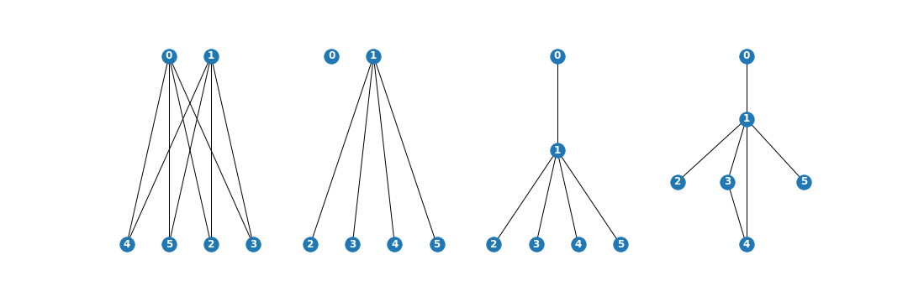

- graph 1 is bipartite; edges=[(0, 2), (0, 3), (0, 4), (0, 5), (1, 2), (1, 3), (1, 4), (1, 5)] and sets are: ({0, 1}, {2, 3, 4, 5})
- graph 2 is bipartite; edges=[(1, 2), (1, 3), (1, 4), (1, 5)] and sets are: Disconnected graph: Ambiguous solution for bipartite sets.
- graph 3 is bipartite; edges=[(0, 1), (1, 2), (1, 3), (1, 4), (1, 5)] and sets are: ({0, 2, 3, 4, 5}, {1})
- graph 4 is not bipartite; edges=[(0, 1), (1, 2), (1, 3), (1, 4), (1, 5), (3, 4)]e

## Graph Isomorphism

Two graphs which contain the same number of vertices connected in a similar way are isomorphic. 

```python
G = nx.Graph()
G.add_edges_from([(0,1), (1,2), (1, 3), (2,3)])
H = nx.Graph()
H.add_edges_from([(1,2), (2,3), (2, 0), (0,3)])

fig, axs = plt.subplots(1, 2, figsize=(12, 4))

nx.draw_networkx(G, node_color='black', font_color='w', font_weight='bold', ax=axs[0])
axs[0].set_axis_off()

nx.draw_networkx(H, node_color='black', font_color='w', font_weight='bold', ax=axs[1])
axs[1].set_axis_off()

plt.show()
```

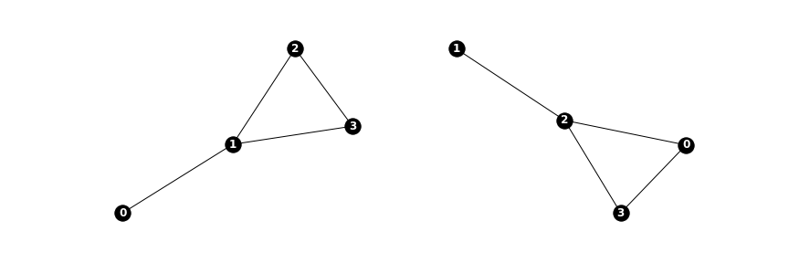


To check if the two graphs isomorphic, we can use the `networkx.algorithms.is_isomorphic()` library.

```python
nx.algorithms.is_isomorphic(G, H)
```

```text
True
```

## Isomorphism: Formal definition

Suppose $G_1=(V,E)$ and $G_2=(W,F)$. $G_1$ and $G_2$ are **isomorphic** if there is a bijection $f:V \rightarrow W$ such that $\{v_1, v_2\}\in E \iff \{f(v_1), f(v_2)\}\in F$. When $G_1$ and $G_2$ are isomorphic, we write $G_1 \cong G_2$.
In the above example function $f$ is a rotation:
$$
f(0) = 1\\
f(1) = 2\\
f(2) = 3\\
f(3) = 0\\
\text{or more generally: }f(v_i)=v_{i+1}
$$

```python
print("degree view of G: {}\ndegree view of G: {}".format(G.degree(), H.degree()))
```

```text
degree view of G: [(0, 1), (1, 3), (2, 2), (3, 2)]
degree view of G: [(1, 1), (2, 3), (3, 2), (0, 2)]
```

We can observe that the degree sequence of the isomorphic graphs is the same. More intuitively, isomorphism is re-arrangement of nodes without changing the arrangement of a graph.

## Neighborhood

In the most standard case, if two vertice are connected, we say the vertices are **adjacent**. The set of vertices that are adjacent to a node $v$ is called the **open neighborhood** of $v$, or just **neighborhood** for short. A closed neighborhood of node $v$, is its open neighborhood plus the node itself or more formally, $\mathcal{N}[v]=\mathcal{N}(v) \cup \{v\}$.

In the code snippet below we create two graphs based on their degree sequence. For graph `G1`,  `sequence = [1, 2, 2, 3, 4]` means that degrees of node 0 is 1 or there are two edges connected to node 1, and similarly degrees of nodes 2 to to 4 are respectively 2, 2, 3, and 4. 
We then compose the two graphs to create a larger graph before investigating neighbors of specific nodes.

```python
import random
sequence = [1, 2, 2, 3, 4]
G1 = nx.random_degree_sequence_graph(sequence, seed=42)
sequence = [2,3,4,2,1,2, 3, 2, 3]
G2 = nx.random_degree_sequence_graph(sequence, seed=42)
F = nx.compose(G1, G2)
nx.draw_kamada_kawai(F, with_labels=True, font_color='w', font_weight='bold', node_color='black')
```

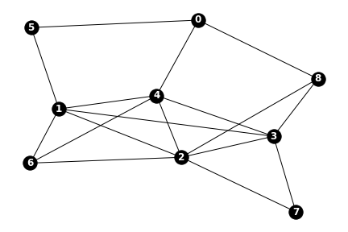


We can list neighbors of a specific node

```python
(list(F.neighbors(4)))
```

```text
[0, 1, 2, 3, 6]
```

We can create a graph, composed on a neighborhood of a node with a `radius` to identify the distance of the farthest node from the center of the neighborhood.

```python
nx.draw(nx.ego_graph(F, 4), with_labels=True, font_color='w', font_weight='bold', node_color='black')
```

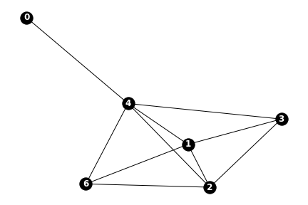

The following code shows neighborhoods of node '0' with $0 \leq radius \leq 2$.

```python
F1 = nx.ego_graph(F,0, radius=0)
F2 = nx.ego_graph(F,0, radius=1, center=True)
F3 = nx.ego_graph(F,0, radius=2)
graphs = [F1,F2,F3]

f, axs = plt.subplots(1,3,figsize=(15,5))
for i,g in enumerate(graphs):
    plt.subplot(140+i+1)
    nx.draw_kamada_kawai(g, with_labels=True, font_color='w', font_weight='bold', node_color='black')
```

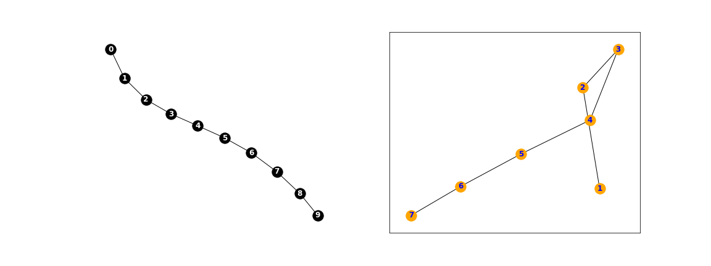

## Example of a path graph using `ego_graph`

In the example below we are creating a complete graph of degree 7 and then create subgraphs, each of which is a path graph. The first path graph is created using `nx.path_graph()` and the second graphs is crated using `nx.ego_graph`, centered on node 3 and has a radius of 2.

```python
P = nx.complete_graph(7)
fig, axs = plt.subplots(1,3, figsize=(16,6))
plt.subplot(131)
plt.title('complete graph with 7 nodes')
nx.draw(P, node_color='black', with_labels=True, font_color='w')

plt.subplot(132)
P1 = nx.path_graph(7)
plt.title('a path of length 6 that goes through all nodes ')
nx.draw(P1, node_color='black', with_labels=True, font_color='w')

plt.subplot(133)
P2 = nx.ego_graph(P1, 3, 2, undirected=True)
edge_lables = {(4,3): 'length: 1', (5,4):'length:2', 
               (2,3): 'length: 1', (1,2):'length:2'}
plt.title("a subpath of length 4 centered around node 3")
pos = nx.spring_layout(P2)
nx.draw_networkx(P2, pos=pos, font_color='b', node_color='orange')
nx.draw_networkx_edge_labels(P2, pos, edge_lables)
plt.axis('off')
plt.show()
```

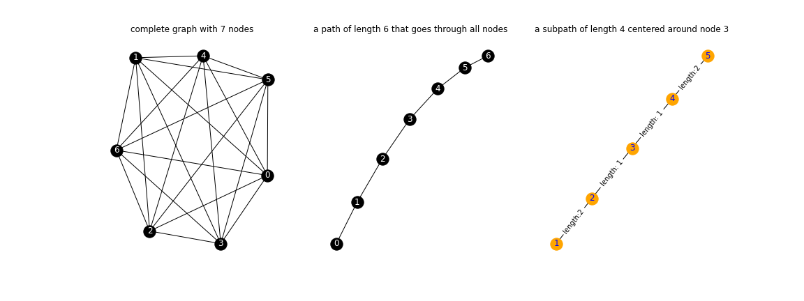

## Adjacency Matrix

Definition of neighborhood can be expanded to include adjacency, defined based on different criteria to capture deeper structures in a graph. For instance a neighborhood of node $v$ with distance 2 is a neighborhood that includes nodes that are of distance 2 of node $v$.

Adjacency matrix is a matrix whose rows and columns represent nodes of a graph. If there is an edge connecting the modes, then the value of the cell is 1, otherwise, the value is 0.
More formally:

Graph $\mathcal{G}=(V,E)$ is an undirected graph $\mathcal{G}=(V,E)$. The adjacency matrix of a $\mathcal{G}$ is given by:

$$
A_{\mathcal{G}}(i,j) = \begin{cases} \\
  1  & \text{if (i,j)} \in E, \\
  0 & otherwise \\
\end{cases} \\
$$

Adjacency matrix is a sparse matrix as most nodes in large graphs might not be connected.

```python
a = nx.adj_matrix(F).todense()
(F.edges(), a)
```

```text
(EdgeView([(0, 4), (0, 8), (0, 5), (1, 3), (1, 4), (1, 5), (1, 2), (1, 6), (2, 4), (2, 3), (2, 6), (2, 7), (2, 8), (3, 4), (3, 8), (3, 7), (4, 6)]),
 matrix([[0, 0, 0, 0, 1, 1, 0, 0, 1],
         [0, 0, 1, 1, 1, 1, 1, 0, 0],
         [0, 1, 0, 1, 1, 0, 1, 1, 1],
         [0, 1, 1, 0, 1, 0, 0, 1, 1],
         [1, 1, 1, 1, 0, 0, 1, 0, 0],
         [1, 1, 0, 0, 0, 0, 0, 0, 0],
         [0, 1, 1, 0, 1, 0, 0, 0, 0],
         [0, 0, 1, 1, 0, 0, 0, 0, 0],
         [1, 0, 1, 1, 0, 0, 0, 0, 0]]))
```

The adjacency matrix can be represented with mode visually expressive graphics.

```python
plt.matshow(a, cmap=plt.cm.gray_r)
```

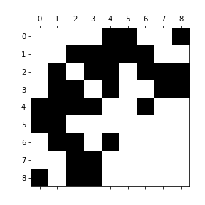

## Weighted graphs

Exoplanets are hat are outside of our solar system. Up until recently we  had not observed any planet outside of the solar systems, simply because planets do not emit enough light to be observable by telescopes. according to Newton's Law of Universal Gravitation, Objects with mass feel an attractive force that is proportional to their masses and inversely proportional to the square of the distance, or $$F=G\frac{Mm}{r^2}.$$

So, if a star affects orbit of a planet that revolves around the star, the planet also does affect orbit of its star slightly. Add to that that there are potentially several planets in a solar system, , then planetary gravity does influences orbits of planets and starts in solar system. Those little wobbles, resulted by smaller mass of planets, was used to discover the first exoplanets. This is in short a multi-body system. In a simplified model of a solar system, the orbits of the planets and the stars are dependent mass of the objects and distance to the star. HEre we are ignoring the effects that the planets have on one another and assume that there is only one start in the system. This can be modeled using a graph data structure. For instance, our solar system data can be summarized as:
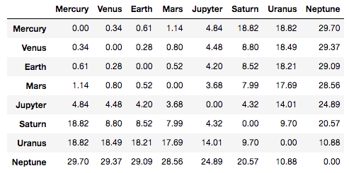


## Example

- First we create a pandas dataframe based on a weighted adjacency graph
    ```python
    distances = []
    distances.append(np.array([0.0, 0.34, 0.61, 1.14, 4.84, 18.82, 18.82, 29.70]))
    distances.append(np.array([0.34, 0.0, 0.28, 0.80, 4.48, 8.80, 18.49, 29.37]))
    distances.append(np.array([0.61, 0.28, 0.0, 0.52, 4.20, 8.52, 18.21, 29.09]))
    distances.append(np.array([1.14, 0.80, 0.52, 0.0, 3.68, 7.99, 17.69, 28.56]))
    distances.append(np.array([4.84, 4.48, 4.20, 3.68, 0.0, 4.32, 14.01, 24.89]))
    distances.append(np.array([18.82, 8.80, 8.52, 7.99, 4.32, 0.0, 9.70, 20.57]))
    distances.append(np.array([18.82, 18.49, 18.21, 17.69, 14.01, 9.70, 0.0, 10.88]))
    distances.append(np.array([29.70, 29.37, 29.09, 28.56, 24.80, 20.57, 10.88, 0.0]))

    distances[0].shape, distances[1].shape
    planets = ['Mercury','Venus','Earth','Mars', 'Jupyter', 'Saturn','Uranus','Neptune']
    SSDF = pd.DataFrame(distances, columns=planets, index=planets)
    ```
- We then create a graph based on this matrix
    ```python
    SSG = nx.from_numpy_matrix(SSDF.values)
    ```
- We can optionally change edge attribute names from default 'weight' to 'distance'
    ```python
    for u, v, data in SSG.edges(data=True):
        data['distance'] = data.pop('weight')
    ```
- Next we create node attributes and assign a mass to each planet. Additionally we re-label the nodes using plant names.
    ```python
    mass = {0: {'mass': 0.166}, 
            1: {'mass': 2.447}, 
            2: {'mass': 3.040}, 
            3: {'mass': 0.323}, 
            4: {'mass': 954.791}, 
            5: {'mass': 285.886}, 
            6: {'mass': 43.662}, 
            7: {'mass': 51.514}}
    nx.set_node_attributes(SSG, mass)
    mapping = {0: 'Mercury', 1: 'Venus', 2:'Earth', 3:'Mars', 4:'Jupyter', 5:'Saturn', 6:'Uranus', 7:'Neptune'}
    SSG = nx.relabel_nodes(SSG, mapping)
    ```
- printing edge and node data shows graph metadata:
    ```python
    SSG.edges(data=True), SSG.nodes(data=True)
    ```

    ```text
    EdgeDataView([('Mercury', 'Venus', {'distance': 0.34}),  ...
    NodeDataView({'Mercury': {'mass': 0.166}, ...
    ```
- At next step we calculate a new value for each edge based on Newton's gravitational force equation $F=G\frac{Mm}{r^2}.$ and add a new edge attribute called 'F'.
    ```python
    G = 6.6743 * 10**(-11)
    SSG.edges(data=True)
    for u,v,data in SSG.edges(data=True):
        u_mass = nx.get_node_attributes(SSG, "mass")[u]
        v_mass = nx.get_node_attributes(SSG, "mass")[v]
        distance = data['distance']
        data['F'] = G*u_mass*v_mass/((distance/2)**2)
    SSG.edges(data=True)
    ```
    ```text
    EdgeDataView([('Mercury', 'Venus', {'distance': 0.34, 'F': 9.381017330795847e-10}), ...
    ```
- Finally can draw the graph
    ```python
    import matplotlib.pyplot as plt
    plt.figure(3,figsize=(16,16))
    nx.draw_circular(SSG, 
                    with_labels=True,
                    node_size = 3000, font_weight='bold', font_color='orange', node_color='black')
    nx.draw_networkx_edge_labels(SSG, pos=nx.spring_layout(SSG), font_size=14)
    plt.show()
    ```

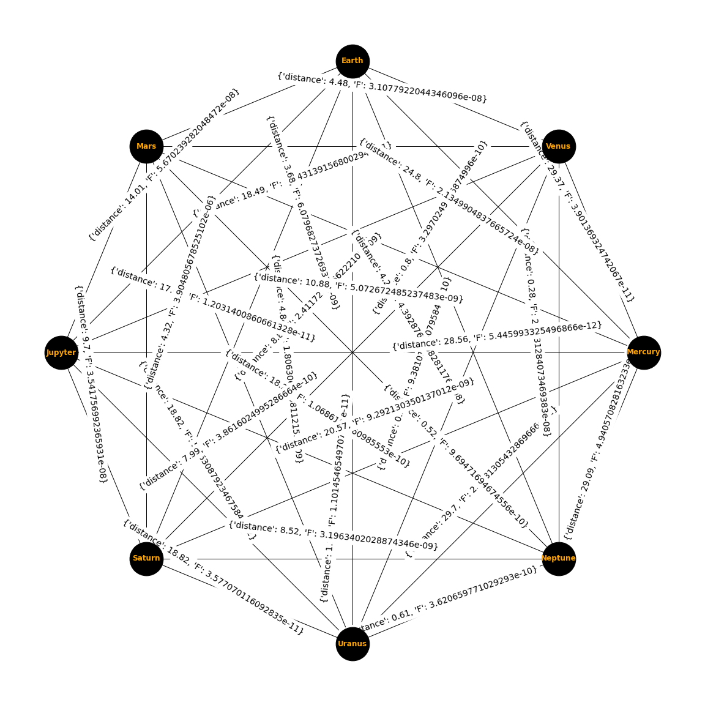

## Adjacency Matrix for a Weighted Graph

Weighted graph $\mathcal{G}=(V,E,w)$ is an undirected graph $\mathcal{G}=(V,E)$ along with a function $w:E\rightarrow \mathbb{R}^+$. The adjacency matrix of a $\mathcal{G}$ is given by:

$$
A_{\mathcal{G}}(i,j) =
\begin{cases}
  w(i,j)  & \text{if (i,j)} \in E,\\
  0 & otherwise
\end{cases}
$$

## Directed Graphs

So far, we have seen only graphs that are *undirected*, meaning that if there is a an edge between vertices $v$ and $w$, then the exact relationship does also exist between $w$ and $v$.

There are a few differences between undirected and directed graphs (also digraph). For instance $\text{if graph } \mathcal{G} \text{ is an undirected graph , then} (v,w) \in E \therefore (w,v) \in E$. The same does not hold for digraphs. directed edges are sometimes called **arcs**.

In undirected graphs there was no concept of **indegree** and **outdegree** in undirected graphs. Due to lack of symmetry in digraphs, there is a need to describe **indegree** and **outdegree**. The **indegree** of $v$, denoted $d^{-}(v)$, is the number of arcs whose target is node $v$. A set of all arcs whose target is $v$ is denoted $E^{-}_{v}$. Similarly, an **outdegree** of node $v$, $d^{+}(v)$, is the number of arcs in $E^{+}_{v}$, a set of all incoming arcs to node $v$.

```python
DG = nx.DiGraph()
BPG = nx.bipartite.random_graph(4,7, .60)
DG.add_edges_from(BPG.edges())
PDG = nx.DiGraph()
PDG.add_edges_from(nx.path_graph(5).edges())
CDG = PDG.copy()
CDG.add_edge(4, 0)

fig, axs = plt.subplots(1, 3, figsize=(15, 5))
nx.draw_circular(DG, with_labels=True, font_color='w', font_weight='bold', ax=axs[0])
axs[0].set_axis_off()
nx.draw(PDG, with_labels=True, font_color='w', font_weight='bold', ax=axs[1])
axs[1].set_axis_off()
nx.draw_circular(CDG, with_labels=True, font_color='w', font_weight='bold', ax=axs[2])
axs[2].set_axis_off()
plt.show()
```

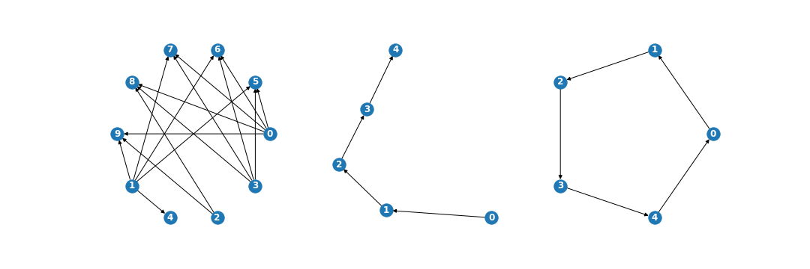

## Walk

A walk in a digraph is a sequence $v_1, e_1, v_2, e_2, \cdots, v_{k-1}, e_{k-1}, v_k$, such that $e_k = (v_i, v_{i+1})$. If $v_1 = v_k$, the the walk is a **cycle**.

A **path** in a digraph, can be redefined in terms of a walk as a **walk** in which all vertices are distinct.

```python
sequence = [1, 2, 2, 3, 4]
G1 = nx.random_degree_sequence_graph(sequence, seed=42)
sequence = [2,3,4,2,1,2, 3, 2, 3]
G2 = nx.random_degree_sequence_graph(sequence, seed=42)
F = nx.compose(G1, G2)
fig, ax = plt.subplots(1, 2, figsize=(15, 5))
nx.draw(F, with_labels=True, font_color='w', font_weight='bold', node_color='black', ax=ax[0])
ax[0].set_axis_off()
ax[0].set_title('an example graph')
# creating a list that represents nodes in the shortest path between nodes 2 and 5. The outcome is [2,1,5]
w = nx.algorithms.shortest_path(F, source=2, target=5)
# we now take the nodes on the shortest path and create an edge list in the form of [(2,1), (1,5)]
tmp = []
for i in range(len(w)-1):
    tmp.append((w[i],w[i+1]))
# creating a directed graph and add edges from the edge list.
W = nx.DiGraph()
W.add_edges_from(tmp)
ax[1].set_axis_off()
ax[1].set_title('a sample directed walk based on shortest distance between node 2 to node 5')
nx.draw(W, with_labels=True, font_color='white', node_color='black', font_weight='bold',ax=ax[1] )
plt.show()
```

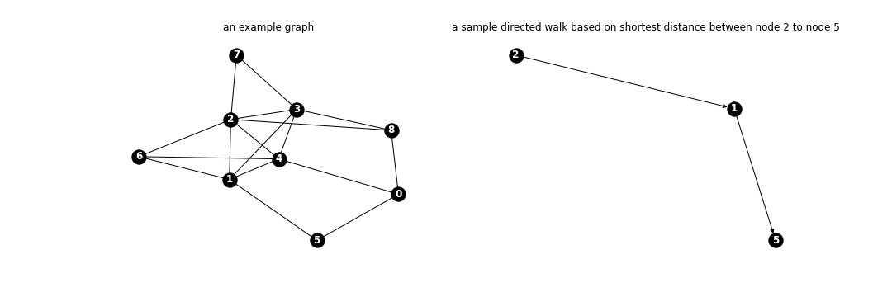

## Random Walks

In the above example, if  degree of a node, is larger than one, then a random decision needs to be made as to which direction to take. If there is no weight associated with an edge, then all paths have an equal probability of being taken as the next step and sum of all probabilities should add to 1. For in the above undirected graph (left side), the probability of moving to 5 from 0 is .33. The same is true about $0\rightarrow 4$ and $0\rightarrow 8$ where total is 1.
In weighted graphs, the next step is decided based on the probability or weight of the edge. For instance in a multi-body system such as the example of gravity in the solar system, the random walk function takes mass and distance into account. in a simpler case

```python
a = nx.subgraph(F, [0,5,8,4])
a[0][4]['weight'] = .3
a[0][8]['weight'] = .6
a[0][5]['weight'] = .1
plt.figure(3,figsize=(5,5))
pos = nx.spring_layout(a)
nx.draw(a, pos=pos, with_labels=True, node_color='black', font_color='w', font_weight='bold')
nx.draw_networkx_edge_labels(a, pos=pos)
plt.show()
```

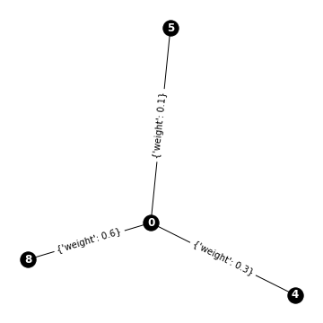

## What is next?

Next we look into [MPNN or Message Passing Neural Networks](../machine-learning-graphs/03-message-passing-neural-networks) paradigm.
