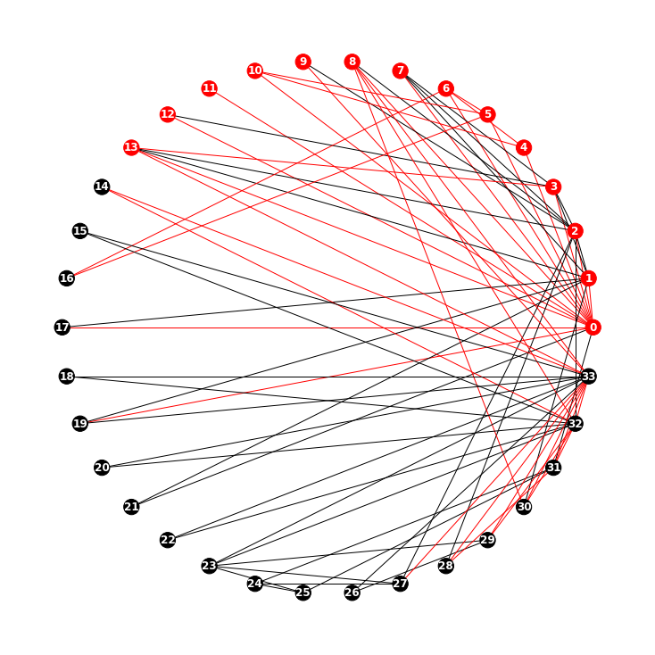
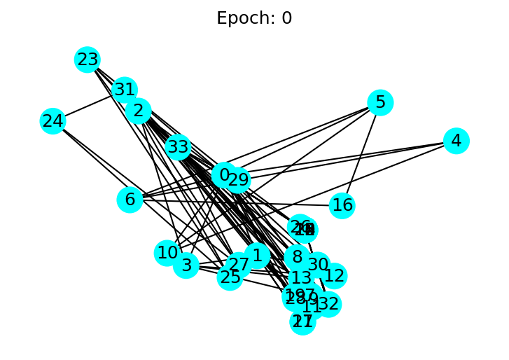

|ToC|
|---|

Finally the theoretical foundation is laid through [part 3](../03-message-passing-neural-networks) and [part 4](../04-graph-convolutional-networks) of this blog series and we are ready to get through a hello world sort of tutorial using Deep Graph Library.
In this notebook, we shall implement a simple example of the Karate club, which is basically the MNIST of GNN.

|SeriesToC|
|---------|

```python
import networkx as nx
import matplotlib.pyplot as plt
import dgl
import numpy as np
import torch
import sys
sys.path.append('./supportingexamples/')
import examples
```

## Drawing the graph of the problem

Below are drawings of the karate club interaction graph. We can observe that the club connections are centered around node 0 and node 33. I have used to different layouts. First the cycle layout that is similar to the graph in the original paper from the 1970s and then Kamada Kawai Layout, which gives us a more expressive graph. I have load the data using ```python networkx.karate_club_graph```

```python
G = nx.karate_club_graph()
examples.draw_interaction_graph(G=G, pos='c')
# Alternatively swap the drawing function with the one below in order not to use the examples library I have created.
#nx.draw_circular(G, with_labels=True, font_weight='bold', node_color=red, font_color="white")
```



## Defining the graph

Since this notebook is all about using DGL to train the karate club network, let us create a DGL graph, using ```dgl.data.karate.KarateClub()``` . 

> ***Note:*** *Please note that you need at least dgl version ```0.4.2``` for this to work. Older version do have a bug and return error. In oder to check your dgl version, please run ```dgl.__version__```.*

`dgl.data.karate.KarateClub()` returns an object with two properties: data, and label. 'data' object is a python list with only one element of type ```dgl.DGLGraph```. data includes node labels. Node labels are either 1 or 0 with 1 indicating that the member, who is represented as a node, belongs to Mr. Hi's club.
'label' is a replica of `KarateClub.data[0].nodes[:].data['label']`.

```python
import dgl
G = dgl.from_networkx(G)
G, G.nodes(), G.edges()
```

```text
    (Graph(num_nodes=34, num_edges=156,
           ndata_schemes={}
           edata_schemes={}),
     tensor([ 0,  1,  2,  3,  4,  5,  6,  7,  8,  9, 10, 11, 12, 13, 14, 15, 16, 17,
             18, 19, 20, 21, 22, 23, 24, 25, 26, 27, 28, 29, 30, 31, 32, 33]),
     (tensor([ 0,  0,  0,  0,  0,  0,  0,  0,  0,  0,  0,  0,  0,  0,  0,  0,  1,  1,
               1,  1,  1,  1,  1,  1,  1,  2,  2,  2,  2,  2,  2,  2,  2,  2,  2,  3,
               3,  3,  3,  3,  3,  4,  4,  4,  5,  5,  5,  5,  6,  6,  6,  6,  7,  7,
               7,  7,  8,  8,  8,  8,  8,  9,  9, 10, 10, 10, 11, 12, 12, 13, 13, 13,
              13, 13, 14, 14, 15, 15, 16, 16, 17, 17, 18, 18, 19, 19, 19, 20, 20, 21,
              21, 22, 22, 23, 23, 23, 23, 23, 24, 24, 24, 25, 25, 25, 26, 26, 27, 27,
              27, 27, 28, 28, 28, 29, 29, 29, 29, 30, 30, 30, 30, 31, 31, 31, 31, 31,
              31, 32, 32, 32, 32, 32, 32, 32, 32, 32, 32, 32, 32, 33, 33, 33, 33, 33,
              33, 33, 33, 33, 33, 33, 33, 33, 33, 33, 33, 33]),
      tensor([ 1,  2,  3,  4,  5,  6,  7,  8, 10, 11, 12, 13, 17, 19, 21, 31,  0,  2,
               3,  7, 13, 17, 19, 21, 30,  0,  1,  3,  7,  8,  9, 13, 27, 28, 32,  0,
               1,  2,  7, 12, 13,  0,  6, 10,  0,  6, 10, 16,  0,  4,  5, 16,  0,  1,
               2,  3,  0,  2, 30, 32, 33,  2, 33,  0,  4,  5,  0,  0,  3,  0,  1,  2,
               3, 33, 32, 33, 32, 33,  5,  6,  0,  1, 32, 33,  0,  1, 33, 32, 33,  0,
               1, 32, 33, 25, 27, 29, 32, 33, 25, 27, 31, 23, 24, 31, 29, 33,  2, 23,
              24, 33,  2, 31, 33, 23, 26, 32, 33,  1,  8, 32, 33,  0, 24, 25, 28, 32,
              33,  2,  8, 14, 15, 18, 20, 22, 23, 29, 30, 31, 33,  8,  9, 13, 14, 15,
              18, 19, 20, 22, 23, 26, 27, 28, 29, 30, 31, 32])))
```

In order to make the edges more friendly to human reader, next I will present them as tuples.
A closer inspection of the edge list shows that for each edge $(v,w)$, there also exists an edge $(w,v)$. This is because ```dgl.DGLGraph``` is always directed. an undirected graph is represented as two directed graphs where $\mathcal{G} = (V,E)\ and\ \forall (v, w) \in E \iff (w, v) \in E$

```python
src = G.edges()[0]
trg = G.edges()[1]
print([(a,b) for a,b in (zip(src.numpy(), trg.numpy()))])
```

```text
    [(0, 1), (0, 2), (0, 3), (0, 4), (0, 5), (0, 6), (0, 7), (0, 8), (0, 10), (0, 11), (0, 12), (0, 13), (0, 17), (0, 19), (0, 21), (0, 31), (1, 0), (1, 2), (1, 3), (1, 7), (1, 13), (1, 17), (1, 19), (1, 21), (1, 30), (2, 0), (2, 1), (2, 3), (2, 7), (2, 8), (2, 9), (2, 13), (2, 27), (2, 28), (2, 32), (3, 0), (3, 1), (3, 2), (3, 7), (3, 12), (3, 13), (4, 0), (4, 6), (4, 10), (5, 0), (5, 6), (5, 10), (5, 16), (6, 0), (6, 4), (6, 5), (6, 16), (7, 0), (7, 1), (7, 2), (7, 3), (8, 0), (8, 2), (8, 30), (8, 32), (8, 33), (9, 2), (9, 33), (10, 0), (10, 4), (10, 5), (11, 0), (12, 0), (12, 3), (13, 0), (13, 1), (13, 2), (13, 3), (13, 33), (14, 32), (14, 33), (15, 32), (15, 33), (16, 5), (16, 6), (17, 0), (17, 1), (18, 32), (18, 33), (19, 0), (19, 1), (19, 33), (20, 32), (20, 33), (21, 0), (21, 1), (22, 32), (22, 33), (23, 25), (23, 27), (23, 29), (23, 32), (23, 33), (24, 25), (24, 27), (24, 31), (25, 23), (25, 24), (25, 31), (26, 29), (26, 33), (27, 2), (27, 23), (27, 24), (27, 33), (28, 2), (28, 31), (28, 33), (29, 23), (29, 26), (29, 32), (29, 33), (30, 1), (30, 8), (30, 32), (30, 33), (31, 0), (31, 24), (31, 25), (31, 28), (31, 32), (31, 33), (32, 2), (32, 8), (32, 14), (32, 15), (32, 18), (32, 20), (32, 22), (32, 23), (32, 29), (32, 30), (32, 31), (32, 33), (33, 8), (33, 9), (33, 13), (33, 14), (33, 15), (33, 18), (33, 19), (33, 20), (33, 22), (33, 23), (33, 26), (33, 27), (33, 28), (33, 29), (33, 30), (33, 31), (33, 32)]
```

We can observe that the graph has 34 nodes and 156 edges and presently neither the nodes nor the edges have any attributes (`ndata_schemes == {} and edata_schemes == {}`). We can then add attributes to all nodes as well as edges.
basically, we need to create a tensors whose first axis (`axis==0`), matches the number of elements in node and edge list. For the nodes we are using `torch.nnEmbedding(34,5)`, which creates a tensor with shape of `(34,5)`. For edges, we simply use a random tensor with shape equal to `(156, 3)`. We then use `ndata['features']` and `edata['attributes]` in order to create attributes for nodes and edges that are respectively called `features` and `attributes`.

```python
import torch
import torch.nn as nn
import torch.nn.functional as F
embedding = nn.Embedding(34,5)
print(embedding.weight.shape, embedding.weight[0])
#creating a features label"
G.ndata['features'] = embedding.weight
G.ndata['features'][0]
```

```text
    torch.Size([34, 5]) tensor([-1.2850, -0.1855,  0.7054,  1.1698,  2.3627],
           grad_fn=<SelectBackward0>)

    tensor([-1.2850, -0.1855,  0.7054,  1.1698,  2.3627],
           grad_fn=<SelectBackward0>)
```

## Defining a Graph Convolutional Network

For detailed information, please refer to the [graph convolutional network](lnk) in the series. Essentially, at each layer, each node carries a feature vector. In our case, we have seen how a feature tensor is being created using using embedding `embedding = nn.Embedding(34,5)` and then assigned to the nodes. `DGL_G.ndata['features'] = embedding.weight`. You can observe that the size of the embedding tensort on `axis[0]` is 34 and matches the number of nodes.The GCN, then aggregates these features, using its neighborhood, before updating the next layer with its value.  This is in keeping with the MPNN paradigm. For more details on MPNN, please refer to the [MPNN entry](link) from this series. Figure 1 visualizes the process.


```python
from dgl.nn.pytorch import GraphConv
import torch.nn as nn
class GCN(nn.Module):
    def __init__(self, in_feats, hidden_size, num_classes):
        super(GCN, self).__init__()
        self.conv1 = GraphConv(in_feats, hidden_size)
        self.conv2 = GraphConv(hidden_size, num_classes)

    def forward(self, g, inputs):
        h = self.conv1(g, inputs)
        h = torch.relu(h)
        h = self.conv2(g, h)
        return h
    
net = GCN(5,5,2)
net
```

```text
    GCN(
      (conv1): GraphConv(in=5, out=5, normalization=both, activation=None)
      (conv2): GraphConv(in=5, out=2, normalization=both, activation=None)
    )
```

As you have noticed, watch node as a feature that is an array of length 5, resulting  from `Embedding(34,5)`. This GCN, takes feature inputs of the size 5 and transforms it to a hidden size of 5 in the first layer. The second layer takes the hidden features of size 5 and generates an output the size of 2, corresponding to which membership each member is going to use. Obviously, if there were a third option, the output layer would have been of size 3.

## Initializing the network

We now pass the data to the network to initialize the network before attempting to train it. First we use the node attributes as input data. We then define which nodes are labeled. Those are nodes `0`, representing the instructor, and node `33`, representing the club president. Finally we label the two nodes as `0` and `1` respectively. Finally, we can initialize the network using the inputs. We use the label information at the next step for training.

```python
inputs = embedding.weight
labeled_nodes = torch.tensor([0, 33])  
labels = torch.tensor([0, 1]) 
```

```python
net(G, inputs)
```

```text
    tensor([[-0.3374,  0.3154],
            [-0.2532,  0.1597],
            [-0.5593,  0.4393],
            [-0.4363,  0.1409],
            [ 0.2600,  0.3816],
            [ 0.0643,  0.4555],
            [-0.5810,  0.2677],
            [-0.1167,  0.0824],
            [-0.1502,  0.1563],
            [-0.1095,  0.0748],
            [-0.4852,  0.1647],
            [-0.1123,  0.0605],
            [-0.0546,  0.1206],
            [-0.1394,  0.1167],
            [-0.1304,  0.2094],
            [-0.1304,  0.2094],
            [-0.0344,  0.2563],
            [-0.1357,  0.0319],
            [-0.1304,  0.2094],
            [-0.1560,  0.0816],
            [-0.1304,  0.2094],
            [-0.1357,  0.0319],
            [-0.1304,  0.2094],
            [-0.6906,  0.5385],
            [-0.7794,  0.4198],
            [-0.3232,  0.1178],
            [-0.1424,  0.2149],
            [-0.3007,  0.1414],
            [-0.1547,  0.0767],
            [-0.3030,  0.3054],
            [-0.0975,  0.1418],
            [-0.5945,  0.4799],
            [-0.0693,  0.0658],
            [-0.4569,  0.3694]], grad_fn=<AddBackward0>)
```

## Training the network

We can now trian the netwrk using the input data and the labels. There are a few setting I would like to highlight before getting into the code:

1. We are using an Adam optimizer using ` torch.optim.Adam`, to which we pass an iterator chaining network parameters, obtained by `net.parameters()` and node label parameters obtained by embedding.parameters(). We additoinally pass a learning rate of `0.01`
2. For loss function we are using a negative log likelihood loss obtained via `torch.nn.functional.nll_loss()` and pass the output of $softmax$ on `labeled_nodes` and `labels` to it. We are using the log likelihood for a classification problem with two classes, `instructor` and `president`.

Next, let us explore what goes into the optimizer.

```python
import itertools
optiam_params = itertools.chain(net.parameters(), embedding.parameters())
optiam_params.__next__()
```

```text
    Parameter containing:
    tensor([[-0.5340,  0.5015, -0.2726,  0.7333,  0.1494],
            [-0.1700, -0.4509, -0.2489,  0.3216, -0.0144],
            [ 0.7049,  0.4724, -0.3158, -0.2444, -0.0796],
            [-0.1441,  0.2260, -0.6152, -0.4975, -0.1515],
            [-0.2843, -0.4554,  0.6432,  0.6919, -0.4815]], requires_grad=True)
```

```python
optimizer = torch.optim.Adam(params=optiam_params, lr=0.01)
```

We can now train the network for 50 epochs

```python
v_logits = []
for epoch in range(50):
    logits = net(G, inputs)
    v_logits.append(logits.detach())
    log_p = F.log_softmax(input=logits, dim=1) 
    loss = F.nll_loss(input=log_p[labeled_nodes], target=labels)
    optimizer.zero_grad()
    loss.backward()
    optimizer.step()
    print('Epoch %d | Loss: %.4f' % (epoch, loss.item()))    
```

```text
    Epoch 0 | Loss: 0.7175
    Epoch 1 | Loss: 0.6903
    Epoch 2 | Loss: 0.6654
    Epoch 3 | Loss: 0.6424
...
    Epoch 46 | Loss: 0.0579
    Epoch 47 | Loss: 0.0542
    Epoch 48 | Loss: 0.0507
    Epoch 49 | Loss: 0.0474

```


```python
(len(v_logits), len(v_logits[0]))
```

```text
    (50, 34)
```

```python
import matplotlib.animation as animation
import matplotlib.pyplot as plt
nx_G = G.to_networkx().to_undirected()

def draw(i):
    cls1color = '#00FFFF'
    cls2color = '#FF00FF'
    pos = {}
    colors = []
    for v in range(34):
        pos[v] = v_logits[i][v].numpy()
        cls = pos[v].argmax()
        colors.append(cls1color if cls else cls2color)
    ax.cla()
    ax.axis('off')
    ax.set_title('Epoch: %d' % i)
    nx.draw_networkx(nx_G.to_undirected(), pos, node_color=colors,
            with_labels=True, node_size=300, ax=ax)

fig = plt.figure(dpi=150)
fig.clf()
ax = fig.subplots()
draw(0)  # draw the prediction of the first epoch
```




The following animation shows how the model correctly predicts the community after a series of training epochs.

```python
ani = animation.FuncAnimation(fig, draw, frames=len(v_logits), interval=200)
```


## References

- https://docs.dgl.ai/en/0.2.x/tutorials/basics/1_first.html

## What is next?

Next we take a look at knowledge graph embedding (KGE) using graphs. Using GNN, we can predict edges that are missing from a knowledge graph and complete them. KGE has massively important applications, which we take a look at in the last post in this introductory series, but first, let us take a look at what KE actual is in the [next post](/posts/machine-learning-graphs/06-kbe.md)
