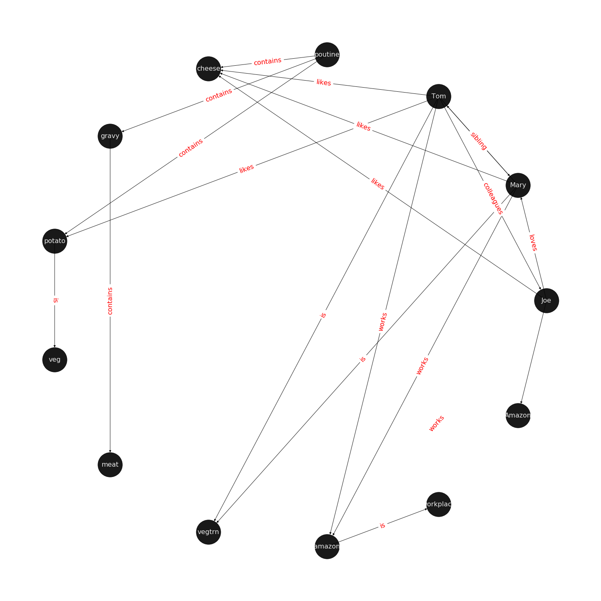
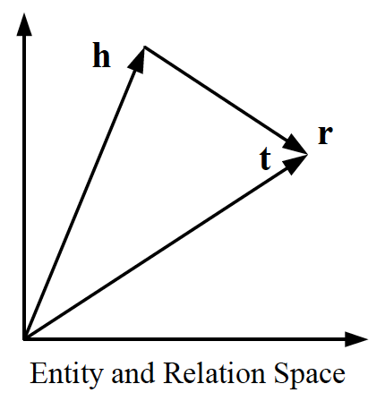
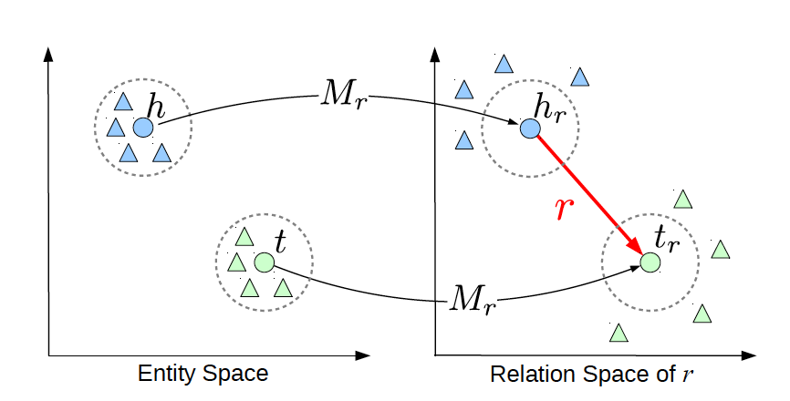
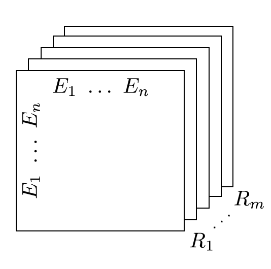
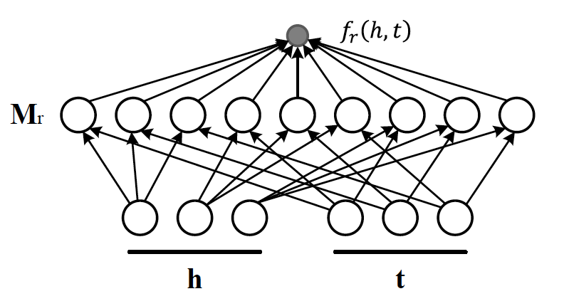
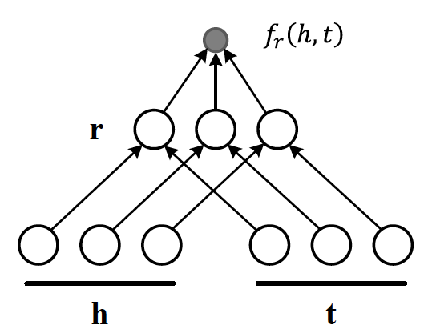
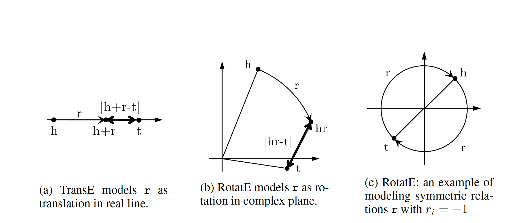

KGE is a fundamental application of GNN and a variety of fields ranging from life sciences to personalization engines can benefit from the ability to build knowledge graphs. In the [previous post](/posts/machine-learning-graphs/05-GNN-example-karate-club) we learned a simple implementation using DGL. DGL is used to develop DGL-KE. This post sets up the theoretical requirement for understanding how to use DGL-KE, while the [next post](/posts/machine-learning-graphs/07-dglke-oss-tool-for-KGE) describes how DGL-KE is implemented and provides the reader with an implementation example. Finally in the [final post](/posts/machine-learning-graphs/08-covid-drug-repurposing-with-DGLKE) we take a look at an important example of DGL-KE in COVID19 drug repurposing research.

- [part 1](/posts/machine-learning-graphs/01-motivation-for-graph-ml) - Motivation for using graphs.
- [Part 2](/posts/machine-learning-graphs/02-graph-theory) - Graph theory, a theoretical minimum.
- [Part 3](/posts/machine-learning-graphs/03-message-passing-neural-networks) - MPNN paradigm.
- [Part 4](/posts/machine-learning-graphs/04-graph-convolutional-networks) - GCN, a brief introduction to the theory.
- [Part 5](/posts/machine-learning-graphs/05-GNN-example-karate-club) - Karate Club example, GNN's HelloWorld using Deep Graph Library.
- [Part 6](/posts/machine-learning-graphs/06-knowledge-graph-embedding) - Introduction to Knowledge Embedding in graphs.
- [Part 7](/posts/machine-learning-graphs/07-dglke-oss-tool-for-KGE) - Under the hood of DGL-KE, a framework for knowledge embedding using DGL.
- [Part 8](/posts/machine-learning-graphs/08-covid-drug-repurposing-with-DGLKE) - DGL-KE in practice, Drug repurposing using DGL-KE

There has been a huge focus, both in academia and industry, on Graph Neural Networks in the past 3 years. A surge of GNN papers, toolkits, and knowledge graph embedding tools is ensued as a result of interest. We, at AWS, have created an open source library for creating, training, and performing several GNN inference tasks, called Deep Graph Library or DGL. DGL is a high performance and highly distributed Graph Neural Network library. On the top of DGL, we have released a knowledge graph embedding tool called DGL-KE, which outperforms similar products thanks to numerous innovations in distributed KGE training for link prediction task. To be able efficiently and effectively apply DGL-KE to KGE tasks, it is however important to understand what the models in the core of DGL-KE do and where they perform best. This blog details out KGE models that are implemented in DGL-KE and is a fundamental to understanding of DGL-KE's functional capabilities.

## What is a  Knowledge Graph

“A knowledge graph (i) mainly describes real-world entities and their interrelations, organized in a graph, (ii) defines possible classes and relations of entities in a schema, (iii) allows for potentially interrelating arbitrary entities with each other and (iv) covers various topical domains.” [Paulheim- 1]
Knowledge Graphs are often modeled as directed multigraphs. As a quick reminder let us define multi-graph and directed graphs:

- In a directed graph edges are called arcs and they can direct information from their tail to their head nodes but not in the opposite direction.
- A multigraph is a graph that can include loops as well as multiple relationships between the same nodes. for more information on Graphs you can check [this link](https://github.com/cyrusmvahid/GNNTrainingMaterial/blob/master/March2020/01-gentle_into_2_graphs.ipynb).

Let us examine a directed multigraph in an example, which includes a cast of characters and the world in which they live.

**scenario:**

**Mary** and **Tom** are ***siblings*** and they both are ***are vegetarians***, who ***like*** **potatoes** and **cheese**. Mary and Tom both ***work*** at **Amazon**. **Joe** is a bloke who is a ***colleague*** of Tom. To make the matter complicated, Joe ***loves*** Mary, but we do not know if the feeling is reciprocated.

Joe ***is from*** **Quebec** and is proud of his native dish of **Poutine**, which is ***composed*** of potato, cheese, and **gravy**. We also know that gravy ***contains*** **meat** in some form.

Joe is excited to invite Tom for dinner and and has sneakily included his sibling, Mary, in the invitation. His plans are doomed from get go as he is planning to serve the vegetarian siblings his favourite Quebecois dish, Poutine.

Oh! by the way, a piece of geography trivia: Quebec ***is located*** in a **province** of the same name, which in turn ***is located*** in **Canada**.

There are several relationships in this scenario that are not explicitly mentioned but we can simply infer from what we are given:

- Mary is a colleague of Tom.
- Tom is a colleague of Mary.
- Mary is Tom's sister.
- Tom is Mary's brother.
- Poutine has meat.
- Poutine is not a vegetarian dish.
- Mary and Tom would not eat Poutine.
- Poutine is a Canadian dish.
- Joe is Canadian.
- Amazon is a workplace for Mary, Tom, and Joe.

There are also some interesting negative conclusions that seem intuitive to us but not to the machine:

- Potato *does not like* Mary.
- Canada *is not from* Joe.
- Canada *is not located* in Quebec.
- ...

What we have examined is a knowledge graph, a set of nodes with different types of relations:

- 1-to-1: Mary is a sibling of Tom.
- 1-to-N: Amazon is a workplace for Mary, Tom, and Joe.
- N-to-1: Joe, Tom, and Mary work at Amazon.
- N-to-N: Joe, Mary, and Tom are colleagues.

There are other categorization perspectives on the relationships as well:

- Symmetric: Joe is a colleague of Tom entails Tom is also a colleague of Joe.
- Antisymmetric: Quebec is located in Canada entails that Canada cannot be located in Quebec.

Figure 1 visualizes a knowledge-base that describes *World of Mary*. For more information on how to use the examples, please refer to the [code](https://github.com/cyrusmvahid/GNNTrainingMaterial/blob/master/March2020/supportingexamples/examples.py) that draws the examples.



## What is the task of Knowledge Graph Embedding?

Knowledge graph embedding is the task of completing the knowledge graphs by probabilistically inferring the missing arcs from the existing graph structure. KGE differs from ordinary relation inference as the information in a knowledge graph are multi-relational and more complex to model and computationally expensive. For this rest of this blog, we examine fundamentals of KGE.

## Common connectivity patterns:

Different connectivity or relational pattern are commonly observed in KGs. A Knowledge Graph Embedding model intends to predict missing connections that are often one of the types below.

- ***symmetric***
  - **Definision:** A relation $r$ is ***symmetric*** if $\forall {x,y}: (x,r,y)\implies (y,r,x)$
  - **Example:** $\text{x=Mary and y=Tom and r="is a sibling of"}; (x,r,y) = \text{Mary is a sibling of Tom} \implies (y,r,x)=\text{Tom is a sibling of Mary}$
- ***antisymmetric***
  - **Definision:** A relation r is ***antisymmetric*** if $\forall {x,y}: (x,r,y)\implies \lnot (y,r,x)$
  - **Example:** $\text{x=Quebec and y=Canada and r="is located in"}; (x,r,y) = \text{Quebec is located in Canada} \implies (y,\lnot r,x)=\text{Canada is not located in Quebec}$
- ***inversion***
  - **Definition:** A relation $r_1$ is ***inverse*** to relation $r_2$ if $\forall x,y: r_2(x,y)\implies r_1(y,x)$.
  - **Example:** $x=Mary,\ y=Tom,\ r_1=\text{"is a sister of}"\ and r_2=\text{"is a brother of"} \\ (x,r_1,y)=\text{Mary is a sister of Tom} \implies (y,r_2,x) = \text{Tom is a brother of Mary}$
- ***composition***
  - **Definition**: relation $r_1$ is composed of relation $r_2$ and relation $r_3$ if $\forall x,y,z: (x,r_2,y) \land (y,r_3,z) \implies (x,r_1, z)$
  - **Example:** $\text{x=Tom, y=Quebec, z=Canada},\ r_2=\text{"is born in"}, r_3=\text{"is located in"}, r_1=\text{"is from"}\\(x,r_2,y)=\text{Tom is born in Quebec} \land (y,r_3,z) = \text{Quebec is located in Canada} \implies (x,r_1,z)=\text{Tom is from Canada}$

```text
*ref: RotateE[2]*
```

## Score Function

There are different flavours of KGE that have been developed over the course of the past few years. What most of them have in common is a score function. The score function measures how distant two nodes relative to a relation type are. As we are setting the stage to introduce the reader to DGL-KE, an open source knowledge graph embedding library, we limit the scope only to those methods that are implemented by DGL-KE and are listed in figure 2.


### A short explanation of the score functions

Knowledge graphs that are beyond toy examples are always large, high dimensional, and sparse. High dimensionality and sparsity are the results of the amount of information that the KG holds that can be represented with 1-hot or n-hot vectors. The fact that most of the items have no relationship with one another is another major contributor to sparsity of KG representations. We, therefore, desire to project the sparse and high dimensional graph representation vector space onto a lower dimensional dense space. This process is similar to to word embedding and dimensionality reduction used for [recommender systems based on matrix factorization models](https://www.slideshare.net/apachemxnet/building-content-recommendation-systems-using-mxnet-gluon). I will provide a detailed account of all the methods in a different post, but here I will provide a short explanation of how projections differ in each paper, what the score functions do, and what consequences the choices have for relationship inference and computational complexity.

## TransE

TransE is a representative translational distance model that represents entities and relations as vectors in the same semantic space of dimension $\mathbb{R^d}$, where $d$ is the dimension of the target space with reduced dimension. A fact in the source space is represented as a triplet $(h, r, t)$ where $h$ is short for *head*, $r$ is for *relation*, and $t$ is for *tail*. The relationship is interpreted as a translation vector so that the embedded entities are connected by relation $r$ have a short distance. [3, 4]

In terms of vector computation it could mean adding a head to a relation should approximate to the relation's tail, or $h+r \approx t$. For example if $h_1=emb("Ottawa"),\ h_2=emb("Berlin"), t_1=emb("Canada"), t_2=("Germany")$, and finally $r="CapilatOf"$, then $h_1 + r$ and $h_2+r$ should approximate $t_1$ and $t_2$ respectively.
TransE performs linear transformation and the scoring function is negative distance between $h+r$ and $t$, or $f=-\|h+r-t\|_{\frac{1}{2}}$



## TransR

TransE cannot cover relationship that are not 1-to-1 as it learns only one aspect of similarity. TransR addresses this issue with separating relationship space from entity space where $h, t \in \mathbb{R}^k$ and $r \in \mathbb{R}^d$. The semantic spaces do not need to be of the same dimension. In the multi-relationship modeling we learn a projection matrix $M\in \mathbb{R}^{k \times d}$ for each relationship that can project an entity to different relationship semantic spaces. Each of these spaces capture a different aspect of an entity that is related to a distinct relationship. In this case a head node $h$ and a tail node $t$ in relation to relationship $r$ is projected into the relationship space using the learned projection matrix $M_r$ as $h_r=hM_r$ and $t_r=tM_r$ respectively.Figure 5 illustrates this projection.

Let us explore this using an example. Mary and Tom are siblings and colleagues. They both are vegetarians. Joe also works for Amazon and is a colleague of Mary and Tom. TransE might end up learning very similar embedding for Mary, Tom, and Joe from the fact that they are colleagues but fail to recognize the (not)sibling relationship.
Using TransR, we learn projection matrices: $M_{sib},\ M_{clg}$ and $M_{vgt}$ that perform better on learning relationship like (not)sibling. The score function in TransR is similar to TransE and measures euclidean distance between $h+r$ and $t$, but the distance measure is per relationship space. More formally: $f_r=\|h_r+r-t_r\|_2^2$



Another advantage of TransR over TransE is its ability to extract compositional rules. Ability to extract rules has two major benefits:

1. Richer information, and
1. smaller memory space as we can infer some of the rules from others.

### Drawbacks

The benefits from more expressive projections in TransR adds to the complexity of the model as well as higher rate of data transfer, which has adversely affects distributed training. TransE requires $O(d)$ parameters per relation, where $d$ is the dimension of semantic space in TransE and includes both entities and relationships. As TransR projects entities to a relationship space of dimension $k$, it will require $O(kd)$ parameters per relation. depending on the size of k, this could potentially increase the number of parameters drastically. In exploring DGL-KE, we will examine benefits of DGL-KE in making computation of knowledge embedding significantly more efficient.

```text
ref: TransR[5], 7
```

TransE and its varieties such as TransR are generally called *translational distance models* as they translate the entities and relationships and measure distance in the the target semantic spaces. A second category of KE models is called *semantic matching* that includes models such as RESCAL, DistMulti, and ComplEx.These models make use of a similarity-based scoring function. The first of semantic matching models we explore is RESCAL.

## RESCAL

RESCAL is a **bilinear** model that captures latent semantics of a knowledge graph through associate entities with vectors and represents each relation as a matrix that **models pairwise interaction** between entities.

Multiple relations of any order can be represented as tensors. In fact $n-dimensional$ tensors are by definitions representation of multi-dimensional vector spaces. RESCAL, therefore, proposes to capture entities and relationships as multidimensional tensors as illustrated in figure 5.

RESCAL uses semantic web's RDF formation where relationships are modeled as $(subject, predicate, object)$. Tensor $\mathcal{X}$ contains such relationships as $\mathcal{X}_{ijk}$ between $i$<sup>th</sup> and $j$<sup>th</sup> entities through $k$<sup>th</sup> relation. Value of $\mathcal{X}_{ijk}$ is determined as:

$$
\mathcal{X}_{ijk} =  
     \begin{cases}
       1\  &\quad\text{if }(e_i, r_k, e_j)\text{ holds}\\
       0\  &\quad\text{if }(e_i, r_k, e_j)\text{ does not hold}
     \end{cases}
$$



As entity relationship tensors tends to be sparse, the authors of RESCAL, propose a dyadic decomposition to capture the inherent structure of the relations in the form of a latent vector representation of the entities and an asymmetric square matrix that captures the relationships. More formally each slice of $\mathcal{X}_k$ is decomposed as a rank$-r$ factorization:

$$
\mathcal{X}_k \approx AR_k\mathbf{A}^\top, \text{ for } k=1, \dots, m
$$

where A is an $n\times r$ matrix of latent-component representation of entities and asymmetrical $r\times r$ square matrix $R_k$ that models interaction for $k_th$ predicate component in $\mathcal{X}$.
To make sense of it all, let's take a look at an example:

$$
Entities=\{\text{Mary :}0, \text{Tom :}1, \text{Joe :}2\} \\
Relationships=\{\text{sibling, colleague}\} \\
Relation_{k=0}^{sibling}: \text{Mary and Tom are siblings but Joe is not their sibling.} \\
Relations_{k=1}^{colleague}: \text{Mary,Tom, and Joe are colleagues}\\
\text{relationship matrices will model: }\mathcal{X_k}=
\begin{bmatrix}
Mary & Tom  & Joe \\
Tom  & Joe & Mary \\
Joe  & Mary  & Tom
\end{bmatrix}\\
{\mathcal{X}}_{0:sibling}=
\begin{bmatrix}
0 & 1 & 0\\
0 & 0 & 1\\
0 & 0 & 0
\end{bmatrix}\\
\mathcal{X}_{1:colleague}=
\begin{bmatrix}
0 & 1 & 1\\
1 & 0 & 1\\
1 & 1 & 0
\end{bmatrix}
$$

Note that even in such a small knowledge graph where two of the three entities have even a symmetrical relationship, matrices $\mathcal{X}_k$ are sparse and asymmetrical. Obviously colleague relationship in this example is not representative of a real world problem. Even though such relationships can be created, they contain no information as probability of occurring is hight. For instance if we are creating a knowledge graph for for registered members of a website is a specific country, we do not model relations like "is countryman of" as it contains little information and has very low entropy.

Next step in RESCAL is decomposing matrices $\mathcal{X}_k$ using a rank_k decomposition as illustrated in figure 6.


Figure 6: Each of the $k$ slices of martix $\mathcal{X}$ is factorized to its k-rank components in form of a $n\times r$ entity-latent component and an asymmetric $r\times r$ that specifies interactions of entity-latent components per relation.

$A$ and $R_k$ are computed through solving an optimization problem that is correlated to minimizing the distance between $\mathcal{X}_k$ and $AR_k\mathbf{A}^\top$.

Now that the structural decomposition of entities and their relationships are modeled we need to create a score function that can predict existence of relationship for those entities we lack their mutual connection information.

The score function $f_r(h,t)$ for $h,t\in \mathbb{R}^d$, where $h$ and $t$ are representations of *head* and *tail* entities, captures pairwise interactions between entities in $h$ and $t$ through relationship matrix $M_r$ that is the collection of all individual $R_k$ matrices and is of dimension $d\times d$.

$$
f_r(h, t) = \mathbf{h}^\top M_rt = \sum_{i=0}^{d-1}\sum_{j=0}^{d-1}[M_r]_{ij}.[h]_i.[t]_j
$$

Figure 7 illustrates computation of the the score for RESCAL method.



Score function $f$ requires $O(d^2)$ parameters per relation.

```text
Ref: 6,7
```

## DistMult

If we want to speed up the computation of RESCAL and limit the relationships only to symmetric relations, then we can take advantage of the proposal put forth by DistMult[8], which simplifies RESCAL by restricting $M_r$ from a general asymmetric $r\times r$ matrix to a diagonal square matrix, thus reducing the number of parameters per relation to $O(d)$. DistMulti introduces vector embedding $r \in \mathcal{R}^d. $the score function for DistMult where $M_r=diag(r)$ is computed as:

$$
f_r(h,t) = \mathbf{h}^\top diag(r) t = \sum_{i=0}^{d-1}[r]_i.[h]_i.[t]_i
$$

Figure 8 illustrates how DistMulti computes the score by capturing the pairwise interaction only along the same dimensions of components of h and t.



### A basic refresher on linear algebra

$$
if\ A=[a_{ij}]_{m\times n}=
\begin{bmatrix}
a_{11} & a_{12} & \dots  & a_{1n} \\
a_{21} & a_{22} & \dots  & a_{2n} \\
\vdots & \vdots & \ddots & \dots  \\
a_{m1} & a_{m2} & \dots  & a_{mn} \\
\end{bmatrix}_{m\times n} \text{ and } 
B=[b_{ij}]_{n\times k}=
\begin{bmatrix}
b_{11} & b_{12} & \dots  & b_{1k} \\
b_{21} & b_{22} & \dots  & b_{2k} \\
\vdots & \vdots & \ddots & \dots  \\
b_{n1} & b_{n2} & \dots  & b_{nk} \\
\end{bmatrix}_{n\times k}\ then\
C=[c_{mk}]_{m\times k}\ such\ that\  c_{mk}=\sum_{p=1}^{k}a_{mp}b_{pk}\, thus: \\
C_{m\times k} = \begin{bmatrix}
a_{11}b_{11} + \dots + a_{1n}b_{n1} & a_{11}b_{12} + \dots + a_{1n}b_{n2} & \dots  & a_{11}b_{1k} + \dots + a_{1n}b_{nk} \\
a_{21}b_{11} + \dots + a_{2n}b_{n1} & a_{21}b_{12} + \dots + a_{2n}b_{n2} & \dots  & a_{21}b_{1k} + \dots + a_{2n}b_{nk} \\
\vdots & \vdots & \ddots & \dots  \\
a_{m1}b_{11} + \dots + a_{mn}b_{n1} & a_{m1}b_{12} + \dots + a_{mn}b_{n2} & \dots  & a_{m1}b_{1k} + \dots + a_{mn}b_{nk} \\
\end{bmatrix}_{n\times k}
$$

We know that a diagonal matrix is a matrix in which all non diagonal elements, $(i \neq j)$, are zero. This reduces complexity of matrix multiplication as for diagonal matrix multiplication for diagonal matrices $A_{m\times n}$ and $B_{n\times k}$, $C=AB= [c_{mk}]_{m\times k}$ where:

$$
c_{mk} = 
\begin{cases}
0& \text{for }m \neq k \\
a_mb_k& \text{for }m = k
\end{cases}
$$

This is basically multiplying to numbers $a_{ii}$ and $b_{ii}$ to get the value for the corresponding diagonal element on $C$.
This complexity reduction is the reason that whenever possible we would like to reduce matrices to diagonal matrices.

## ComplEx

In order to model a KB effectively models need to be able to identify most common relationship patters as laid out earlier in this blog. relations can be reflexive/irreflexive, symmetric/antisymmetric, and transitive/intransitive. We have also seen two classes of semantic matching models, RESCAL and DistMulti. RESCAL is expressive but has an exponential complexity, while DistMulti has linear complexity but is limited to symmetric relations.
An ideal model needs to keep linear complexity while being able to capture antisymmetric relations. Let us go back to what is good at DistMulti. It is using a rank-decomposition based on a diagonal matrix. We know that dot product of embedding scale well and handles symmetry, reflexity, and irreflexivity effectively. Matrix factorization methods have been very successful in recommender systems based on some variation of MF. MF works based on factorizing a relation matrix to dot product of lower dimensional matrices $\mathbf{U}\mathbf{V}^\top$ where $\mathbf{U}\mathbf{V} \in \mathbb{R}^{n\times K}$. The underlying assumption here is that the same entity would be taken to be different depending on whether it appears as a subject or an object in a relationship. For instance "Quebec" in "Quebec is located in Canada" and "Joe is from Quebec" appears as subject and object respectively. In many link prediction tasks the same entity can assume both roles as we perform graph embedding through adjacency matrix computation. Dealing with antisymmetric relationships, consequently, has resulted in an explosion of parameters and increased complexity and memory requirements.

The goal ComplEx is set to achieve is performing embedding while reducing the number of required parameters, to scale well, and to capture antisymmetric relations. One essential strategy is to compute a joint representation for the entities regardless of their role as subject or object and perform dot product on those embeddings.

Such embedding cannot be achieved in the real vector spaces, so ComplEx authors propose complex embedding. But first a quick reminder about complex vectors.

### Complex Vector Space

1 is the unit for real numbers, $i=\sqrt{-1}$ is the **imaginary unit** of complex numbers. Each complex number has two parts, a real and an imaginary part and is represented as $c = a + bi \in \mathbb{C}$. As expected, the complex plane has a horizontal and a vertical axis. Real numbers are placed on the horizontal axis and the vertical axis represents the imaginary part of a number. This is done in much the same way as in $x$ and $y$ are represented on Cartesian plane.
An n-dimensional complex vector $\mathcal{V}\in \mathbb{C}^n$ is a vector whose elements $v_i\in \mathbb{C}$ are complex numbers.

Example:

$
V_1 = \begin{bmatrix}
2 + 3i \\
1 + 5i
\end{bmatrix}
\text{ and }  
V_2 = \begin{bmatrix}
2 + 3i \\
1 + 5i \\
3
\end{bmatrix} 
\text{ are in } \mathbb{C}^2\text{ and }\mathbb{C}^3\text{ respectively.}
$

$\mathbb{R} \subset \mathbb{C}$ and $\mathbb{R}^n \subset \mathbb{C}^n$. Basically a real number is a complex number whose imaginary part has a coefficient of zero.

**modulus of a complex number**
$z$ is a complex number as is given by $z=a+bi$, modulus $z$ is analogous to size in vector space and is given by $\mid z\mid = \sqrt{a^2 + b^2}$

**Complex Conjugate**
The conjugate of complex number $z=a+bi$ is denoted by $\bar{z}$ and is given by $\bar{z}=a-bi$.

Example:

$
\bar{V}_1 = \begin{bmatrix}
2 - 3i \\
1 - 5i
\end{bmatrix}
\text{ and }  
\bar{V}_2 = \begin{bmatrix}
2 - 3i \\
1 - 5i \\
3
\end{bmatrix} 
\text{ are in } \mathbb{C}^2\text{ and }\mathbb{C}^3\text{ respectively.}
$

**Conjugate Transpose**
The conjugate transpose of a complex matrix $\mathcal{A}$, is denoted as $\mathcal{A}^*$ and is given by $\mathcal{A}^* = \mathbf{\bar{\mathcal{A}}}^\top$ where elements of $\bar{\mathcal{A}}$ are complex conjugates of $\mathcal{A}.$

Example:

$
V^*_1 = \begin{bmatrix}
2 - 3i &
1 - 5i
\end{bmatrix}
\text{ and }  
V^*_2 = \begin{bmatrix}
2 - 3i &
1 - 5i &
3
\end{bmatrix} 
\text{ are in } \mathbb{C}^2\text{ and }\mathbb{C}^3\text{ respectively.}
$

**Complex dot product. aka Hermitian inner product**
If $\mathbf{u}$ and $\mathbf{c}$ are complex vectors, then their inner product is defined as $\langle \mathbf{u}, \mathbf{v} \rangle = \mathbf{u}^*\mathbf{v}$.

Example:

$
u = \begin{bmatrix}
2 + 3i \\
1 + 5i
\end{bmatrix}
\text{ and }  
v = \begin{bmatrix}
1 + i \\
2 + 2i
\end{bmatrix}
\text{ are in } \mathbb{C}^2\text{ and }\mathbb{C}^3\text{ respectively.}
\text{ then }u^*= \begin{bmatrix}
2 - 3i &
1 - 5i
\end{bmatrix}
\text{ and }
\langle u,v \rangle = u^*v = \begin{bmatrix}
2 - 3i &
1 - 5i
\end{bmatrix}
\begin{bmatrix}
1 + i \\
2 + 2i
\end{bmatrix}
= (2-3i)(1+i)+(1-5i)(2+2i)=[4-13i]
$

**Definition:** A complex matrix $A$ us **unitary** when $A^{-1} = A^*$

Example: $A = \frac{1}{2}\begin{bmatrix}1+i & 1-i \\1-i & 1+i\end{bmatrix}$

**Theorm:** An $n \times n$ complex matrix $A$ is unitary $\iff$ its rows or columns form an orthanormal set in $\mathcal{C}^n$

**Definition:** A square matrix $A$ is **Hermitian** when $A=A^*$

Example:$A = \begin{bmatrix}a_1 & b_1+b_2i \\b_1+b_2i & d+1\end{bmatrix}$

**Theorm:** Matrix $A$ is Hermitian $\iff$:

1. $a_{ii} \in \mathbb{R}$
2. $a_{ij}$ is complex conjugate of $a_{ji}$

**Theorm:** If $A$ is a Hermirian matrix, then its eigenvalues are real numbers.

**Theorm:** Hermitian matrices are **unitarity diagonizable**.

**Definitions:** A squared matrix A is unitarily diagonizable when there exists a unitary matrix $P$ such that $P^{-1}AP$.

Diagonizability can be extended to a larger class of matrices, called normal matrices.

**Definition**: A square complex matrix A is called **normal** when it commutes with its conjugate transpose. $AA^*=A^*A$.

**Theorm**: A complex matrix $A$ is **normal** $\iff A$ is **diagonizable**.

This theorm plays a crucial role in ComplEx paper.

[ref](https://www.cengage.com/resource_uploads/downloads/1133110878_339554.pdf)

### Eigen decomposition for entity embedding

The matrix decomposition methods have a long history in machine learning. Using embedding based decomposition in the form of $X=EWE^{-1}$ for square symmetric matrices can be represented as eigen decomposition $X=Q\Lambda Q^{-1}$ where $Q$ is orthogonal ($\models Q^{-1} = Q^\top$) and $\Lambda = diag(\lambda)$ and $\lambda_i$ is an eigenvector of $X$.

As ComplEx targets to learn antisymmetric relations, and eigen decomposition for asymmetric matrices does not exist in real space, the authors extend the embedding representation to complex numbers, where they can factorize complex matrices and benefit from efficient scaling and distribution of matrix multiplication while being able to capture antisymmetric relations. This asymmetry is resulted from the fact that dot product of complex matrices involves conjugate transpose.

We are not done yet. Do you remember in RESCAL the number of parameters was $O(d^2)$ and DistMulti reduce that to a linear relation of $O(d)$ by limiting matrix $M_r$ to be diagonal?. Here even with complex eigenvectors $E \in \mathcal{C}^{n \times n}$, inversion of $E$ in $X=EWE^{*}$ explodes the number of parameters. As a result we need to find a solutions in which W is a diagonal matrix, and $E = E^*$, and $X$ is asymmetric, so that we:

1. computation is minimized,
2. there is no need to compute inverse of $E$, and
3. antisymmetric relations can be captures.

We have already seen the solution in the complex vector space section. The paper does construct the decomposition in a normal space, a vector space composed of complex normal vectors.

### The Score Function

A relation between two entities can be modeled as a sign function, meaning that if there is a relation between subject and object, then the outcome is 1, otherwise it is -1. More formally, $Y_{so}\in \{-1, 1\}$. the probability of of a relation to exist then is given by sigmoid function: $P(Y_{so}=1) = \sigma(X_{so})$.

This probability score requires $X$ to be real, while $EWE^*$ includes both real and imaginary components. We can simply project the decomposition to the real space so that $X =Re(EWE^*)$. the score function of ComlEx, therefore is given by:

$$
f_r(h, t) = Re(h^\top diag(r) \bar{t}) = Re(\sum_{i=0}^{d-1}[r]_i.[h]_i.[\bar{t}]_i)
$$

and since there are no nested loops, the number of parameters is linear and is given by $O(d)$.

## RotateE

Let us reexamine translational distance models with on of the latest publications in relational embedding models, RotateE. Inspired by TransE, RotateE veers into complex vector space and is motivated by Euler's identity, defines relations as rotation from head to tail.

### Euler's Formula

$e^x$ can be computed using the infinite series below:

$$
e^x = 1 + \frac{x}{1!} +\frac{x^2}{2!} + \frac{x^3}{3!} + \frac{x^4}{4!}+ \frac{x^5}{5!} + \frac{x^6}{6!} + \frac{x^7}{7!} + \frac{x^8}{8!} + \dots
$$

replacing $x$ with $ix$ entails:

$$
e^{(ix)} = 1 + \frac{ix}{1!} - \frac{x^2}{2!} - \frac{ix^3}{3!} + \frac{x^2}{4!} + \frac{ix^5}{5!} - \frac{x^6}{6!} - \frac{ix^7}{3!} + \frac{x^8}{8!} + \dots\\
$$

Computing $i$ to a sequence of powers and replacing the values in $e^{ix} $ the the results in:

$$
i^2=-1,\ i^3=i^2i=-i,\ i^4=ii^3=-1^2=1,\ i^5=i^4i=i,\ i^6=i^5i=i^2=-1,\ i^7=i^6i=-i,\ i^8=i^7i=-i^2=1,\ \dots\\
e^{(ix)} = 1 + \frac{ix}{1!} +\frac{i^2x^2}{2!} + \frac{i^3x^3}{3!} + \frac{i^4x^4}{4!} + \frac{i^5x^5}{5!} + \frac{i^6x^6}{6!} + \frac{i^7x^7}{3!} + \frac{i^8x^8}{8!} + \dots\\
$$

rearranging the series and factoring $i$ in terms that include it:

$$
1 - \frac{x^2}{2!} + \frac{x^4}{4!} - \frac{x^6}{6!} + \frac{x^8}{8!} +i\left(\frac{x}{1!} - \frac{x^3}{3!} + \frac{x^5}{5!} -  \frac{x^7}{7!}  \right)\text{ (1)}\\
$$

$sin$ and $cosin$ representation as series are given by:

$$
sin(x) = \frac{x}{1!} - \frac{x^3}{3!} + \frac{x^5}{5!} -  \frac{x^7}{7!} + \dots\\
cos(x) = 1 - \frac{x^2}{2!} + \frac{x^4}{4!} - \frac{x^6}{6!} + \frac{x^8}{8!} + \dots\\
$$

Finally replacing terms in equation (1) with $sin$ and $cosin$, we have:

$$
\large e^{i\theta} = cos(\theta) + isin(\theta)\ (2)
$$

Equation 2 is called Euler's formula and has interesting consequences in a way that we can represent complex numbers as rotation on the unit circle.

### Modeling Relations as Rotation

Given a triplet $(h,r,t), t = h \circ r$, where $h$, $r$, and $t \in \mathbb{C}^k$ are the embeddings. modulus $\mid r_i\mid=1$(as we are in the unit circle thanks to Euler's formula), and $\circ$ is the element-wise product. We, therefore, for each dimension expect to have:

$$
t_i=h_ir_i,\text{ where } h_i, r_i, t_i \in \mathbb{C}, and \mid r_i\mid=1.
$$

Restricting $\mid r_i\mid = 1\ r_i$ will be of form $e^{i\theta_{r,i}}$. Intuitively $r_i$ corresponds to a counterclockwise rotation by $\theta_{r,i}$ based on Eurler's formula. 

Under these conditions,:

- $r$ is symmetric $\iff \forall i \in (0,k]: r_i=e^{\frac{0}{i\pi}}=\pm 1$.
- $r_1$ and $r_2$ are inverse $\iff r_2=\bar{r}_1$ (embeddings of relations are complex conjugates)
- $r_3=e^{i\theta_3}$ is a combination of $r_1=e^{i\theta_1}$ and $r_2=e^{i\theta_2} \iff r_3=r_1\circ r_2.\text(i.e)\theta_3=\theta1+\theta2$ or a rotation is a combination of two smaller rotations sum of whose angles is the angle of the third relation.



### Score Function

Score function of RotateE measures the angular distance between head and tail elements and is defined as:

$$
d_r(h, t)=\|h\circ r-t\|
$$ 

## Training KE

### Negative Sampling

Generally to train a KE, all the models we have investigated apply a variation of negative sampling by corrupting triplets $(h,r,t)$. They corrupt either $h$, or $t$ by by sampling from set of head or tail entities for heads and tails respectively. The corrupted triples can be of wither forms $(h', r, r)$ or $(h, r, t')$, where $h'$ and $t'$ are the negative samples.

### Loss functions

Most commonly logistic loss and pairwise ranking loss are employed. The logistic loss returns -1 for negative samples and +1 for the positive samples. So if $\mathbb{D}^+$ and $\mathbb{D}^-$ are negative and positive data, $y=\pm 1$ is the label for positive and negative triplets and $f$(figure 2) is the ranking function, then the logistic loss is computed as:

$$
minimize\ \sum_{(h,r,t)\in \mathbb{D}^+\cup \mathbb{D}^-}log(1+e^{-y\times f(h,r,t)})
$$

The second commonly use loss function is margin based pairwise ranking loss, which minimizes the rank for positive triplets($(h,r,t)$ does hold). The lower the rank, the higher the probability. Ranking loss is give by:

$$
minimize \sum_{(h,r,t)\in \mathbb{D}^+}\sum_{(h,r,t)\in \mathbb{D}^-}max(0, \gamma - f(h,r,t)+f(h',r', t')).
$$

| Method | Ent. Embedding | Rel. Embedding | Score Function | Complexity | Symm | Anti | Inv | Comp |
|--------|----------------|-----------------|----------------|------------|------|------|-----|------|
| TransE | $h,t \in \mathbb{R}^d$ | $r \in \mathbb{R}^d$ | $-\|h+r-t\|$ | $O(d)$ | $-$ | $\checkmark$ | $\checkmark$ | $-$ |
| TransR | $h,t \in \mathbb{R}^d$ | $r \in \mathbb{R}^k,M_r\in\mathbb{R}^{k\times d}$ | $-\|M_rh+r-M_rt\|_2^2$ | $O(d^2)$ | $-$ | $\checkmark$ | $\checkmark$ | $\checkmark$ |
| RESCAL | $h,t \in \mathbb{R}^d$ | $M_r\in\mathbb{R}^{d\times d}$ | $h^\top M_rt$ | $O(d^2)$ | $\checkmark$ | $-$ | $\checkmark$ | $\checkmark$ |
| DistMulti | $h,t \in \mathbb{R}^d$ | $r\in\mathbb{R}^d$ | $h^\top diag(r)t$ | $O(d)$ | $\checkmark$ | $-$ | $-$ | $-$ |
| ComplEx | $h,t \in \mathbb{C}^d$ | $r\in\mathbb{C}^d$ | $h^\top Re(diag(r)t)$ | $O(d)$ | $\checkmark$ | $\checkmark$ | $\checkmark$ | $-$ |
| RotateE | $h,t \in \mathbb{C}^d$ | $r\in\mathbb{C}^d$ | $\|h\circ r-t\|$ | $O(d)$ | $\checkmark$ | $\checkmark$ | $\checkmark$ | $\checkmark$ |

## What's Next?

Now that we have investigated the methods that are implemented in DGL-KE, we shall explore how DGL-KE optimized computation of these methods and distributes them on multiple devices in the [next post](/posts/machine-learning-graphs/07-dglke-oss-tool-for-KGE).

## References

The below papers are the source for the material as well as most of the images in this review. For more detailed information and to learn more about the said methods, please refer to the original papers.

1. http://semantic-web-journal.net/system/files/swj1167.pdf
2. Zhiqing Sun, Zhi-Hong Deng, Jian-Yun Nie, and Jian Tang. RotatE: Knowledge graph embedding by relational rotation in complex space. CoRR, abs/1902.10197, 2019.
3. Knowledge Graph Embedding: A Survey of Approaches and Applications Quan Wang, Zhendong Mao, Bin Wang, and Li Guo. DOI 10.1109/TKDE.2017.2754499, IEEE Transactions on Knowledge and Data Engineering
4. transE: Antoine Bordes, Nicolas Usunier, Alberto Garcia-Duran, JasonWeston, and Oksana
Yakhnenko. Translating embeddings for modeling multi-relational data. In Advances in Neural Information Processing Systems 26. 2013.
5. TransR: Yankai Lin, Zhiyuan Liu, Maosong Sun, Yang Liu, and Xuan Zhu. Learning entity and relation embeddings for knowledge graph completion. In Proceedings of the Twenty-Ninth AAAI Conference on Artificial Intelligence, 2015.
6. RESCAL: Maximilian Nickel, Volker Tresp, and Hans-Peter Kriegel. A three-way model for collective learning on multi-relational data. In Proceedings of the 28th International Conference on International Conference on Machine Learning, ICML’11, 2011.
7. Survey paper: Q. Wang, Z. Mao, B. Wang and L. Guo, "Knowledge Graph Embedding: A Survey of Approaches and Applications," in IEEE Transactions on Knowledge and Data Engineering, vol. 29, no. 12, pp. 2724-2743, 1 Dec. 2017.
8. DistMult: Bishan Yang, Scott Wen-tau Yih, Xiaodong He, Jianfeng Gao, and Li Deng. Embedding entities and relations for learning and inference in knowledge bases. In Proceedings of the International Conference on Learning Representations (ICLR)
2015, May 2015.
9. ComplEx: Théo Trouillon, Johannes Welbl, Sebastian Riedel, Éric Gaussier, and Guillaume Bouchard. Complex embeddings for simple link prediction. CoRR, abs/1606.06357, 2016.
10. Zhiqing Sun, Zhi-Hong Deng, Jian-Yun Nie, and Jian Tang. RotatE: Knowledge graph embedding by relational rotation in complex space. CoRR, abs/1902.10197, 2019.
