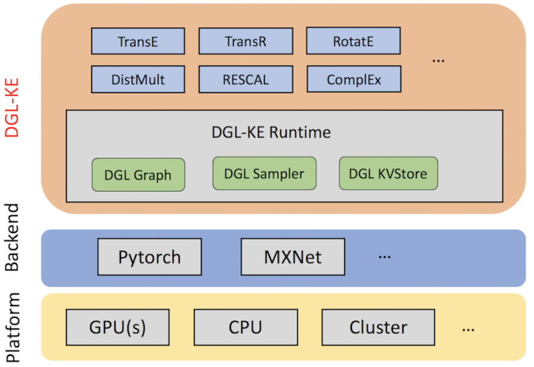

[source](https://github.com/gnn4dr/DRKG)

- [part 1](/posts/machine-learning-graphs/01-motivation-for-graph-ml) - Motivation for using graphs.
- [Part 2](/posts/machine-learning-graphs/02-graph-theory) - Graph theory, a theoretical minimum.
- [Part 3](/posts/machine-learning-graphs/03-message-passing-neural-networks) - MPNN paradigm.
- [Part 4](/posts/machine-learning-graphs/04-graph-convolutional-networks) - GCN, a brief introduction to the theory.
- [Part 5](/posts/machine-learning-graphs/05-GNN-example-karate-club) - Karate Club example, GNN's HelloWorld using Deep Graph Library.
- [Part 6](/posts/machine-learning-graphs/06-knowledge-graph-embedding) - Introduction to Knowledge Embedding in graphs.
- [Part 7](/posts/machine-learning-graphs/07-dglke-oss-tool-for-KGE) - Under the hood of DGL-KE, a framework for knowledge embedding using DGL.
- [Part 8](/posts/machine-learning-graphs/08-covid-drug-repurposing-with-DGLKE) - DGL-KE in practice, Drug repurposing using DGL-KE

## Introduction

Drug-repurposing (DR) is a drug discovery strategy from existing drugs that significantly shortens the time and reduces the cost compared to denovo drug discovery. AWS Science team has developed a knowledge graph based on existing datasets in combination with recent literature about Covid-19 in order to propose potential drug repurposing candidates. In this post I attempt to explain: 

1. Drug repurposing strategies
2. Datasets
3. Data analysis and preprocessing strategy of the DRKG project
4. Implementation of the drug knowledge graph using DGL-KE.

## Synthesising Proteins

Viruses infect us by getting inside our bodies and reproducing. To combat an infection, we would like to stop the viruses from reproducing by targeting them. It is however not as straight forward as it seems. Complex organisms such as animals, plants, fungi, and even many of the simpler organisms’s genetic information is stored in the organisms’ DNA. All our cells contain our DNA. What distinguishes different cells is the part of the DNA molecule that is used to assemble a specific type of cell. Protein synthesis is performed outside of the nucleus of cells. DNA does not leave the nucleus, an interim diary must carry the genetic message to the site of protein synthesis in cytoplasm using another type of  long molecule called  mRNA or messenger RiboNucleic Acid.


**Gene Transcription:** (a) RNA molecules are synthesised by RNA polymerase and then processed into mRNA to carry the genetic instructions to protein assembly from the nucleus to the cytoplasm. (b) Transcription is initiated at the promoter region of the gene and stopped at the terminator region. The initial RNA must be spliced to remove the introns that do not code the protein.

*source: NEUROSCIENCE, Exploring the Brain.* ***ISBN-13:*** *978-1451109542*
If the same process was undertaken by the viruses we could simply target the cells. The problem is that many viruses, including those that do not have DNA, including the novel Covid-19 virus. Viruses are far too small for such complex machinery. To put the genetic magnitude into scale, Human genome size is 3,234.83 Mbp or mega-basepairs @ (https://en.wikipedia.org/wiki/Human_genome), mean of gnome size for average ant species is 361.8 Mbp (https://bmcevolbiol.biomedcentral.com/articles/10.1186/1471-2148-8-64), and average for strains of E-Coli bacteria is 4.64(Mbp) https://science.sciencemag.org/content/277/5331/1453. Covid-19 is amongst RNA viruses (organisms without DNA where RNA is holding and replicating genetic signature) and has a mere 30000 (0.03 Mbp) base-long RNA molecule ([https://arstechnica.com/science/2020/03/covid-19-the-biology-of-an-effective-therapy](https://arstechnica.com/science/2020/03/covid-19-the-biology-of-an-effective-therapy/)). Viruses are in fact so small that can enter cells of bacteria in a processes called Horizontal Gene Transfer or HGT that changes DNA of another organism with parasitic or symbiotic outcome.

So, If virus are so small with some without even DNAs, how do they replicate?  

## Covid19 Replication Processes

(a) **Reproduction****:** Covid 19 is a single-stranded RNA virus and typically enters a host cell and uses the cell’s machinery to create its own RNA. using its RNA-copying proteins called polymerases. (b) **Processing:** For coronavirus to become functional, it must reach its mature configuration. The maturity is reached by cutting some small pieces of polymerases. Covid19 produces a few proteins that perform this cutting in order for the virus to adopt its mature configuration. such proteins are called proteases.(3) **Packaging:** Up until now, the virus is still inside the host cell. In order to the virus to spread the infection, it should leave the cell. The virus achieves this by packaging its mature form using special packaging proteins and leaves the cell to spread the infection. (4) **The Viral Shell:** Once we have a mature virus particle, its behaviour is controlled by the proteins that form the exterior structure of the virus. In the coronavirus, two of these proteins (called "membrane" and "envelope") combine with some of the cell's membrane to form the virus' shell. There's also the spike protein, which creates a halo (or "corona," meaning "crown") around the virus that gives it its name—and which serves to latch on to cells to enable infection. (5) **New Infections:** Now that the virus has successfully left a cell in its mature packaged form, there is only one thing left for it to do, infecting new cells. The Covid19 virus  latches on to a protein on the surface of cells in the respiratory tract outside the cell membrane. the membrane gets pulled inside the cell and  the virus gets "pinched off". The virus ends up now being inside the cell. Encountered with an external body, the cell increases acidity to break the bubble in which the virus resides. Now that the spike protein is cut, it triggers merging the virus and membrane, so the genome of the virus can be finally placed inside the new cell in order to infect it.


ref: ([https://arstechnica.com/science/2020/03/covid-19-the-biology-of-an-effective-therapy](https://arstechnica.com/science/2020/03/covid-19-the-biology-of-an-effective-therapy/)).

## Strategies of Drugs to Combat Viral Infection

Different drugs are developed to target each of the stages of replication process. Each stage provides its own challenges. In reproduction stage, as RNAs and DNAs are very similar it is difficult for the drugs to target target  polymerases (RNA-copying proteins) alone and could potentially target the host cell. Targeting the processing stage has shown promising success in combating other viruses such as HIV and provide a promising prospect for targeting Covid19 virus using proteases inhibitors. It seems an obvious place to target viruses at the time of packaging to prevent the spread, but unfortunately there are several technical complexities involved in targeting viruses during packaging or at the time of leaving the host cells that drugs that are based on targeting packaging stage are absolutely rare. In the viral shell envelope and membrane proteins are not ideal targets for drugs as membrane, although numerous, is buried in membrane and mostly is not accessible from the outside, while the envelope protein can be eliminated at times without affecting the virus’ ability to infect other cells. Spike protein is the best target at this stage. As a complicated with a larger attack surface, which happens to be  most prominent feature of the virus’ exterior, spike is the most common target for natural antibodies that human immune system generates.  
The multistep process of entering the cell and being broken is the target of some of the existing drugs that could potentially stop the infection form spreading in the body.

ref: ([https://arstechnica.com/science/2020/03/covid-19-the-biology-of-an-effective-therapy](https://arstechnica.com/science/2020/03/covid-19-the-biology-of-an-effective-therapy/)).

## Knowledge Graph Embedding

“A knowledge graph (i) mainly describes real world entities and their interrelations, organised in a graph, (ii) defines possible classes and relations of entities in a schema, (iii) allows for potentially interrelating arbitrary entities with each other and (iv) covers various topical domains.” [Paulheim](http://semantic-web-journal.net/system/files/swj1167.pdf)
Knowledge Graphs are often modeled as directed multigraphs. As a quick reminder let us define Multigrpah and directed graphs:

* In a directed graph edges are called arcs and they can direct information from their head to their tail but not in the opposite direction.
* A multigraph is a graph that can includes loops as well as multiple relationships between the same nodes. for more information on knowledge graph embedding you can check this [link](https://github.com/cyrusmvahid/GNNTrainingMaterial/blob/master/DGL-KE/Intro2KBE.ipynb).

***Knowledge graph embedding*** is the task of completing the knowledge graphs by probabilistically inferring the missing arcs from the existing graph structure. KGE differs from ordinary relation inference as the information in a knowledge graph are multi-relational and more complex to model and computationally expensive. For this rest of this blog, we examine fundamentals of KGE.

### DGL-KE

DGL-KE is a high performance, easy-to-use, and scalable package for learning large-scale knowledge graph embeddings. DGL-KE contains a python package atop DGL in order to be able to take advantage of distributed graph operations implemented by DGL. DGL in turn takes advantage of popular deep learning libraries such as MXNet and Pytorch for performing tensor operations.


As illustrated in the picture above, DGL-KE implements some of the most popular knowledge embedding models such as TransE, TransR, RotateE, DistMulti, RESCAL, and ComplEx. More details about the models cab be found [here](http://./blogs/Intro2KBE.html). The models are implemented in python and rely on pytorch in order to run. The runtime includes DGL Graph for graph operations, DGL Sampler to perform sampling and triplets sampling, and a key-value pair in memory data store,DGL KVStore, specifically designed for DGL-KE to hold embedding in distributed training. The KV store has graph partitioning capabilities it uses to distribute graphs across multiple machines. For more information on DGL-KE please check this [link](https://github.com/cyrusmvahid/GNNTrainingMaterial/blob/master/DGL-KE/DGL-KE-UnderTheHood.ipynb) or consult [DGL-KE Documentation.](https://aws-dglke.readthedocs.io/en/latest/)
Drug repurposing heavily relies on identifying novel interactions among biological entities like genes and compounds. Such interactions are partially available in various data sources.
Using such datasets, we can create a knowledge graph that captures interactions between entities that are related to components of existing drugs and viruses as well as genetic signature of Covid19, we can perform a knowledge graph embedding to automate the drug repurposing task and nominate a set of plausible drug candidates to help patient with Covid19 infections.


image source: https://github.com/gnn4dr/DRKG

## Datasets

Several public datasets provide us with a large body of knowledge that can be combined to create a knowledge graph for Covid19 DRKG. Such datasets include:

### Drugbank

It is a bioinformatic and cheminformatics knowledge base with drug data information and drug target information with 13,563 drug entries. Drugbank contains interactions of different relation type as listed in the table below.


image source: https://arxiv.org/abs/2007.10261

**Examples:**

* Cyclosporine
* DB00091 (BTD00003, BIOD00003)
* Small Molecule
* Cyclosporine is a calcineurin inhibitor known for its immunomodulatory properties that prevent organ transplant rejection...


### GNBR (Global Network of Biochemical Relations)

The biomedical community’s collective understanding of how chemicals, genes and phenotypes interact is distributed across the text of over 24 million research articles. These interactions offer insights into the mechanisms behind higher order biochemical phenomena, such as drug-drug interactions and variations in drug response across individuals. GNBR identifies chemical-gene, chemical-disease, gene-disease, and gene-gene interactions. https://www.ncbi.nlm.nih.gov/pubmed/29490008


image source: https://arxiv.org/abs/2007.10261

### Hetionet

Hetionet is a heterogeneous information network of biomedical knowledge assembled from 29 different databases relating genes, compounds, diseases and other. We extract 2,250,197 triplets from 24 relation types and 45,279 entities belong to 11 entities types. https://het.io/


image source: https://arxiv.org/abs/2007.10261

### STRING

STRING [6] is a database of established and predicted protein-protein interactions[6]. The interactions include direct (physical) and indirect (functional) associations and are extracted from computational prediction, knowledge transfer between organisms, and interactions aggregated from other databases. We extract the interactions whose score is greater than or equal to 0:6, resulting in 1,496,708 triplets from 7 relation types as shown in Table IV and 18,316 gene entities.https://www.ncbi.nlm.nih.gov/pubmed/30476243


image source: https://arxiv.org/abs/2007.10261


image source: https://pubmed.ncbi.nlm.nih.gov/30476243/

### IntAct

IntAct is an open source database that contains molecular interaction data. IntAct provides gene to gene as well as gene to chemical compounds interactions. https://www.ebi.ac.uk/intact/


image source: https://arxiv.org/abs/2007.10261


screen shot from the tool https://www.ebi.ac.uk/intact/

### DGIdb:

DGIdb  is a drug–gene interaction database that consolidates, organizes and presents drug–gene interactions and gene druggability information from papers, and online databases. We extract 26290 triplets from 13 relation types as shown in and 2551 gene entities and 6348 compound entities. http://dgidb.org/


image source: https://arxiv.org/abs/2007.10261


image source: screen shot from the tool  http://dgidb.org/

### Bibliographical Extracted Data

A data-driven drug-repurposing framework that utilizes a biological network to discover the potential drug candidates against SARS-CoV-2 (current name for Covid19). We extracted the biological network that describes interactions among host human proteins, virus proteins and chemical compounds.  https://www.biorxiv.org/content/biorxiv/early/2020/03/12/2020.03.11.986836.full.pdf


image source: https://arxiv.org/abs/2007.10261

## Drug Repurposing Knowledge Graph

Combining all the information for all the data sources above, creates a rich dataset. To do so, we created a common ID space and combined the triplets into a single dataset. The outcome of loading the combined data into pandas dataframes looks like the table below where source columns:


image source: https://arxiv.org/abs/2007.10261

Below unique values for head and tail as well as 5 random relations from unique values for relations are listed.

 ```python
#unique values for head, top 5 unique relatiions and unique values for tail`
import random
print('heads: {}\ntails: {}\nrelations: {}'.format(random. choices ( df [ 0 ]. unique (),  k = 5 ),  `
                                                   random . choices ( df [ 2 ]. unique (),  k = 5 ),`
                                                   random . choices ( df [ 1 ]. unique (),  k = 5 )`))

heads: ['Gene::23053', 'Gene::286530', 'Compound::DB04015', 'Gene::494119', 
        'Gene::281154']
tails: ['Biological Process::GO:0006867', 'Gene::55985', 'Gene::22924', 
        'Biological Process::GO:0051933', 'Biological Process::GO:0072171']
relations: ['GNBR::J::Gene:Disease', 'INTACT::DIRECT INTERACTION::Compound:Gene', 
            'GNBR::C::Compound:Disease', 'GNBR::D::Gene:Disease', 
            'INTACT::UBIQUITINATION REACTION::Gene:Gene']
```

As you can observe, heads and tails are of various entity types and whenever ambiguous, prefixed with datasource name `<DS>::entity`. Relationships are represented by the name of the data source is used followed by a relation type identifier representing the functionality of this relation, then its head and tail entity type.
DRKG contains a total of 97; 055 entities belonging to K = 13 entity-types.


image source: https://arxiv.org/abs/2007.10261

## Extracting Embeddings

Knowledge graphs embeddings are low dimensional representations relations and entities that can be used in learning tasks such as link prediction and are applied to use cases such as recommendation. We have extracted embeddings to several ends: (a) removal of noisy triplets, (b) discovering similarities between nodes and edges such as disease or drugs as well as clustering similar nodes, and (c) performing link prediction tasks amongst nodes in the DRKG to discover information such as probability of certain side effects. For more on knowledge embedding and similarity measures please check [this link](https://github.com/cyrusmvahid/Graph-BuildOn/blob/main/06-kbe.ipynb).

### Drug Repurposing (DR) task

DR is basically using existing drugs to treat new diseases, since diseases usually follow similar biological pathways. A **biological pathway** is a series of interactions among molecules in a cell that leads to a certain product or a change in a cell. We solve the DR problem as a link prediction task over DRKG (drug knowledge graph) such that predicted link represent strong connection between drugs and disease entities of relevant types such as “treats”. Alternatively we might discover indirect links such as biological entry pair participating in a specific pathway, such as a compound inhibiting a certain gene or protein.

## DRKG Data Analysis

We have used DGL-KE to learn graph embeddings and have applied several methods to ensure the embeddings we have learned are accurate.

### Graph structure analysis

As the data is extracted and aggregated from several datasets there should be significant overlap within DRKG. We assess percentage of common triplets among each pair of edge types. The duplicate connections can result in overrepresentation and overfitting. We use Jaccard score witch measures rate of the number of common elements over total elements.
  


image source: https://arxiv.org/abs/2007.10261

In the picture opposite, there are 45 objects in total (union of two sets) and there are 15 objects in the intersection, so the Jaccard score is 15/45 or 1/3. Obviously the larger the score the higher is the similarity.


image source: https://arxiv.org/abs/2007.10261

the relative small values of the Jaccard coefficient for the most similar edge-type pairs indicates that there is value in including the edge types from al the sources. The Jaccard similarity may not capture the case that an edge type is contained in another one but the two edge sets have significantly different sizes. Nevertheless, this could happen if two data sources describe the same relation, but one has significantly less edges than the other. Next, we examine whether all the edges of a certain type are described by another edge type as well that is one of the sets is contained in the second. To accomplish this, we compute the overlap coefficient.


image source: https://arxiv.org/abs/2007.10261

Here the green bubble contains 28 items and the blue bubble contains 32. the intersection includes 15. Overlap score is 15/28 as the green bubble has fewer elements. The overlap coefficient is close to 1 if all the edges in one edge set are also present in the other set.
    


We observe that for certain edge-type pairs there exists significant overlap. Nevertheless, for the pair GNBR::E and
GNBR::E+ the total overlap is expected since the first relation signifies that a drug affects the expression of a gene whereas the second indicates that a drug increases the expression of a gene and it is contained in the first one.

Code for structural analysis can be found here: https://github.com/gnn4dr/DRKG/blob/master/raw_graph_analysis/Jaccard_scores_among_all_edge_types_in_DRKG.ipynb.

### KGE analysis

We can analyse how relationships and entities are clustered through investigating embeddings similarity and check if embedding similarity reflects actual similarity. Additionally, we validate triplets by using scoring function of the KGE model. We can analyse how relationships and entities are clustered through investigating embeddings similarity and check if embedding similarity reflects actual similarity. Additionally, we validate triplets by using scoring function of the KGE model. Hence, we analyze the extracted DRKG by learning a TransE KGE model that utilizes the `2 distance. For more information on KGE please refer to this [link](https://github.com/cyrusmvahid/GNNTrainingMaterial/blob/master/DGL-KE/Intro2KBE.ipynb).


We split the data 90-5-5 for training, test, and validation respectively. after acquiring the embeddings we validate the results by applying following methods.

***Entity Embedding Similarity***
We use t-SNE (t-Distributed Stochastic Neighbor Embedding ) in order to projects higher dimensional embeddings to 2D space. The figure on the left shows how the entity embeddings are placed in the 2D space. Different colors denote different entity types. We observe that entities from the same type are grouped together as we expected. The image on the right  shows the detailed distribution of pairwise cosine similarity between different entities based on their embeddings. In the figure, the counts are normalized that the area under the histogram is sum to 1. It can be seen that most of the entities have low cosine similarity according to their embeddings. They are distinguishable in the current embedding space.


image source: https://arxiv.org/abs/2007.10261

***Relation type embedding similarity***
using t-SNE, the mapping of relations to the 2D space is presented in this graph. It can be seen that relations are widely spread across the 2D space and relations from the same dataset do not cluster which is expected as most of relations have different meanings even from the same data source. Only a small part of relations from GNBR dataset are clustered together.


image source: https://arxiv.org/abs/2007.10261

Embedding analysis code can be found here:
https://github.com/gnn4dr/DRKG/tree/master/embedding_analysis and training code is located here:  https://github.com/gnn4dr/DRKG/blob/master/embedding_analysis/Train_embeddings.ipynb

## Conclusion

constructed a DRKG from a collection of data sources that can be utilized for general drug repurposing tasks. To further facilitate efforts of researchers in repurposing drugs for Covid-19 we also include in DRKG proteins and genes related to Covid-19, as extracted from relevant papers.We train KGE models on the DRKG and obtain embeddings for entities and relation types. We also validate that the DRKG structure and the learned embeddings are of high quality. Finally, we evaluate the DRKG in the drug repurposing task for Covid-19. It is observed that several of the widely used drugs in clinical trials are identified by our method.
