In this tutorial, you will learn how to use Amazon SageMaker Autopilot to automatically build, train, and tune a machine learning (ML) model, and deploy the model to make predictions.

Specifically, you will learn the following:

- Create a training experiment using SageMaker Autopilot
- Explore the different stages of the training experiment
- Identify and deploy the best performing model from the training experiment
- Predict with your deployed model

Amazon SageMaker Autopilot eliminates the heavy lift of building ML models by helping you automatically build, train, and tune the best ML model based on your data. With SageMaker Autopilot, you simply provide a tabular dataset and select the target column to predict. SageMaker Autopilot explores your data, selects the algorithms relevant to your problem type, prepares the data for model training, tests a variety of models, and selects the best performing one. You can then deploy one of the candidate models or iterate on them further to improve prediction quality.


## Table of Contents

| Attributes                |                                   |
| ------------------- | -------------------------------------- |
| ✅ AWS Level        | 100 - Beginner                          |
| ⏱ Time to complete  | 45 minutes                             |
| 💰 Cost to complete | ReadSee [SageMaker pricing](https://aws.amazon.com/sagemaker/pricing/) to estimate cost for this tutorial      |
| 🧩 Requisites    | You must be logged into an AWS account.                         |
| 🧩 Service used           | Amazon SageMaker Autopilot   |
| ⏰ Last Updated     | YYYY-MM-DD                             |


| ToC |
|-----|


## Understanding the dataset

For this workflow, you will use a synthetically generated auto insurance claims dataset. The raw inputs are two tables of insurance data: a claims table and a customers table. The claims table has a fraud column indicating whether a claim was fraudulent or otherwise. For the purposes of this tutorial, we have selected a small portion of the dataset. However, you can follow the same steps in this tutorial to process large datasets.


## Setting up Amazon SageMaker Studio domain

An AWS account can have only one SageMaker Studio domain per AWS Region. If you already have a SageMaker Studio domain in the US East (N. Virginia) Region, follow the [SageMaker Studio setup guide](https://docs.aws.amazon.com/sagemaker/latest/dg/onboard-quick-start.html) to attach the required AWS Identity and Access Management (IAM) policies to your SageMaker Studio account. Then, skip *Setting up Amazon SageMaker Studio domain*, and proceed directly to *Starting a new SageMaker Autopilot experiment*. 

If you don't have an existing SageMaker Studio domain, continue with *Setting up Amazon SageMaker Studio domain* to run an AWS CloudFormation template that creates a SageMaker Studio domain and adds the permissions required for this tutorial.

This stack assumes that you have a public Virtual Public Cloud (VPC) set up in your account. If you do not have a public VPC, read [VPC with a single public](https://docs.aws.amazon.com/vpc/latest/userguide/VPC_Scenario1.html) subnet to learn how to create a public VPC.

Choose the [AWS CloudFormation stack link](https://us-east-1.console.aws.amazon.com/cloudformation/home?region=us-east-1#/stacks/quickcreate?templateURL=https://sagemaker-sample-files.s3.amazonaws.com/libraries/sagemaker-user-journey-tutorials/CFN-SM-IM-Lambda-catalog.yaml&stackName=CFN-SM-IM-Lambda-Catalog). This link opens the AWS CloudFormation console and creates your SageMaker Studio domain and a user named `studio-user`. It also adds the required permissions to your SageMaker Studio account. In the CloudFormation console, confirm that US East (N. Virginia) is the Region displayed in the upper-right corner. The stack name is`CFN-SM-IM-Lambda-catalog`, and should not be changed. This stack takes about 10 minutes to create all the resources:

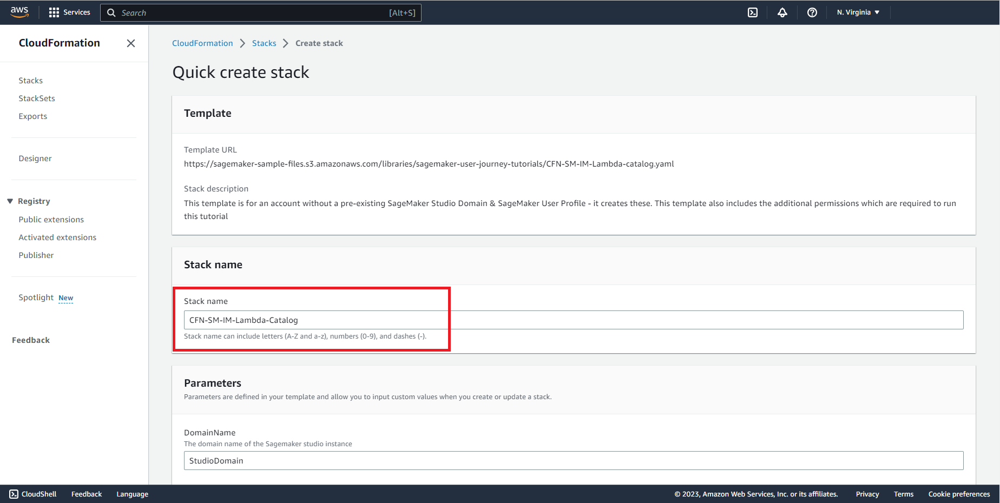

Then, select `I acknowledge that AWS CloudFormation might create IAM resources`, and choose `Create stack`:

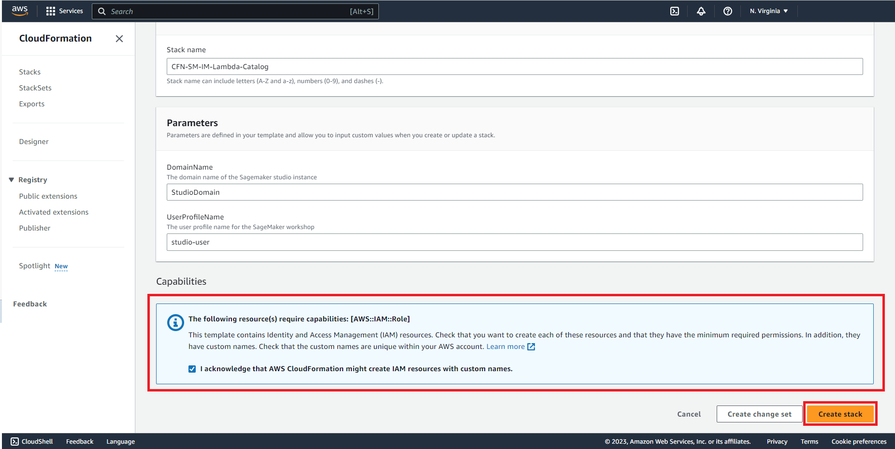

On the `CloudFormation` pane, choose `Stacks`. When the stack is created, the status of the stack should change from `CREATE_IN_PROGRESS` to `CREATE_COMPLETE`:

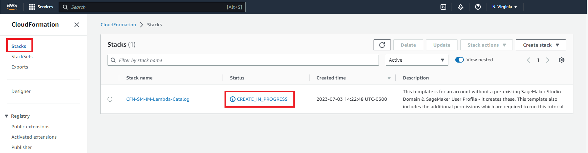

Enter `SageMaker Studio` into the CloudFormation console search bar, and then choose `SageMaker Studio`:

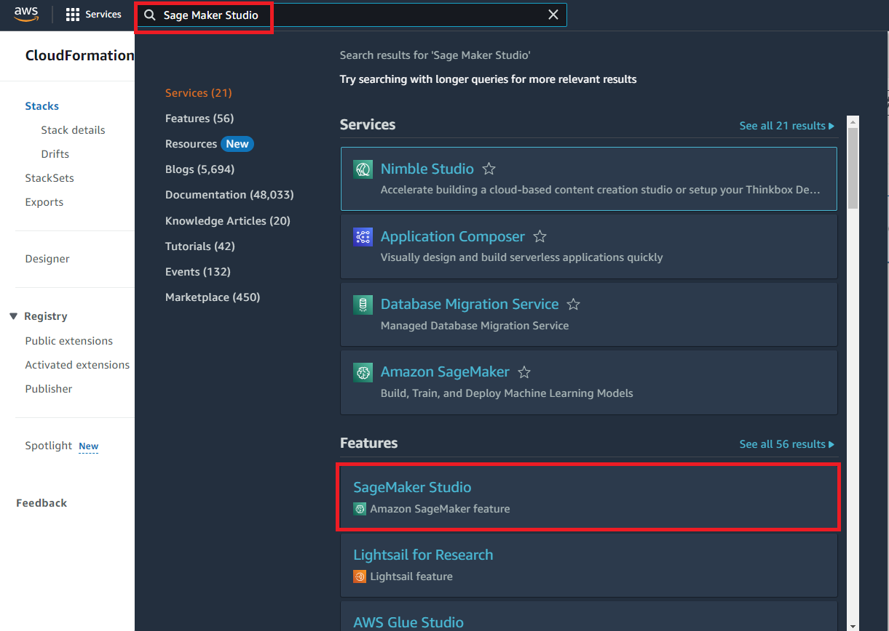

Choose `US East (N. Virginia)` from the `Region` drop-down list on the upper-right corner of the SageMaker console. For `Launch app`, select `Studio` to open SageMaker Studio using the `studio-user` profile:

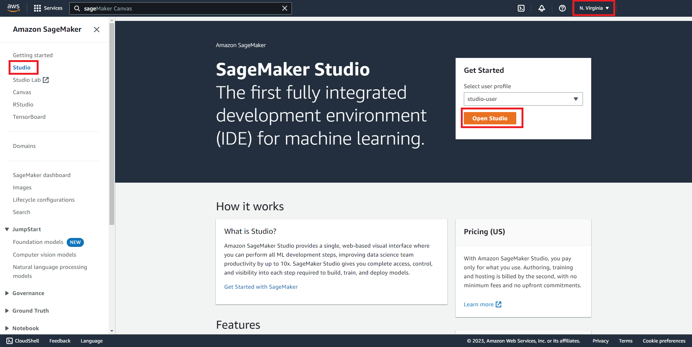

Now that you’ve set up your Amazon SageMaker Studio domain, you can continue to the next step. 


## Starting a new SageMaker Autopilot experiment

Developing and testing a large number of candidate models is crucial for machine learning (ML) projects. Amazon SageMaker Autopilot helps by providing different model candidates and automatically chooses the best model based on your data. In this step, you will configure a SageMaker Autopilot experiment to predict success from a financial services marketing campaign. This dataset represents a marketing campaign that was run by a major financial services institution to promote certificate of deposit enrollment.

To start a new SageMaker Autopilot experiment, in the Launcher window, scroll to `prebuild and automated solutions` and press `AutoML`:

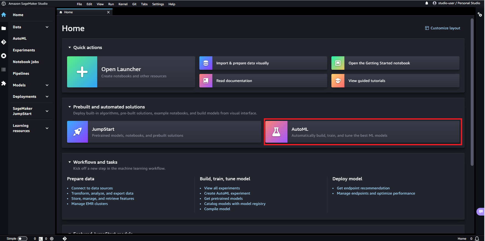

Alternatively, you can also select the File from the top menu and select `New` and then `New experiment`:

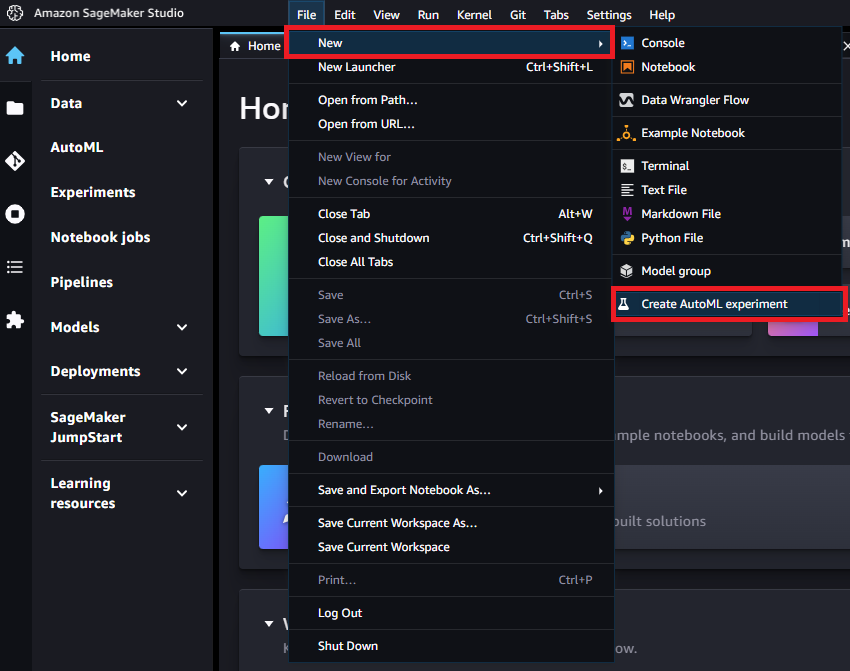

Next, you’ll name your experiment. Select the `Experiment` name box and write `autopilot-experiment` as the name. After, connect the experiment to data that is staged in S3. Press the box `Enter S3 bucket location`. In the S3 bucket address box, insert the following S3 path: `s3://sagemaker-sample-files/datasets/tabular/uci_bank_marketing/bank-additional-full.csv`.For `output data` define a S3 location. Additionally, for  the option `Auto create output data location?` select `NO`, because if not, it will try to create it in the same location as the input data:

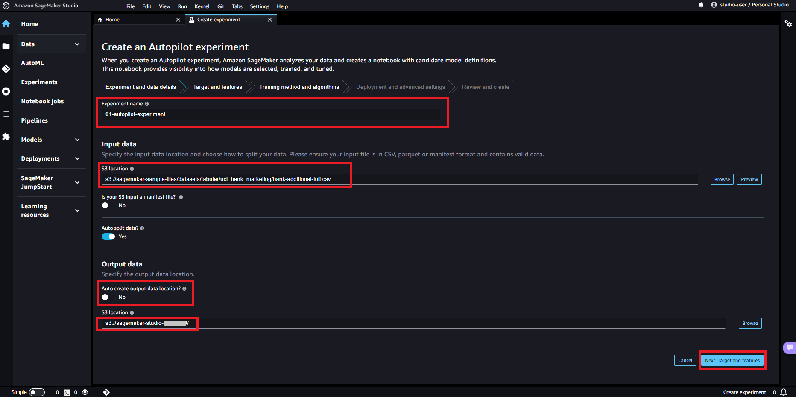

Select `y` as the target feature which your model will attempt to predict. Choose `Next: Training Method`:

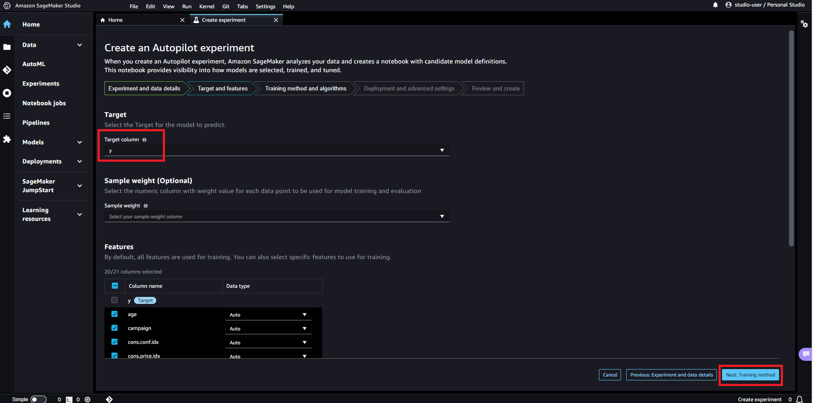

For Deployment and advanced settings, you can keep everything as default. However, you have the option to specify the `Auto deploy endpoint name`. Now select `Next: Review and create`:

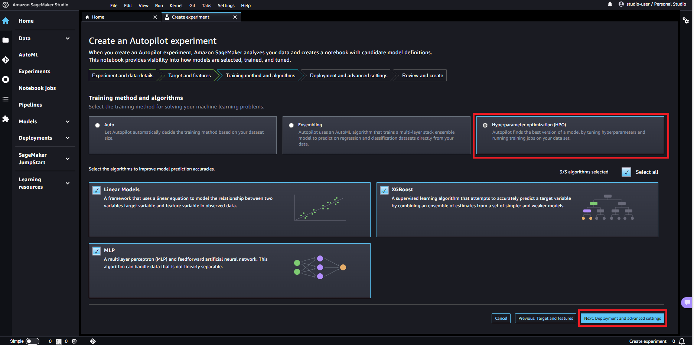

For Deployment and advanced settings, you can keep everything as default. (Optionally, you specify the Auto deploy endpoint name and Select the machine learning problem from the drop down.) Then select Next: Review and create

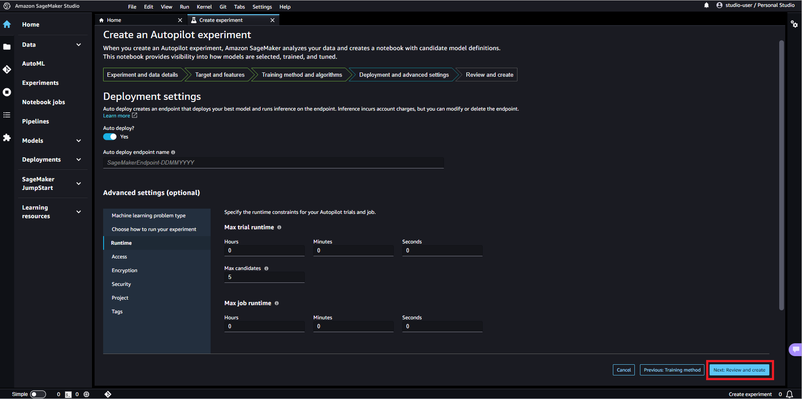

You can review the summary about the experiment. If you wish to modify any option you can press on the previous button and modify it. Choose `Create Experiment` to start the first stage of the SageMaker Autopilot experiment. SageMaker Autopilot will begin to run through the phases of an experiment. In the experiment window, you can track progress through the phases of pre-processing, candidate definitions, feature engineering, model tuning, explainability, and insights:

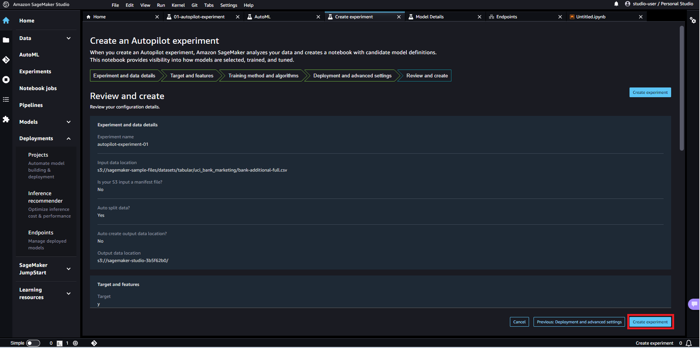

Press `Create Experiment`:

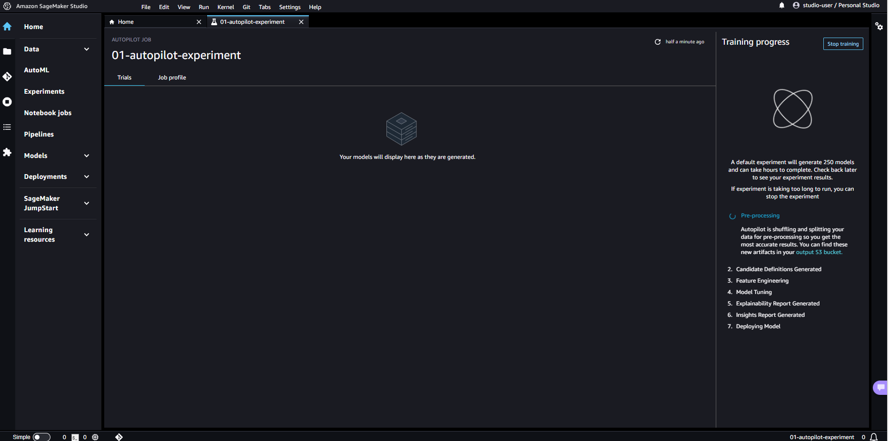

Once the SageMaker Autopilot job is complete, you can access a report that shows the candidate models, candidate model status, objective value, F1 score, and accuracy. SageMaker Autopilot will automatically deploy the endpoint:

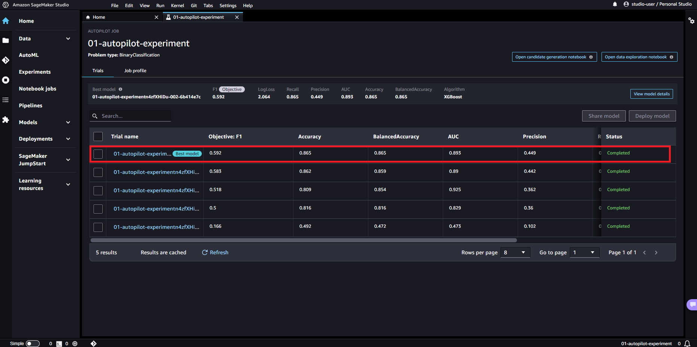

Now that the experiment is complete and you have a model, the next step is to interpret its performance. 


## Interpreting model performance

With the SageMaker Autopilot experiment complete, now you can open up the top ranking model to obtain more details on the model’s performance and metadata. 

In the new window, press on `Explainability`. The first view you receive is called `Feature Importance` and represents the aggregated SHapley Additive exPlanations (SHAP) value for each feature across each instance in the dataset. The feature importance score is an important part of model explainability because it shows what features tend to influence the predictions the most in the dataset. In this use-case, the customer duration or tenure and employment variation rate are the top two fields for driving the model's outcome:

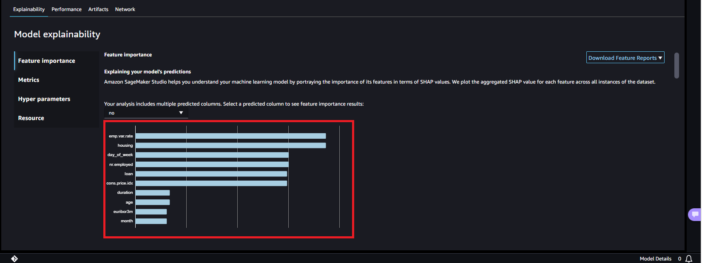

Now, toggle to  the tab `Performance`. You will find detailed information on the model’s performance, including recall, precision, and accuracy. You can also interpret model performance and decide if additional model tuning is needed:

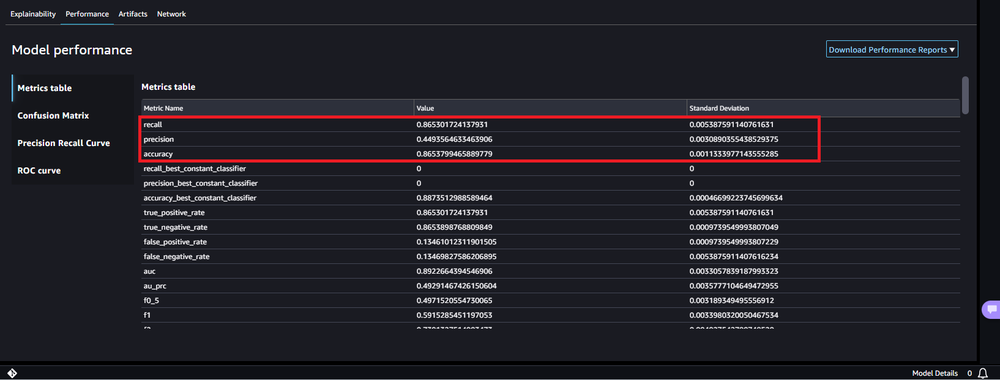

Next, visualizations are provided to further illustrate model performance. First, review the confusion matrix. The confusion matrix is commonly used to understand how the model labels are divided among the predicted and true classes. In this case, the diagonal elements show the number of correctly predicted labels and the off-diagonal elements show the misclassified records. A confusion matrix is useful for analyzing misclassifications due to false positives and false negatives:

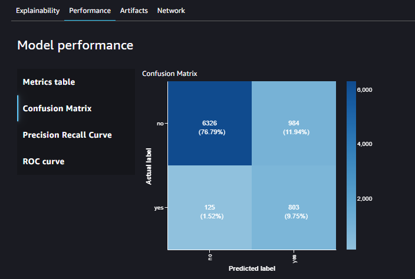

Now, review the precision versus recall curve. This curve interprets the label as a probability threshold and shows the trade-off that occurs at various probability thresholds for model precision and recall. SageMaker Autopilot automatically optimizes these two parameters to provide the best model:

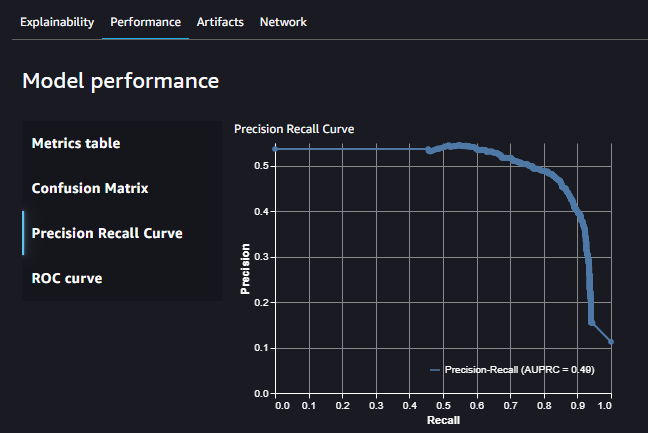

After, review the curve labeled `Receiver Operating Characteristic (ROC)`. This curve shows the relationship between the true positive rate and the false positive rate over a variety of potential probability thresholds. A diagonal line represents a hypothetical model based on random guessing. The more this curve pulls to the upper-left of the chart, the better the model will perform.

The dashed line represents a model with `0` predictive value, which is often called the null model. The null model would randomly assign a `0/1` label, and its area under the ROC curve would be `0.5`, meaning that it would be accurate 50% of the time:

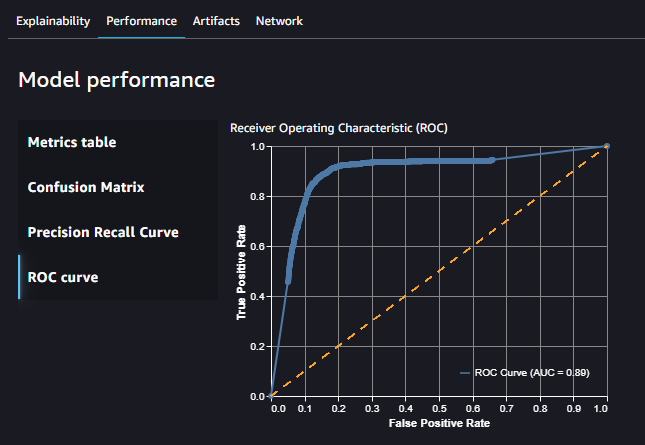

Next, navigate to the tab `Artifacts`. You can find the SageMaker Autopilot experiment’s supporting assets, including feature engineering code, input data locations, and explainability artifacts:

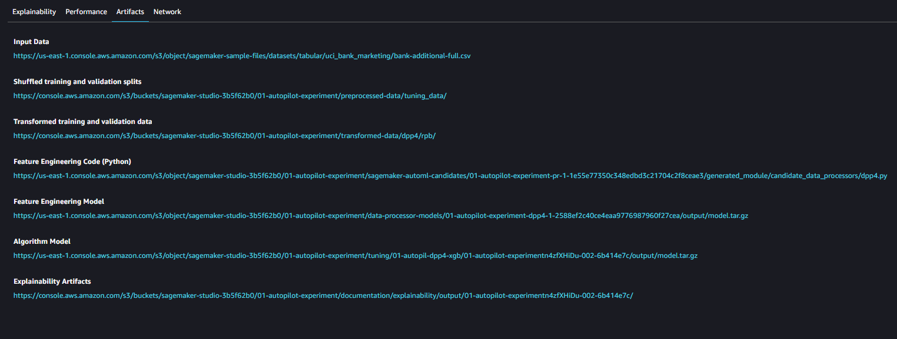

Finally, press on the Network tab. You will find information about network isolation and container traffic encryption:


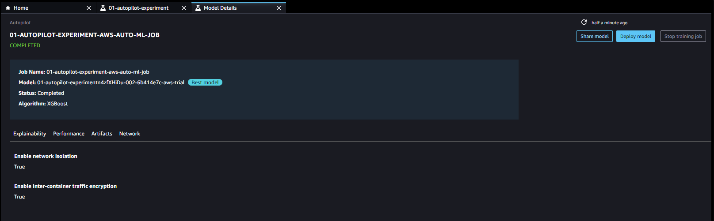

Now that you’ve interpreted the model’s performance, next you will test the endpoint. 


## Testing the SageMaker model endpoint

In JupyterLab, on the `File` menu, choose `New`, then `Notebook`: 

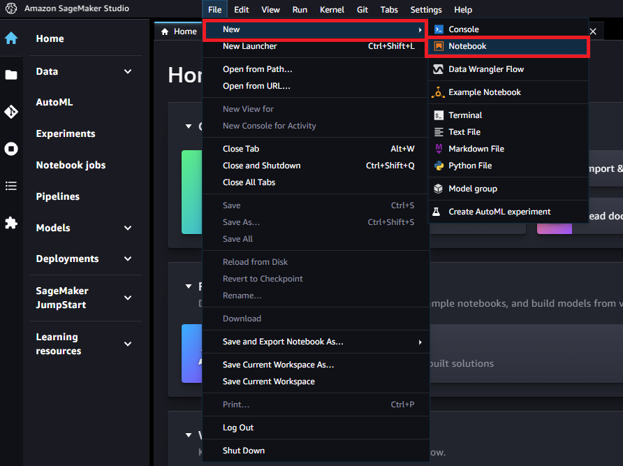

In the `Set up notebook environment`, choose `Image`, then `Data Science`. For `Kernel` select `Python 3`, and for `Instance type` choose `mlt3.medium`. Then, for `Start-up script` select`No script`:

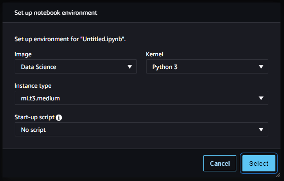

To identify where to send the request, search the model endpoint’s name. On the left pane, press the `SageMaker Resources` icon. In the SageMaker resources pane, select `Endpoints`. Selectthe endpoint associated with the experiment name you created at the start of this tutorial. This will bring up the `Endpoint Details` window. Record the endpoint name and navigate back to the Python 3 notebook:

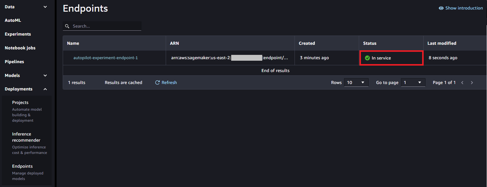

Insert the following code snippet into a cell in the notebook, and press `Shift + Enter` to run the current cell. This code sets the environment variable `ENDPOINT_NAME` and runs inference. As the code completes, you will receive a result consisting of the model label and associated probability score:

```python
import os
import io
import boto3
import json
import csv

#: Define the endpoint's name.
ENDPOINT_NAME = 'autopilot-experiment-6d00f17b55464fc49c45d74362f284ce'
runtime = boto3.client('runtime.sagemaker')

#: Define a test payload to send to your endpoint.
payload = {
    "data":{
        "features": {
            "values": [45,"blue-collar","married","basic.9y",'unknown',"yes","no","telephone","may","mon",461,1,999,0,"nonexistent",1.1,93.994,-36.4,4.857,5191.0]
        }
    }
}

#: Submit an API request and capture the response object.
response = runtime.invoke_endpoint(
    EndpointName=ENDPOINT_NAME,
    ContentType='text/csv',
    Body=str(payload)
)

#: Print the model endpoint's output.
print(response['Body'].read().decode())
```

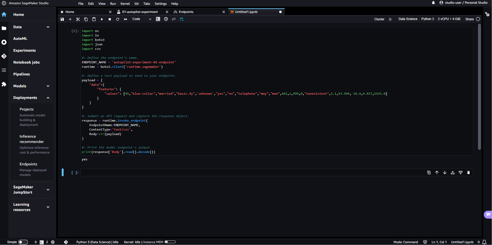

You have successfully learned how to use SageMaker Autopilot to automatically train and deploy a machine learning model.


## Cleaning up resources

It is a best practice to delete resources that you are no longer using so that you don't incur unintended charges.

First, open the CloudFormation console, enter `CloudFormation` into the AWS console search bar, and choose `CloudFormation` from the search results:

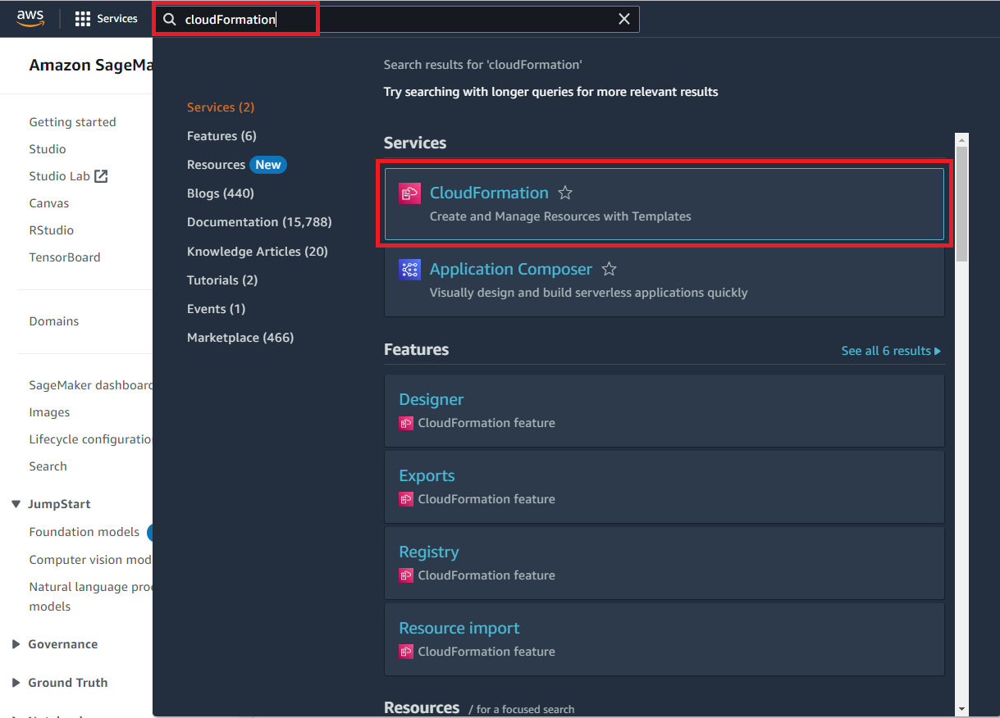

In the CloudFormation pane, choose `Stacks`. On the `CFN-SM-IM-Lambda-catalog` stack details page, choose `Delete` to delete the stack along with the resources it created in *Setting up Amazon SageMaker Studio domain*

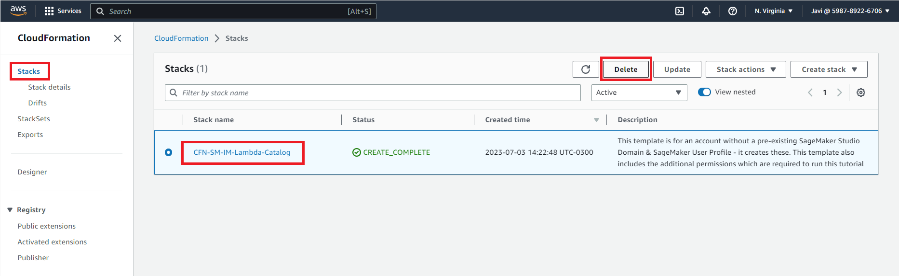

You’ve now successfully deleted your resources. 


## Conclusion

You have successfully used SageMaker Autopilot to automatically build, train, and tune models, and then deploy the best candidate model to make predictions.
