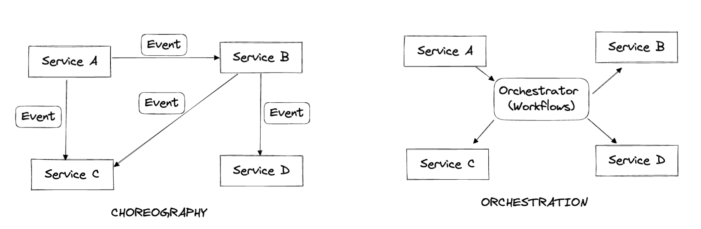

---

title: Microservices orchestration and choreography
description: An overview of services choreography and orchestration in a distributed services architecture.
tags:
  - microservices
  - orchestration
  - choreography
  - workflows
authorGithubAlias: codesforwork
authorName: Mohammed Fazalullah Qudrath
date: 2022-11-11
---

## Oveview

The approach to building distributed systems by decoupling services has been done to allow for better scale and performance in the distributed systems.

The idea of implementing patterns to build distributed systems isn't new to the microservcies world. This has been an approach taken since the time of monoliths and Service Oriented Architecture architected applications where you would see a need to say send a message or an event to a job that is polling a queue to work on the next item. Over the years due to the complexity of business processes growing and with systems built to reflect the real-world tend to adopt behaviours like parallel processing, long term wait on status updates, rollback and a few others.

## Patterns in distributed systems

### Choreography
The core idea of the choreography pattern is to keep the decision logic distributed and let each service decide when needs to be done upon an event. It thus laid the foundation for Event Driven Architecture.

In our example, when the order is placed the Orders service will simply emit an event to which all the involved services subscribe. Upon receiving an event, the services will react accordingly and do what they are supposed to.

All the 4 involved services are thus totally decoupled and independent; making this a truly distributed and decentralized architecture.

### Orchestration
Orchestration is the simplest way to model workflows. The core idea of the orchestration pattern is to keep the decision logic centralized and have a single brain in the system.

In our example, the Orders service can be that brain, and when the order is placed the order service talks to Notification, Seller, and Logistics services and get the necessary things done. The communication between them is synchronous and the Orders service acts as the coordinator.

The workflow as part of our example is a one-level simple workflow but in the real world, these workflows could become extremely complex and the Orders service would be needing to handle the coordination.

## Orchestration vs Choreography

Most model systems favor choreography because it provides some standard asynchronous architecture benefits.

- Loose coupling: Services involved are decoupled
- Extensibility: Extending the functionality is simple and natural
- Flexibility: Search service owns its own decision on the next steps
- Robustness: If one service is down, it does not affect others

A challenge when using observability is the need to track each service and the events published, the action(s) it took, and completion of it.

Although choreography is the first choice when building decoupled asyncronous systems, it does not mean orchestration isn't an option. Orchestration has its advantages and can be used in modeling services that are involved transactionally.

Sending OTP during login, for example, is best modeled synchronously rather than asynchronously. Another example is that when we want to render recommended items, a Recommendation service communicates with relevant services to enrich the information before it is sent to the user.

A common approach is to use both choreography and orchestration in a **hybrid** approach  where a centralized service makes the decisions and manages the business process through workflows (the orchestration approach) while the communication to other services is performed through events (the choreography approach).

