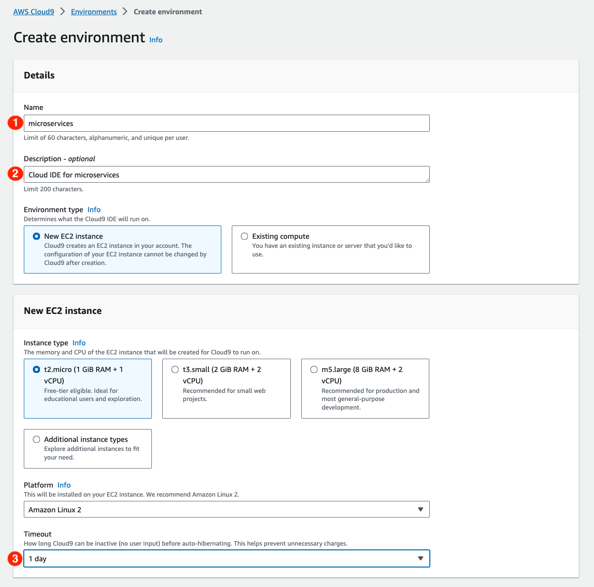

|ToC|
|---|

[Microservices](https://aws.amazon.com/microservices/?sc_channel=el&sc_campaign=post&sc_content=microservices-with-aws-cloud9-and-lightsail&sc_geo=mult&sc_country=mult&sc_outcome=acq) are the basis of a service oriented architecture pattern that has been in use for over a decade. It’s a proven way for building agile applications that are easy to deploy, upgrade, and scale flexibly. A microservice solves a specific problem with self-contained code which lends to deploying them in [containers](https://aws.amazon.com/containers/?sc_channel=el&sc_campaign=post&sc_content=microservices-with-aws-cloud9-and-lightsail&sc_geo=mult&sc_country=mult&sc_outcome=acq). AWS Lightsail is an simple and quick way to build microservices with containers. Lightsail supplies an HTTPS endpoint and automatically sets up a load balanced TLS endpoint with a TLS certificate. In addition., it can replace unresponsive containers automatically and assign a DNS name to the endpoint. When updating the container, Lightsail maintains the old version until the new version is live and healthy. The Lightsail console includes AWS CloudShell, a complete environment for building containers and deploying them in Lightsail. This article demonstrates how to build a microservice and deploy it using Lightsail’s container service.

## AWS Cloud9

A common way to build and containerize a microservice is to use a desktop tool such as Docker to build a container before pushing it to a registry or running it in a cloud service. AWS Cloud9 is a cloud-base integrated development environment (IDE) that is prepackaged with popular programming languages and tools such as Docker. The included AWS CLI provides access to AWS services including Lightsail.

To get started, open the Cloud9 console by using the search bar.


Choose **Create environment**.


Name the Cloud9 environment. Optionally provide a **Description** and set the **Timeout duration**.



Choose **Create** at the bottom of the page.


In the `Environments` page, choose **Open**.


The Cloud9 environment will open with a text editor window on the top, and a terminal on the bottom.


## Setting Up the Environment

To use Lightsail with Cloud9 we will to install two tools. The first is the [`lightsailctl`](https://lightsail.aws.amazon.com/ls/docs/en_us/articles/amazon-lightsail-install-software?sc_channel=el&sc_campaign=post&sc_content=microservices-with-aws-cloud9-and-lightsail&sc_geo=mult&sc_country=mult&sc_outcome=acq) plugin for deploying containers and the second is the [jq](https://jqlang.github.io/jq/manual/) utility for parsing JSON data from the container service.

Install `lightsailctl` plugin.

```bash
$ sudo curl "https://s3.us-west-2.amazonaws.com/lightsailctl/latest/linux-amd64/lightsailctl" -o "/usr/local/bin/lightsailctl"
$ sudo chmod +x /usr/local/bin/lightsailctl
```

Install `jq`.

```bash
$ sudo yum install jq -y
```

## Create an AWS Lightsail Container Service

A container is a standard unit of software that packages code and dependencies together so the application runs reliably from one computing environment to another. Containers are ideal for microservices because all the code and dependencies are encapsulated in the container. The Lightsail container service is used to store and deploy containers. Use the `create-container-service` command to create a container service for the microservice.

```bash
$ aws lightsail create-container-service \
--service-name microservice \
--power medium \
--scale 1
```

Check the status of the container service.

```bash
$ aws lightsail get-container-services --service-name microservice
```

## Build and Push the Container

The microservice is a REST service that returns [dad jokes](https://en.wikipedia.org/wiki/Dad_joke). It is a NodeJS application built with [Express](https://expressjs.com/). Start by creating a directory for the project.

Open a new file with the the Cloud9 text editor. Copy the express application below into the text editor window and save it as `app.js`.

```javascript
const express = require('express');
const app = express();


const dadjokes = [{"Id": 1,"Joke": "I'm tired of following my dreams. I'm just going to ask them where they are going and meet up with them later."},{"Id": 2,"Joke": "Did you hear about the guy whose whole left side was cut off? He's all right now."},{"Id": 3,"Joke": "Why didn’t the skeleton cross the road? Because he had no guts."},{"Id": 4,"Joke": "What did one nut say as he chased another nut?  I'm a cashew!"},{"Id": 5,"Joke": "Where do fish keep their money? In the riverbank"},{"Id": 6,"Joke": "I accidentally took my cats meds last night. Don’t ask meow."},{"Id": 7,"Joke":"Chances are if you' ve seen one shopping center, you've seen a mall."},{"Id": 8,"Joke": "Dermatologists are always in a hurry. They spend all day making rash decisions. "},{"Id": 9,"Joke": "I knew I shouldn't steal a mixer from work, but it was a whisk I was willing to take."},{"Id": 10,"Joke": "I won an argument with a weather forecaster once. His logic was cloudy..."}]

function randomId() {
  return Math.floor(Math.random() * (10 - 1 + 1)) + 1;
}

function getJoke(id) {
   for (i = 0; i < dadjokes.length; i++) {
      if (dadjokes[i].Id == id) {
       return dadjokes[i].Joke;
      }
    }
};

app.get('/', function(req,res) {
   res.set('Content-Type', 'text/html');
   res.send(JSON.stringify(getJoke(randomId())));
});

app.listen(3000, function(req, res) {
  console.log("Server is running at port 3000");
});
```

Next, configure the project with `npm init` and accept the default options. Next, install `express.js`.

```bash
$ npm init
$ npm install express --save
```

To build a container, open a new file in the text editor, copy the Dockerfile below, and save it as `Dockerfile`.

```dockerfile
FROM node:20
WORKDIR /app
COPY package.json .
RUN npm install
COPY app.js .
EXPOSE 3000
CMD ["node", "app.js"]
```

Build the container with Docker. After the container is built, list the containers.

```bash
$ docker build -t dadjoke:dev .
$ docker images
```

Push the container to the Lightsail container service created earlier. The Lightsail container includes a registry for storing images.

```bash
aws lightsail push-container-image --service-name microservice \
--label dadjoke \
--image dadjoke:dev
```

Note the image name. We will use the image name to configure the deployment

> Refer to this image as `:microservice.dadjoke.x` in deployments

## Deploy the Microservice

Deploying a container requires a JSON file that defines the configuration parameters. The AWS Location Service requires AWS credentials and is available in the us-east-1 region. We also include the image name that we pushed into the container service and the container's exposed port. The configuration file requires an [access_key and secret access key](https://docs.aws.amazon.com/IAM/latest/UserGuide/id_credentials_access-keys.html#Using_CreateAccessKey?sc_channel=el&sc_campaign=post&sc_content=microservices-with-aws-cloud9-and-lightsail&sc_geo=mult&sc_country=mult&sc_outcome=acq). Open a new file in the text editor and copy the JSON file below, add your credentials, and save the file as `container.json`.

```json
{
   "microservice" : { 
      "environment": { 
         "AWS_ACCESS_KEY_ID" : "<AAAAAAAAAAAAAAAAAAAA>", 
         "AWS_SECRET_ACCESS_KEY" : "<BBBBBBBBBBBBBBBBBBBBBB>",
         "AWS_REGION" : "us-east-1"
         
      },
      "image": ":microservice.dadjoke.1",
      "ports": { 
         "3000" : "HTTP" 
      }
   }
}
```

To make the service accessible, we define an endpoint with a JSON file. Open a file in the text editor, copy the JSON file, and save it as `endpoint.json`.

```json
{
    "containerName": "dadjoke",
    "containerPort": 3000,
    "healthCheck": { 
     "healthyThreshold": 2,
     "intervalSeconds": 5,
     "path": "/",
     "successCodes": "200-499",
     "timeoutSeconds": 2,
     "unhealthyThreshold": 2
    }
}
```

Use the `create-container-service-deployment` command to deploy the microservice.

```bash
$ aws lightsail create-container-service-deployment \
--service-name microservice \
--containers file://containers.json \
--public-endpoint file://endpoint.json
```

Get the public URL for the geocoder.

```bash
$ aws lightsail get-container-services --service-name microservice | jq -r '.containerServices' | jq '.[0].url'
```

Try out the microservice.

```bash
$ curl https://<your-microservice-url>/

"Did you hear about the guy whose whole left side was cut off? He's all right now."
```

## Summary

With Cloud9, you can immediately build and deploy applications without the overhead of configuring a local development environment. The tools for creating and managing AWS services are included in Cloud9 and specialized tools can be installed as needed. The integrated development environment simplifies coding and creating configuration files. This example uses the AWS Lightsail container service. The container service includes a container registry for storing container images and automated deployment of containers. The advantage of using the AWS CLI and Lightsail plugin is that it can be scripted and run as a devops workflow for consistent and secure updates.

Check out these articles to learn more about Lightsail container services.

[Container services in Amazon Lightsail](https://lightsail.aws.amazon.com/ls/docs/en_us/articles/amazon-lightsail-container-services?sc_channel=el&sc_campaign=post&sc_content=microservices-with-aws-cloud9-and-lightsail&sc_geo=mult&sc_country=mult&sc_outcome=acq)

[Lightsail Containers: An Easy Way to Run your Containers in the Cloud](https://aws.amazon.com/blogs/aws/lightsail-containers-an-easy-way-to-run-your-containers-in-the-cloud/?sc_channel=el&sc_campaign=post&sc_content=microservices-with-aws-cloud9-and-lightsail&sc_geo=mult&sc_country=mult&sc_outcome=acq)
