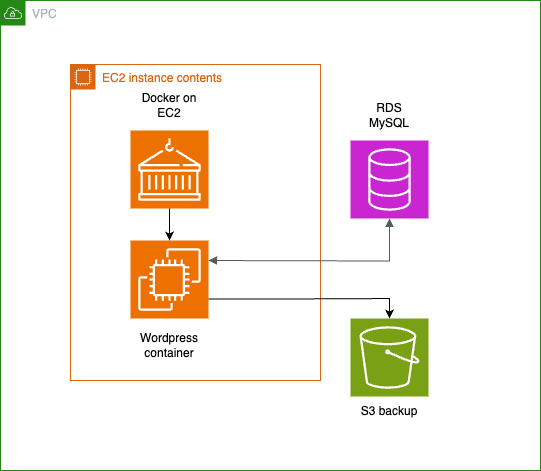
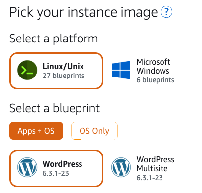
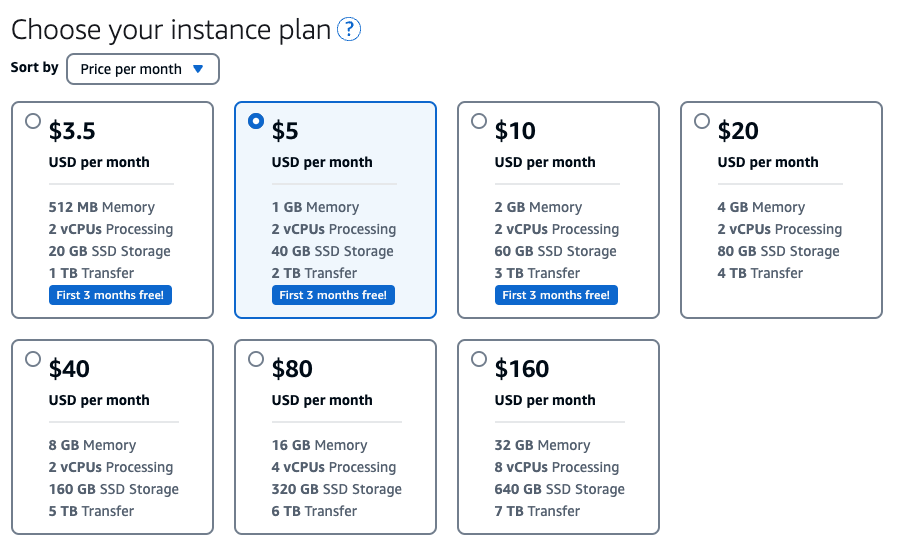
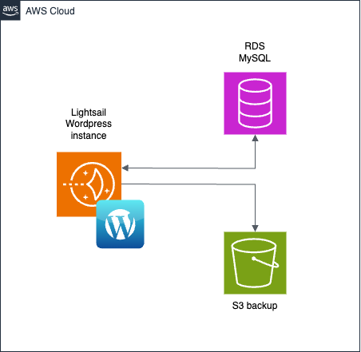

If you’ve worked in tech for a while, there comes a point when you stop telling people where you work. A typical conversation starts with, “What do you do?” At this point, you consider your options, should you tell them you work with computers and the cloud, or should you say, “Hey checkout that Cybertruck behind you,” point over their shoulder and run away. Inevitably, you tell them the truth and their eyes light up, followed by, “Hey, we got this website someone built for us, but they left and we don’t know how to update it.” Your eyes dart side-to-side like a trapped animal, but you sigh, your shoulders drop, and you say, “Tell me about it.”

## Tell Me About It

Your new friend starts off with, “I’ve been a system administrator, but this setup is on AWS on a server running WordPress in a Docker container. I think the database is standalone and another app is connected to it. We get notifications that WordPress and PHP needs updating but we don’t know how to do that.” For this organization, performing maintenance upgrades is important because the site contains Personal Identifiable Information (PII). Our conversation goes on with a few more details, until I finally ask to look at the deployment. I was given access to the account and found the following:

- An Amazon VPC for networking
- An Amazon EC2 instance running Docker as a container engine
- A container running WordPress
- An Amazon RDS DB instance for MySQL connected to WordPress
- An Amazon S3 bucket for storing backups



I’ve reached a decision point. Should I try to teach them how to maintain the existing system or should I simplify the deployment so they can maintain it without the extra overhead of container maintenance? The problem is that WordPress is running in a container which is immutable. Every time they need to update WordPress or PHP, they would have to rebuild the container and redeploy. However, the previous maintainer did not leave behind either a Dockerfile or a docker-compose file, leaving the process to replicate the deployment to guesswork.

> Tip for the impatient: Skip to the [Summary](#summary) for migration steps.

## The Right Amount of Technology

The website maintainers are familiar with running servers, databases, and storage. However, they weren’t familiar with cloud technologies and wanted a simple path to maintaining the site. I describe these type of builders as “people who want to build on the cloud, but not build the cloud.” They have a task to accomplish but they don’t need the latest infrastructure pattern to meet complete the task.

I suggested that they rebuild their web site with Amazon Lightsail which is a service that provides private virtual server instances pre-configured with software, relational databases, storage, and even a container runtime without having to build infrastructure. Lightsail provides a VPS with a blueprint that bundles the [Bitnami WordPress stack](https://bitnami.com/stack/WordPress).



Another feature of Lightsail is a fixed monthly cost. Lightsail instances are [EC2 t3 burstable instances](https://aws.amazon.com/ec2/instance-types/t3/?sc_channel=el&sc_campaign=post&sc_content=migrating-to-wordpress-on-aws-lightsail-for-easier-maintenance&sc_geo=mult&sc_country=mult&sc_outcome=acq), which means that they run at a lower CPU utilization until traffic increases. The $10/month instance plan is a popular choice for many sites.



## The Lightsail Deployment

A Lightsail WordPress instance can directly replace the EC2 instance with the WordPress container. The updated deployment looks like this.



Because Lightsail instances are virtual private servers, it’s not necessary to create a [VPC](https://aws.amazon.com/vpc/?sc_channel=el&sc_campaign=post&sc_content=migrating-to-wordpress-on-aws-lightsail-for-easier-maintenance&sc_geo=mult&sc_country=mult&sc_outcome=acq) for the deployment. Lightsail provides networking including static IPs, a content delivery network, and load balancers. In addition, you can map a registered domain to the Lightsail instance. Because the previous site had a MySQL instance and an S3 bucket for storing backups, they can be reused. However, both MySQL and the S3 bucket can also migrate to Lightsail. 

## Migration Path

The first step is to create a Lightsail WordPress server. The [documentation](https://lightsail.aws.amazon.com/ls/docs/en_us/articles/amazon-lightsail-tutorial-launching-and-configuring-WordPress??sc_channel=el&sc_campaign=post&sc_content=migrating-to-wordpress-on-aws-lightsail-for-easier-maintenance&sc_geo=mult&sc_country=mult&sc_outcome=acq) covers the process from creating the server, signing into the server as the administrator, and configuring a public static IP address.

The second step to migrate WordPress from the current server to the Lightsail server is to export the current WordPress instance then import the content into the new server. The Lightsail documentation provides [step-by-step instructions](https://lightsail.aws.amazon.com/ls/docs/en_us/articles/migrate-your-WordPress-blog-to-amazon-lightsail?sc_channel=el&sc_campaign=post&sc_content=migrating-to-wordpress-on-aws-lightsail-for-easier-maintenance&sc_geo=mult&sc_country=mult&sc_outcome=acq).

In this case, there is an existing MySQL database that needs to connect the Lightsail WordPress server. To establish the connection, you will need the values for `DB_NAME`, `DB_USER`, `DB_PASSWORD`, and `DB_HOST`. You can find these values by opening the `wp-config.php` file in a an editor.

```bash
nano /opt/bitnami/WordPress/wp-config.php
```

These are the variables to copy.

```php
/** The name of the database for WordPress */
define( 'DB_NAME', 'current_WordPress' );

/** Database username */
define( 'DB_USER', 'bn_WordPress' );

/** Database password */
define( 'DB_PASSWORD', 'password');

/** Database hostname */
define( 'DB_HOST', '127.0.0.1:3306' );
```

Replace the MySQL connection values in the Lightsail Word instance with the values from the current WordPress server. Restart the web services in the Lightsail WordPress instance to refresh the connection.

```bash
sudo /opt/bitnami/ctlscript.sh restart
```

The Lightsail documentation covers this process starting from [Step 3 in a tutorial](https://lightsail.aws.amazon.com/ls/docs/en_us/articles/amazon-lightsail-connect-WordPress-to-mysql-managed-database?sc_channel=el&sc_campaign=post&sc_content=migrating-to-wordpress-on-aws-lightsail-for-easier-maintenance&sc_geo=mult&sc_country=mult&sc_outcome=acq).

The final step in the migration is to enable HTTPS by requesting an SSL/TLS certificate from [Let’s Encrypt](https://letsencrypt.org/about/). The process has a number of steps but is well documented.

Once the migration and configuration is complete, you will need to update the DNS record for the domain to point to the Lightsail WordPress instance. In this case, the site maintainers have a registered domain name and can follow the [how-to manage the WordPress instance DNS records instructions](https://lightsail.aws.amazon.com/ls/docs/en_us/articles/lightsail-how-to-create-dns-entry?sc_channel=el&sc_campaign=post&sc_content=migrating-to-wordpress-on-aws-lightsail-for-easier-maintenance&sc_geo=mult&sc_country=mult&sc_outcome=acq) to make the site available by the domain name.


## Maintenance

There two ways to perform maintenance upgrades on Lightsail WordPress instances. 

1. Use the upgrade feature in WordPress. Bitnami provides [detailed instructions](https://docs.bitnami.com/aws/apps/wordpress/administration/upgrade/) for performing the upgrade. It is important to note that the Bitnami Wordpress stack does not support upgrading PHP.
2. Create a new Lightsail WordPress instance using the latest blueprint. This upgrades both WordPress and PHP. Before performing the upgrade, do the following:

    - export the content from the current WordPress instance
    - detach the static IP address from the current instance
    - save the wp-config.php file from the current instance

    To complete the maintenance upgrade:

    - import the content to the upgraded instance
    - attach the static IP to the upgraded instance
    - create and install a new SSL/TLS certificate for the upgraded instance
    - replace the wp-config.php file in the upgraded instance with the file saved from the previous instance

Restart the upgraded WordPress instance to initialize the changes made.

## Summary

If you’re impatient, here are the individual steps to migrate to WordPress on Lightsail.

1. Create a server and add a static IP address: Tutorial: [Launch and configure a WordPress instance in Amazon Lightsail](https://lightsail.aws.amazon.com/ls/docs/en_us/articles/amazon-lightsail-tutorial-launching-and-configuring-WordPress?sc_channel=el&sc_campaign=post&sc_content=migrating-to-wordpress-on-aws-lightsail-for-easier-maintenance&sc_geo=mult&sc_country=mult&sc_outcome=acq).
2. Export the current WordPress contents and import into the Lightsail WordPress instance: [Migrate an existing WordPress blog to Amazon Lightsail](https://lightsail.aws.amazon.com/ls/docs/en_us/articles/migrate-your-WordPress-blog-to-amazon-lightsail?sc_channel=el&sc_campaign=post&sc_content=migrating-to-wordpress-on-aws-lightsail-for-easier-maintenance&sc_geo=mult&sc_country=mult&sc_outcome=acq).
3. Configure the Lightsail WordPress instance to connect to the existing database: [Tutorial: Connecting your WordPress website to a MySQL managed database in Amazon Lightsail](https://lightsail.aws.amazon.com/ls/docs/en_us/articles/amazon-lightsail-connect-WordPress-to-mysql-managed-database?sc_channel=el&sc_campaign=post&sc_content=migrating-to-wordpress-on-aws-lightsail-for-easier-maintenance&sc_geo=mult&sc_country=mult&sc_outcome=acq).
4. Enable HTTPS by adding a SSL/TLS certificate: [Enabling HTTPS on your WordPress instance in Amazon Lightsail](https://lightsail.aws.amazon.com/ls/docs/en_us/articles/amazon-lightsail-enabling-https-on-WordPress?sc_channel=el&sc_campaign=post&sc_content=migrating-to-wordpress-on-aws-lightsail-for-easier-maintenance&sc_geo=mult&sc_country=mult&sc_outcome=acq).
5. Update the DNS to point to domain name of the Lightsail WordPress instance: [Creating a DNS zone to manage your domain’s DNS records in Lightsail](https://lightsail.aws.amazon.com/ls/docs/en_us/articles/lightsail-how-to-create-dns-entry?sc_channel=el&sc_campaign=post&sc_content=migrating-to-wordpress-on-aws-lightsail-for-easier-maintenance&sc_geo=mult&sc_country=mult&sc_outcome=acq).

Managing maintenance upgrades for a WordPress instance based on a container deployment would require a similar level of effort. However, when deciding on a solution, it’s important to factor in the maintainer’s level of comfort with the technology.