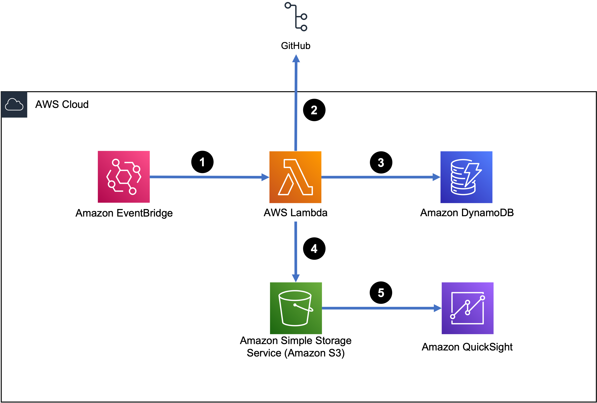
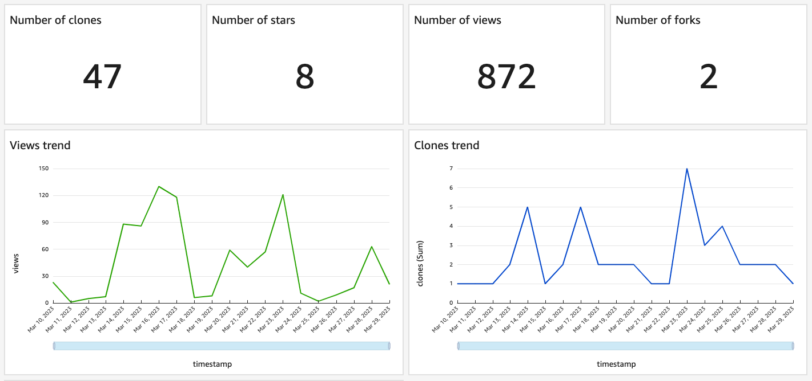
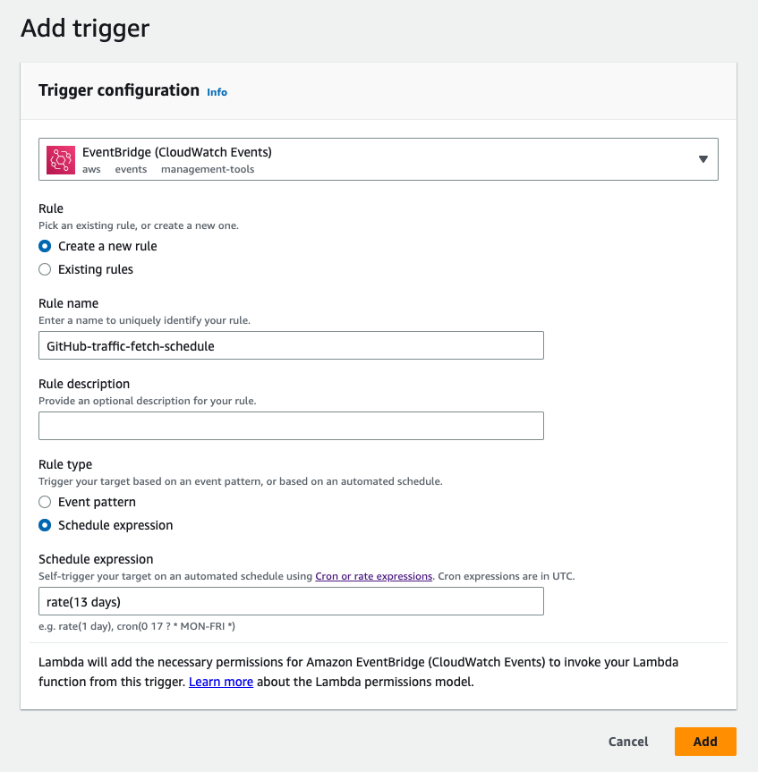

At first glance, it may seem like Star Wars, good food, and astronomy have little in common. However, they all share a surprising connection to the world of GitHub metrics - [clones](https://docs.github.com/en/repositories/creating-and-managing-repositories/cloning-a-repository), [forks](https://docs.github.com/en/get-started/quickstart/fork-a-repo), and [stars](https://docs.github.com/en/get-started/exploring-projects-on-github/saving-repositories-with-stars). These are some common GitHub metrics developers use to gain insight into the popularity and usage of their repositories. Let's delve into the world of GitHub metrics and explore how we can track and store them for analysis.

With the recent launch of the [aws-resilience-hub-tools](https://github.com/aws-samples/aws-resilience-hub-tools) repository, I needed a way to track the traffic to the repository to get a better understanding of my customers’ needs. Like many others, I decided that metrics like stars, clones, forks, and views would allow me to get a pulse for the repository. Although GitHub provides this data, it is limited to the last 14 days. So I embarked on a journey to create a solution that would allow me to capture, store, and analyze this information using GitHub APIs and AWS serverless. Let's dive in!

## Architecture

*“A picture is worth a thousand words”* they say, so let's look at how this solution works and then walk through how to put it all together.



1. We start with an [Amazon EventBridge](https://docs.aws.amazon.com/eventbridge/latest/userguide/eb-what-is.html?sc_channel=el&sc_campaign=devopswave&sc_content=mntr_gh_trfc&sc_geo=mult&sc_country=mult&sc_outcome=acq) rule that periodically invokes an [AWS Lambda](https://docs.aws.amazon.com/lambda/latest/dg/welcome.html?sc_channel=el&sc_campaign=devopswave&sc_content=mntr_gh_trfc&sc_geo=mult&sc_country=mult&sc_outcome=acq) function.
2. The Lambda function makes API calls to GitHub to fetch traffic data.
3. For persistence, the data is stored in an [Amazon DynamoDB](https://docs.aws.amazon.com/amazondynamodb/latest/developerguide/Introduction.html?sc_channel=el&sc_campaign=devopswave&sc_content=mntr_gh_trfc&sc_geo=mult&sc_country=mult&sc_outcome=acq) table.
4. Data is then exported as a CSV file from the DynamoDB table and stored in an [Amazon S3](https://docs.aws.amazon.com/AmazonS3/latest/userguide/Welcome.html?sc_channel=el&sc_campaign=devopswave&sc_content=mntr_gh_trfc&sc_geo=mult&sc_country=mult&sc_outcome=acq) bucket.
5. The CSV file is then ingested into [Amazon QuickSight](https://docs.aws.amazon.com/quicksight/latest/user/welcome.html?sc_channel=el&sc_campaign=devopswave&sc_content=mntr_gh_trfc&sc_geo=mult&sc_country=mult&sc_outcome=acq) for visualization.

Simple, powerful, and cost efficient!

## Walkthrough

We start with the Lambda function, which does most of the magic.

[PyGithub](https://github.com/PyGithub/PyGithub) is an awesome library that allows us to query the GitHub APIs using Python, which is [one of the supported runtimes for Lambda functions](https://docs.aws.amazon.com/lambda/latest/dg/lambda-runtimes.html?sc_channel=el&sc_campaign=devopswave&sc_content=mntr_gh_trfc&sc_geo=mult&sc_country=mult&sc_outcome=acq). We start by importing [boto3](https://boto3.amazonaws.com/v1/documentation/api/latest/index.html?sc_channel=el&sc_campaign=devopswave&sc_content=mntr_gh_trfc&sc_geo=mult&sc_country=mult&sc_outcome=acq), which is the AWS SDK for Python, CSV, and PyGithub libraries, and then authenticating to GitHub. Note that I'm using a [personal access token](https://docs.github.com/en/authentication/keeping-your-account-and-data-secure/creating-a-personal-access-token) here, but you can use other forms of authentication (though they might require additional code/configuration). The personal access token is [stored as a parameter in AWS Systems Manager Parameter Store](https://docs.aws.amazon.com/systems-manager/latest/userguide/parameter-create-console.html?sc_channel=el&sc_campaign=devopswave&sc_content=mntr_gh_trfc&sc_geo=mult&sc_country=mult&sc_outcome=acq) and retrieved dynamically when the Lambda function runs. Remember, hard-coding credentials into application code is bad practice and should be avoided.

```python
import boto3
from github import Github
import csv

def lambda_handler(event, context):
    # Retrieve the personal access token from SSM Parameter Store
    access_token = get_ssm_parameter('arh-traffic-stats')
    
    # Authenticate with GitHub using the PyGitHub library
    g = Github(access_token)
    
    # Replace <owner> and <repo> with your repository information
    repo = g.get_repo("<owner>/<repo>")
```

Next we query GitHub for the data that is needed. The following APIs provide this data:

* [`get_views_traffic()`](https://pygithub.readthedocs.io/en/latest/github_objects/Repository.html#github.Repository.Repository.get_views_traffic) - to get the number of views
* [`get_clones_traffic()`](https://pygithub.readthedocs.io/en/latest/github_objects/Repository.html#github.Repository.Repository.get_clones_traffic) - to get the number of clones
* [`get_top_paths()`](https://pygithub.readthedocs.io/en/latest/github_objects/Repository.html#github.Repository.Repository.get_top_paths) - to get the top paths

Additionally, we can get the count of stars and forks on the repo from the `repo` object.

```python
traffic = repo.get_views_traffic()
clones = repo.get_clones_traffic()
stars = repo.stargazers_count
top_paths = repo.get_top_paths()
forks = repo.forks_count
```

We initialize the Boto client for DynamoDB and then persist the traffic data in the DynamoDB table after making sure we are not duplicating the data.

```python
# Initialize DynamoDB client and specify table name
dynamodb = boto3.client('dynamodb')
table_name = <table_name>

# Process the traffic data and store it in DynamoDB
for view in traffic['views']:
    timestamp = view.timestamp.strftime('%Y-%m-%d %H:%M:%S')
    views_count = view.count
    
    clone = next((c for c in clones['clones'] if c.timestamp == view.timestamp), None)
    clones_count = clone.count if clone else 0
    
    # Check if the item already exists in DynamoDB
    response = dynamodb.get_item(TableName=table_name, Key={'timestamp': {'S': timestamp}})
    
    # If the item does not exist, put the item in DynamoDB
    if 'Item' not in response:
        item = {
            'timestamp': {'S': timestamp},
            'views': {'N': str(views_count)},
            'clones': {'N': str(clones_count)},
            'stars': {'N': str(stars)},
            'forks': {'N': str(forks)}
        }
        dynamodb.put_item(TableName=table_name, Item=item)
    else:
        print(f"Item with timestamp {timestamp} already exists in DynamoDB. Skipping.")

print('Data stored in DynamoDB')
```

Finally, we export the data from the table and create a CSV file. We create an additional CSV file for the top views data as this is not time stamped and doesn't make sense to persist. The CSV files are then stored in an S3 bucket for analysis.

```python
scan_response = dynamodb.scan(
        TableName=table_name
    )
    
items = scan_response['Items']
    
while 'LastEvaluatedKey' in scan_response:
    scan_response = dynamodb.scan(
        TableName=table_name,
        ExclusiveStartKey=scan_response['LastEvaluatedKey']
    )
    items += scan_response['Items']
 
# Replace bucket name with your bucket
bucket = <bucket_name>
   
with open('/tmp/views_clones_stars.csv', 'w', newline='') as file:
    writer = csv.writer(file)
    fieldnames = ['timestamp', 'clones', 'views', 'stars', 'forks']
    writer = csv.DictWriter(file, fieldnames=fieldnames)
    writer.writeheader()

    for item in items:
        row = {'timestamp': item['timestamp']['S'], 'clones': item['clones']['N'], 'views': item['views']['N'], 'stars': item['stars']['N'], 'forks': item['forks']['N']}
        writer.writerow(row)
        
s3 = boto3.resource('s3')
write_response = s3.Bucket(bucket).upload_file('/tmp/views_clones_stars.csv', 'views_clones_stars/views_clones_stars.csv')
print(write_response)

with open('/tmp/top_paths.csv', 'w', newline='') as file:
    writer = csv.writer(file)
    fieldnames = ['path', 'views']
    writer = csv.DictWriter(file, fieldnames=fieldnames)
    writer.writeheader()

    for path in top_paths:
        row = {'path': path.path, 'views': path.count}
        writer.writerow(row)
        
s3 = boto3.resource('s3')
write_response = s3.Bucket(bucket).upload_file('/tmp/top_paths.csv', 'top_paths/top_paths.csv')
print(write_response)
```

Putting it all together, this is what the Lambda function looks like. When deploying it to Lambda, the PyGitHub library needs to be [packaged up with the function code](https://docs.aws.amazon.com/lambda/latest/dg/gettingstarted-package.html#gettingstarted-package-zip?sc_channel=el&sc_campaign=devopswave&sc_content=mntr_gh_trfc&sc_geo=mult&sc_country=mult&sc_outcome=acq) as it is not natively available on the Lambda runtimes.

```python
import boto3
from github import Github
import csv

# Function retrieve GitHub token from SSM Parameter store
def get_ssm_parameter(param_name):
    client = boto3.client('ssm')
    response = client.get_parameter(
        Name=param_name
    )
    return response['Parameter']['Value']

def lambda_handler(event, context):
    # Retrieve the personal access token from SSM Parameter Store (Replace <parameter_name>)
    access_token = get_ssm_parameter(<parameter_name>)
    
    # Authenticate with GitHub using the PyGitHub library
    g = Github(access_token)
    
    # Replace <owner> and <repo> with your repository information
    repo = g.get_repo("<owner>/<repo>")
    traffic = repo.get_views_traffic()
    clones = repo.get_clones_traffic()
    stars = repo.stargazers_count
    top_paths = repo.get_top_paths()
    forks = repo.forks_count
    
    # Initialize DynamoDB client and specify table name
    dynamodb = boto3.client('dynamodb')
    table_name = <table_name>
    
    # Process the traffic data and store it in DynamoDB
    for view in traffic['views']:
        timestamp = view.timestamp.strftime('%Y-%m-%d %H:%M:%S')
        views_count = view.count
        
        clone = next((c for c in clones['clones'] if c.timestamp == view.timestamp), None)
        clones_count = clone.count if clone else 0
        
        # Check if the item already exists in DynamoDB
        response = dynamodb.get_item(TableName=table_name, Key={'timestamp': {'S': timestamp}})
        
        # If the item does not exist, put the item in DynamoDB
        if 'Item' not in response:
            item = {
                'timestamp': {'S': timestamp},
                'views': {'N': str(views_count)},
                'clones': {'N': str(clones_count)},
                'stars': {'N': str(stars)},
                'forks': {'N': str(forks)}
            }
            dynamodb.put_item(TableName=table_name, Item=item)
        else:
            print(f"Item with timestamp {timestamp} already exists in DynamoDB. Skipping.")
    
    print('Data stored in DynamoDB')
        
    scan_response = dynamodb.scan(
        TableName=table_name
    )
    
    items = scan_response['Items']
    
    while 'LastEvaluatedKey' in scan_response:
        scan_response = dynamodb.scan(
            TableName=table_name,
            ExclusiveStartKey=scan_response['LastEvaluatedKey']
        )
        items += scan_response['Items']
    
    # Replace bucket name with your bucket
    bucket = <bucket_name>
    
    with open('/tmp/views_clones_stars.csv', 'w', newline='') as file:
        writer = csv.writer(file)
        fieldnames = ['timestamp', 'clones', 'views', 'stars', 'forks']
        writer = csv.DictWriter(file, fieldnames=fieldnames)
        writer.writeheader()
    
        for item in items:
            row = {'timestamp': item['timestamp']['S'], 'clones': item['clones']['N'], 'views': item['views']['N'], 'stars': item['stars']['N'], 'forks': item['forks']['N']}
            writer.writerow(row)
            
    s3 = boto3.resource('s3')
    write_response = s3.Bucket(bucket).upload_file('/tmp/views_clones_stars.csv', 'views_clones_stars/views_clones_stars.csv')
    print(write_response)

    with open('/tmp/top_paths.csv', 'w', newline='') as file:
        writer = csv.writer(file)
        fieldnames = ['path', 'views']
        writer = csv.DictWriter(file, fieldnames=fieldnames)
        writer.writeheader()
    
        for path in top_paths:
            row = {'path': path.path, 'views': path.count}
            writer.writerow(row)
            
    s3 = boto3.resource('s3')
    write_response = s3.Bucket(bucket).upload_file('/tmp/top_paths.csv', 'top_paths/top_paths.csv')
    print(write_response)
```

Using QuickSight, I can ingest this data and [create two datasets](https://docs.aws.amazon.com/quicksight/latest/user/create-a-data-set-s3.html?sc_channel=el&sc_campaign=devopswave&sc_content=mntr_gh_trfc&sc_geo=mult&sc_country=mult&sc_outcome=acq). This requires creating a [manifest file](https://docs.aws.amazon.com/quicksight/latest/user/supported-manifest-file-format.html?sc_channel=el&sc_campaign=devopswave&sc_content=mntr_gh_trfc&sc_geo=mult&sc_country=mult&sc_outcome=acq) that informs QuickSight as to where the data is stored for each dataset. We use the following manifest files for the datasets.

For the dataset that will contain information on views, stars, forks, and clones (note that the [S3 path](https://docs.aws.amazon.com/AmazonS3/latest/userguide/access-bucket-intro.html#accessing-a-bucket-using-S3-format?sc_channel=el&sc_campaign=devopswave&sc_content=mntr_gh_trfc&sc_geo=mult&sc_country=mult&sc_outcome=acq) to the CSV needs to be updated):

```json
{
  "fileLocations": [
      {
          "URIPrefixes": [
              "s3://PATH_TO_views_clones_stars.csv"
          ]
      }
  ],
  "globalUploadSettings": {
      "format": "CSV",
      "delimiter": ",",
      "containsHeader": "true"
  }
}
```

For the dataset that will contain information on top paths for the last two weeks (note that the [S3 path](https://docs.aws.amazon.com/AmazonS3/latest/userguide/access-bucket-intro.html#accessing-a-bucket-using-S3-format?sc_channel=el&sc_campaign=devopswave&sc_content=mntr_gh_trfc&sc_geo=mult&sc_country=mult&sc_outcome=acq) to the CSV needs to be updated):

```json
{
  "fileLocations": [
      {
          "URIPrefixes": [
              "s3://PATH_TO_top_paths.csv"
          ]
      }
  ],
  "globalUploadSettings": {
      "format": "CSV",
      "delimiter": ",",
      "containsHeader": "true"
  }
}
```

After the datasets have been created, we [create an analysis](https://docs.aws.amazon.com/quicksight/latest/user/creating-an-analysis.html?sc_channel=el&sc_campaign=devopswave&sc_content=mntr_gh_trfc&sc_geo=mult&sc_country=mult&sc_outcome=acq) to define how the data is visualized. Once the analysis has been created, we need to make sure [both our datasets are added](https://docs.aws.amazon.com/quicksight/latest/user/adding-a-data-set-to-an-analysis.html?sc_channel=el&sc_campaign=devopswave&sc_content=mntr_gh_trfc&sc_geo=mult&sc_country=mult&sc_outcome=acq). The analysis can then be used to [publish a beautiful dashboard](https://docs.aws.amazon.com/quicksight/latest/user/creating-a-dashboard.html?sc_channel=el&sc_campaign=devopswave&sc_content=mntr_gh_trfc&sc_geo=mult&sc_country=mult&sc_outcome=acq) like the one below (at least in my humble opinion).



Finally, we add a trigger to the Lambda function. For this solution, it will be an [EventBridge (CloudWatch Events) trigger](https://docs.aws.amazon.com/eventbridge/latest/userguide/eb-run-lambda-schedule.html?sc_channel=el&sc_campaign=devopswave&sc_content=mntr_gh_trfc&sc_geo=mult&sc_country=mult&sc_outcome=acq), and we will use a rate expression to trigger the function every 13 days.



Note that the entire solution has been built using AWS Serverless technology. Lambda for the compute, DynamoDB for the database, S3 for storage, QuickSight for analytics, and EventBridge for scheduling. This means there's no infrastructure that needs to be managed, and we only pay for what we use (almost all of this is included in the free tier). Since all the services used are managed by AWS, we get the added benefit of improved security and reliability i.e. no security groups/NACLs to manage, and definitely no multi-AZ configurations required (they're all managed by the service and are multi-AZ by default. Yay, high availability!).

## Conclusion

Remember, you cannot manage what you cannot measure. With all the awesome open-source projects available on GitHub, it's important to understand the impact of your hard work. We've explored a solution to track key GitHub metrics like clones, stars, and forks, store it beyond the 14 day limit on GitHub, and analyzed the data to gain insight. This approach can be expanded to track additional metrics such as issues, pull requests, and any other data that you may find useful.

So whether you're exploring a galaxy far, far away or tracking the performance of your code, the importance of metrics cannot be understated. You too can use the power of serverless architectures to track the success of your repositories.
