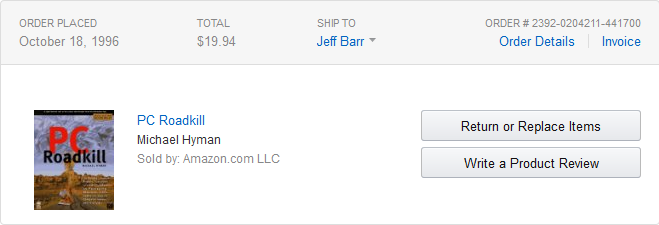
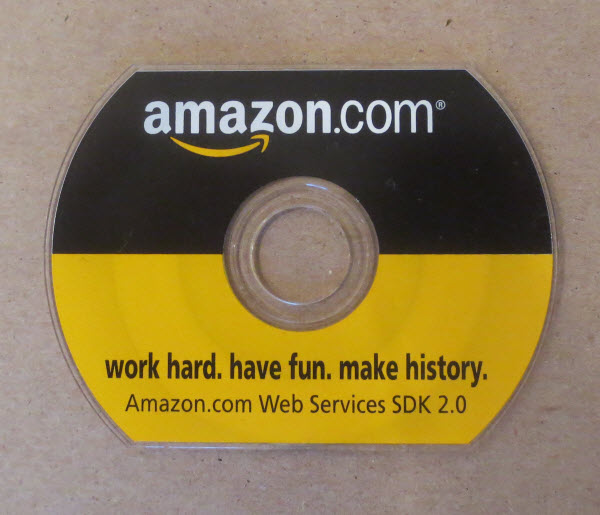

Twelve years ago today I drove to Seattle and started working at [Amazon.com](https://amazon.com). Today seems like a good time to tell the story of how and why I joined the company and to retrace my career path to date.

I have been an Amazon customer since the fall of 1996. My first order was a book called [PC Roadkill](http://www.amazon.com/gp/product/1568843488/ref=as_li_tl?ie=UTF8&camp=1789&creative=390957&creativeASIN=1568843488&linkCode=as2&tag=vertexdevelopmen&linkId=YH5HZVNFEY5ZEBTB):

## The First Web Service
In early 2002 I was happily self-employed. I had a nice consulting business and made a good living working with a wide variety of early Internet and web services companies. Several of my customers were preparing for a future where web services (discovered via UDDI and accessed via SOAP) were commonplace. At that point in time, however, working examples were few and far between. There were some simple demo services that could return a stock quote or a weather forecast, package tracking from UPS, and a limited bookkeeping service from Intuit. It was easy to talk about the promise of web services but there was very little to actually show. I must have drawn diagrams like this several dozen times (this is taken from a presentation that I delivered in late 2002):

All that changed in the spring of 2002 when the very first Amazon.com Web Service (as it was called at the time) emerged in beta form. This simple service offered SOAP and XML interfaces to the Amazon product catalog and allowed developers to earn revenue through the Amazon Associates program. I became aware of this service, signed up for the beta, and downloaded the SDK. I wrote some simple PHP applications to try it out, and then built and briefly distributed a PHP library to simplify access to the data. I was impressed and intrigued and sent them some feedback and offered to meet with them to share my feedback in person.

At this time I was also running Syndic8, a directory of RSS and Atom feeds. Syndic8 included a fairly comprehensive web services API built on top of the [XML-RPC](http://en.wikipedia.org/wiki/XML-RPC) protocol.

The product manager responded quickly and was happy to meet with me and to listen to my feedback. He also invited me to a modest developer conference that they were planning to conduct later that spring.

## Developer Conference
The conference was held on the 6th floor of the [Pac-Med](http://en.wikipedia.org/wiki/Pacific_Tower_%28Seattle%29) building. Once a Marine hospital, this imposing edifice dates back to 1933 and sits on a prominent piece of land on Seattle’s Beacon Hill. It turned out that “modest” was an overstatement. There were either four or five guests, including [Allan Engelhardt](http://www.meetup.com/AWSUGUK/members/36567242/) , who is still involved in what is now AWS. One of the other attendees was under the age of 18, and came to the conference from Germany.

The attendees were outnumbered by the Amazon employees. We sat and listened as the speakers talked about their plans to build on their success and to expand their web service offering over time. One speaker (it may have been Colin Bryar but I am not sure) looked to the future and said that they would be looking around the company for other services to expose in the future.

This was the proverbial [light-bulb](http://www.oxforddictionaries.com/us/definition/american_english/light-bulb-moment) moment for me! It was obvious that they were thinking about developers, platforms, and APIs and I wanted to be a part of it. I turned to [Sarah Spillman](http://www.linkedin.com/pub/sarah-bryar/2/383/a52) (who later married Colin Bryar) and said “You need to interview me for a position here.” She was happy to hear this and told me that recruiting was one of the goals of the conference.

Jeff Bezos made a cameo appearance. He spent a few minutes with each of the guests and expressed his gratitude for our attendance. Later that summer, Jeff’s prescient quote formed an important part of the [press release](http://phx.corporate-ir.net/phoenix.zhtml?c=176060&p=irol-newsArticle&ID=503034):

> We’re putting out a welcome mat for developers – this is an important beginning and new direction for us. Developers can now incorporate Amazon.com content and features directly onto their own websites. We can’t wait to see how they’re going to surprise us.

I left the conference and drove home, not realizing that I had just seen the future and that I would get to be a part of it!

## Interview, Hiring, Coming On-Board
Later that week, the recruiting coordinator got in touch to initiate the hiring process. The first step was a phone screen. Given my development background, I was quizzed on C, C++, and even had to write some SQL over the phone. I must have done fine and they scheduled an in-person interview. I met with Colin, Sarah, Larry Hughes, Carl Christofferson, and Rob Frederick. Sarah actually asked me if I knew what Amazon.com did and if I had ever made a purchase! I expressed surprise that she would even need to ask, and she told me that many candidates knew nothing about the company and had yet to shop online.

I was hired as a Senior Developer on the Amazon Associates team, reporting to Larry Hughes and reported for work on August 19, 2002. At that point the nascent web services effort was joined at the hip with the Associates program, sharing management and marketing leadership. My primary responsibility was a set of daily reports that tracked the growth of the Associates program. However, Larry also gave me the freedom to spend a little bit of my time (10% or so) helping out the web services team as I saw fit.

The service was growing by leaps and bounds. I wrote some monitoring tools to make sure that it was healthy, built some sample code, and also helped out on the developer forums where possible.

## First Talk
A few months in, I was asked to speak at a conference. This was presented to me as “None of us want to do it and you are the new guy, so we are dumping this on you.” Little did they know that I actually enjoyed speaking at conferences and that I was happy to accept their offer. I am fairly certain that this was a Seybold conference and that it was held in San Francisco, but I cannot find the presentation or any information about the conference.

The talk went well and they booked me for a couple of other conferences in early 2003. Again, I enjoyed spreading the word about technology and was comfortable in front of an audience. I also distributed a very simple SDK on a small CD:

## Becoming an Evangelist
In early 2003, Sarah and Larry met with me. They said “We have been searching for a Web Services Evangelist for months, but it appears that you are already doing the job. Would you like a new role?” The job sounded intriguing but would require a lot of travel. I checked with my wife and my children to make sure that this would be acceptable, and it was. I accepted the position and the title change (to “Web Services Evangelist”) became effective on March 24, 2003!

I brushed up my PowerPoint skills and decided that my goal was to simply spread the word about AWS to developers all over the world, raising awareness and encouraging them to build applications. Eleven years later, that’s still my job description. My early travels took me all over the US, to Japan, and to the UK (Hello, Slough!).

## AWS Emerges
Jeff Bezos and the “S Team” (the Senior VPs reporting to him) saw the potential for infrastructure services and put Andy Jassy in charge of the effort in 2003. Andy had built several other Amazon businesses from scratch and was ready to do it again. Andy shared early drafts of his “vision document” with me and I provided him with lots of feedback. The label AWS, once used to describe the service which provided access to the Amazon product catalog, became an umbrella term for a set of [infrastructure services](http://aws.amazon.com/).

Andy’s vision document outlined a broad collection of services and a long-term roadmap to build, promote, scale, and charge for them. I discussed various aspects of developer relations and product marketing with Andy and [Drew Herdener](https://www.linkedin.com/pub/drew-herdener/1/b5/362) and we decided to create the [AWS Blog](http://aws.amazon.com/blogs/aws/welcome/) in late 2004. At that point, blogs were primarily used for personal self-expression and it was up to me to choose the best content, voice, and style. As I said in the “Welcome” post:

> We plan to provide you with useful information about AWS, products built with AWS, web services development tools, interviews with successful AWS developers,case studies, and information about the web services industry.

## Lots of Opportunities
The decade has flown by and I don’t have the time or the space to cover it in depth. We launched the [Simple Queue Service](http://aws.amazon.com/sqs/) in late 2004, [Amazon S3](http://aws.amazon.com/s3/) in early 2006, and [Amazon EC2](http://aws.amazon.com/ec2/) later that summer.

I am proud of what I have accomplished, but I know that there’s a lot more to do. I have written over 2000 blog posts, one [AWS book](http://www.amazon.com/gp/product/B0046ZRKZ8/ref=as_li_tl?ie=UTF8&camp=1789&creative=390957&creativeASIN=B0046ZRKZ8&linkCode=as2&tag=vertexdevelopmen&linkId=2RD22XLVP564HG3U), and have earned six patents. I have traveled the world and have appeared in front of tens of thousands of people, and I drove across the United States for the [AWS Road Trip](http://awsroadtrip.com/) and was the host of almost one hundred AWS Report videos.

I have been promoted several times and am now Director of AWS Evangelism. I have had opportunities to manage people, but I am not very good at it and strongly prefer to be an individual contributor (IC). Fortunately, there’s a place for senior ICs at Amazon (me, [James Hamilton](http://perspectives.mvdirona.com/), and [Werner Vogels](http://www.allthingsdistributed.com/), to name some public examples) and there’s an IC ladder with another rung or two for me to climb in the future!

## Looking Ahead
Twelve years in, it is clear that joining Amazon was the right thing for me to do. It is hard to imagine another place to work that would be more fun, more rewarding, or that would allow me to have a greater impact on the world. As it says on that CD, “Work hard, have fun, make history!”

