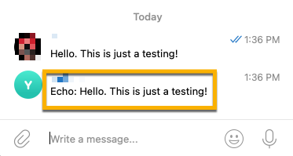

We often need tools to get things done. As a developer, one of my productivity hacks is to use Telegram bots to help me get things done quickly. From checking the bus schedule for commuting, to image resizing. Most of the small, unpleasant tasks I delegate to the Telegram bot. Simply put, a Telegram bot is my personal assistant.

If that opening line got your interest, this article will provide you the base foundation to build Telegram bot. Plus, with ready-to-deploy code which you can find on this Github repo.

> You can find the source code in this Github repo: [donnieprakoso/telegram-bot-boilerplate](https://github.com/donnieprakoso/telegram-bot-boilerplate).

Now, let's get more technical.

To interact with Telegram bots — such as getting messages or photos — we can use either polling ([getUpdates](https://core.telegram.org/bots/api#getting-updates)) or webhooks ([setWebhook](https http://core.telegram.org/bots/api#setwebhook)). Of these two methods, I'm more comfortable using a webhook because I don't have to develop polling mechanisms that use resources inefficiently. With a webhook, if there is a message, Telegram will make a `POST` request to the webhook URL which will trigger our backend to process the request.


In this article, you will learn how to build a Telegram bot that integrate with serverless APIs. This article provides an overview of the basic concept, workflow, and requirements. You can extend the functionality by adding business logic based on your needs. For the serverless API, you will use the Amazon API Gateway and an AWS Lambda function.


All the stacks here will use the AWS CDK to provision resources, so you'll get a consistent deployment. If you are new to the AWS CDK, please [install the CDK first](https://docs.aws.amazon.com/cdk/v2/guide/getting_started.html) and then follow the [tutorial for bootstrapping](https://docs.aws.amazon.com/cdk/v2/guide/bootstrapping.html).

## Let's Get Started!

### Step 1: Request bot using @BotFather

First, we need to create a bot using [@BotFather](https://t.me/botfather). You need to run the command `/newbot` and follow the instructions from @BotFather to give it a name. Once that's all done, you'll get the URL for the bot you just created as well as a token that you can use to interact with your bot.


After you get the token, keep your token safe and don't share it with anyone for security reasons. We will use Telegram token in the following steps.

### Step 2: Deploy Webhook using Serverless API

In this step we will deploy the serverless API. The output of this step is the API Endpoint URL that we can use to register the webhook for the Telegram bot that we just created. Before we deploy this serverless API stack, let's do a code review so you understand what the CDK app will do.

#### Code Review: AWS Systems Manager Parameter Store

The first thing we need to define in the CDK app is to create resources to store the Telegram token. Of course we want to avoid hard coding in this application. We will use the [AWS Systems Manager Parameter Store](https://docs.aws.amazon.com/systems-manager/latest/userguide/systems-manager-parameter-store.html) which we can later retrieve inside the Lambda function. The parameter name that we use is `telegram_token` which you can find in the Parameter Store dashboard, with a dummy value of `TELEGRAM_TOKEN` which we will need to change manually later.

```python
ssm_telegram_token = _ssm.StringParameter(self, id="{}-ssm-telegram-token".format(
    stack_prefix), parameter_name="telegram_token", description="Telegram Bot Token", type=_ssm.ParameterType.STRING, string_value="TELEGRAM_TOKEN")
```

#### Code Review: AWS IAM Roles

The next thing we need to define are the IAM roles that define Lambda function access to write log groups with Amazon CloudWatch as well as access to the Parameter Store. For the record, we can grant access to the Lambda function by calling the `.grant_read()` function, but I prefer this approach because I can explicitly implement for [least privilege](https://docs.aws.amazon.com/IAM/latest/UserGuide/best-practices.html#grant-least-privilege.html).

```python
lambda_role = _iam.Role(
    self,
    id='{}-lambda-role'.format(stack_prefix),
    assumed_by=_iam.ServicePrincipal('lambda.amazonaws.com'))

cw_policy_statement = _iam.PolicyStatement(effect=_iam.Effect.ALLOW)
cw_policy_statement.add_actions("logs:CreateLogGroup")
cw_policy_statement.add_actions("logs:CreateLogStream")
cw_policy_statement.add_actions("logs:PutLogEvents")
cw_policy_statement.add_actions("logs:DescribeLogStreams")
cw_policy_statement.add_resources("*")
lambda_role.add_to_policy(cw_policy_statement)

ssm_policy_statement = _iam.PolicyStatement(effect=_iam.Effect.ALLOW)
ssm_policy_statement.add_actions("ssm:DescribeParameters")
ssm_policy_statement.add_actions("ssm:GetParameter")
ssm_policy_statement.add_resources(ssm_telegram_token.parameter_arn)
lambda_role.add_to_policy(ssm_policy_statement)
```

#### Code Review: Define AWS Lambda Function

After that, we will define the Lambda function which is the central point in processing the request. Here, I define some properties for Lambda functions, such as `handler`, `timeout`, `tracing` using AWS X-Ray, and using Python 3.8 `runtime`. For `role`, we will use `lambda_role` which we defined above. Also, for Lambda function to be able to get the Parameter Store, we will pass an environment variable called `SSM_TELEGRAM_TOKEN`.

```python
fnLambda_handle = _lambda.Function(
    self,
    "{}-function-telegram".format(stack_prefix),
    code=_lambda.AssetCode("../lambda-functions/webhook"),
    handler="app.handler",
    timeout=core.Duration.seconds(60),
    role=lambda_role,
    tracing=_lambda.Tracing.ACTIVE,
    runtime=_lambda.Runtime.PYTHON_3_8)
fnLambda_handle.add_environment(
    "SSM_TELEGRAM_TOKEN", ssm_telegram_token.parameter_name)
```

_But what about the code for AWS Lambda?_

Here we define `AssetCode` which we can get in `lambda-functions/webhook` folder. There is only 1 main file which is `app.py`, and let's evaluate what this Lambda function (`lambda-functions/webhook/app.py`) will do:

The first thing it will do is get the Telegram token for the Parameter Store using string `SSM_TELEGRAM_TOKEN` from the environment variables. To do this, we need to call `os.getenv("SSM_TELEGRAM_TOKEN")`. The important thing here is how we construct the `TELEGRAM_BASE_URL` variable which is the Telegram endpoint to interact with bots.

```python
# Get Parameter Store for Telegram Token
ssm = boto3.client('ssm')
SSM_TELEGRAM_TOKEN = os.getenv('SSM_TELEGRAM_TOKEN')
TELEGRAM_TOKEN = ssm.get_parameter(Name=SSM_TELEGRAM_TOKEN)[
    "Parameter"]["Value"]
TELEGRAM_BASE_URL = "https://api.telegram.org/bot{}/".format(
    TELEGRAM_TOKEN)
```

Next, we define a function for `send_message`. Here we will pass `chat_ID` so that our `text` message will be sent to the appropriate channel.

```python
def send_message(chat_ID, text):
    data = {"chat_id": chat_ID, "text": text}
    send_message = requests.post("{}{}".format(TELEGRAM_BASE_URL,
                                               "sendMessage"),
                                 data=data)
```

Once we have defined the `send_message` function, the next part is to define the `handler` function. The `handler⁣` function is the main event loop function that processes events. When the Lambda function receives an event, it passes the event (and runtime context) to the `handler⁣` function.

In this case, the webhooks calls will invoke this Lambda function. For this Lambda function, I need to be able to interact with media images as well as text. Therefore, here I define two key properties, namely `text` to be able to parse requests for text messages, and also `photo` to process messages with images.

```python
def handler(event, context):
    try:
        logger.info(event)
        data = json.loads(event['body'])

        if "text" in data["message"]:
            text_to_reply = "Echo: {}".format(data["message"]["text"])
            send_message(data["message"]["chat"]["id"], text_to_reply)
            response = {"statusCode": 200,
                        "body": json.dumps({"message": "success"})}
        elif "photo" in data["message"]:
            text_to_reply = "Received a photo with caption: {}".format(
                data["message"]["caption"]) if "caption" in data["message"] else "Received a photo"
            send_message(data["message"]["chat"]["id"], text_to_reply)
            response = {"statusCode": 200,
                        "body": json.dumps({"message": "success"})}

        return response
    except Exception as e:
        logger.error("Error on processing request: {}".format(e))
        response = {"statusCode": 200,
                    "body": json.dumps({"message": "success"})}
        return response
```

#### Code Review: REST API with Amazon API Gateway

Back to the CDK app, after defining the Parameter Store, IAM, and Lambda function, it's time to define the API Gateway.

Here I define a REST API — you can use any API type supported by API Gateway, such as the HTTP API. After that, I defined the integration for Lambda function. We also need to define a resource for this API path URI, and by defining `add_resource("telegram")`, Telegram can use our webhook URL at `exampledomain.com/telegram` using the `POST` method.

```python
api = _ag.RestApi(
    self,
    id="{}-api-gateway".format(stack_prefix),
)

int_webhook = _ag.LambdaIntegration(fnLambda_handle)

res_data = api.root.add_resource('telegram')
res_data.add_method('POST', int_webhook)
```

```python
core.CfnOutput(self,
               "{}-output-apiEndpointURL".format(stack_prefix),
               value=api.url,
               export_name="{}-apiEndpointURL".format(stack_prefix))
```

### Step 3: Deployment

To deploy our serverless API stack, you will first need to install all the libraries that will be used by Lambda functions with the following command in the `lambda-functions/webhook` folder:

```bash
pip install -r requirements.txt -t .
```

After that, you can switch to the `cdk` folder, and deploy the serverless API with the following command:

```bash
cdk deploy
```

Once the process is complete, you will get an endpoint URL from the API Gateway.

### Step 4: Configure Telegram Token

Before we can use the webhook, we need to set up the Telegram token in the Parameter Store. For that we need to do the following steps:

Go to Parameter Store [dashboard](https://console.aws.amazon.com/systems-manager/parameters/?tab=Table) and use `telegram_token` as filter.


Click the `telegram_token` parameter and click the `Edit` button.


Change the value of `telegram_token` to the value of the Telegram token you got.


### Step 5: Configure the Webhook

After that, set up your bot using a webhook. For that, you need to open the following URL and replace it with the appropriate variable:

`https://api.telegram.org/bot{TELEGRAM TOKEN}/setWebhook?url={API ENDPOINT URL}`

Change `{TELEGRAM TOKEN}` to your Telegram token. Then, change `{URL API ENDPOINT}` to the URL of API Gateway and add `/telegram`, for example: `https://XYZ.execute-api.ap-southeast-1.amazonaws.com/prod/telegram `.

After that, you need to open your browser and go to the URL. If this works, you'll get this response.:


### Step 6: Testing

And that's it! At this stage, you have already done the integration for your Telegram bot and webhook. For testing, please send a message to your bot. You will get an echo response for the `text` message.



You can also send a message with a photo, and get a confirmation image received with or without a caption.


If you need to view the logs from your Lambda, you can take a detailed look at the CloudWatch logs. Here's an example display for logs from my serverless API:


### Step 7: Cleaning Up

Don't forget to clean up all the resources by running this following command in `cdk` folder:

```bash
cdk destroy
```

I know that you won't do this when you're building the bot, and just a quick note for you to clean up the resources.

## Conclusion and What's Next?

And that's how you build a personal assistant with Telegram bot. I use this Telegram bot for various needs, and it is very practical because I can interact with the bot either via mobile phone or from the desktop.

But, what's next? From here, you have the basic foundation to build your own logic needs. You can modify the text using keywords or use captions for media images. Let me know what you've built in the comments below!

Happy building! ️
— Donnie
