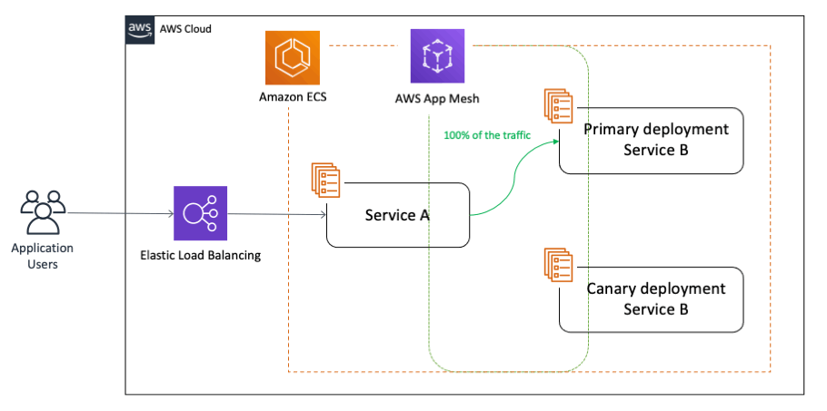
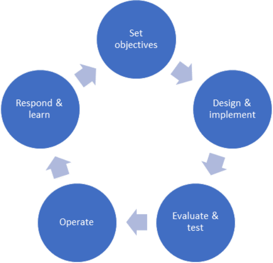
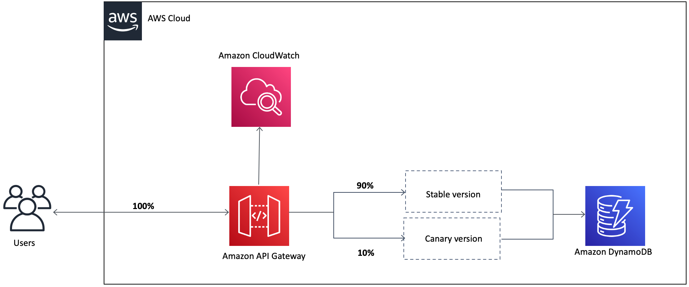
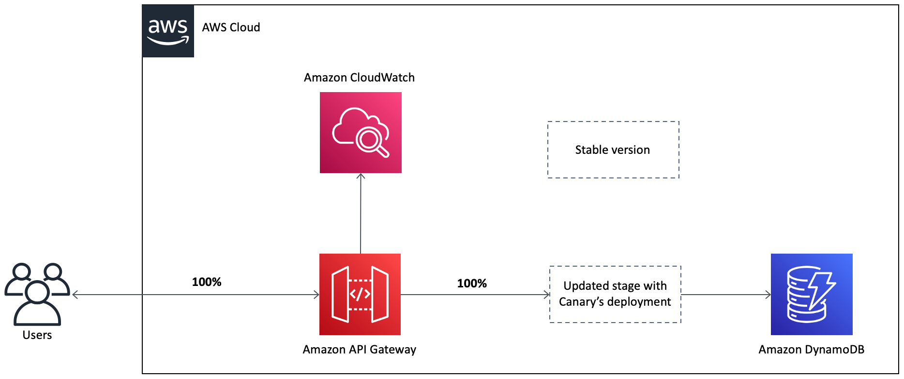

## Learn how to ensure that you minimize negative impact for new releases!

### What is a Canary?
Canary release is a technique to reduce the risk of introducing a new software version in production by slowly rolling out the change to a small subset of users before rolling it out to the entire infrastructure and making it available to everybody.

Similar to a Blue/Green Deployment, you start by deploying the new version of your software to a subset of your infrastructure.

With canary deployments/releases, you switch the traffic in user defined percentage increments as per business needs after deploying a new version of a given application or service. 

#### Why Canary?
The name "canary deployment" comes from the old practice of using canaries in mines. Canaries are sensitive to substances toxic to miners, carbon monoxide, so they worked as an early warning system for miners. If the canary became sick, it was a sign to evacuate.  

* Deploying new versions of your application to a subset of your infrastructure first, or maintaining two environments (blue/green), allows you to verify a change's behavior in production and quickly roll back if necessary.
* To test in an environment that requires production deployment.  
* Capture real-time feedback from users in the environment before wide deployment.  

#### Canary deployment strategy.
In a similar way to canary in the coal mine, canary deployment provides a narrow deployment mimicing the warning system. By initially deploying changes to a small subset of users, or only internally, known as the "canary target", organizations can monitor how the new feature or release perform in this controlled subset of the environment, production or otherwise. If any issues arise, they are contained within the canary target, allowing for rapid detection.  

#### Canary & the Resilience Lifecycle.
Modern organizations today face an ever-growing number of resilience-related challenges, especially as expectations from customers shift toward an always on, always available mindset. Deploying new versions of your application to a subset of your infrastructure first allows you to verify a change's behavior in production and quickly roll back, if necessary.

#### Health and observability.

We monitor the health of the new version, so if there is an issue, your canary deployment can automatically switch the traffic back to the old version, thereby decreasing the impact of the bug(s) introduced in the new application version on the end customers. This approach not only helps with brand new implementations, but also addresses the need for testing around complex and distributed microservices where you can send a percentage of traffic to newer versions in a controlled manner:

#### Canary routing.

Routing to your canary is a key element in striping your workload.  You can use a variety of techniques for this with Route 53, API Gateway, Elastic Load Balancers, and custom cell routing, considering production as one cell and the canary as a second.

When you are happy with the new version, you can start routing a few selected users to it. There are different strategies to choose which users will see the new version: a simple strategy is to use a random sample; some companies choose to release the new version to their internal users and employees before releasing to the world; another more sophisticated approach is to choose users based on their profile and other demographics.

As you gain more confidence in the new version, you can start releasing it to more servers in your infrastructure and routing more users to it. A good practice to rollout the new version is to repurpose your existing infrastructure using PhoenixServers or to provision new infrastructure and decommission the old one using ImmutableServers.

Canary release is an application of ParallelChange, where the migrate phase lasts until all the users have been routed to the new version. At that point, you can decomission the old infrastructure. If you find any problems with the new version, the rollback strategy is simply to reroute users back to the old version until you have fixed the problem.

A benefit of using canary releases is the ability to do capacity testing of the new version in a production environment with a safe rollback strategy if issues are found. By slowly ramping up the load, you can monitor and capture metrics about how the new version impacts the production environment. This is an alternative approach to creating an entirely separate capacity testing environment, because the environment will be as production-like as it can be.

Although the name for this technique might not be familiar [1], the practice of canary releasing has been adopted for some time. Sometimes it is referred to as a phased rollout or an incremental rollout.

In large, distributed scenarios, instead of using a router to decide which users will be redirected to the new version, it is also common to use different partitioning strategies. For example: if you have geographically distributed users, you can rollout the new version to a region or a specific location first; if you have multiple brands you can rollout to a single brand first, etc. Facebook chooses to use a strategy with multiple canaries, the first one being visible only to their internal employees and having all the FeatureFlags turned on so they can detect problems with new features early.

Canary releases can be used as a way to implement A/B testing due to similarities in the technical implementation. However, it is preferable to avoid conflating these two concerns: while canary releases are a good way to detect problems and regressions, A/B testing is a way to test a hypothesis using variant implementations. If you monitor business metrics to detect regressions with a canary [2], also using it for A/B testing could interfere with the results. On a more practical note, it can take days to gather enough data to demonstrate statistical significance from an A/B test, while you would want a canary rollout to complete in minutes or hours.

One drawback of using canary releases is that you have to manage multiple versions of your software at once. You can even decide to have more than two versions running in production at the same time, however it is best to keep the number of concurrent versions to a minimum.

Another scenario where using canary releases is hard is when you distribute software that is installed in the users' computers or mobile devices. In this case, you have less control over when the upgrade to the new version happens. If the distributed software communicates with a backend, you can use ParallelChange to support both versions and monitor which client versions are being used. Once the usage numbers fall to a certain level, you can then contract the backend to only support the new version.

Managing database changes also requires attention when doing canary releases. Again, using ParallelChange is a technique to mitigate this problem. It allows the database to support both versions of the application during the rollout phase.

### To learn more
* [Resilience Lifecycle](https://docs.aws.amazon.com/prescriptive-guidance/latest/resilience-lifecycle-framework/stage-2.html?sc_channel=el&sc_campaign=resiliencewave&sc_geo=mult&sc_country=mult&sc_outcome=acq&sc_content=my-real-world-experince-with-canary-deployments)
* [Canary Deployment (AWS Well Architected)](https://wa.aws.amazon.com/wellarchitected/2020-07-02T19-33-23/wat.concept.canary-deployment.en.html?sc_channel=el&sc_campaign=resiliencewave&sc_geo=mult&sc_country=mult&sc_outcome=acq&sc_content=my-real-world-experince-with-canary-deployments)
* [Introduction - Blue/Green Deployments on AWS (AWS Whitepaper)](https://docs.aws.amazon.com/whitepapers/latest/blue-green-deployments/introduction.html)
* [Automating safe, hands-off deployments (AWS Builders Library)](https://aws.amazon.com/builders-library/automating-safe-hands-off-deployments/)
* [How Amazon.com Search Uses Chaos Engineering to Handle Over 84K Requests Per Second (Blog Post)](https://docs.aws.amazon.com/whitepapers/latest/development-and-test-on-aws/testing-phase.html)
* [Create a pipeline with canary deployments for Amazon ECS using AWS App Mesh (Blog Post)](https://aws.amazon.com/blogs/containers/create-a-pipeline-with-canary-deployments-for-amazon-ecs-using-aws-app-mesh/?sc_channel=el&sc_campaign=resiliencewave&sc_geo=mult&sc_country=mult&sc_outcome=acq&sc_content=my-real-world-experince-with-canary-deployments)
* [AWS re:Invent 2022 - Reliable scalability: How Amazon.com scales in the cloud (ARC206)](https://bit.ly/reliable2022) - Learn how Amazon search implemented Chaos Engineering
* [AWS Fault Injection Simulator (AWS FIS)](https://docs.aws.amazon.com/fis/latest/userguide/what-is.html?sc_channel=el&sc_campaign=resiliencewave&sc_geo=mult&sc_country=mult&sc_outcome=acq&sc_content=my-real-world-experince-with-canary-deployments)

Hands-on References
https://aws.amazon.com/blogs/containers/using-aws-load-balancer-controller-for-blue-green-deployment-canary-deployment-and-a-b-testing/