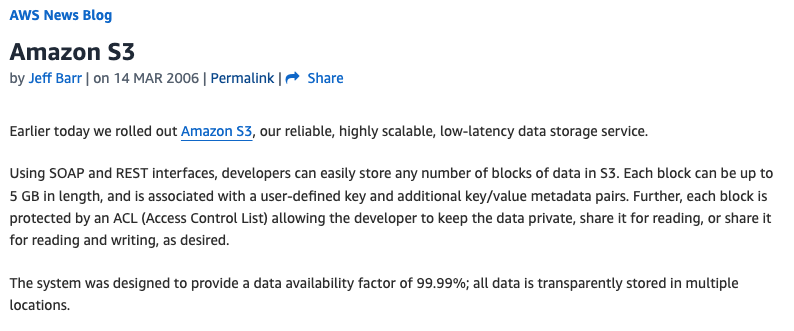

One of the great things about my role as a consultant at [GlobalLogic]([https://](https://www.globallogic.com/uk/) is that sometimes I'll be asked to help out on what at first glance can be a simple problem, but as I investigate, I get a chance to uncover some unusual or forgotten features.

Recently, I was working on a project and was asked if I could help solve an issue that had been puzzling a developer. They had deployed a system where some objects uploaded to an S3 bucket seemed to disappear and then reappear; it was time to start digging.

## Our design.
In this case, we were logging access for all S3 buckets to a central accounting bucket. The data was used for analytics, cost management, and incident analysis; we'd started using Athena to query the generated logs.

Given that this was in a live environment, we were generating a lot of logs, and Athena was struggling. Our aim was to move the incoming logs into a structure where the objects had a prefix like `PartitionedLogs/Year=yy/Month=mm/Day=dd/bucket`, replacing the placeholders with appropriate values. Athena could then use this to partition the data, so we could have more efficient queries for a specific day or a specific bucket.

To achieve this, we were using an event-driven pattern as per the diagram below:


As an object was written to the S3 log bucket, this would generate an event that matched a rule configured in EventBridge. This posted a message to an SQS queue with details of the object, and then a lambda read those messages in batches. The lambda would loop over the messages in the batch and move the associated object to the prefix for partitioning. To prevent a feedback loop where moving the objects to the new prefix would trigger a new event, the rule in EventBridge was configured to ignore all new events for objects with a prefix starting with `PartitionedLogs`.

We'd used SQS rather than triggering the lambda directly because there is a limit on the number of lambdas running at any one time, so by managing batches of messages, we could reduce the number of lambda triggers by a factor of x100 in this case. As it turned out, this was a great decision and helped us solve our issue once we'd identified it.

## Our problem and how we investigated.
We'd rolled out our infrastructure and code through Terraform, and at first glance, everything was running great. We could see the objects being created in the log bucket, and after a short period, they were moved to the new prefix. However, after a couple of days, we noticed that some objects were still sitting in their original locations. And so, started our puzzle ...

First, we tried manually submitting a message describing our S3 object to our SQS queue, and our code worked, copying the file that had stayed in place previously to the expected location. This ruled out issues with permissions or KMS keys, which had been our thought. We also checked that our lambda wasn't exhausting the allocated memory or timeout, again with no problems noted.

Next, we wanted to get a feel for the scale of our problem, so we added some debug to our lambda code; this was written in Python, and we were using the [logging library](https://docs.python.org/3/library/logging.html), so we added a couple of debug lines and also added a 'try ... except` clause to capture any errors. With these in place, a simplified version of our code would look like:

```python
for object in event['Messages']:
  ...

  log.debug('Notified of key %s), objectName)

  try:
    s3_client.copy_object(
      CopySource=copy_object,
      Bucket=bucket_name,
      Key=target_key)
    s3_client.delete_object(Bucket=s3access_bucket, Key=key)
  except botocore.exceptions.ClientError as exception:
    log.debug(exception)

```

With these changes, we started to get some understanding of the scale of the problem. We used log insights in CloudWatch to query the logs from lambda, and as an example, on one day, we saw 1.5 million objects passing through the lambda loop and triggering the `Notified of` and 350 errors logged as the `copy_object` failed. This meant we were seeing a failure rate of 0.02%, and this was approximately the same on other days.

The debug log also exposed an error message: `NoSuchKey - The specified key does not exist.`

So we had our first big clue to the issue: when the lambda tried to copy the object to the partitioned space, the object didn't exist. But remember, we'd checked the bucket, and we could see the object in the specified location. Also, our architecture meant that EventBridge only added a message to the queue when it was notified that an object had been uploaded to the bucket, so how could the object not be there, and then when we checked, it was?

## An S3 history lesson.
As we investigated more, I started to get a feeling for where our problem was, and to understand this, it's worth re-visiting what in AWS terms is ancient history.

S3 was announced in 2006 with this [announcement](https://aws.amazon.com/blogs/aws/amazon_s3/):



At the time S3 was announced, it was a simpler service with only a single storage class, the equivalent of today's standard storage class. (Glacier was announced nearly 6 years later.) However, as can be seen at the bottom of the announcement above, it already had an important factor:

> The system was designed to provide a data availability of 99.99%; all data is stored in multiple locations.

What this meant is that when an object was uploaded to an S3 bucket, it would be replicated to all availability zones in the region associated with the bucket. This was great in terms of data resilience, but it came at a price.

## Strong vs. Eventual Consistency in S3

If you consider that AWS might see many objects being uploaded to all of the S3 buckets in a region, and that some of those objects might be multi-Gb; all of these objects will take a finite amount of time to upload and replicate. This means that the designers of the S3 service had two choices of when to notify the user that the upload had been successful. They could either wait for the replication to complete, which meant that if there was a large load on the system, you would be waiting a while. Alternatively, they could use a different criteria, for example, that it had been successfully stored in one availability zone, in which case you could move on and leave AWS to handle the replication behind the scenes.

The first option, where we wait for the data to be written to all locations, is known as **strong consistency**, while the second option, where you wait for the data to be stored in one location and signal completion, knowing that the other locations will catch up soon, is known as **eventual consistency**. The final option is what was chosen by the designers to give a faster throughput in the S3 service.

Eventual consistency is used elsewhere in AWS, such as in RDS read replicas, DynamoDB, and services such as CloudWatch and CloudTrail. And it's not only used in AWS; many IT systems rely on eventual consistency to provide a compromise in terms of data consistency vs. speed.

This explained why, in a very small number of cases, we might see an event being triggered in S3 to indicate that an object had been uploaded, and if we were very quick in processing that event, we might try to read from a location where that data hadn't replicated yet - a reason why we might see our dreaded `NoSuchKey` message.

## But didn't AWS announce that S3 is now strongly consistent?
As I write the above section, I can imagine people quickly searching because they remember an [announcement](https://aws.amazon.com/blogs/aws/amazon-s3-update-strong-read-after-write-consistency/) that AWS was now strongly consistent. Indeed, that announcement was made in December 2020. The announcement starts with

> When we launched S3 back in 2006, I discussed its virtually unlimited capacity (“…easily store any number of blocks…”), the fact that it was designed to provide 99.99% availability, and that it offered durable storage, with data transparently stored in multiple locations. Since that launch, our customers have used S3 in an amazing diverse set of ways: backup and restore, data archiving, enterprise applications, web sites, big data, and (at last count) over 10,000 data lakes.
>
> One of the more interesting (and sometimes a bit confusing) aspects of S3 and other large-scale distributed systems is commonly known as eventual consistency. In a nutshell, after a call to an S3 API function such as PUT that stores or modifies data, there’s a small time window where the data has been accepted and durably stored, but not yet visible to all GET or LIST requests.

The announcement then went on to say **S3 is Now Strongly Consistent**, a statement that seems to be at odds with what we were encountering. However, if you carry on reading the article, it states

> Effective immediately, all S3 GET, PUT, and LIST operations, as well as operations that change object tags, ACLs, or metadata, are now strongly consistent. What you write is what you will read, and the results of a LIST will be an accurate reflection of what’s in the bucket. This applies to all existing and new S3 objects, works in all regions, and is available to you at no extra charge! There’s no impact on performance, you can update an object hundreds of times per second if you’d like, and there are no global dependencies.

That's a specific set of operations. I think it's safe to say that if AWS had meant that **ALL** S3 operations were strongly consistent, they wouldn't have added that level of detail.

That meant there were a number of operations in S3 that were still handled using eventual consistency, and we were using one of them, `copy_object`.

## Case closed.
So we finally could understand what was happening with our system - in a very small number of cases, we were processing the events fast enough, and we were unlucky to read from S3 before the data had copied to all availability zones, and so we got the `NoSuchKey` warning.

We still had to work out how to resolve the issue, and I'll cover that in the next post, but in the meantime, I'd like to leave you with three suggested learnings.

1. Make sure you understand consistency and how it can impact your system. Don't expect that the systems you work with will always be strongly consistent.
2. When you read announcements or documentation, don't skim read or just read the headline; always dig into the detail.
3. Everything fails eventually (no pun intended) - your code should never assume that it will always work. Ensure that you capture any possible error conditions and work out how to deal with them; at a minimum, flag the issue, but where possible, try to find a solution to resolve the problem.

