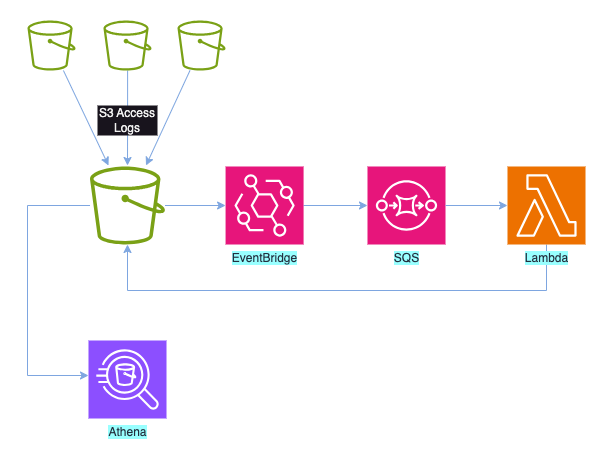
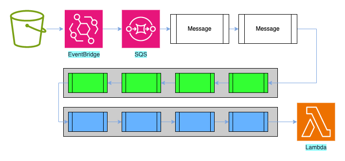

|ToC|
|---|

In my [previous post](../01-the-case-of-the-disappearing-s3-keys/), I described how I'd been asked to help a developer who was having some issues. His team was logging all S3 accesses to a central log bucket and then using Athena to analyse the data. They needed to partition this data to allow Athena to process the data more efficiently. However, a small number of the entries they were trying to process seemed to be missing when they used the architecture below:



It turned out that their problem was caused by eventual consistency; in about 0.02% of all objects being processed, the code to process the objects was executing before consistency ensured the object was available, so when we ran the S3 `copy_object` operation, the object didn't seem to exist.

## Please join the queue in an orderly manner

The design meant that as new entries were written to the S3 log bucket, an event was triggered, which was captured by an EventBridge rule. These events were then written to SQS and picked up for processing by a lambda. When you look at the architecture diagram above, you might ask why we didn't simply skip SQS and directly trigger the lambda, something that EventBridge is more than capable of doing.

The simplest answer is that by directly triggering the lambda from EventBridge, the invocation would be tightly coupled to the S3 events; for every object created in the log bucket, there would be an associated lambda function invocation. In our pre-production environment, we were seeing 1.5 million log objects per day, and the live environment would be even higher.

With lambdas, there is a service quota that controls how many lambdas can be running concurrently - by default, 1000 concurrent executions. While this limit can be increased within reason, we would still need to run millions of invocations per day, and we were at risk of exceeding the concurrency limit. If that happened, the lambda would fail to be triggered, and we'd need some method of processing that log entry at a later time. We could also have limited the number of invocations of the lambda that could run concurrently, but this would mean that potentially we'd not process some events since there was no queueing mechanism.

We also need to consider the cost of the lambda. While there's a generous free tier for lambdas, and when you exceed that, the cost is only a couple of tens of cents per million invocations, over time this would add up.

A far better solution is to remove the dependency between the triggering event and the action. In this case, there were no requirements to process the logs immediately; it's unlikely we'd be concerned if a log entry wasn't available for a short period of time. By sending the details of the event from S3 to SQS via EventBridge, we could write the function to process those events in batches; if we processed the events in a batch of 100, we'd reduce the number of lambda invocations a hundredfold; if we handled it in batches of 1000, we'd have a thousand-fold reduction.

## Poll baby, poll

Using lambdas to process messages from SQS in a mature pattern, but when it was first made available, our lambdas had to check if there were any messages in the queue, process them, and then delete them if the lambda executed successfully or place the messages back in the queue if the processing failed. This led to the situation where many developers and organisations were writing very similar code just to handle the housekeeping of queue messages.

This was a prime opportunity for AWS to provide a solution for what they term 'undifferentiated heavy lifting'—i.e.  the situation where you have many customers performing the same task, and sure enough, in 2018, AWS [announced](https://aws.amazon.com/blogs/aws/aws-lambda-adds-amazon-simple-queue-service-to-supported-event-sources/) the idea of an SQS lambda poller.

The poller allows us to configure an SQS queue so that when there are a certain number of messages, those messages will be passed in a batch to the specified lambda. It is also possible to configure the poller so that if there aren't a sufficient number of messages in the queue after a certain amount of time, any existing messages will be passed without waiting longer for the required amount. This pattern would look something like this:



As the lambda processed a batch of messages, if it completed without error, the messages would be removed from the queue; otherwise, they would be returned to the queue for re-processing.

## It's all or nothing

However, this meant that if there were any errors during the processing of a batch of messages, the entire batch would need to be reprocessed. The need for code to reprocess messages was built into the original pattern where the lambda would do the polling, so we've always been aware that we should check to see if the message has been processed previously; there was no guarantee that messages would only arrive once. In the case of our code, this meant checking to see if the object had been moved to the partitioned space already or simply allowing the partition file to be overwritten if it did exist.

This meant there was no real overhead in handling message processing failures since we should already have logic to handle this, but we do need to bear in mind that it takes a finite amount of time to read and process the messages. In the diagram above, there are only four messages per batch, so the overhead for this would be low, but we might be handling 10s, 100s, or even 1000s of messages in a batch, and this time would start to add up. There is a per-millisecond element to billing for lambdas; ideally we'd want to minimise the number of messages we have to reprocess to only include the failures to reduce the reprocessing time.

Again, this gave AWS an opportunity to remove undifferentiated heavy lifting and simplify the handling of messages, and sure enough, in 2021, AWS [announced a solution](https://aws.amazon.com/about-aws/whats-new/2021/11/aws-lambda-partial-batch-response-sqs-event-source/)
where we could signal which messages had failed to be processed, rather than having to process all messages even if they had been successful. To do this, we could return an object called `batchItemFailures`.

We can give some example Python code, based on our partitioning code below - **note that this isn't full code, but rather an example of the process**.

``` python
batch_item_failures = [] 

For message in event["Messages"]
	try:
    s3_client.copy_object(
        	CopySource=copy_object,
        	Bucket=s3access_bucket,
        	Key=target_key)
    s3_client.delete_object(Bucket=s3access_bucket, Key=key)   
	except botocore.exceptions.ClientError as exception:
    batch_item_failures.append(
		{"itemIdentifier": message['messageId’]})

sqs_batch_response["batchItemFailures"] = batch_item_failures
return sqs_batch_response
```

At the start of the processing, we create an empty list called `batch_item_failures`. As we loop over the messages we're receiving from SQS in the `event["Messages"]` data, we check each iteration to see if our copy works. If, however, we see a failure, we add an `itemIdentifier` object to the list, along with the id of the message we were processing that failed.

At the end of the code, we generate an object called `batchItemFailures` containing our list of failed messages - an example structure might look something like

```json
{ 
  "batchItemFailures": [ 
        {
            "itemIdentifier": "msg-id-1234"
        },
        {
            "itemIdentifier": "msg-id-7890"
        }
    ]
}
```

This would tell the poller that the specified messages had failed and they would be placed back in the queue. This means we no longer have to fail all of the messages in the queue, just the specific failures which will lead to faster processing.

## Conclusion

Hopefully you've found this review of the history of SQS message processing with lambdas, especially around failure handling useful.

Whilst this was just a high level review of the process, look out for an upcoming post with a walkthrough of a full implementation of this solution.
