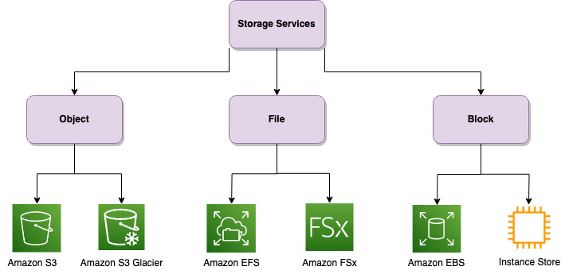

| ToC |
|-----|

### Introduction

Choosing the right storage volume can be a daunting task. With multiple options available on AWS, it can be difficult to determine which storage solution is best suited for your specific use case. The wrong choice can result in performance issues, reduced scalability, and ultimately, higher costs. In this blog, I will help you navigate through the complexities of choosing the right storage volume for your data. We will explore factors such as performance, durability, scalability, access controls, data retrieval, and cost optimization. It's important to note that even the same application can have different storage needs depending on its specific use case. Therefore, understanding the nuances of each storage option is crucial to ensuring optimal performance and cost-efficiency for your application.

There are three main cloud storage types: [object storage](https://aws.amazon.com/what-is/object-storage/?sc_channel=el&sc_campaign=costwave&sc_content=storage-cost-fundamentals&sc_geo=mult&sc_country=mult&sc_outcome=acq), [file storage](https://aws.amazon.com/what-is/cloud-file-storage/?sc_channel=el&sc_campaign=costwave&sc_content=storage-cost-fundamentals&sc_geo=mult&sc_country=mult&sc_outcome=acq), and [block storage](https://aws.amazon.com/what-is/block-storage/?sc_channel=el&sc_campaign=costwave&sc_content=storage-cost-fundamentals&sc_geo=mult&sc_country=mult&sc_outcome=acq). Each of these further have various sub types.

### Object Store

Object store is a storage architecture for unstructured data that stores data as objects with metadata and unique identifiers for easy access. It's ideal for large amounts of data, such as media files, documents, logs, and backups. Object stores are highly scalable, provide high availability and durability, and are cost-effective. [Amazon Simple Storage Service](https://docs.aws.amazon.com/AmazonS3/latest/userguide/Welcome.html?sc_channel=el&sc_campaign=costwave&sc_content=storage-cost-fundamentals&sc_geo=mult&sc_country=mult&sc_outcome=acq)(S3) is an Object Store service from AWS that can store and manage petabytes of data with 11 9's of durability. Amazon S3 offers a range of storage classes that you can choose from based on the data access, resiliency, and cost requirements of your workloads.

Here is a quick brief about few of them:

1. **Frequently Accessed data:** The Standard storage class is designed for frequently accessed data that requires low latency and high throughput performance. This storage class is ideal for use cases such as web and mobile applications, content distribution, and big data analytics.

2. **Infrequently Accessed data:** S3 Standard-IA and S3 One Zone-IA are cost-effective storage classes for infrequently accessed data requiring fast access, such as backups and disaster recovery. They have lower storage costs than S3 Standard, but higher retrieval costs. S3 One Zone-IA is less expensive than S3 Standard-IA, but is not resilient to physical loss of Availability Zones due to disasters. Use S3 One Zone-IA if data can be recreated and for object replicas in S3 Cross-Region Replication (CRR).

3. **Archiving Objects:** Amazon S3's Glacier storage class archives rarely-accessed objects for long-term retention with low storage costs, though retrieval time is slower. It's suited for regulatory requirements, legal docs, and healthcare records. Three low-cost storage classes are offered: S3 Glacier Instant Retrieval, for rare but quick access; S3 Glacier Flexible Retrieval, for partially quick access with a 90-day minimum storage period; and S3 Glacier Deep Archive, the cheapest option for seldom-accessed data with a 180-day minimum storage period and longer default retrieval time.

### File Storage

File storage stores data in a hierarchical structure and is ideal for frequently accessed structured and unstructured data. It's a great choice for shared data workloads with multiple simultaneous users, like content management and media sharing. It's also good for accessing data over network protocols like NFS or SMB. File storage is cost-effective and easy to manage, and it scales well as your data grows. It's a better choice than block storage for large amounts of data that don't need the high performance or low latency of block storage. AWS offers [Amazon Elastic File System](https://docs.aws.amazon.com/efs/latest/ug/whatisefs.html?sc_channel=el&sc_campaign=costwave&sc_content=storage-cost-fundamentals&sc_geo=mult&sc_country=mult&sc_outcome=acq) (Amazon EFS) and [Amazon FSx](https://aws.amazon.com/fsx/?sc_channel=el&sc_campaign=costwave&sc_content=storage-cost-fundamentals&sc_geo=mult&sc_country=mult&sc_outcome=acq) as File Storage Service.

Here is a quick brief about them:

1. **Amazon EFS:** Amazon EFS is an ideal choice for use cases that require shared file storage accessed by multiple instances simultaneously. It provides scalable, highly available, and durable file storage, making it suitable for applications like content management, web serving, and data sharing. It's also well-suited for big data workloads, machine learning, and media processing applications that need to read and write large files quickly.
2. **Amazon FSx:** Amazon FSx lets you choose between four widely-used file systems: NetApp ONTAP, OpenZFS, Windows File Server, and Lustre. This choice is typically based on your familiarity with a given file system. Visit the Choosing an Amazon FSx File System for more information on these.

In summary, if you have Linux-based workloads that require high concurrency and scalability, choose EFS. Similarly, if you have windows based workload choose FSx for Window. Choose other options from FSx based on your familiarity with a given file system.

### Block Storage

Block storage is a storage architecture that stores data in fixed-sized blocks, offering high-performance, low-latency access, making it suitable for low-latency access workloads like financial transaction records and ERP systems. It is commonly used for databases, enterprise applications, and transactional workloads since it can be attached as a local drive to provide fast access to data. AWS offers [Amazon Elastic Block Store](https://docs.aws.amazon.com/AWSEC2/latest/UserGuide/AmazonEBS.html) (EBS) and [Instance Store](https://docs.aws.amazon.com/AWSEC2/latest/UserGuide/InstanceStorage.html?sc_channel=el&sc_campaign=costwave&sc_content=storage-cost-fundamentals&sc_geo=mult&sc_country=mult&sc_outcome=acq) as its block storage service. EBS provides persistent block-level storage volumes for use with Amazon EC2 instances. On the other hand Instance Store is a temporary block-level storage option that is directly attached to an EC2 instance.

Here is a quick brief about them:

1. **Amazon EBS:** It is a suitable option for workloads that require long-term persistence of data, including databases like MySQL, PostgreSQL, or Microsoft SQL Server, mission-critical enterprise applications such as ERP systems or CRM software, and for safeguarding transaction logs and financial records that demand data integrity and rapid access. EBS offers a range of volume types, including General Purpose SSD, Provisioned IOPS SSD, and HDDs, to meet different performance needs.

2. **Instance Store:** It is perfect for short-term storage needs like caching, temporary data from processing tasks, scientific simulations, and computational workloads. It offers exceptional performance and low latency compared to EBS but lacks data persistence; information is lost when the instance stops or terminates. Therefore, it's fitting for scenarios where data loss isn't critical or data recreation is feasible

It's important to carefully choose between EBS and Instance Store based on the specific workload requirements and performance needs.

Table below quickly summarizes the discussion so far:

| Storage Type   | Use Case                 | Advantages                                 | Disadvantages                               |
|--------------|--------------------------|--------------------------------------------|---------------------------------------------|
| Object       | Big data storage, backups, regulatory requirements | Unlimited scalability, cost-effective, metadata rich | Not suitable for structured data, slower performance compared to block storage |
| File  | Shared file storage accessed by multiple instances simultaneously, NAS | Petabyte scale scalability, shared access, parallel access  | Limited scalability compared to object storage |
| Block      | Databases, mission-critical enterprise applications, short-term storage needs | High performance, low latency | Less cost-effective, not suitable for sharing data |

### Choosing the right AWS Storage Solution

Having a grasp of the fundamental building blocks of AWS storage, you might understand, choosing the right storage on AWS depends on several factors, including your specific requirements, workload characteristics, and budget.
Here is a step-by-step guide to help you choose the right storage on AWS:

1. **Understand requirements:** Analyze data type, growth rate, performance levels, durability, availability, access patterns, and compliance/regulatory needs.

2. **Determine storage options:** Familiarize yourself with AWS storage services like S3, EBS, EFS and FSx. Understand their strengths and limitations to choose the most suitable service for your needs. This blog as acts as a good starting point and its always best practice to refer [official document](https://aws.amazon.com/products/storage/?sc_channel=el&sc_campaign=costwave&sc_content=storage-cost-fundamentals&sc_geo=mult&sc_country=mult&sc_outcome=acq).

3. **Evaluate performance requirements:** For low-latency persistent block storage, choose Amazon EBS. For high-throughput file storage, consider Amazon FSx or Amazon EFS. Evaluate each service's performance capabilities for your workload demands.

4. **Evaluate the durability and availability requirements:** Amazon S3 offers 99.999999999% (11 nines) durability and replication across Availability Zones. Services like Amazon EBS and Amazon FSx have different characteristics. Assess these aspects to ensure data protection and accessibility as needed.

5. **Consider cost implications:** Review storage costs based on data volume, storage type, data transfer, and additional features. Examine pricing models for different services and calculate anticipated costs. Consider both upfront and ongoing operational costs to make an informed decision. As an example Amazon S3 Glacier Deep Archive provides cheapest storage on AWS, but the cost may increase exponentially if data is accessed frequently. This storage is best suited for long term archival where data is rarely accessed. Also, with S3 and EFS you are charged only for amount of data stored where as with EBS you are charged for amount of storage provisioned.

6. **Security and compliance considerations:** Ensure the chosen storage service meets specific security and compliance requirements. AWS offers security features like encryption at rest and in transit, access controls, and compliance certifications. Evaluate these features to align with security and compliance needs. Example, With S3 Object Lock, you can store objects using a write-once-read-many (WORM) model. Object Lock can help prevent objects from being deleted or overwritten for a fixed amount of time or indefinitely.

7. **Consider future storage needs and growth projections:** Determine if your storage requirements will increase over time. Ensure the chosen storage service can scale without disruptions. AWS's elasticity and scalability features can accommodate evolving storage needs. Both EFS and S3 are petabyte scale storage with high elasticity. Whereas, EBS provides storage up to few TBs.

8. Leverage online resources, customer reviews, and use cases to gain insights into real-world experiences. Visit platforms like [AWS Customer Success Stories](https://aws.amazon.com/solutions/case-studies/?sc_channel=el&sc_campaign=costwave&sc_content=storage-cost-fundamentals&sc_geo=mult&sc_country=mult&sc_outcome=acq) and [AWS This is My Architecture](https://aws.amazon.com/architecture/this-is-my-architecture/?sc_channel=el&sc_campaign=costwave&sc_content=storage-cost-fundamentals&sc_geo=mult&sc_country=mult&sc_outcome=acq) to gather valuable information for an informed decision.

9. Experiment and iterate Before committing to a particular storage service, consider running a small-scale proof of concept (POC) or pilot project to validate your assumptions and evaluate the service's performance and suitability for your specific use case. This allows you to make adjustments and iterate before scaling up.

10. Remember that storage requirements can evolve, and it's always a good idea to periodically reassess your storage needs to ensure you're utilizing the most appropriate storage solution on AWS.

### Summary

Choosing the right storage on AWS requires understanding your requirements, evaluating available options like Amazon S3, S3 Storage Classes, EBS Types, Instance Store, EFS, FSx flavours and considering performance, durability, and cost implications, ensuring security and compliance, planning for scalability, reviewing customer feedback, and conducting small-scale experiments. Hope this blog gave you some idea on how to choose best storage for your workloads. To dive further, you can always visit [Choosing an AWS storage service](https://aws.amazon.com/getting-started/decision-guides/storage-on-aws-how-to-choose/?sc_channel=el&sc_campaign=costwave&sc_content=storage-cost-fundamentals&sc_geo=mult&sc_country=mult&sc_outcome=acq).
