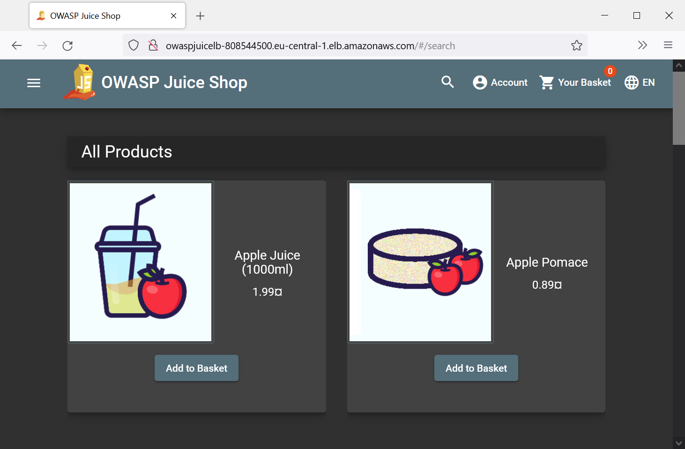
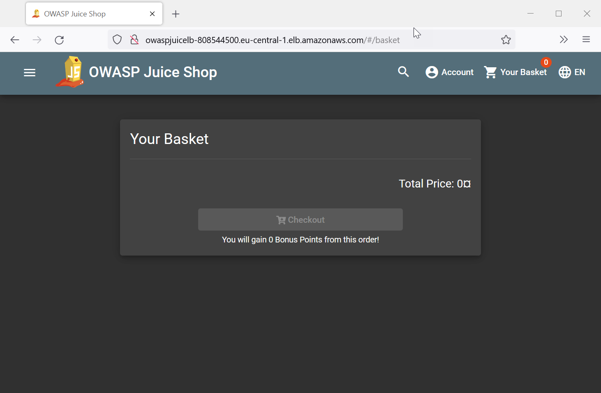
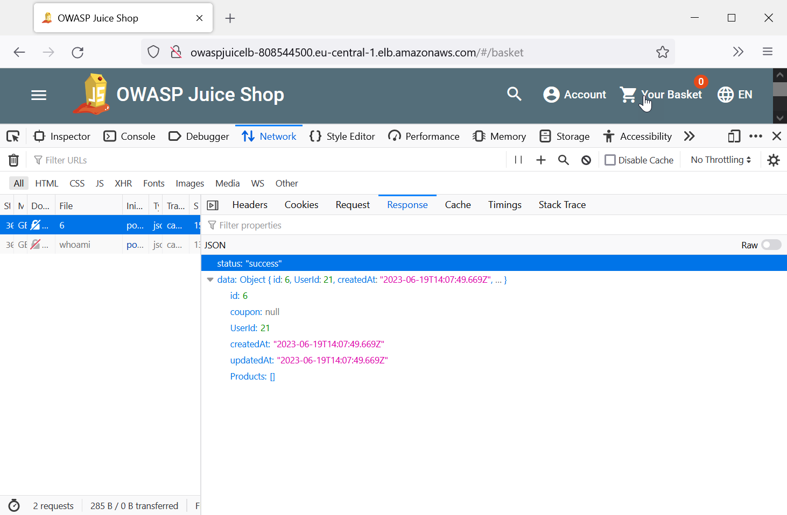
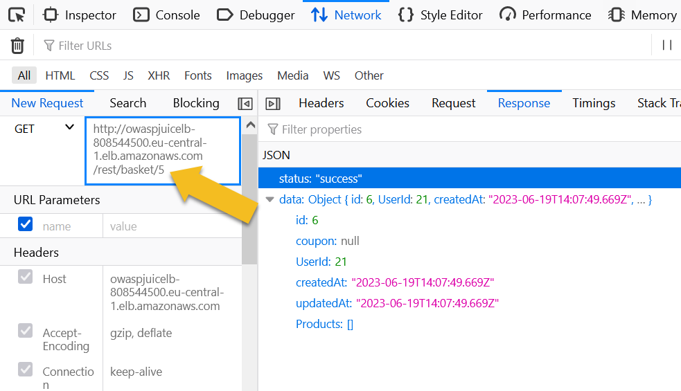
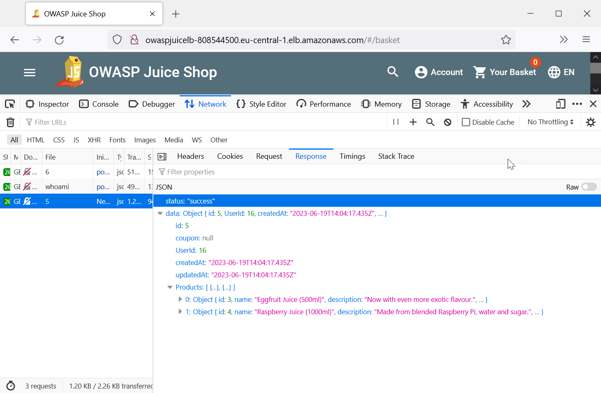

|ToC|
|---|

This is a 4-part series:

| SeriesToC |
|-----------|

In this article, we will talk about **Insecure Direct Object Reference (IDOR)** attacks. IDOR attacks involve unauthorized access to sensitive data or resources by manipulating object references within an application. From exposing confidential information to tampering with critical system components, IDOR attacks pose a significant threat. You'll learn what IDORs are, how they can be exploited, and how you can apply practical techniques to protect your applications against these types of attacks.

> The [OWASP Top Ten](https://owasp.org/www-project-top-ten/) refer to a list of the most critical security risks in web applications, maintained by the [Open Worldwide Application Security Project (OWASP)](https://owasp.org/).

## Notable Common Weakness Enumerations (CWEs)

- [CWE-200 Exposure of Sensitive Information to an Unauthorized Actor](https://cwe.mitre.org/data/definitions/200.html)
- [CWE-284 Improper Access Control](https://cwe.mitre.org/data/definitions/284.html)
- [CWE-285: Improper Authorization](https://cwe.mitre.org/data/definitions/285.html)

> The [Common Weakness Enumerations (CWEs)](https://cwe.mitre.org/data/index.html) are a comprehensive list of software security weaknesses and vulnerabilities, providing a standardized framework for identifying and categorizing common security issues across different applications and systems.

## What is an Insecure Direct Object Reference (IDOR)?

An IDOR occurs when an application unintentionally exposes a reference to an internal implementation object, such as a record identifier in a database or a filename in a filesystem, revealing the actual identifier and format used in the backend storage.

While IDOR itself may not directly constitute a security issue, it can enable attackers to mount enumeration attacks, taking advantage of the exposed format or pattern. This allows them to build a collection of valid identifiers based on the discovered format or pattern and test them against the application, trying to access associated objects.

In essence, IDOR vulnerabilities highlight the importance of properly securing object references and implementing robust access controls to prevent unauthorized access and potential enumeration attacks.

## Impact

The impact of an IDOR attack can be:

- Unauthorized information disclosure
- Modification or destruction of data
- Performing a function outside the limits of the user, potentially including privilege escalation like in our example above.

In the following example, we will see how an IDOR can result in unauthorized information disclosure.

## A simple example

To demonstrate the discovery and exploitation of an IDOR, we'll be using a deployment of the [OWASP Juice Shop application](https://owasp.org/www-project-juice-shop/). This is an open source web application that is intentionally insecure. You can obtain the application yourself if you wish to recreate what I'm showing here or to play around on your own with other vulnerabilities. Please make sure to only install it in a lab environment that is isolated from production resources.

> If you're interested in learning more about the OWASP Juice Shop, there is a [free book](https://pwning.owasp-juice.shop/) that explains the app and its vulnerabilities in more detail.

After deploying the application, e.g. on an Amazon EC2 instance behind a load balancer, we can create a user, browse the products, and add them to our shopping basket:



Let's click on **Your Basket** in the menu bar. As you can see, my shopping basket is empty:



For a regular user, there is nothing special about this page. But an attacker might be aware of the fact that a shopping basket is probably associated with a specific id. Let's do some reconnaissance and see if we can find an id. Looking at the network traffic in the web browser's developer tools, we find an interesting API request:

```text
GET /rest/basket/6 HTTP/1.1
Host: ...
User-Agent: ...
Accept: application/json, text/plain, */*
Accept-Language: en-US,en;q=0.5
Accept-Encoding: gzip, deflate
Authorization: Bearer ...
Cookie: token=...
```

This looks like it could contain the id of my basket (`6`), which we will investigate by looking at the response. The API returned a JSON object representing my empty shopping cart. It contains `id: 6`, which corresponds to the id that has been sent to the API. It also contains a user id, some meta data, and an empty list of products:



The Firefox Developer Tools allow us to modify and replay the request. Let's try this, by changing the id to `5`:



As you can see, the modified request returns a different basket. This time with another user id, which is different to our own, and two items in the product list:



This means that we just used the basket API to access another customers' data, including what products they are interested in.

In this case, the basket id is an **Insecure Direct Object Reference (IDOR)** because it references the individual basket stored in the database, allowing a malicious actor to retrieve any basket by guessing their respective ids.

> Note that we were also able to obtain the basket owner's user id. For an attacker this could be another valuable piece of information that will try to leverage for additional attacks.

## Prevention

A seemingly easy fix to this vulnerability is to use more complex, random, and hard to guess basket ids, like UUIDs (Universally Unique Identifiers, e.g. `88c2652a-8080-4c9e-b1b0-42122b35e9a1`).

However, this approach would mean that the security of our application depends on secrecy or hidden aspects of the system. This approach is commonly known as **Security by Obscurity** and is considered weak and unreliable. Determined attackers can often discover obscured ids through further analysis or reverse engineering.

An IDOR vulnerability is a type of **Broken Access Control**, which is one of the most common web application security risks. To mitigate IDOR vulnerabilities, it is essential to implement robust security measures, such as proper authentication and authorization checks, instead of relying on hidden or undisclosed components of a system.

> **[A01:2021B – Broken Access Control (OWASP)](https://owasp.org/Top10/A01_2021-Broken_Access_Control):** "Access control enforces policy such that users cannot act outside of their intended permissions. Failures typically lead to unauthorized information disclosure, modification, or destruction of data, or performing a business function outside the user's limits."

## How to fix the example

Let's have look at the source code of the OWASP Juice Shop, which can be found at [github.com/juice-shop](https:github.com/juice-shop).

Here's an excerpt from the source file _(basket.ts)_:

```javascript
module.exports = function retrieveBasket () {
  return (req: Request, res: Response, next: NextFunction) => {
    const id = req.params.id

    BasketModel.findOne({ where: { id }, ... })
      .then((basket: BasketModel | null) => {
        res.json(utils.queryResultToJson(basket))
      }
    )
  }
}
```

This function reads the basket's id from the request parameters, tries to retrieve the associated basket from the underlying repository, and--if it exists--adds it to the response.

The vulnerability occurs, because the function doesn't check if the basket actually belongs to the user.

To fix this, let's retrieve the user's id from the request and compare it with the user id in the basket. If they match, the basket can be returned. If they don't match, the application will send an error code to the client, including the information that the access has been denied.

Here's the modified function:

```javascript
module.exports = function retrieveBasket () {
  return (req: Request, res: Response, next: NextFunction) => {
    const id = req.params.id
    BasketModel.findOne({ where: { id }, ... })
      .then((basket: BasketModel | null) => {
        
        // Check if the basket is owned by the user
        const user = security.authenticatedUsers.from(req)
        if (basket?.UserId != user.id) {
          res.status(403).json({ error: 'Access denied' })
        } else {
          res.json(utils.queryResultToJson(basket))
        }
      }
    )
  }
}
```

## Conclusion

Insecure Direct Object Reference (IDOR) attacks can lead to serious unintended consequences, including unauthorized access, data modification, and privilege escalation. Relying on hidden aspects of the system--also known as security by obscurity--is unreliable.

To prevent IDOR attacks, it is crucial to implement robust access control, validate user access rights, and perform proper authorization checks
