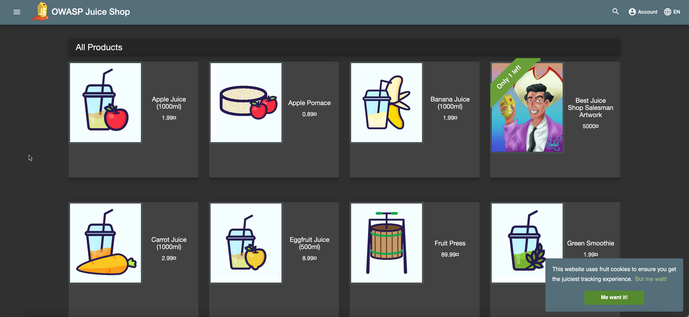
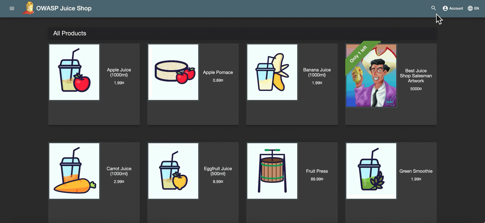
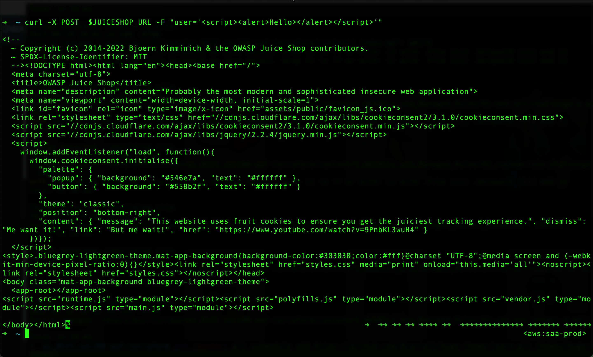
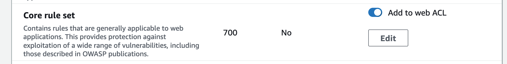
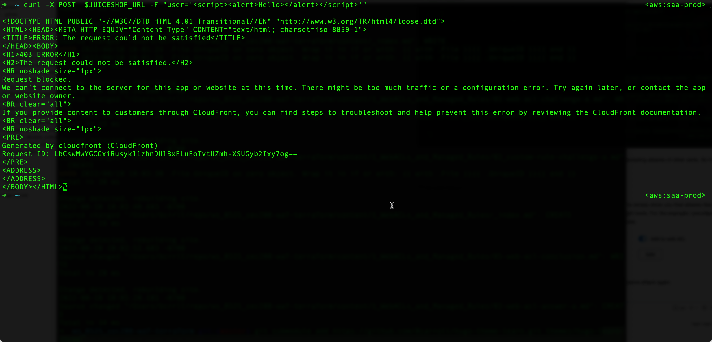

This is a 10-part series:
1. [What is Broken Access Control?](01-what-is-broken-access-control)
2. [What is a Cryptographic Failure?](02-what-is-a-cryptographic-failure)
3. What is an Injection Attack? (this post)

In this post we are talking about injection attacks. As the name would elude, this is typically a scenario where data is injected into a query or a call, is not validated, filtered or sanitized by the application, thus resulting in unintended action from the application.  This could be in the form of returning data in a query that should not be returned, causing the appliation to crash, or even inserting fradulent data into a database or data stream.  You get the idea, right?  Overall it's a difficult type of attack to explain because there are many ways it can happen and different results that can be seen.  There are however, a few noteable Common Weakness Enumerations that I'll share in this post and I'll provide you with a simple example of one.

## Notable Common Weakness Enumerations (CWEs)

- [CWE-79: Cross-site Scripting](https://cwe.mitre.org/data/definitions/79.html)
- [CWE-89: SQL Injection](https://cwe.mitre.org/data/definitions/89.html)
- [CWE-73: External Control of File Name or Path](https://cwe.mitre.org/data/definitions/73.html.)

## Simple Example

For this example, we're going to look at an example of a Cross Site Scripting (XSS) attack.  To do this, I'll be using a deployment of the [OWASP Juice Shop application](https://owasp.org/www-project-juice-shop/).  This is an open source web application that is intentionally insecure.  You can obtain this application yourself if you wish to recreate what I'm showing here or to play around on your own with other vulnerabilities.  Of course, I only recommend installing it in a lab environment that is isolated from production resources.  

> If you're interested in learning more about the OWASP Juice Shop, there is a [free book](https://pwning.owasp-juice.shop/) that explains the app and its vulnerabilities in more detail.

That being said, my server is up and running, as you can see below.  Let's look at an attack.



First, we'll run the attack from the search box on the GUI.



As you can see, we get a nice alert pop-up with the text we entered.  This is not supposed to happen.  We shouldn't be able to interact with the page using the search box in this way.  What you are seeing here is a DOM XSS attack.

Next, lets formulate the attack from the command line using the `curl` command.  When I run the command I'll run it against the URL of the Juice Shop applicaiton and I have created an environment variable using the command `export JUICESHOP_URL=<Your Juice Shop URL>`. 

Let's run a similar command to initiate an XSS attack.

```
curl -X POST  $JUICESHOP_URL -F "user='<script><alert>Hello></alert></script>'"

```

And the result is that the page was served as seen below.  Nothing blocked.  Attack successful.



Remember, this is just one simple example, however there are several CVE's that involve scripting attacks of other sorts.  So how can we prevent attacks like this?  Let's look at one solution.

## Prevention

As far as prevention goes, I'm not going to give you the definitive guide.  The intent here is to simply show you that attacks like this exist, they are on the OWASP Top 10, and can be mitigated in many cases by using the right tools.  For the example I provided here, I'm going to use a AWS WAF and deploy the simple managed rules.



With those core rules in place, we should have some protection against XSS.  Let's try the same attack again.



In the above output, you can see the "Request blocked" notification was returned.  We now have protection for our server against XSS attacks.  

## Conclusion

I've said it throughout this series, but I'll say it again: this is not meant to be an exhasutive list of attacks or prevention mechanisms.  Instead, the hope is that it spurs a bit of thinking on anyone reading this.  Trying to keep up with every vulnerability, every CVE, every potential issue is quite a chore, however much can be accomplished by just having a sense for the common attacks and employing the tools avaiable to establish a base level of protection.  From there you can always get into the weeds with specific attacks that your organization is succeptible to.  That's the fun part!  
