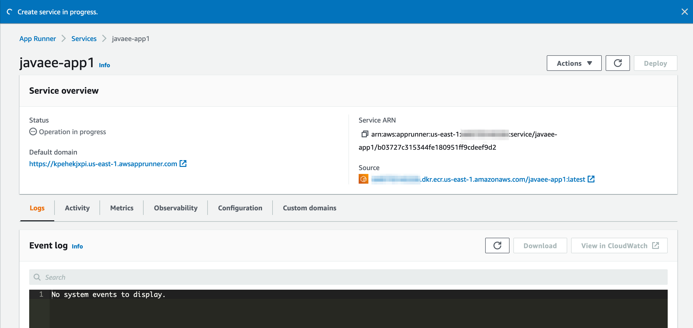

Quick guide on how to create a container image with your old Java EE Application Server.

Java EE still in production and will be there for much more time, 
and I know many companies that run Java EE applications using 
Apache Tomcat and Jboss and when they consider migrating to AWS 
most of them consider Amazon EC2 as first choice and more similar 
to running in your own infrastructure, kind of classical lift and shift approach! 
But with the containers' generation we have much more options to pack the old 
Java EE application and deploy as gold containerized app and that's what we are going
to show step-by-step how to do it.

For this tutorial I choose JBoss 4.2.3 as example, but you can replace it by your 
choice of Java EE application server very easily and in the end of this tutorial
you will have a simple Java EE application built with Docker and running with a public URL.

That's the basic steps we need to do it:

1. Download a copy of Jboss 4.2.3
2. Install Docker
3. Create a simple Java EE application (or use your existing one!)
4. Create a Docker File
5. Build and tag the docker image
6. Create an Amazon Elastic Container Registry private repository
7. Tag and push image to ECR
8. Create an AWS App Runner service using ECR image URI
9. Done!

Let's build it!

## 1. Download JBoss

I used the version 4.2.3, but you can use any other with small changes or even
another application server.

[Here is the link to download Jboss 4.2.3](https://sourceforge.net/projects/jboss/files/JBoss/JBoss-4.2.3.GA/jboss-4.2.3.GA-jdk6.zip/download
)

Create a project directory and unzip Jboss there.

    mkdir javaee-docker
    cd javaee-docker
    unzip <downloaded_jboss.zip>

## 2. Create a simple Java EE Application

Let's create a very simple Java EE application that can be replaced by your real app.
In your project directory we need to create this:

    myapp
      --WEB-INF
      ----web.xml
      index.html

Create the directories:

    mkdir myapp
    cd myapp
    mkdir WEB-INF

Create index.html in myapp directory with this simple content:

    <html>
      <body>
        
Hello!

      </body>
    </html>

Create the classical web.xml in myapp/WEB-INF:

    <?xml version="1.0"?>
    <!DOCTYPE web-app PUBLIC
       "-//Sun Microsystems, Inc.//DTD Web Application 2.3//EN"
       "http://java.sun.com/dtd/web-app_2_3.dtd">
    
    <web-app>
       <description>Simple Java App!</description>
    </web-app>

Your Java App is done!

## 3. Install Docker

Follow the [docker website](https://docs.docker.com/get-docker/) instructions 
to download and install it.

## 4. Create a Docker File

Now we have the jboss app server and also our simple Java EE app ready and we
need to create a Docker File to describe the commands that will build the image. 
Create a file named javaee.DockerFile in your project directory with the following code:

    FROM amazoncorretto:8
    
    EXPOSE 8080
    COPY "jboss-4.2.3.GA" "/opt/jboss"
    COPY "myapp" "/opt/jboss/server/default/deploy/myapp.war"
    
    RUN find /opt/jboss | grep myapp
    
    ENTRYPOINT ["/opt/jboss/bin/run.sh", "-b", "0.0.0.0"]

Now let's explain this file step-by-step:
Our image will be based on a public Amazon Corretto 8 image that will provide us 
the right SDK to run JBoss:

    FROM amazoncorretto:8

This line doesn't have any practical impact, but it can inform container's services
that we need to expose the port number 8080, and they can configure it automatically:

    EXPOSE 8080

Now we are going to copy our JBoss application server inside the container's
directory /opt/jboss

    COPY "jboss-4.2.3.GA" "/opt/jboss"

And we are going to copy our Java EE simple app to the deployment directory:

    COPY "myapp" "/opt/jboss/server/default/deploy/myapp.war"

This is just to help us to debug and be sure that our app was included in our image:

    RUN find /opt/jboss | grep myapp
    
This is our container execution entry point where we are starting jboss and binding 
the port to 0.0.0.0:

    ENTRYPOINT ["/opt/jboss/bin/run.sh", "-b", "0.0.0.0"]

Now we are ready to build the image!

## 5. Build the docker image

To build the image we are going to run a docker command line command with the
target platform, docker file and also tagging this image as jboss:latest

    docker build --platform=linux/amd64  --no-cache --progress=plain -f javaee.DockerFile . -t javaee-app1:latest

## 6. Create an Amazon Elastic Container Registry private repository

Open your AWS Console go to Amazon Elastic Container Registry and click "Create Repository"

Type javaee-app1 as the name of this repository and use default config for other parameters:

Now you can see it listed, click the repository link:

Now let's click on "View push commands"

And now you can copy it into a notes document to use later:

It's all good with ECR, now we can push our image in this private repository!

## 7. Tag and push image to ECR

Retrieve a token to authentic your Docker client to our registry, 
which is the first command that you copied from the console:

    aws ecr get-login-password --region us-east-1 | docker login --username AWS --password-stdin 649770145326.dkr.ecr.us-east-1.amazonaws.com

We already build our image previously just now we need to tag it:

    docker tag javaee-app1:latest 649770145326.dkr.ecr.us-east-1.amazonaws.com/javaee-app1:latest

It's time to push it to Amazon ECR:

    docker push 649770145326.dkr.ecr.us-east-1.amazonaws.com/javaee-app1:latest

The image should be listed in your ECR AWS Console:

Click in the image link to access some required information:

Now you have URI for your image, copy this information to use next with AWS App Runner.

## 8. Create an AWS App Runner service using ECR image URI

Log into AWS App Runner console and click "Create new service" 
and paste the Container image URI:

Choose Automatic deployment and ask it to create as new service role:

Give a name to your service and use default parameters or customize it for your workload:

Click "Crete & deploy" and in some minutes your app will be ready!

Now we can click the link and access our JBoss Application Server:

You can change your Java EE App and run docker build, tag and push commands to update 
your App Runner automatically.

Hope you enjoy this tutorial and please feel free to provide us any feedback!