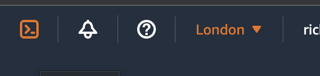
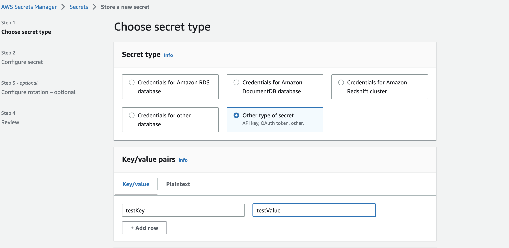
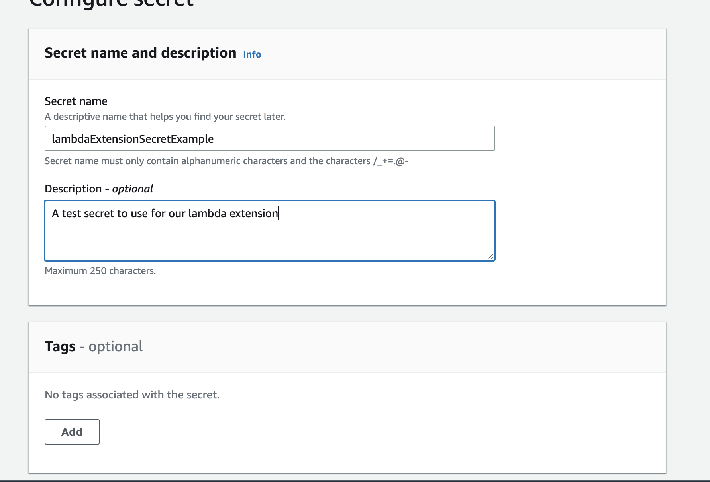
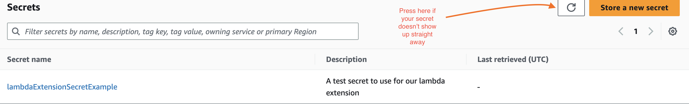
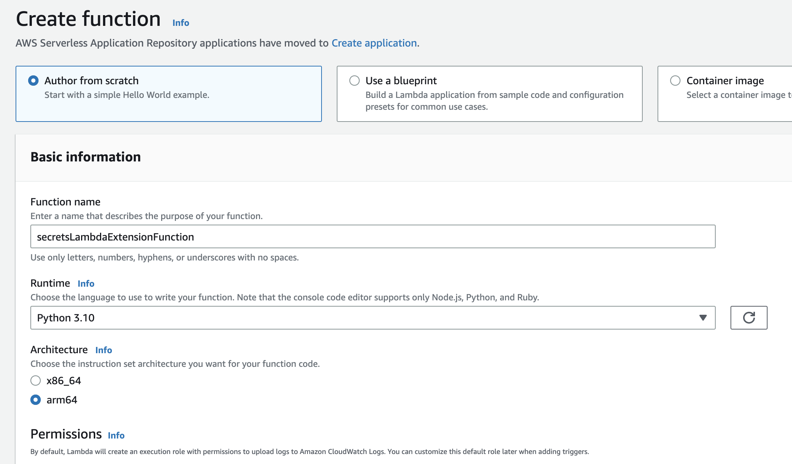
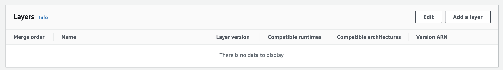
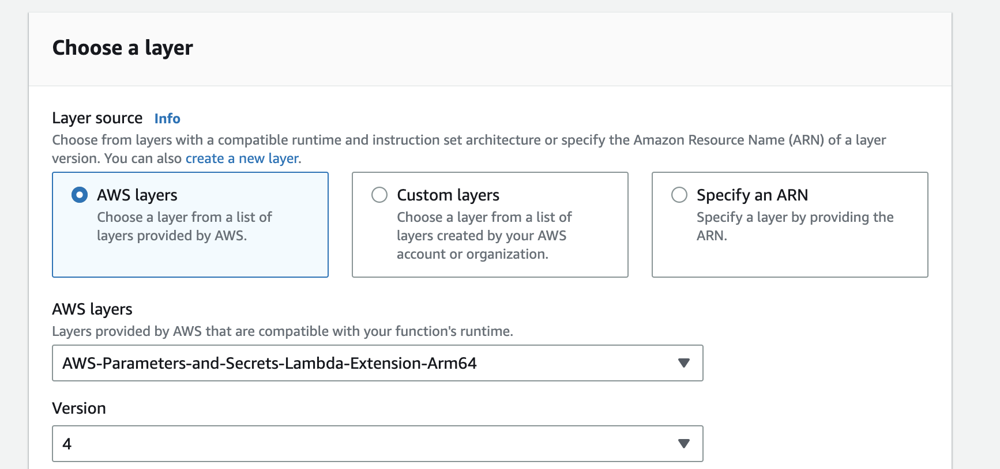
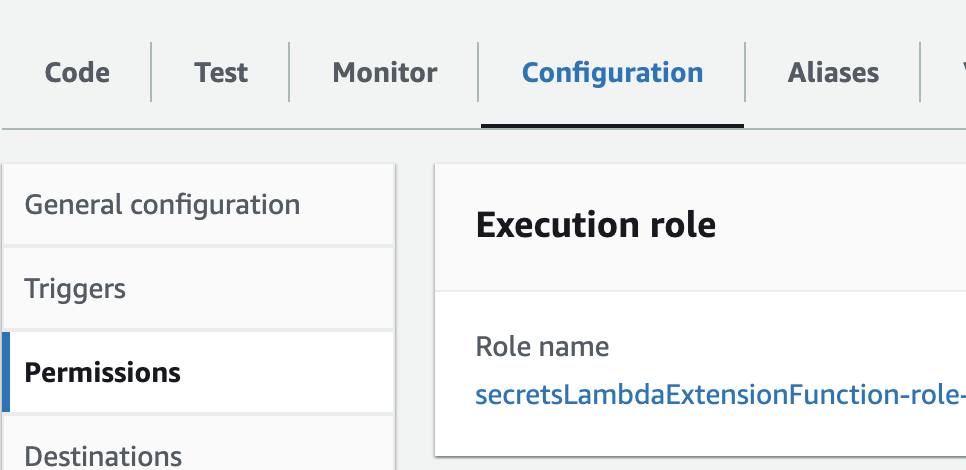
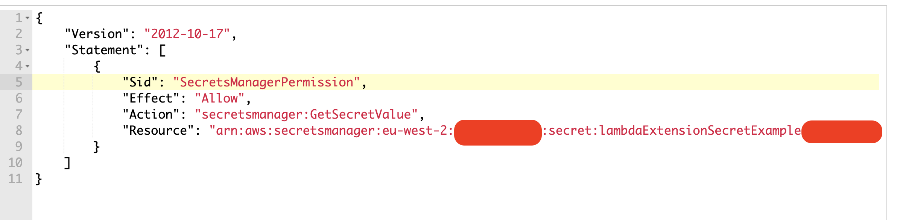
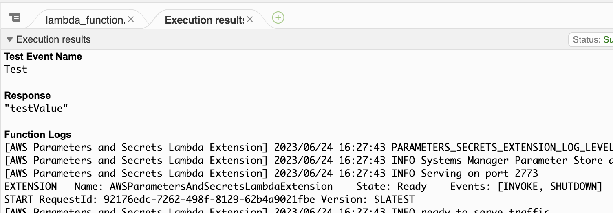

## 

Storing your secrets and parameters in Secrets Manager and Parameter Store respectively is the best way to keep them secure, highly available and accessible to all your AWS Services. Quick and simple, it saves the trouble of having to have info stored on your local machine, or worse still add the secrets to your git repo, a huge no-no and likely to get you excoriated by all those who discover them. Traditionally in a lambda you could access the data through an SDK call; fine, but it could involve making the call every time your lambda runs, which can add unnecessary cost. Cache the variable inside the lambda? OK, but now you're using a lambda with insecure, or perhaps stale secrets. Far from ideal.

Enter the [AWS Parameters and Secrets Lambda Extension](https://docs.aws.amazon.com/secretsmanager/latest/userguide/retrieving-secrets_lambda.html).

The Lambda Extension both retrieves and caches your Secrets Manager secrets and Parameter Store parameters for you, making it simpler and cheaper, [and according to some sources](https://blog.aquia.us/blog/2023-01-01-secrets-manager-lambda-extension/), potentially faster as well.

In this short article, I'll run through a practical example step by step, firstly using the console, then a SAM template, and finally CDK to access our secrets. I'll also talk quickly about some of the pitfalls and gotchas I came across when working with the extension for the foirst time and how to overcome them.

### Before we start

You will need an AWS Account and a basic knowledge of the Console to begin with, if you'd like to use SAM or CDK versions, a working knowledge of those will be useful too. Log in to your account and make sure you are in a region that [supports the extension](https://docs.aws.amazon.com/secretsmanager/latest/userguide/retrieving-secrets_lambda.html#retrieving-secrets_lambda_ARNs)



### Storing our secret
For this excercise we'll focus on Secrets Manager. Navigating there in the console we'll store our secret as a key value pair. This can be whatever you want but for my example I'm going to store a key of ``testKey`` and a value of ``testValue``



Use the standard encryption and navigate to the next page, where we'll add the name of our secret and a description, if desired. I'm naming the secret ``lambdaExtensionSecretExample``



Keep all other settings as default and click through the pages until you reach 'Review'. You'll notice they give example code for retriveing your secret using the SDK - but we don't want to use that. Instead, click 'Store' to save your secret.

NB - If it doesn't look like your secret has been stored immediately, press the refresh button on the page (next to ``Store a new secret``) and it should appear.



### Creating our lambda

Now that we have our secret let's create a lambda to retrieve it. Navigate to the Lambda page in the console and click on ``Create Function``. Choose ``Author From Scratch`` and give the function a name - I'm going with ``secretsLambdaExtensionFunction``. Choose Python 3.10 for your runtime (I've chosen arm64 for my Architecture as it is slightly cheaper to run, if you do the same make sure you are in a region that supports the [extension with ARM](https://docs.aws.amazon.com/secretsmanager/latest/userguide/retrieving-secrets_lambda.html#retrieving-secrets_lambda_ARNs))



For the moment, we're going to create the default lambda execution role (although we'll need to change it later). So scroll down and click ``Create Function``. Once created, the function page should open and you'll be able to see the default code inside the code window.

### Adding the Lambda Extension

Scroll to the bottom of the page and the section labelled ``Layers`` and click on ``Add A layer``



Keep the ``AWS layers`` option and select ``AWS-Parameter-and-Secrets-Lambda-Extension-Arm64`` (``AWS-Parameter-and-Secrets-Lambda-Extension`` if not using ARM) from the drop-down menu, then create the latest version (there is currently only one). Click ``Add``



### Add our lambda code

Copy and paste the following into the Code window of the lambda window, replacing what is already there:

```
import os
import urllib3
import json


def lambda_handler(event, context):
    http = urllib3.PoolManager()
    
    headers = {"X-Aws-Parameters-Secrets-Token": os.environ.get('AWS_SESSION_TOKEN')}
    
    secrets_extension_http_port = "2773"
    
    secrets_extension_endpoint = "http://localhost:" + \
    secrets_extension_http_port + \
    "/secretsmanager/get?secretId=" + \
    "lambdaExtensionSecretExample"
  
    resp = http.request(
    "GET",
    secrets_extension_endpoint,
    headers=headers
    )
    print('data', resp.data)
    
    secret = json.loads(resp.data)
    
    secretValue = json.loads(secret['SecretString'])
    
    return secretValue['testKey']

```

A number of things to notice here:

- We're importing the `os`, `json` and `urllib3` modules. Lambda's Python 3.10 environment does NOT include the requests module by default. This is our first gotcha!
- We're using the os module to get ther environment variable AWS_SESSION_TOKEN to pass in as a header for the request to the Extension. This variable is there already inside the lambda runtime, so you don't need to do anything else to be able to access it.
- The default port for the extension is 2773. We can change this if needed but there's not reason to.
- The request is made via a local endpoint, which returns an object, which we then need to turn into a dict that we can get our test value from.
- We've added a print statement so you can see how the data looks, but obviously this wouldn't be recommended normally. Keep those secrets secret!

Then click ``Deploy`` and wait for notification that your new code is ready to use!. Click ``Test``, ``Configure Test Event`` and create a name for your test, using the 'Hello world' setup. Save and run the test.

### What went wrong?

Our function errored! This is not what you signed up for! Let's inspect our error for clues.

It's saying there is a json decode error but that's not the underlying reason - if you look carefully at there was an ``AccessDeniedException`` from the Extension. We need to look at the permissions for the execution role.

Click on the ``Configuration`` Tab and then the ``Permissions`` Section. Click on the name of the role ``secretsLambdaExtensionFunction-role...`` or similar. This will open up the role's iam page.



We could attach a policy to give us full read and write access to Secrets Manager, but that defies the rule of 'least privilege', so instead we'll add only the permission to read the secret that we want. If we were fetching from Parameter Store, we would need to add similar permissions to access from there.

Click on ``Add Permissions`` and then ``Create inline policy``. Choose the ``JSON`` tab and then paste in the following:

```
{
    "Version": "2012-10-17",
    "Statement": [
        {
            "Sid": "SecretsManagerPermission",
            "Effect": "Allow",
            "Action": "secretsmanager:GetSecretValue",
            "Resource": "YOUR_SECRET_ARN_HERE"
        }
    ]
}
```

You'll need to retrieve the ARN of your Secret, from the Secrets Manager page click on the name and copy the 'Secret Arn' and then paste it in.



Navigate back to the function and hit the test button again. Success!



If you click the test button several times you'll see the return is almost instantaneous due to the cache.

### Moving to SAM

So now we have a working lambda which fetches and caches our secret. But there's a lot of clicking buttons and navigating around the console, and we don't want to have to do that everytime we want to perform this operation in the future, do we?

Let's look at incorporating it into a SAM template

```
AWSTemplateFormatVersion: '2010-09-09'
Transform: AWS::Serverless-2016-10-31
Description: >
  testLambdaExtSam

Globals:
  Function:
    Timeout: 3
    MemorySize: 128

Resources:
  LambdaRole:
    Type: AWS::IAM::Role
    Properties:
      AssumeRolePolicyDocument:
        Version: '2012-10-17'
        Statement:
          - Effect: Allow
            Principal:
              Service: lambda.amazonaws.com
            Action: sts:AssumeRole
      Policies:
        - PolicyName: SecretsManagerPolicy
          PolicyDocument:
            Version: '2012-10-17'
            Statement:
              - Effect: Allow
                Action: 'secretsmanager:GetSecretValue'
                Resource: !Sub 'arn:aws:secretsmanager:${AWS::Region}:${AWS::AccountId}:secret:*'

  TestExtensionLambdaFunction:
    Type: AWS::Serverless::Function
    Properties:
      FunctionName: secretsLambdaExtensionFunctionSam
      Role: !GetAtt LambdaRole.Arn
      CodeUri: lambdaExtensionTest/
      Handler: app.lambda_handler
      Runtime: python3.10
      Architectures:
        - arm64
      Layers:
        - arn:aws:lambda:eu-west-2:133256977650:layer:AWS-Parameters-and-Secrets-Lambda-Extension-Arm64:4
```

As you can see, we add the extension in the same way that we would add any lambda layer. Now for another gotcha - the arn of the Extension! It will vary dependent on your region, so look it up [here](https://docs.aws.amazon.com/secretsmanager/latest/userguide/retrieving-secrets_lambda.html#retrieving-secrets_lambda_ARNs).
We're also being slightly less specific with our permissions resource here - this would be suitable if we don't know what secrets we will be accessing yet.

### And on to CDK

For CDK enthusiasts like myself, it's even easier:

```
import * as cdk from 'aws-cdk-lib';
import { Construct } from 'constructs';
import * as sm from 'aws-cdk-lib/aws-secretsmanager';
import * as lambda from 'aws-cdk-lib/aws-lambda';

export class CdkExtensionTestStack extends cdk.Stack {
  constructor(scope: Construct, id: string, props?: cdk.StackProps) {
    super(scope, id, props);
    const secretCompleteArn = 'YOUR_SECRET_ARN_HERE';

    const secret = sm.Secret.fromSecretAttributes(this, 'SecretFromAttributes', {
      secretCompleteArn,
    });
    
    const paramsAndSecrets = lambda.ParamsAndSecretsLayerVersion.fromVersion(lambda.ParamsAndSecretsVersions.V1_0_103, {
      cacheSize: 500,
      logLevel: lambda.ParamsAndSecretsLogLevel.INFO,
    })
    
    const lambdaFunction = new lambda.Function(this, 'TestExtensionsFunction', {
      runtime: lambda.Runtime.PYTHON_3_10,
      handler: 'index.lambda_handler',
      architecture: lambda.Architecture.ARM_64,
      code: lambda.Code.fromInline(`
import os
import urllib3
import json


def lambda_handler(event, context):
    http = urllib3.PoolManager()
    
    headers = {"X-Aws-Parameters-Secrets-Token": os.environ.get('AWS_SESSION_TOKEN')}
    
    secrets_extension_http_port = "2773"
    
    secrets_extension_endpoint = "http://localhost:" + \
    secrets_extension_http_port + \
    "/secretsmanager/get?secretId=" + \
    "lambdaExtensionSecretExample"
  
    resp = http.request(
    "GET",
    secrets_extension_endpoint,
    headers=headers
    )
    print('data', resp.data)
    
    secret = json.loads(resp.data)
    
    secretValue = json.loads(secret['SecretString'])
    
    return secretValue['testKey']
      `),
      paramsAndSecrets,
    });
    
    secret.grantRead(lambdaFunction);
  }
}
```
Even though I write my CDK in Typescript, you can see I've inlined the python code inside of the file, meaning all of our infrastructure allocation and the lambda code is contained inside one small file! We're also using the version of the extension rather than it's arn, although you can do that too. We're importing the secret arn, so you'll need to grab that from the Secrets Manager console page.x And because we're granting access to the function to retrieve the secret the permissions are all handled for us, so we don't need to muck about with iam at all.

So now we have 3 different ways to start using the AWS Parameters and Secrets Lambda Extension! Let me know if you have any questions, problems or issues, and happy building!
