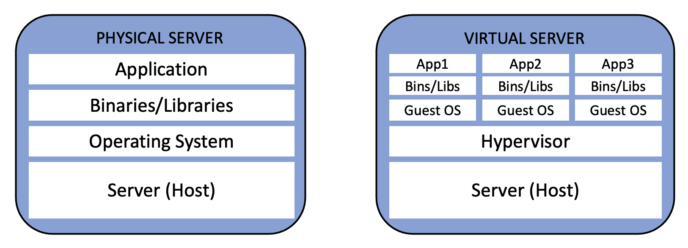
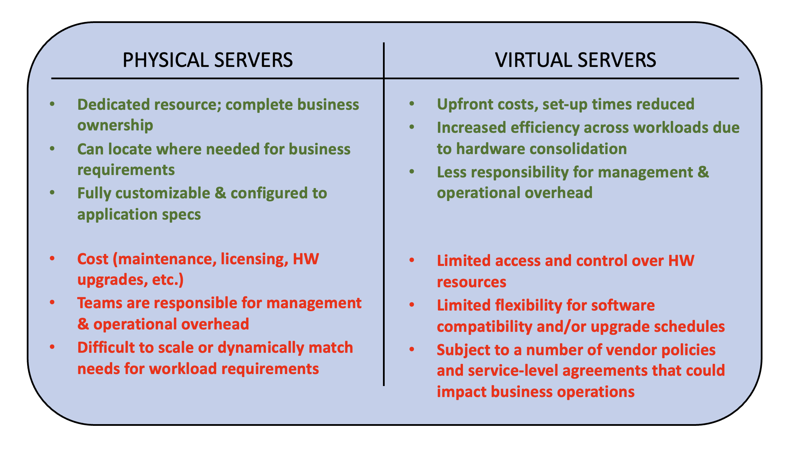

***Spoiler Alert!***... Technically, there is no *real* difference between physical and virtual servers. All computer systems, regardless of category require hardware components to deliver power, memory, storage and other processing capabilities to run applications. What is different is the way in which the hardware is configured that classifies a system as a physical or virtual server. 

Now that this revelation has been made, I hope you are not deterred from reading the rest of this article. Stick around, and I assure you that there’s more to learn about the differences between server types, and most importantly which option is best for your compute needs. Before moving on, be mindful that throughout this article the terms *server*, *system* and *machine* are used interchangeably and carry the same meaning.

## Physical Servers

What is a **physical server**? A physical server is a system that is equipped with a motherboard, CPU, memory, hard drive, monitor and other devices for performing various tasks. In today’s world of modern systems where cloud computing is widespread, physical servers are commonly referred to as *bare-metal*. This is because the hardware runs an operating system like Linux, or Windows and generally has a single "tenant" or organization using the entire machine for a specific function or business operation. Another way to think about a physical server is if a software bug, slow network, or application crash frustrates you so much that you want to kick the machine, you are running a physical server.

## Virtual Servers

By comparison, a **virtual server** is a software implementation running on a physical system. Virtual servers (*machine instances*, *virtual machines*, or *VMs* as they are commonly called) use similar hardware, however the processor, RAM, and I/O controllers are abstracted away from the running mode. This abstraction allows the hardware components to be shared by multiple VMs thereby turning one physical computer into *many* virtual computers. Using the angry analogy from earlier, if a single VM experiences a problem, it is likely you may not even have access to the physical machine, but if you do and can kick it, you risk damaging the other VMs not related to the issue!

Not completely satisfied with the description of the system types, or are you questioning if there's a difference knowing that the hardware is basically the same? Let’s discuss the [*hypervisor*](https://en.wikipedia.org/wiki/Hypervisor) next. I mentioned previously that for VMs the hardware is abstracted from the running mode. This is because of the role the hypervisor plays in virtualization. The hypervisor is software or firmware that supplants the operating system creating a layer of isolation that partitions hardware components into controllable units. This is not the case for a bare metal system because hypervisors are not required for direct communication between the OS and the hardware. It is common for multiple VMs to run on the same hardware sharing resources, yet they all can run operating systems or application stacks independently. That is, Linux applications can run on one VM, and a Windows environment on a separate VM. The concept of abstraction is being further extended to support the implementation of services like [Docker](https://docker.com) and [AWS Lambda](https://docs.aws.amazon.com/lambda/latest/dg/getting-started.html) or function-based computing. The following diagram is a basic illustration of the layers inside of a bare metal (or physical) server and a server configured to run virtual machines:

## The birth of virtualization

There was a time when VMs did not exist, and running bare metals was the sole compute option. An argument can be made that mainframes and the concept of time-sharing which spreads compute between users and applications was an early form of virtualization. For this article, we will discuss virtualization in the context of modern systems.

Walking into a loud, cold data center you’re liable to find racks of x86 or ARM-based servers running constantly and dedicated to a single application. Historically, SysAdmins and Operations staff were completely fine with the management and upkeep for so many systems. If a problem occurred, the attention of troubleshooting would be focused on that particular machine while the other systems continued to function. Granted, you did not want to be the customer impacted by the outage because that meant you had to wait hours or in some cases days for the system to be restored.

This approach to managing systems in the data center was an acceptable trade-off for the IT team, but not so much for the Finance department. Running isolated, *do-one-thing* systems is an expensive way to operate a business. Along with the high cost of equipment, licensing, power and data center floor space, utilization for these systems was found to be less than optimal. It was not uncommon for a system configured with 32 GB of RAM to only consume half the memory, or contain hard drives with terabytes of storage capacity that sat unused. Operating costs and utilization could be justified during peak business hours when business users frequently ran reports, and performed other system tasks, but what about the drop-off in activity during evenings and weekends? It was clear that a lot of money was wasted during off-peak hours and that meant these high cost, low-utilization problems needed a solution. The answer would lie in the birth of virtualization. 

When virtualization arrived on the scene, the benefits were immediate. The ability to consolidate resources and reduce the number of servers across the enterprise meant that 20 physical machines taking up expensive real estate in a data center could be replaced with 2 machines configured with hypervisors to run 20 VMs. Other benefits like reduced time to manage applications, and more efficient resource consumption was welcome news to the Finance team. Migrating legacy workloads, performing application failovers, and backing up system data for disaster recovery (DR) proved to be much simpler to implement. As software vendors began introducing more advanced features into virtualization like live-migration of workloads, this gave SysAdmins and Operations staff the ability to replace failed hardware, upgrade software on existing machines, and distribute workloads evenly across systems with minimal disruption. This flexibility would go a long way in eliminating bottlenecks and reducing outage times for users who used to be severely impacted for hours or days.

Back to costs for a moment... I must point out that investment costs to move from physical servers to virtualization cannot be overlooked. Acquiring new hardware, licensing, adding hypervisors, and costs for training staff adds up. In the long run, these expenses yield a significant return-on-investment through smaller, less expensive hardware footprints, reduced energy costs for power & cooling, and additional savings that come with running a lean, efficient IT operation. As for operating income, there’s the increased financial benefit realized for a lot of companies. An example would be an online retailer whose customers can purchase items 24x7 with fewer web site outages because using virtual servers to run digital storefronts can be done with systems and applications that are flexible, more reliable and easier to maintain.

## Cloud Computing & Virtualization

Virtualization is also the defacto choice for offering services in public cloud environments. For over a decade, there has been a huge surge in the way businesses consume system resources due to abstraction. Some of the largest selling points for public cloud providers is the ability for customers to utilize services on demand, and deploy workloads globally in minutes. There’s even the added value of scaling resources up or down using the right amount of capacity to meet business demands, or design solutions that are fault tolerant, highly available, and can recover from failures instantaneously. These benefits are possible because public cloud environments use virtualization for servers running in data centers around the world. As more abstraction is added, cloud providers provide more value to customers by off-loading non-strategic tasks like upgrading hardware and software. Being able to support millions of customers means having the flexibility to offer services that match use cases and application patterns at reduced costs. As a result, companies are increasingly adopting an "all cloud" or "cloud first" approach when developing new applications.

Some organizations that choose to take a balanced approach using hybrid environments or a mix of on-premises and cloud services, leverage existing data centers while extending operations to public cloud where needed. As demand for systems and applications continue to grow, companies can add more resource capacity, or reduce it when no longer required to help manage costs. Using the online retail example again, if a clothing company anticipates an increase in online shoppers during peak holiday season, instead of buying more hardware for the data center they can 'rent' cloud resources to handle the increase in traffic. Even if traffic spikes unexpectedly during the year, the same approach can be applied in rapid fashion using automation to scale. Earlier, I mentioned that services like containers and function-based computing is creating additional compute services available from cloud providers. This video provides a great explanation of the difference of offerings like VMs, containers and serverless:

https://youtu.be/SFHVGCrOF6Y

## *If virtual servers are so great, why do I even need "bare metal" machines?*

Despite the tremendous benefits of virtualization, there are use cases that justify the need for bare metal. The most common being  workloads that simply cannot be virtualized. This includes legacy business applications originally designed to run on commercial UNIX, AS/400 or mainframe platforms (yes, these still exist today and in lots of cases operate just fine!). Other examples are applications requiring specialized hardware available on servers to maximize performance. A post-production operation at a major film studio putting the final touches on scenes for a science-fiction movie is an example of a workload that requires specialized graphics for frame processing and visual effects rendering to deliver the highest of audio and video quality. It would be difficult for a studio to pass on full use of a system with 64 CPU cores, 4 NVIDIA GPUs, 32 TBs of RAM, and 200+ TBs of storage that allows them to get the project completed on time. Similar resources in public cloud are not always available or difficult to customize, and in some cases not compatible with commercial media software products. As virtualization and the ability to offer custom, high-end performance in the cloud improves, expect to see advancements in software being made by vendors working with cloud providers to bring more features to VMs on-demand.  

For your next website or business application project, I hope the information above proves useful in helping to determine the best approach for your system needs. If considering services from a hosting company or public cloud provider, look for services that provide a variety of compute options along with the provider's proven track record of reliability, cost, performance and scale. When operated properly, managed services environments are a great option for meeting the needs of most business use cases.

If taking the 'do-it-yourself' approach with dedicated servers, be prepared to do some extensive shopping as there are so many options available. Take the time to research the hardware profile and compute characteristics needed to meet your business and performance objectives. I would also highly recommend evaluating the self-managed vs hosted options and compare the cost, security, performance, and management overhead requirements for each before making any final decision.

**Happy Computing!!!**
