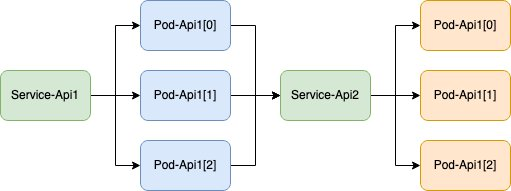
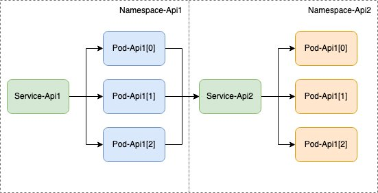

This is an 8-part series about Picturesocial:

| SeriesToC |
|-----------|

## Introduction

In the last post, [Picturesocial - How to containerize an app in less than 15 minutes](/posts/picturesocial/01-how-to-containerize-app-less-than-15-min/), we discussed containers and the steps needed to containerize an application. Creating a container without thinking where to deploy it is like having your home inside a cargo container floating in the middle of the ocean. As wonderful and terrifying as that sounds, you will definitely need power, water, gas, garbage collection, food, and may be some human interaction if you want to lead a healthy and productive life. In this post, we are going to learn about Kubernetes, one of the most important pieces in the Picturesocial architecture.

Picturesocial will have several APIs and we want to have independence in how the services are maintained, deployed, and developed. We decided to use a containerized architecture. This is not as complex as it sounds, it just means that you are using containers and a container orchestrator. A container orchestrator is the component in charge of handling all the containers, replicas, networking, storage, and infrastructure needed. When we talk about container orchestrators, the most popular one today is Kubernetes, thanks to its active community, support, and ecosystem.

Kubernetes, or k8s for friends, is an open-source container orchestrator with a fast growing and wide ecosystem. Kubernetes helps you manage the scaling and failover for your containers. It can also help you with:

* **Service Discovery and Load Balancing** You can load balance the network traffic between containers and infrastructure, as well as discover new replicas of a container or failed containers to be removed.
* **Automated rollouts and rollbacks** You can choose how you want to deploy your containers, how you want to handle updates, and how to prevent downtime from updates, infrastructure failures, or container errors.
* **Automatic bin packing** Kubernetes will use, optimize, and adapt to the compute power available based on the limits that you set.
* **Self-healing** If a container fails, Kubernetes will restart it until it works, or delete it and create a new one for you.

Deploying and maintaining your own Kubernetes cluster from scratch is not trivial and requires deep understanding of Kubernetes, Linux, virtualization, networking, security, among other technologies. That’s why AWS has the Amazon EKS. EKS is an managed Kubernetes solution that will help you reduce the complexity of your infrastructure and Kubernetes setup. It will also help ensure a more secure environment with security patches automatically applied to your cluster.

## The manifest, aka. The YAML

You can communicate natively with a Kubernetes cluster in 2 ways: Kubectl (Kube Control) or calling a REST API. Both methods use a common YAML (Yet Another Markup Language) structure to send payloads to the cluster. We call this the Manifest and it contains detailed instructions for:

* what we are deploying,
* how we are deploying it,
* what gets exposed, and
* how we are exposing it.

The following is an example YAML template that can be used for many container applications. We will cover the basic concepts of this manifest below.

```yaml
#########################
# POD Definition
#########################
apiVersion: apps/v1
kind: Deployment
metadata:
  name: deploymentName
  labels:
    app: applicationName
spec:
  replicas: 1
  selector:
    matchLabels:
      app: applicationName
  template:
    metadata:
      labels:
        app: applicationName
    spec:
      containers:
      - name: applicationName
        image: [aws account id].dkr.ecr.[aws region].amazonaws.com/imageName
        resources:
          requests:
            memory: "256Mi"
            cpu: "250m"
          limits:
            memory: "512Mi"
            cpu: "500m"
---
#########################
# Service Definition
#########################
kind: Service
apiVersion: v1
metadata:
  name: service-name
spec:
  selector:
    app: applicationName
  ports:
  - port: 80
    targetPort: 80
  type: LoadBalancer
  
```

### Label

Everything inside Kubernetes needs a label. That’s how you identify all the resources inside the cluster and also how you can tell Kubernetes what to look for using Kubectl commands or API Requests.

```yaml
template:
    metadata:
      labels:
        app: applicationName
```

### Pods

Pods are the smallest objects in Kubernetes and are the place where the containers live. A pod could have more than one container but a 1 to 1 relationship is recommended to avoid highly coupled failure points. Some important considerations for pods are:

* Pods are ephemeral. That means if the container inside fails, the most probable outcome is that Kubernetes will delete that pod and create a new one. When you deploy new versions of a container you also create new pods and Kubernetes will be in charge of updating the backend of the balancing service.
* A container image must be specified. It is defined as the repository name and the image name. For example: `[aws account id].dkr.ecr.[aws region].amazonaws.com/imageName`
* It’s a good practice to establish resource limits. We have two kinds of boundaries: 
  * **`Requests`** This is what the Pod will get as a guarantee. It’s like when you order a pizza and you have a 30-minutes guarantee. That doesn’t mean that the pizza can’t arrive sooner. It’s just an indicator of how many orders a single delivery person can handle. It’s the same for Requests. They specify your compute allocation guarantee in a cluster. If you have only one pod, chances are, you will get more compute than what has been guaranteed.
  * **`Limits`** This is the hard limit for any pod. If you specify a Limit, even if you have available resources, the pod won’t consume beyond the specified limit. Using the same example of the delivery person, it’s like telling them that under no circumstance can they deliver more than 3 pizzas at the same time.
* The units that we commonly use in Kubernetes are:
  * **`Mebibytes (MiB)`** (expressed as Mi) Used as memory measurements. To convert from MiB to MB you multiply the MiB x 1.049
  * **`Millicores (mc)`** (expressed as m) Used as CPU measurements. 1 CPU Core is represented as 1000 millicores. For example 250m is 1/4 of a CPU Core.

```yaml
containers:
      - name: applicationName
        image: [aws account id].dkr.ecr.[aws region].amazonaws.com/imageName
        resources:
          requests:
            memory: "256Mi"
            cpu: "250m"
          limits:
            memory: "512Mi"
            cpu: "500m"
```

### ReplicaSet

Pods are meant to be replicated based on different metrics like CPU or memory consumption. We can also set a static value like in the example below, where we set just 1 replica. We call the set of replicas an auto-scaling rules a ReplicaSet.

```yaml
spec:
  replicas: 1
  selector:
    matchLabels:
      app: applicationName
```

### Services

Pods shouldn’t be called directly because as we discussed earlier they are ephemeral. This means the pod name and IPs are dynamic. That’s where Services come to the rescue and offer a single point for calling one or multiple pods from the same ReplicaSet. We are going to focus on two Service types:

* **LoadBalancer** This kind of Service is used when you need to expose a ReplicaSet _outside_ of the Kubernetes cluster. That could be your private network or publicly to the internet. In the case of EKS, take note of two things:

  * Service name must always start with a letter and use "-" as a separator, for example: `picturesocial-pictures`
  * *For private load balancers* A Service annotation must be present. Here is an example where you specify that the service will be exposed internally only:
    ```yaml
    kind: Service
    apiVersion: v1
    metadata:
      name: service-name
      **`annotations``:`
    `    service.beta.kubernetes.io/aws-load-balancer-scheme: "internal"`**
    spec:
      selector:
        app: applicationName
      ports:
      - port: 80
        targetPort: 80
      type: LoadBalancer
    ```
* **ClusterIP** This kind of Service is used when you need to expose a ReplicaSet for consumers _inside_ a Kubernetes Cluster. This is the most common approach as the Pods are more secure if they are kept within cluster boundaries. This way you can add layers of security to consume Pods, like ingress controller, mutual authentication, API Gateways, etc. We are going to explain more of these concepts in future posts.
  ```yaml
  kind: Service
  apiVersion: v1
  metadata:
    name: service-name
  spec:
    selector:
      app: applicationName
    ports:
    - targetPort: 80
      port: 80
    type: ClusterIP
  ```

Services always detect changes in the backend, so if a pod goes offline or is being replaced by a new one, the Service will stop sending traffic and reroute to the working pods. This is why I emphasize that synchronous communication between pods must be made using Services and not calling the pods directly, even if your API is composed of just one pod.



### Namespace

Kubernetes was conceived as a multi-tenant container orchestrator. That means that it was designed as a solution to handle multiple applications and environments at the same time. This is where namespaces come to the action. Namespaces work as a _logical_ separator of resources inside Kubernetes. You can bind resources (pods, services, etc.) to a specific namespace and set specific permissions. For example, you could configure pods in namespace A cannot reach pods in namespace B.

My suggestion is to group the resources of a business domain in a namespace, that way it is easier to find the resources you need and also to allow teams to maintain specific business domains independently in a software project.



## What kind of applications should I host on Kubernetes?

Using Kubernetes for everything is like driving an F1 car to go to the supermarket. Don’t get me wrong, I would 100% do it, but it’s still nonsense. Where would I put my 3 pallets of coffee for the week?

I use the following criteria when I have to choose. This is not an exact science and may need to be adapted to your scenario but it has helped me a lot in the past.

* You have a containerized architecture of at least 10 different services running and scaling independently on the same infrastructure.
* Your services have dependencies that live on a local network environment and you need traffic policies and authentication to call those dependencies.
* You are working with different teams maintaining and developing different components of the same application.
* You need control over the compute, networking, network policies, rolling strategy and orchestrator versioning.
* You need a solution that expands from on-premises to the cloud using a consistent toolset and deployment strategy.

 If two or more of the above are **true** then Kubernetes is a great option.

I know this is a lot of information for one blog post and I also know that it may feel overwhelming, but the purpose of this post is to understand how it works and to get familiar with the terms. As we advance further in the creation of Picturesocial we are going to see how these concepts are applied with a hands-on experience.

In the [next post](/posts/picturesocial/03-how-to-deploy-kubernetes-cluster-using-terraform/), we are going to learn how to actually create an EKS cluster using Terraform!
