This is an 8-part series about Picturesocial:

| SeriesToC |
|-----------|

So far we have learned about containers, Kubernetes, and Terraform. Now, it’s time to use the knowledge that we acquired in the previous posts to deploy a container on our Amazon EKS cluster. In this post, we are also going to learn about the Kubectl tool and some commands to handle basic Kubernetes tasks.

## Containerized Application Development Flow

To understand the basic flow of application deployment into Kubernetes, we have to understand the complete flow of containerized application development. I designed this diagram to help summarize the Build, Push, Compose, Connect, Deploy process.
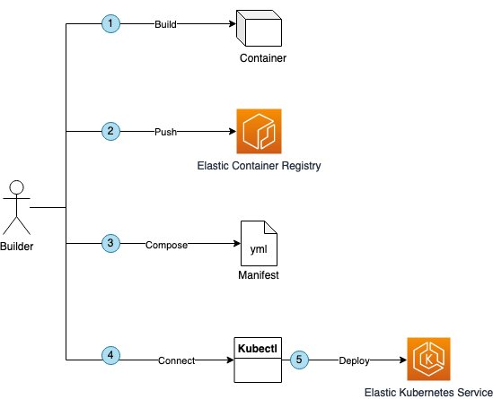

I divided the diagram above into the five steps explained below to clarify the activities involved:

1. First, we have to build our container image, setting an image name and a tag. Once the image is created, we can test the container locally before going further.
2. Once that the container works properly, we have to push the image into a container registry. In our case, we are going to use Amazon ECR. All the required steps to get here are in our [first post](/posts/picturesocial/01-how-to-containerize-app-less-than-15-min/).
3. When the container image is stored on the container registry, we have to create a Kubernetes manifest so we can send instructions to the cluster to create a pod, a replica set, and a service. We also tell the cluster where to retrieve the container image and how to update the application version. If you want to remember how, this a good time to review the [second post](/posts/picturesocial/02-whats-kubernetes-and-why-should-you-care/).
4. Now, we are ready to create our Kubernetes cluster in order to get the credentials. This is done once per project. We learn how to create and connect to a Kubernetes cluster in our [third post](/posts/picturesocial/03-how-to-deploy-kubernetes-cluster-using-terraform/).
5. And last but not least, we use Kubectl to deploy our application to Kubernetes using the Manifest. We are going to learn about this final step in the walk-through below.

## Deploy the Application

Now, that we have reviewed and put together what we learned from previous posts, let’s go and deploy the application! I’m assuming you already reviewed the walk-throughs from previous posts before continuing with this.

### Prerequisites

* An [AWS Account](https://aws.amazon.com/free/).
* If you are using Linux or macOS, you can continue to the next bullet point. If you are using Microsoft Windows, I suggest you to use [WSL2](https://docs.microsoft.com/en-us/windows/wsl/install).
* Install [Git](https://github.com/git-guides/install-git).
* Install [Kubectl](https://docs.aws.amazon.com/eks/latest/userguide/install-kubectl.html).
* Install [AWS CLI 2](https://docs.aws.amazon.com/cli/latest/userguide/getting-started-install.html).

Or

If this is your first time working with AWS CLI or you need a refresher on how to set up your credentials, I suggest you follow this [step-by-step guide of how to configure your local AWS environment](https://aws.amazon.com/es/getting-started/guides/setup-environment/). In this same guide, you can also follow steps to configure AWS Cloud9,  as that will be very helpful if you don’t want to install everything from scratch.

### Walk-through

1. First, we are going to connect to check if we have Kubectl correctly installed by running:

```bash
kubectl version
```

You should have a version of at least `Major:"1", Minor:"23"` to run this walk-through. Otherwise, I suggest you to [upgrade the version](https://docs.aws.amazon.com/eks/latest/userguide/install-kubectl.html) first.

2. When you created the cluster, you also run a command to update the `kubeconfig` file. You don’t have to run it again, but just a friendly reminder that it is a necessary step to continue further.

```bash
aws eks --region $(terraform output -raw region) update-kubeconfig --name $(terraform output -raw cluster_name)
```

This downloads a `kubeconfig` file into your local terminal with: a) the cluster name, b) kubernetes api URL, c) key to connect. That file is saved by default in `/.kube/config`. You can see an example below, from Kubernetes official documentation:

```yaml
apiVersion: v1
clusters:
- cluster:
    certificate-authority: fake-ca-file
    server: https://1.2.3.4
  name: development
- cluster:
    insecure-skip-tls-verify: true
    server: https://5.6.7.8
  name: scratch
contexts:
- context:
    cluster: development
    namespace: frontend
    user: developer
  name: dev-frontend
- context:
    cluster: development
    namespace: storage
    user: developer
  name: dev-storage
- context:
    cluster: scratch
    namespace: default
    user: experimenter
  name: exp-scratch
current-context: ""
kind: Config
preferences: {}
users:
- name: developer
  user:
    client-certificate: fake-cert-file
    client-key: fake-key-file
- name: experimenter
  user:
    password: some-password
    username: exp
## Source: https://kubernetes.io/docs/tasks/access-application-cluster/configure-access-multiple-clusters
```

Now that we have the kubeconfig, we have established a trust relationship between your terminal and Kubernetes that will work through kubectl.

3. Next, let’s look at the workers for this cluster by running the command below. The command will return the 3 workers that we created, the version of Kubernetes and the age of the worker since creation or upgrade. As shown below, each worker is on a different subnet that belongs to 3 different availability zones.

```bash
kubectl get nodes
```

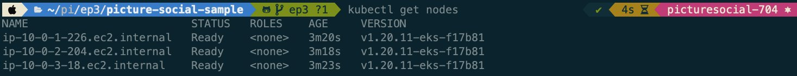

4. In addition to nodes, you can also check for pods by running the command below. But keep in mind that we haven’t deploy anything yet. Also, if you don’t specify a namespace in the command, it will return everything from the "default" namespace.

```bash
kubectl get pods
```

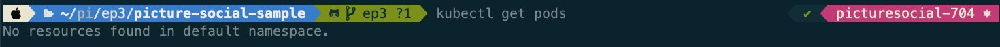

5. We can also specify the pods in all namespaces, including the ones that Kubernetes needs to run properly by adding the `—all-namespaces` parameter.

```bash
kubectl get pods --all-namespaces
```

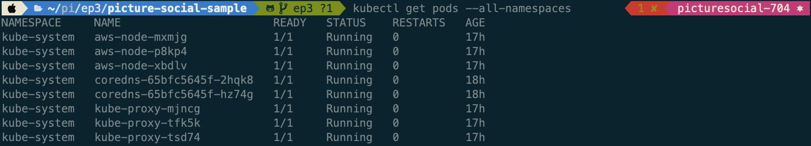

6. Similarly with services, we can check all the services in the cluster. As you can see, you have the default service that will handle the `kubecontrol` requests and the kube-dns that will handle the calls to the `coredns` of the cluster. It’s important that we don’t edit or delete any of the those services or pods, believe me :)

```bash
kubectl get services --all-namespaces
```

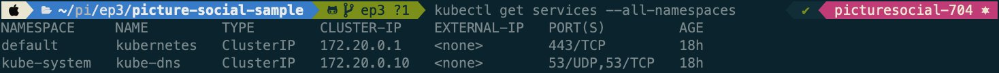

7. We can also check the replica sets of the cluster by running this command:

```bash
kubectl get rs --all-namespaces
```

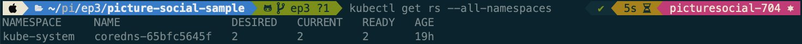

As shown above, the commands for running the basics are pretty simple and self explanatory. 

8. Now let’s deploy the container that we created from our first post. I have prepared a branch with everything that you will need, we are going to clone it first. And position our self in the folder that we are going to use.

```bash
git clone https://github.com/aws-samples/picture-social-sample.git -b ep4
cd picture-social-sample/HelloWorld
```

9. Now, lets open the file `manifest.yml`. That file includes the Kubernetes manifest. This manifest will create a deployment called `helloworld` with a pod of a container stored at `111122223333.dkr.ecr.us-east-1.amazonaws.com/helloworld`, also replicated twice. The manifest also includes a service with a public load balancer that will expose port 80 and will target container port 5111.

```yaml
#########################
# Definicion de las POD
#########################
apiVersion: apps/v1
kind: Deployment
metadata:
  name: helloworld
  labels:
    app: helloworld
spec:
  replicas: 2
  selector:
    matchLabels:
      app: helloworld
  template:
    metadata:
      labels:
        app: helloworld
    spec:
      containers:
      - name: helloworld
        image: 111122223333.dkr.ecr.us-east-1.amazonaws.com/helloworld
        resources:
          requests:
            memory: "256Mi"
            cpu: "250m"
          limits:
            memory: "512Mi"
            cpu: "500m"
---
#########################
# Definicion del servicio
#########################
kind: Service
apiVersion: v1
metadata:
  name: helloworld-lb
spec:
  selector:
    app: helloworld
  ports:
  - port: 80
    targetPort: 5111
  type: LoadBalancer
```

10. Now we are ready to deploy the application to Kubernetes. Make sure you change the Amazon ECR Account ID on the manifest above before proceeding.

11. We going to work using the namespace "tests" for this post. Remember that namespaces will help us handle the order of the pods and group them by business domain or affinity. So let’s create the namespace with this command:

```bash
kubectl create namespace tests
```

12. Now that we have the namespace created, we are going to apply changes to Kubernetes using the manifest and specifying the newly created namespace.

```bash
kubectl apply -f manifest.yml -n tests
```

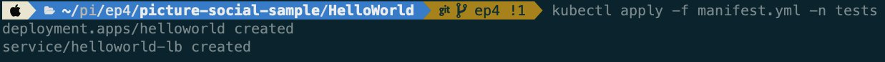

13. Now you can check the deployment, the pods, and the service. Don’t forget to always pass the parameter, namespace. For pods, you should get two replicas of the same pod.

```bash
kubectl get pods -n tests
```

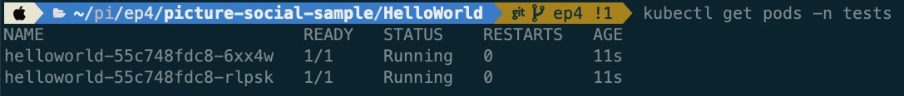

14. If you want to see details from a specific pod, you can run the following command, where `podName` is the name of the pod that you want to check. It also includes the scheduling from the Kubernetes Control Plane to that specific pod and the history of all events.

```bash
kubectl describe pod **podName** -n tests
```

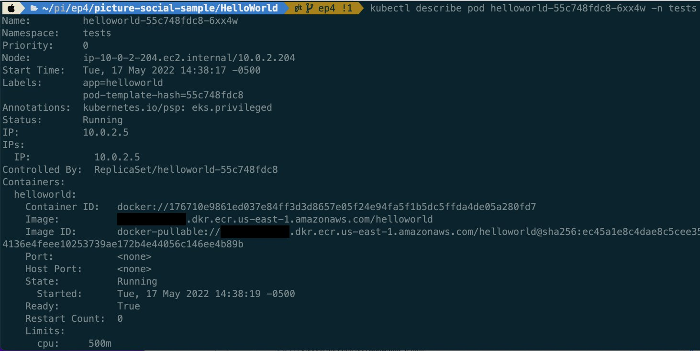
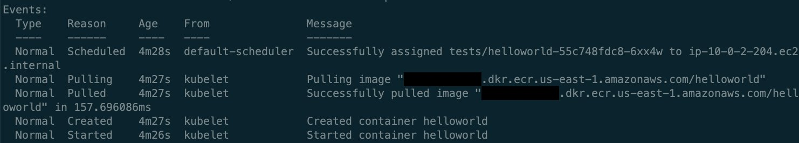

15. You can also stream the logs from an specific pod by running the following command and specifying the `podName`.

```bash
kubectl logs **podName** -f -n tests
```

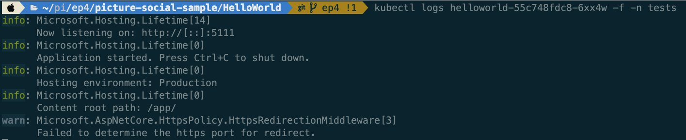

16. I recommend you to store the Kubernetes logs for observability into CloudWatch, but we are going to cover this in the next post. You can take a look to the official [EKS documentation](https://docs.aws.amazon.com/prescriptive-guidance/latest/implementing-logging-monitoring-cloudwatch/kubernetes-eks-logging.html) for more information.

17. Now, you can also check your service status and address to test if the application is running. The `EXTERNAL-IP` column is the one that contains the FQDN address that you can use.

```bash
kubectl get services -n tests
```

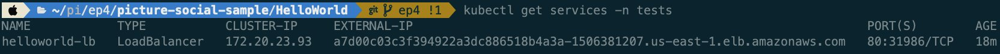

18. Now, you can open the browser and test your application. Be sure to use http instead of https for this specific test. We are going to learn how to protect your API endpoints in a future post.

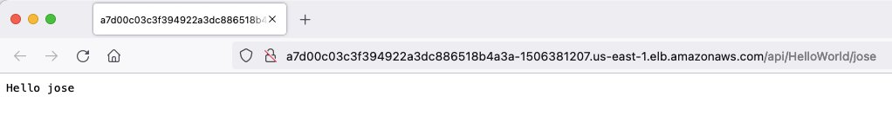

That simple "Hello Jose" from the API is the response from the call to a load balancer that chose one of the two pods to send the request to. Then "Hello Jose" was rendered in your browser as the output. I highly suggest you to try this only locally and not exposing it to Internet. We are going to learn how to expose endpoints to the outside world using other security layers like API Gateways and Layer 7 load balancers in the next posts.

19. Now let’s prove why Kubernetes is a self-healing container orchestrator. We are going to delete one of the two pods and see what happens.

```bash
kubectl delete pod **podName** -n tests
```

As soon as a pod is deleted, Kubernetes will provision another clone because the replica set has to be honored. If you want to see the stream of pods and status you can add the `-w` parameter to watch for changes.

```bash
kubectl get pods -w -n tests
```

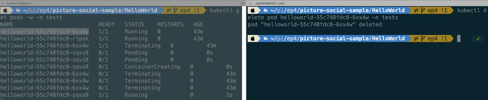

20. You can also set an autoscale rule for your deployment by running the following command. Where `—max` is the number of max replicas that will handle this HPA or Horizontal Pod Autoscaler, `—min` is the number of minimum replicas running, and `—cpu-percent` is the percentage of CPU of all the current pods from this deployment. In the case of exceeding the number specified, it will scale up.

```bash
kubectl autoscale deployment helloworld --max 10 --min 2 --cpu-percent 70 -n tests
```

21. You can check the status of the HPA by running the following command:

```bash
kubectl get hpa -n tests
```

I hope you enjoy this post as much as I enjoyed writing it! And I also hope that it gave you some clarification from the previous posts. If everything went well, you learned how to deploy an application to Kubernetes, create services, access the commands to create namespaces and work through namespaces, check for object descriptions, review the logs of your application, scale your application, and create rules for autoscaling.

In the [next post](/posts/picturesocial/05-how-to-analyze-images-with-machine-learning/) we are going to develop one of the core parts of Picturesocial, the API for image recognition and auto tagging using Amazon Rekognition!
