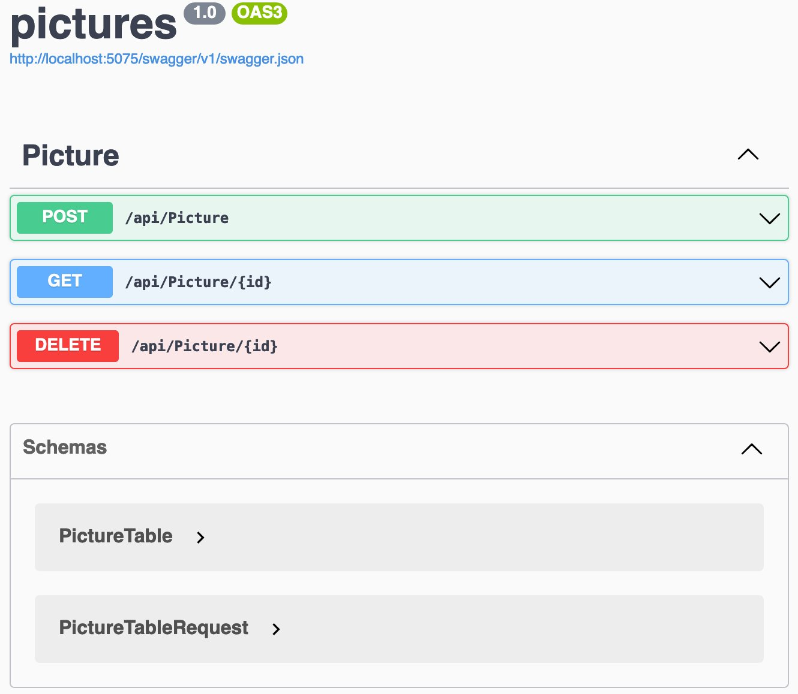
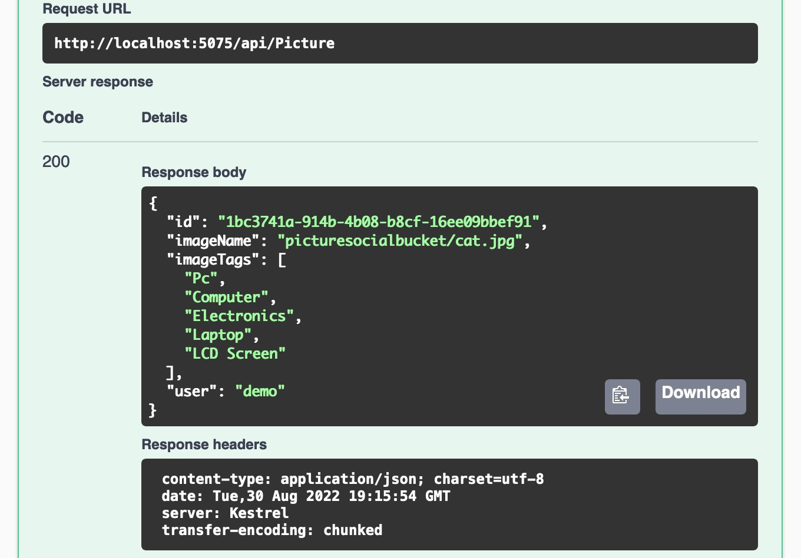
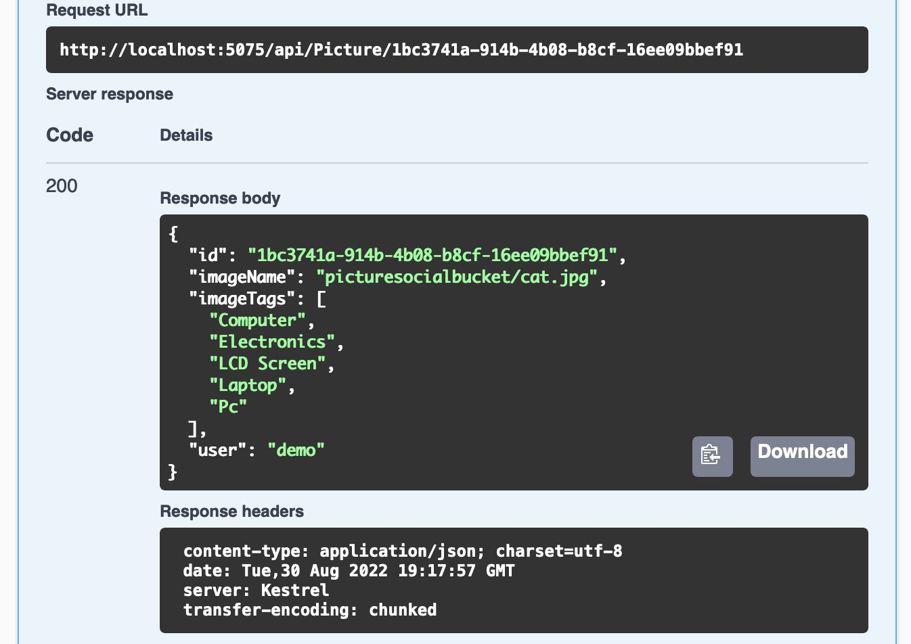

This is a 8-part series about Picturesocial:

1. [How to containerize an app in less than 15 minutes](/posts/picturesocial/01-how-to-containerize-app-less-than-15-min/)
2. [What’s Kubernetes and why should you care?](/posts/picturesocial/02-whats-kubernetes-and-why-should-you-care/)
3. [How to deploy a Kubernetes cluster using Terraform](/posts/picturesocial/03-how-to-deploy-kubernetes-cluster-using-terraform/)
4. [How to deploy an app to Kubernetes](/posts/picturesocial/04-how-to-deploy-an-app-to-kubernetes/)
5. [How to analyze images with Machine Learning](/posts/picturesocial/05-how-to-analyze-images-with-machine-learning/)
6. [How to use DynamoDB on a containerized API](this post)


So far you have been lerning about containers, Kubernetes, Infraestructure as a Code and even intelligent services like Amazon Rekognition. Now it’s time to add a database to store the needed data models that will be used on our social media platform.

I choose Amazon DynamoDB because the Picturesocial need a modern database that support high throughput and simplify the overall data management by providing an API for all the Data Management and Operations. Also because I'm using document data structures that will be better working on a non-relational and document DB as DynamoDB. But first I need to figure out the relevant field for the data structure in the APIs that I have done so far.

In a previous post about [how to analyze images with Machine Learning](/posts/picturesocial/05-how-to-analyze-images-with-machine-learning/), I created an API that returned the Labels from a photo using Amazon Rekognition. The most relevant attributes for Picturesocial are: **1/** An ID to correlate the image with the Labels, **2/** Image Name, **3/** Label List (top 5), and **4/** User who uploaded the image. Now I'm going to convert those attributes into a Data Model, using JSON, that I will follow for the whole API.

```json
`{  
    "id": "string",  
    "imageName": "string",  
    "imageTags": ["string"],  
    "user": "string"
}`
```

That Data Model with real data will look like this in our API. This is what we call a Data Object, in this case using JSON.

```json
`{  
    "id": "c37ae810-4b6e-4da7-8b5d-1f720448f9a4",  
    "imageName": "picturesocialbucket/cat.jpg",  
    "imageTags": [    
        "Cat",    
        "Electronics",    
        "LCD Screen",    
        "Laptop",    
        "Pc"  ],  
    "user": "demo03"
 }`
```

Now that we have our data model, let’s surf some of the CRUD API specs to accommodate our Pictures API to follow the best practices. CRUD stands for Create, Read, Update and Delete, which are the basic operations that you usually do with a Data Object, and we will align those operations into HTTP Methods like this:

* Create → POST
* Read → GET
* Update → PUT
* Delete → DELETE

This way we don’t have to know much about the method names, we just know what it does just following the HTTP Method and understanding the Data Model. You can learn about the different HTTP Methods and purposes by visiting the Restfull documentation [here](https://restfulapi.net/http-methods/).

Now we are goint to put all this together and start coding!

### **Pre-requisites:**

* An [AWS Account](https://aws.amazon.com/free/).
* If you are using Linux or macOS, you can continue to the next bullet point. If you are using Microsoft Windows, I suggest you to use [WSL2](https://docs.microsoft.com/en-us/windows/wsl/install).
* Install [Git](https://github.com/git-guides/install-git).
* Install [AWS CLI 2](https://docs.aws.amazon.com/cli/latest/userguide/getting-started-install.html).
* Install [.NET 6](https://dotnet.microsoft.com/en-us/download).

Or

If this is your first time working with AWS CLI or you need a refresher on how to set up your credentials, I suggest you follow this [step-by-step guide of how to configure your local AWS environment](https://aws.amazon.com/es/getting-started/guides/setup-environment/). In this same guide, you can also follow steps to configure AWS Cloud9,  as that will be very helpful if you don’t want to install everything from scratch.

### Walkthrough

* First, we are going to create the DynamoDB Table needed for this walkthrough, this table will be named Pictures. We will use the Terminal of our preference with AWS CLI 2 installed and logged in.

```bash
aws dynamodb create-table \
--table-name pictures \
--attribute-definitions \
AttributeName=id,AttributeType=S \
--key-schema \
AttributeName=id,KeyType=HASH \
--provisioned-throughput \
ReadCapacityUnits=5,WriteCapacityUnits=5 \
`--table-class STANDARD`
```

* When we execute the command, we are going to get a JSON response with the table structure. We just need to write `:q `and press Enter to finish. The command `:q ` is what we use to exit the current view of the terminal when we are in text mode. This also apply to console text editors like VIM.

```json
{
    "TableDescription": {
    "AttributeDefinitions": [
    {
        "AttributeName": "id",
        "AttributeType": "S"
        }
        ],
        "TableName": "pictures",
        "KeySchema": [
        {
            "AttributeName": "id",
            "KeyType": "HASH"
        }
        ],
        "TableStatus": "CREATING",
        "CreationDateTime": "2022-08-30T11:53:01.937000-05:00",
        "ProvisionedThroughput": 
        {
            "NumberOfDecreasesToday": 0,
            "ReadCapacityUnits": 5,
            "WriteCapacityUnits": 5
        },
        "TableSizeBytes": 0,
        "ItemCount": 0,
        "TableArn": "arn:aws:dynamodb:us-east-1:378907872096:table/pictures",
        "TableId": "d95f5cf0-d2c1-48b8-b02c-4bdcb243b179",
        "TableClassSummary": 
        {
            "TableClass": "STANDARD"
        }
    }
}
```

* Now the table is ready for the code! But we need to clone our repo first by choosing the branch “Ep7”, this repo contains all the code needed for replicate this walkthrough.

```bash
git clone https://github.com/aws-samples/picture-social-sample.git -b ep7
```

* But first, we need to add the AWS Packages to our project by going to Pictures folder and running the following commands, which were explored on our previous posts and the one new AWSSDK.DynamoDBv2

```bash
dotnet add package AWSSDK.SecurityToken
dotnet add package AWSSDK.Core
dotnet add package AWSSDK.DynamoDBv2
dotnet add package AWSSDK.Rekognition
```

* We are going to open the cloned repo on VS Code and explore the file PictureTable.cs, which contain the classes PictureTable and PictureTableRequest, the first is the one that define the Table Data Model and the second is the Payload Data Model for creating new items.

```csharp
using Amazon.DynamoDBv2.DataModel;
[DynamoDBTable("pictures")]
public class PictureTable
{
    [DynamoDBHashKey]
    public string id { get; set; } = default!;
    [DynamoDBProperty("imagename")]
    public string ImageName { get; set; } = default!;
    [DynamoDBProperty("imagetags")]
    public string[] ImageTags { get; set; } = default!;
    [DynamoDBProperty("user")]
    public string User { get; set; } = default!;
}
```

* We start by adding the definition of DynamoDBTable and the name of the table on top of the PictureTable Class by using `[DynamoDBTable("**pictures**")]`. Also, we define which attribute of the class is the Key of the Schema by using `[DynamoDBHashKey] `on top of the declaration and for the other attributes we just set the name as will appear on the JSON document like this `[DynamoDBProperty("**nameOfTheAttribute**")]`
* The second class will be much simpler as it only is the Payload Data Model, where we define the photo, bucket and user name that will be send to create a new element.

```csharp
public class PictureTableRequest
{
    public string photo { get; set; }= default!;
    public string bucket { get; set; }= default!;
    public string user { get; set; }= default!;
}
```

* Open the Controller Picture by going to Controllers/PictureController.cs, there we have 3 Methods: Create, Read and Delete using the corresponding HTTP Method.
* On top of the class, we declare the DynamoDB variables and the Data Model variable. And using the constructor method we are going to initialize them, they are going to take the profile from the terminal to authenticate.
* We are not adding an Authorize header to the controller because this will be handled by Amazon API Gateway and will be explored with more detail in the next episode.

```csharp
public class PictureController : ControllerBase
{
    AmazonDynamoDBConfig clientConfig;
    AmazonDynamoDBClient client;
    DynamoDBContext context;
    PictureTable model;

    public PictureController()
    {
        this.clientConfig = new AmazonDynamoDBConfig();
        this.client = new AmazonDynamoDBClient(clientConfig);
        this.context = new DynamoDBContext(client);
        this.model = new PictureTable();
    }
```

* We declared, on top of the class, the DynamoDB variables and the Data Model variable. And using the constructor method we are going to initialize them. They will take the profile from the terminal to authenticate.
* We explored Amazon Rekognition in our [previous post](https://go.aws/3PxPyga?r=lp), so for now I will focus only on the added parts of the API to store the information on DynamoDB. First we declare the Create method as HttpPost and parse the request from the PictureTableRequest class that we explored earlier. The next step is just to create a PictureTable object and fill it with the results from the Amazon Rekognition detection, and then just use the global variable context to save asynchronously the object into the database. As you can see this is quite straightforward and doesn't add much custom logic to our methods; it's just one line of code.

```csharp
[HttpPost]
public async Task<PictureTable> Create([FromBody]PictureTableRequest req)
{
    var rekognitionClient = new AmazonRekognitionClient(Amazon.RegionEndpoint.USEast1);
    var responseList = new List<String>();

    DetectLabelsRequest detectlabelsRequest = new DetectLabelsRequest()
    {
        Image = new Image()
        {
            S3Object = new S3Object()
            {
                Name = req.photo,
                Bucket = req.bucket
            },
        },
        MaxLabels = 5,
        MinConfidence = 80F
    };
    try
    {
        var detectLabelsResponse = await rekognitionClient.DetectLabelsAsync(detectlabelsRequest);
        foreach (Label label in detectLabelsResponse.Labels)
            responseList.Add(label.Name);
        if (responseList.Count() > 0)
        {
            **var guid = Guid.NewGuid().ToString();
            model = new PictureTable{
                id = guid,
                ImageName = $"{req.bucket}/{req.photo}",
                ImageTags = responseList.ToArray(),
                User = req.user
            };
            await context.SaveAsync(model);**
        }
        return model;
    }
    catch(Exception)
    {
        return model;
        throw;
    }    
}
```

* We are going to follow similar steps for the Read method using HTTP Get, where we use the Table Key to retrieve values. In this case we are receiving by the url the ID and returning the corresponding Data Object from DynamoDB by using the context and the method LoadAsync.

```csharp
[HttpGet("{id}")]
public async Task<PictureTable> Read(string id)
{
 **model** **= await context.LoadAsync<PictureTable>(id);
**    return model;
}
```

* And finally the Delete method using HTTP Delete, where we also use the LoadAsync method to get the Data Object and then the DeleteAsync method to use the previous object to point what to delete.

```csharp
[HttpDelete("{id}")]
public async Task<bool> Delete(string id)
{
    **model** **= await context.LoadAsync<PictureTable>(id);**
    if(model != null)
    {
        **await context.DeleteAsync<PictureTable>(model);**
        return true;
    }
    return false;
}
```

* The final API will look like this:

```csharp
using Microsoft.AspNetCore.Mvc;
using Amazon.Rekognition;
using Amazon.Rekognition.Model;
using Amazon.DynamoDBv2;
using Amazon.DynamoDBv2.DataModel;

namespace pictures.Controllers;

[ApiController]
[Route("api/[controller]")]
public class PictureController : ControllerBase
{
    AmazonDynamoDBConfig clientConfig;
    AmazonDynamoDBClient client;
    DynamoDBContext context;
    PictureTable model;

    public PictureController()
    {
        this.clientConfig = new AmazonDynamoDBConfig();
        this.client = new AmazonDynamoDBClient(clientConfig);
        this.context = new DynamoDBContext(client);
        this.model = new PictureTable();
    }
    [HttpPost]
    public async Task<PictureTable> Create([FromBody]PictureTableRequest req)
    {
        var rekognitionClient = new AmazonRekognitionClient(Amazon.RegionEndpoint.USEast1);
        var responseList = new List<String>();

        DetectLabelsRequest detectlabelsRequest = new DetectLabelsRequest()
        {
            Image = new Image()
            {
                S3Object = new S3Object()
                {
                    Name = req.photo,
                    Bucket = req.bucket
                },
            },
            MaxLabels = 5,
            MinConfidence = 80F
        };
        try
        {
            var detectLabelsResponse = await rekognitionClient.DetectLabelsAsync(detectlabelsRequest);
            foreach (Label label in detectLabelsResponse.Labels)
                responseList.Add(label.Name);
            if (responseList.Count() > 0)
            {
                var guid = Guid.NewGuid().ToString();
                model = new PictureTable{
                    id = guid,
                    ImageName = $"{req.bucket}/{req.photo}",
                    ImageTags = responseList.ToArray(),
                    User = req.user
                };
                await context.SaveAsync(model);
            }
            return model;
        }
        catch(Exception)
        {
            return model;
            throw;
        }    
    }
    [HttpGet("{id}")]
    public async Task<PictureTable> Read(string id)
    {
        model = await context.LoadAsync<PictureTable>(id);
        return model;
    }

    [HttpDelete("{id}")]
    public async Task<bool> Delete(string id)
    {
        model = await context.LoadAsync<PictureTable>(id);
        if(model != null)
        {
            await context.DeleteAsync<PictureTable>(model);
            return true;
        }
        return false;
    }
}
```

* We are now ready to test it locally by running on our Terminal the following command:

```bash
dotnet run
```

* We are going to test it using the built-in Swagger, going to our browser and typing the following URL. The Swagger endpoint will only work when you test it locally.

```bash
http://localhost:5075/swagger/index.html
```

* There we can see the auto documented Data Model and Methods and also test them.


* I will create a new Picture by going to the POST option and creating a payload using the PictureTableRequest Model, in my case I will use the name of a picture and bucket that exists to test it.

```json
`{`
    `"photo": "cat.jpg",`
    `"bucket": "picturesocialbucket",`
    `"user": "demo"`
`}`
```

* The result will be a view similar to the following:


* Where the most important part to test the other methods will be the id. We are going to copy that and test the Read.


* As we can see, we get exactly the same information that we had using the Create method, with the difference that this  time we are retrieving the object directly from the Database and not evaluating the image through Amazon Rekognition. This also improved significantly the response time from the Read vs the Create.

```json
{
  "Version": "2012-10-17",
  "Statement": [
    {
      "Sid": "Stmt1661888238004",
      "Action": [
        "s3:GetObject"
      ],
      "Effect": "Allow",
      "Resource": "arn:aws:s3:::picturesocialbucket"
    },
    {
      "Sid": "Stmt1661888728691",
      "Action": [
        "dynamodb:DeleteItem",
        "dynamodb:GetItem",
        "dynamodb:PartiQLDelete",
        "dynamodb:PartiQLInsert",
        "dynamodb:PartiQLSelect",
        "dynamodb:PartiQLUpdate",
        "dynamodb:PutItem",
        "dynamodb:UpdateItem"
      ],
      "Effect": "Allow",
      "Resource": "arn:aws:dynamodb:us-east-1:**111122223333**:table/pictures"
    },
    {
      "Sid": "Stmt1661888876887",
      "Action": [
        "rekognition:DetectLabels"
      ],
      "Effect": "Allow",
      "Resource": "*"
    }
  ]
}
```

We are making a good progress in our journey to create Picturesocial so far we have learned how to create an API, containerized it, deploy a Kubernetes cluster, use infraestructure as a code and deploy our API to Kubernetes and now we learned how to add Database support!
The next post will be about exposing our APIs to the Internet using API Gateway and VPC Link! 

[Continue to the next post about API Gateway and VPC Link](picturesocial/07-how-to-expose-a-containerized-api-to-the-internet).
