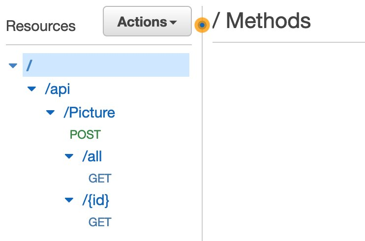

This is a 8-part series about Picturesocial:

1. [How to containerize an app in less than 15 minutes](/posts/picturesocial/01-how-to-containerize-app-less-than-15-min/)
2. [What’s Kubernetes and why should you care?](/posts/picturesocial/02-whats-kubernetes-and-why-should-you-care/)
3. [How to deploy a Kubernetes cluster using Terraform](/posts/picturesocial/03-how-to-deploy-kubernetes-cluster-using-terraform/)
4. [How to deploy an app to Kubernetes](/posts/picturesocial/04-how-to-deploy-an-app-to-kubernetes/)
5. [How to analyze images with Machine Learning](/posts/picturesocial/05-how-to-analyze-images-with-machine-learning/)
6. [How to use DynamoDB on a containerized API](/posts/picturesocial/06-how-to-use-dynamodb-on-a-containerized-api/)
7. [How to use DynamoDB on a containerized API](this post)


Not everything is about creating and deploying. One of the most important parts of the journey is to make sure that our APIs are available to be consumed by the clients, wherever they are. The way you expose an API could represent the success or faliure of the whole project, and this is why we need to explore some of the best practices and tips. In this post we will be learning about API Gateway and how we can make sure that our backends are consumed appropriately in a secure way.

But first, we need to understand where are we right now. We already [created and conainerized](/posts/picturesocial/01-how-to-containerize-app-less-than-15-min/), [deployed](/posts/picturesocial/04-how-to-deploy-an-app-to-kubernetes/), and secured the API and the infrastructure components needed for our APIs. But our services are presented as Internet Load Balancers, and that means that anybody with the URL can call our services without any control. So far we haven’t implemented throttling policies, API-key validation, authentication, or any other security mechanism to protect our endpoints.

A natural choice would be to present everything from a Layer 7 Load Balancer, but managing all the API design and considerations for presenting and covering all the points presented earlier would be a challenge. That’s where Amazon API Gateway comes to the rescue!

Picturesocial development team had a retro where they agreed to the following rules:

* R1: APIs cannot be exposed directly through Kubernetes into a Public Network.
* R2: We should avoid call the backend for content that is not refreshed constantly.
* R3: No client application will be allowed to call the backend more than 100,000 times per second
* R4: APIs calls needs an API key


In the following walk-through, we are going to learn how to expose our APIs while we comply with the rules using Network Load Balancers, Amazon API Gateway, and VPC Link.

### **Pre-requisites:**

* An AWS Account https://aws.amazon.com/free/
* If you are using Linux of MacOS you can continue to the next bullet point. If you are using Microsoft Windows I suggest you to use WSL2 https://docs.microsoft.com/en-us/windows/wsl/install
* Install Git https://github.com/git-guides/install-git
* Install AWS CLI 2 https://docs.aws.amazon.com/cli/latest/userguide/getting-started-install.html
* Install .NET 6 https://dotnet.microsoft.com/en-us/download

OR

* If this is your first time working with AWS CLI or you need a refresh on how to set up your credentials, I suggest you follow this step-by-step of how to configure your local environment https://aws.amazon.com/es/getting-started/guides/setup-environment/. In this same link you can also follow steps to configure Cloud9, that will be very helpful if you don’t want to install everything from scratch.

### Walkthrough

* Let’s explore visually what are we going to do next. We are going to have a human calling API’s through an API Gateway, that API Gateway will have a private connection to the Kubernetes Cluster through a VPC Link, and that VPC Link will call the Private Load Balancers.


* Before starting to create the new APIs we need to make sure that Kubernetes Services are completely private and can only be called inside a VPC. This is where the Kubernetes Private Load Balancers help us to simplify and protect our endpoints. This was explored in an earlier post about [What’s Kubernetes and Why should I care](/posts/picturesocial/02-whats-kubernetes-and-why-should-you-care/). 
* Let’s take a look the original service manifest. Here we are creating a public LoadBalancer for the app pictures that are exposed through the port 80.

```yaml
#########################
# Definicion del servicio
#########################
kind: Service
apiVersion: v1
metadata:
  namespace: dev
  name: pictures-lb
spec:
  selector:
    app: pictures
  ports:
  - port: 80
    targetPort: 5075
  type: LoadBalancer
```

* If we want to make this LoadBalancer reachable only under a VPC, we have to make a few changes. Kubernetes personalizations to interact with Cloud Providers come inside “annotations”, and this is where we define the type of LoadBalancer and if the LoadBalancer will be internal or public. 

```yaml
#########################
# Definicion del servicio
#########################
kind: Service
apiVersion: v1
metadata:
  namespace: dev
  name: pictures-lb
  **annotations****:
    service.beta.kubernetes.io/aws-load-balancer-type: nlb
    service.beta.kubernetes.io/aws-load-balancer-internal:** **"true"**
spec:
  selector:
    app: pictures
  ports:
  - port: 80
    targetPort: 5075
  type: LoadBalancer
```

* Once we save that change through kubectl, the public endpoint will no longer respond and will be reachable only inside a VPC.

```bash
`kubectl apply -f manifest.yml`
```

* Now let’s take a look into the available LoadBalancers and copy the Full Qualified Domain Name (FQDN) from the Private LoadBalancer we just created. We can save the FQDN into a text file, because we are going to use it several times in the following steps.


* The easiest way to create an API through API Gateway is by importing a Swagger file with the operation definition. This is pretty simple to accomplish by running the API that we made in the [previous post](/posts/picturesocial/06-how-to-use-dynamodb-on-a-containerized-api/) and running it locally going to http://localhost:5075/swagger/index.html


* You will find the swagger.json file after the API name. Download it. We are going use it to create the API structure in Amazon API Gateway.
* We have to open the AWS Console and find API Gateway, or just click on the [link](https://us-east-1.console.aws.amazon.com/apigateway/main/apis?region=us-east-1)
* Let’s click on VPC and create a new one. As we are creating a REST API, we are going to select that option as shown in the picture below:


* On target NLB we are going to select the same name from the Private Load Balancer FQDN. The process of VPC Link creation and connection will take a while, so we can sit and enjoy a coffee ☕
* Now let’s go back to APIs and click on Create a New API. We are going to select IMPORT on the REST API option.


* This is where we import the Swagger JSON file that we downloaded from the first steps.


* We have an option to select the Type of Endpoint: a/ Regional, b/ Edge Optimized, or c/ Private. We would use Regional when the endpoint will live exclusively on its own Region - in our case us-east-1. Edge Optimized would be when API Gateway uses Amazon CloudFront to create global replicas and optimized routes for high throughput global APIs. We would use Private when we want the APIs accessible only through a VPC.
* In our case we are going to select Regional and click Import.
* Now the whole API structure will be created in API Gateway, and we can start working on the VPC Link integration.



* Let’s select one HTTP method to explore the flow. For example, /all GET.


* As we can see, we have a visual diagram with the whole method execution flow. We need to change the Integration Request to go through the VPC Link we just created.
* It should look like this: a/ On Integration Type we are going to select VPC Link 🤓, b/ We are going to check the Proxy Integration, so that we use API Gateway as a passthrough mechanism. c/ The method will still be GET. d/ We select the VPC Link that we created. e/ The endpoint URL will be the FQDN with http and the route to the API Method. And finally we click on Save.


* You can go back to the Method Execution flow and click the Test option to check if the API is running correctly. If everything works, we have covered the first requirement. R1: APIs cannot be exposed directly through Kubernetes into a Public Network. 
* Now it’s time to Deploy the API! Click on Actions and then Deploy API.


* We are going to be asked about the Stage, so we'll click on New Stage, name it Test, and then click Deploy.


* Now we can select Stages from the vertical left menu and configure other important requirements like: 
  * R2: We should avoid calling the backend for content that is not refreshed constantly and 
  * R3: No client application will be allowed to call the backend more than 100,000 times per second. 
* For R2 we are going to click on Enable API Cache, as it will serve distributed replicas of the API response for static or not so changing data. You can configure the time to live of the cache if you need more or less time.
* For R3 we click on Enable Throttling and we set the Rate to 10,000 RPS (Request per second) and we'll save changes. 


* Also, if you notice, on top of the Stage settings you will get the Invoke URL for the API, we are going to use it later for the tests.
* It’s time to configure an API Key to complete the requirement R4: API’s calls needs an API key.
* We have to click on API Keys from the vertical left menu and then Create an API Key. We are going to name it test and the key will be auto generated.


* Finally we have to require API Keys for every method execution. We go back to APIs, select the Method, and then Click on Method Request. We will change API Key required from false to true.


* If we call the API directly without an API Key we are going get a 403 Error stating that the call is Forbidden.


* But if we use the x-api-key header and include the API Key, then we get the response correctly.


If you get this far you have your backend secured through API Gateway and with very few steps! If you want to learn more you can go to the [API Gateway Developer guide](https://docs.aws.amazon.com/apigateway/latest/developerguide/rest-api-protect.html) for more information Thanks for reading and don’t miss the next post about how to deal with ambiguity when you need just in time compute power for uncertain demand.

[Continue to the next post about Just-in-time compute power with Kubernetes](picturesocial/08-how-to-add-just-in-time-capacity-kubernetes)
