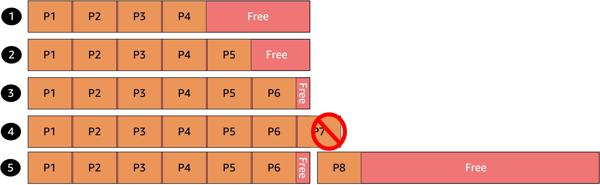

This is a 8-part series about Picturesocial:

| SeriesToC |
|-----------|

In the face of uncertainty, we use logic, positive thinking, prayer, or whatever else seems like it might make an outcome more dependable. But sometimes you just need the right tool. For example, APIs often use frameworks to predict demand, but they cannot always provision compute capacity to serve it exactly when it's needed -- or Just in Time. Facing this uncertain availability, what tool can help?

This may seem obvious for Serverless workloads, as its handled by the cloud provider, but for Kubernetes we use scaling strategies, like HPA (Horizontal Pod Autoscaler), that we explored in previous [posts](/posts/picturesocial/04-how-to-deploy-an-app-to-kubernetes/). But HPA needs compute capacity from the Node Groups to schedule new pods, otherwise the new ones are evicted. Let’s take a look at how this process still won't solve the problem above.



1. We have a node with 4 pods and around 35% of compute power free to scale current deployments.
2. An increase in the demand made a deployment scale to one extra replica. We now have a node with 5 pods and around 17% of compute power free to scale current deployments.
3. Another increase in the demand made a deployment scale to one more replica. We now have a node with 6 pods and around 5% of compute power free.
4. The demand is still going up and the auto-scaling rules forced Kubernetes Scheduler to add one more pod, but we don’t have compute power to serve the demand and we evicted the new pod.
5. Kubernetes realizes that it needs more nodes and due to worker autoscaling rules it schedule a new EC2 instance and deploys the pod into the new node.

In the real world that extra node scheduled to cover the demand will take more than 10 minutes to be ready, the users are already there and we may lose customer trust for not serving the demand. This is where we need something that observes the aggregate resource requests of unscheduled pods to make decisions on launch and terminate nodes to minimize scheduling latencies and infrastructure costs. This is where [Karpenter](https://karpenter.sh/) comes to the rescue.

[Karpenter](https://karpenter.sh/) is an open source project created by AWS that helps you solve this problem by having Just in Time nodes to serve the uncertain demand. Today we are gonna learn how to implement it and how it looks on your Kubernetes Cluster.

### **Pre-requisites:**

* An AWS Account https://aws.amazon.com/free/
* If you are using Linux of MacOS you can continue to the next bullet point, if you are using Microsoft Windows I suggest you to use WSL2 https://docs.microsoft.com/en-us/windows/wsl/install
* Install Git https://github.com/git-guides/install-git
* Install AWS CLI 2 https://docs.aws.amazon.com/cli/latest/userguide/getting-started-install.html
* Install ekctl https://eksctl.io/
* Read the EKS Workshop: https://www.eksworkshop.com/beginner/085_scaling_karpenter/ I used it for some parts of this blog post and if you wanna go deep that’s the place to explore! 🚀

OR

* If this is your first time working with AWS CLI or you need a refresh on how to set up your credentials, I suggest you to follow this step-by-step of how to configure your local environment https://aws.amazon.com/es/getting-started/guides/setup-environment/ in this same link you can also follow steps to configure Cloud9, that will be very helpful if you don’t want to install everything from scratch.

### Walkthrough

* We are going to start opening our Terminal and creating a variable to set the Karpenter version that we are gonna use as well as the region, that in our case is us-east-1, the cluster name and finally the identify profile of the current session.

```bash
export KARPENTER_VERSION=v0.16.0
export AWS_REGION=us-east-1
export CLUSTER_NAME=ekspicturesocial02
export ACCOUNT_ID=$(aws sts get-caller-identity —output text —query Account)
```

* Now it’s time to add Karpenter as Cluster extension by running a CloudFormation script.

```bash
TEMPOUT=$(mktemp)

curl -fsSL https://karpenter.sh/"${KARPENTER_VERSION}"/getting-started/getting-started-with-eksctl/cloudformation.yaml  > $TEMPOUT \
&& aws cloudformation deploy \
  --stack-name "Karpenter-${CLUSTER_NAME}" \
  --template-file "${TEMPOUT}" \
  --capabilities CAPABILITY_NAMED_IAM \
  --parameter-overrides "ClusterName=${CLUSTER_NAME}"
```

* This is how it looks like, the CloudFormation downloaded from karpenter.sh, that we are using.

```yaml
AWSTemplateFormatVersion: "2010-09-09"
Description: Resources used by https://github.com/aws/karpenter
Parameters:
  ClusterName:
    Type: String
    Description: "EKS cluster name"
Resources:
  KarpenterNodeInstanceProfile:
    Type: "AWS::IAM::InstanceProfile"
    Properties:
      InstanceProfileName: !Sub "KarpenterNodeInstanceProfile-${ClusterName}"
      Path: "/"
      Roles:
        - Ref: "KarpenterNodeRole"
  KarpenterNodeRole:
    Type: "AWS::IAM::Role"
    Properties:
      RoleName: !Sub "KarpenterNodeRole-${ClusterName}"
      Path: /
      AssumeRolePolicyDocument:
        Version: "2012-10-17"
        Statement:
          - Effect: Allow
            Principal:
              Service:
                !Sub "ec2.${AWS::URLSuffix}"
            Action:
              - "sts:AssumeRole"
      ManagedPolicyArns:
        - !Sub "arn:${AWS::Partition}:iam::aws:policy/AmazonEKS_CNI_Policy"
        - !Sub "arn:${AWS::Partition}:iam::aws:policy/AmazonEKSWorkerNodePolicy"
        - !Sub "arn:${AWS::Partition}:iam::aws:policy/AmazonEC2ContainerRegistryReadOnly"
        - !Sub "arn:${AWS::Partition}:iam::aws:policy/AmazonSSMManagedInstanceCore"
  KarpenterControllerPolicy:
    Type: AWS::IAM::ManagedPolicy
    Properties:
      ManagedPolicyName: !Sub "KarpenterControllerPolicy-${ClusterName}"
      PolicyDocument:
        Version: "2012-10-17"
        Statement:
          - Effect: Allow
            Resource: "*"
            Action:
              # Write Operations
              - ec2:CreateLaunchTemplate
              - ec2:CreateFleet
              - ec2:RunInstances
              - ec2:CreateTags
              - ec2:TerminateInstances
              - ec2:DeleteLaunchTemplate
              # Read Operations
              - ec2:DescribeLaunchTemplates
              - ec2:DescribeInstances
              - ec2:DescribeSecurityGroups
              - ec2:DescribeSubnets
              - ec2:DescribeImages
              - ec2:DescribeInstanceTypes
              - ec2:DescribeInstanceTypeOfferings
              - ec2:DescribeAvailabilityZones
              - ec2:DescribeSpotPriceHistory
              - ssm:GetParameter
              - pricing:GetProducts
          - Effect: Allow
            Action:
              - iam:PassRole
            Resource: !Sub "arn:${AWS::Partition}:iam::${AWS::AccountId}:role/KarpenterNodeRole-${ClusterName}"
```

* We are going to use eksctl command line tool to create an IAM Identity mapping to our cluster, this will create the Karpenter role node to our config map as well as allow the nodes to be managed by the cluster.

```bash
eksctl create iamidentitymapping \
  --username system:node:{{EC2PrivateDNSName}} \
  --cluster  ${CLUSTER_NAME} \
  --arn "arn:aws:iam::${ACCOUNT_ID}:role/KarpenterNodeRole-${CLUSTER_NAME}" \
  --group system:bootstrappers \
  --group system:nodes
```

* Once this is done, we can check if the config map is ready by running the following command and looking if a config map named Karpenter-{something} is in place.

```bash
kubectl describe configmap -n kube-system aws-auth
```

* We are going to create an Open ID Connect (OIDC) provider for our Cluster. This is needed for establishing the trust relationship between Karpenter and our Cluster.

```bash
eksctl utils associate-iam-oidc-provider --cluster ${CLUSTER_NAME} --approve
```

* And finally we create the Kubernetes Service Account to give Karpenter permissions to launch new instances.

```bash
eksctl create iamserviceaccount \
  --cluster "${CLUSTER_NAME}" --name karpenter --namespace karpenter \
  --role-name "${CLUSTER_NAME}-karpenter" \
  --attach-policy-arn "arn:aws:iam::${ACCOUNT_ID}:policy/KarpenterControllerPolicy-${CLUSTER_NAME}" \
  --role-only \
  --approve

export KARPENTER_IAM_ROLE_ARN="arn:aws:iam::${ACCOUNT_ID}:role/${CLUSTER_NAME}-karpenter"
```

* We are going to use Helm to install in Kubernetes the Karpenter dependancies (Config Maps, Pods, Services, etc), but first we add the repo from karpenter.sh

```bash
helm repo update
helm repo add karpenter https://charts.karpenter.sh/
```

* And we install the Helm chart.

```bash
helm upgrade --install --namespace karpenter --create-namespace \
  karpenter karpenter/karpenter \
  --version ${KARPENTER_VERSION} \
  --set serviceAccount.annotations."eks\.amazonaws\.com/role-arn"=${KARPENTER_IAM_ROLE_ARN} \
  --set clusterName=${CLUSTER_NAME} \
  --set clusterEndpoint=$(aws eks describe-cluster --name ${CLUSTER_NAME} --query "cluster.endpoint" --output json) \
  --set defaultProvisioner.create=false \
  --set aws.defaultInstanceProfile=KarpenterNodeInstanceProfile-${CLUSTER_NAME} \
  --wait # for the defaulting webhook to install before creating a Provisioner
```

* You can now check if everything is properly installed and running before continuing further.

```bash
kubectl get all -n karpenter
```

* This YAML contains the provisioner for on-demand nodes. This is what it does: a/ Requirements: implements new on-demand nodes that are extra-large or bigger, b/ Limits: The provisioner will not use more than 1000 virtual cores and 1000GB of RAM. c/ ttlSecondsAfterEmpty: How many seconds until an empty node is terminated.

```yaml
cat <<EOF | kubectl apply -f -
apiVersion: karpenter.sh/v1alpha5
kind: Provisioner
metadata:
  name: default
spec:
  labels:
    intent: apps
  requirements:
    - key: karpenter.sh/capacity-type
      operator: In
      values: ["on-demand"]
    - key: karpenter.k8s.aws/instance-size
      operator: NotIn
      values: [nano, micro, small, medium, large]
  kubectl get all -n karpenter:
    resources:
      cpu: 1000
      memory: 1000Gi
  ttlSecondsAfterEmpty: 30
  ttlSecondsUntilExpired: 2592000
  providerRef:
    name: default
---
apiVersion: karpenter.k8s.aws/v1alpha1
kind: AWSNodeTemplate
metadata:
  name: default
spec:
  subnetSelector:
    alpha.eksctl.io/cluster-name: ${CLUSTER_NAME}
  securityGroupSelector:
    alpha.eksctl.io/cluster-name: ${CLUSTER_NAME}
  tags:
    KarpenerProvisionerName: "default"
    NodeType: "karpenter-workshop"
    IntentLabel: "apps"
EOF

```

>**WARNING**: This next step can generate a considerable consumption if you don’t delete it after this step by step.

* It’s time to test if it really worked! I’m going to use the [pause](https://www.ianlewis.org/en/almighty-pause-container) image. You have to change the amount of replicas from 0 to at least 1 to see how this triggers a just-in-time scale up to the node group.

```yaml
cat <<EOF > inflate.yaml
apiVersion: apps/v1
kind: Deployment
metadata:
  name: inflate
spec:
 **replicas: 0
**  selector:
    matchLabels:
      app: inflate
  template:
    metadata:
      labels:
        app: inflate
    spec:
      nodeSelector:
        intent: apps
      containers:
        - name: inflate
          image: public.ecr.aws/eks-distro/kubernetes/pause:3.2
          resources:
            requests:
              cpu: 1
              memory: 1.5Gi
EOF
kubectl apply -f inflate.yaml
```

* Once you run this command, you are going to have at least 1 new node ready in the following 1-2 minutes, and this is how Just-in-Time compute with Kubernetes and Karpenter allows us to scale further in a very easy and agile way to serve uncertain demand. Plus, it allows you to put your effort toward innovation through the application without spending so much time on infrastructure operation.
* Don’t forget to delete the deployment by running:

```bash
kubectl delete -f inflate.yaml
```


And we've arrived at the end of the series. I hope you enjoyed and learned from this journey as much as I did. In this series, we learned about containers, databases, orchestrators, API gateways, autoscaling, microservices, ML services, security, and many other things together. Now it's time for you to start your own projects, and I look forward to joining paths together in the future. If you have any problem please add an issue into our[GitHub repo](https://github.com/aws-samples/picture-social-sample), also if you want to learn more about Kubernetes on AWS here are some good deep dive resources that you can use:

* [EKS Workshop](https://www.eksworkshop.com/)
* [Deploying an EKS Cluster with Terraform](https://developer.hashicorp.com/terraform/tutorials/kubernetes/eks) 

