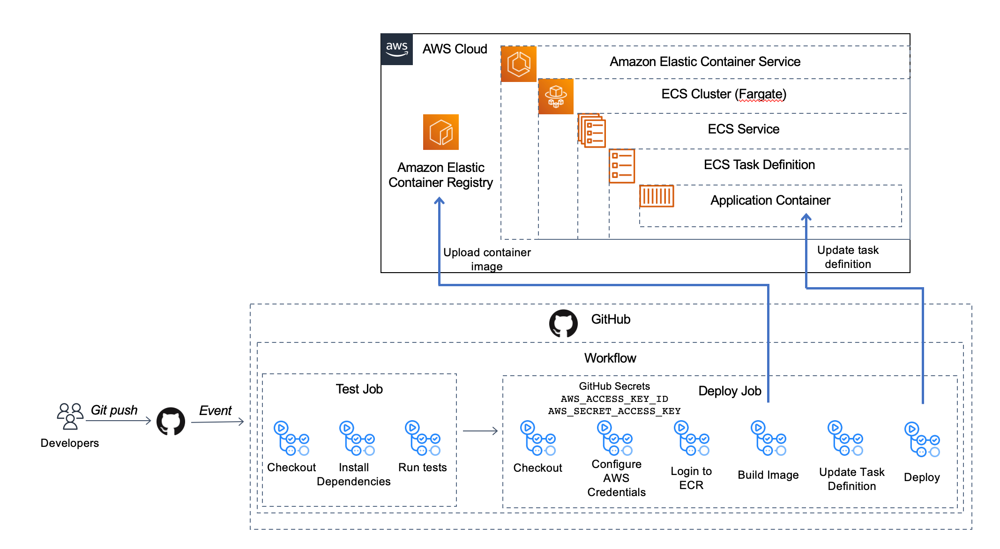
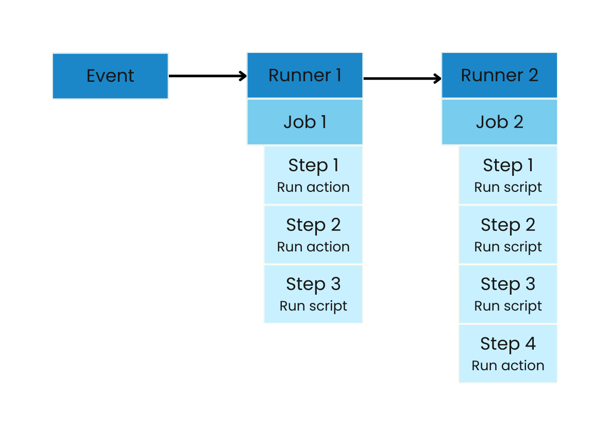

You've built out the first version of you Flask web app and even containerized it with Docker so your developer teammates can run it locally. Now, it's time to figure out how to deploy this container into the world! You want to have your app deployed whenever you or your teammates push a new feature up to the repo. You also want to make sure that the code you're putting out into the world is high quality and delivers value to your customers right away. To do this, we'll create a simple CI/CD pipeline to deploy our container to infrastructure in the cloud.



Upon push to the main branch, we'll trigger a GitHub Actions workflow that runs two jobs:
- a test job to run unit tests against our Flask app, and
- a deploy job to create a container image and deploy that to our container infrastructure in the cloud
First, we'll create this infrastructure using the CDK, an infrastructure as code framework that let's us create infrastructure with higher-level programming languages like Python.

We're only deploying one container today, but this solution would work if you're running multiple containerized services.

Let's get started!

### Prerequisites

To work through these examples, you'll need a few bits setup first:
- An AWS account. You can create your account [here](https://aws.amazon.com/premiumsupport/knowledge-center/create-and-activate-aws-account/).
- The CDK installed. You can find instructions for installing the CDK [here](https://docs.aws.amazon.com/cdk/v2/guide/getting_started.html). Note: For the CDK to work, you'll also need to have the AWS CLI installed and configured or setup the `AWS_ACCESS_KEY_ID`, `AWS_SECRET_ACCESS_KEY`, and `AWS_DEFAULT_REGION` as environment variables. The instructions above show you how to do both.

Just want the code? Grab the CDK code to create the infrastructure [here]() or the Flask app, container configuration, and GitHub Actions workflow [here]().

## Provision Infrastructure Resources

First, we'll need to provision our infrastructure resources. To do this, we'll use the CDK today, but you could use other Infrastructure as Code frameworks like Terraform, Pulumi, or CloudFormation. We'll use ECS for our container orchestrator, but there are others you could use as well.

### App Setup

We already have a containerized Flask app. Here, there is one route that reverses the value of a string passed on the URL path and returns it:

```python
"""Main application file"""  
from flask import Flask  
app = Flask(__name__)  
  
@app.route('/<random_string>')  
def returnBackwardsString(random_string):  
"""Reverse and return the provided URI"""  
return "".join(reversed(random_string))  
  
if __name__ == '__main__':  
app.run(host='0.0.0.0', port=8080)
```

And we have one test to ensure our business functionality of reversing that string value is working:

```python
"""Unit test file for app.py"""  
from app import returnBackwardsString  
import unittest  
  
class TestApp(unittest.TestCase):  
"""Unit tests defined for app.py"""  
  
def test_return_backwards_string(self):  
"""Test return backwards simple string"""  
random_string = "This is my test string"  
random_string_reversed = "gnirts tset ym si sihT"  
self.assertEqual(random_string_reversed, returnBackwardsString(random_string))  
  
if __name__ == "__main__":  
unittest.main()
```

We've already got a Dockerfile set up our container image. This is essentially a template for our image. In this case, it's based on a public Python image and customized for our use.

```
CMD python app.py  
FROM python:3  
# Set application working directory  
WORKDIR /usr/src/app  
# Install requirements  
COPY requirements.txt ./  
RUN pip install —no-cache-dir -r requirements.txt  
# Install application  
COPY app.py ./  
# Open port app runs on  
EXPOSE 8080  
# Run application
```

Next, we'll create the `task-definition.json` file that ECS needs. This is essentially a blueprint for our application. We can add multiple containers (up to 10) to compose our app. Today, we only need one.

```json
{
  "requiresCompatibilities": [
      "FARGATE"
  ],
  "inferenceAccelerators": [],
  "containerDefinitions": [
      {
          "name": "ecs-devops-sandbox",
          "image": "ecs-devops-sandbox-repository:00000",
          "resourceRequirements": null,
          "essential": true,
          "portMappings": [
              {
                  "containerPort": "8080",
                  "protocol": "tcp"
              }
          ]
      }
  ],
  "volumes": [],
  "networkMode": "awsvpc",
  "memory": "512",
  "cpu": "256",
  "executionRoleArn": "arn:aws:iam::YOUR_AWS_ACCOUNT_ID:role/ecs-devops-sandbox-execution-role",
  "family": "ecs-devops-sandbox-task-definition",
  "taskRoleArn": "",
  "placementConstraints": []
}
```


### Create CDK App

Now, we're ready to create our CDK app that will create the infrastructure to deploy our app to.

First we'll initialize a CDK app that uses Python.

```bash
$ cdk init --language python
```
This will create the following file structure. Today, we'll be hanging out in the `ecs_devops_sandbox_cdk/ecs_devops_sandbox_cdk_stack.py` file and making the rest of these changes there.

#### Create VPC and Task Execution Role
Then we'll set up our VPC and a task execution role so that ECS task can pull our container image from ECR, the repository where we'll store our container images.

```python
vpc = ec2.Vpc(self,
	"ecs-devops-sandbox-vpc",
	max_azs=3)

execution_role = iam.Role(self,
	"ecs-devops-sandbox-execution-role",
	assumed_by=iam.ServicePrincipal("ecs-tasks.amazonaws.com"),
	role_name="ecs-devops-sandbox-execution-role")

execution_role.add_to_policy(iam.PolicyStatement(
	effect=iam.Effect.ALLOW,
	resources=["*"],
	actions=[
		"ecr:GetAuthorizationToken",
		"ecr:BatchCheckLayerAvailability",
		"ecr:GetDownloadUrlForLayer",
		"ecr:BatchGetImage",
		"logs:CreateLogStream",
		"logs:PutLogEvents"
		]
))
```

#### Create Container Image Repository
Next, we need a place to put our container images after we've built them so that they can be deployed. We'll create a private ECR repository.

```python
ecr_repository = ecr.Repository(self,
	"ecs-devops-sandbox-repository",
	repository_name="ecs-devops-sandbox-repository")
```

#### Create ECS Cluster, Task Definition, Container, and Service

TODO: do we want to talk about Fargate vs ECS with EC2 here?

Then, we create an ECS Cluster. A cluster is a logical grouping of tasks or services. Here, we'll add a simple task definition so that our infrastructure will start up (without our app deployed the first time) and a container. Finally, we'll setup a service, which allows you to run a specified number of instances of a task definition. If any of the instances fails or stops, ECS will launch another instance of your task definition to replace it and maintain the desired count of tasks in the service. We always want at least one container running, so we'll use a service today. If we were running a cron like job, we could omit the service.

### Deploy CDK App
Now that we've created our CDK stack of resources, we can deploy it to create the infrastructure in the cloud.

At the command like, we'll run:

```bash
$ cdk deploy
```

Now that we've created the infrastructure, we need to deploy our application container to the infrastructure. We'll do this using a GitHub Action to first test and then deploy our app.

## Setup GitHub Action Workflow
Now, we need a tool to implement our CI/CD pipeline to build and test our app and deploy it to that infrastructure. Today we'll use GitHub Actions. We could even build and test our infrastructure code and deploy it with GitHub Actions, but we'll save that for another day.

### What Are GitHub Actions
GitHub Actions provide a way to implement complex orchestration and CI/CD functionality directly in GitHub by initiating a workflow on any GitHub event like a push to a branch or a merge to main or even adding a label every time an issue is opened.

### Parts of a Workflow
A workflow runs one or more jobs that runs inside it's own runner or container. Each job has a series of steps and each step runs a specific action or script.



An action can be something like a starter on the GitHub Marketplace, either created by GitHub or published by someone else. For example:
-   checkout code - an action created by the GitHub organization
	-   actions/checkout@v3
-   configure aws credentials - an action on the marketplace created by AWS
	-   aws-actions/configure-aws-credentials@v1

We can also run a script like:
-   docker build / docker push

This let's us string multiple actions together to build, test, package up, and deploy our app. Each step is dependent on prior steps, so if the checkout code step isn't successful, we won't run the unit test step. Then we can set each job, build, test, deploy, etc. to be dependent on the previous job. If the test job fails, the deploy job won't run.

We could create our workflows directly from the GitHub UI, using one of the starter workflows in the GitHub Marketplace. In fact, the code we're using today uses the starter workflows for [testing a python app] and for [deploying to ECS].

Let's cover the steps to create this workflow. We'll be setting up:
- one workflow
- that triggers when there's a push to the main branch
- with two jobs, a test job and a deploy job
- the deploy job will depend on the test job, so if our tests fail, the deploy will not happen

### Creating the Test Job

### Creating the Deploy Job

## Wrapping up