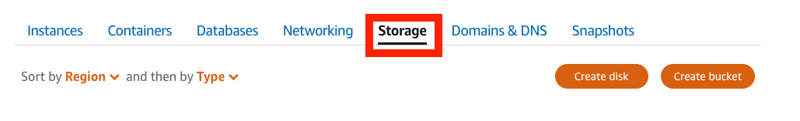
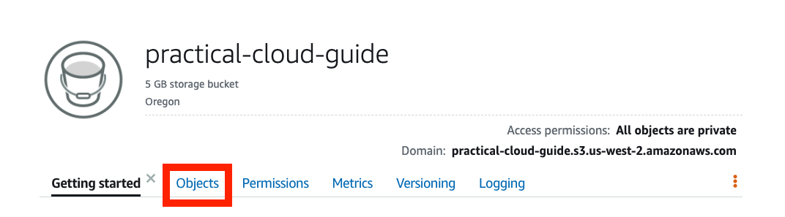
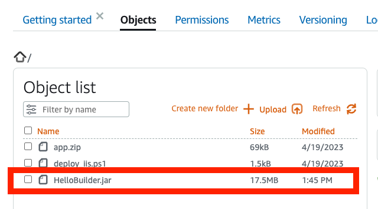

The [previous tutorial]() demonstrated how to create a Windows Server VPS and deploy an ASP.NET Core application. A common and similar task is deploying a Java application on a Linux server. While Javascript frameworks such as Node.js have increased in popularity for applications in the cloud, Java frameworks such as SpringBoot are equally popular in enterprise environments.

This tutorial demonstrates how to deploy a Java application on a Linux VPS with AWS Lightsail. If you’re unfamiliar with AWS Lightsail check out the overview in the previous tutorial<add link>. We’ll use the previous DevOps scenario where the software is compiled by a CI/CD and stored in an S3 bucket. You copy the software or artifact from AWS S3 bucket or object store to deploy on a Linux VPS.

## What you will learn

- How to deploy and configure a Linux server on AWS Lightsail.
- Configure and deploy a Java SpringBoot application with a launch script or User data.
- Configure the VPS network with a static IP and open a port for the Java application

## Prerequisites

Before starting this tutorial, you will need the following:

- An AWS account: If you don't already have an account, follow the [Setting Up Your Environment](https://aws.amazon.com/getting-started/guides/setup-environment/) tutorial. For a quick overview for creating account follow the [Create Your AWS Account](http://%20https://aws.amazon.com/getting-started/guides/setup-environment/module-one/) instructions.
- AWS credentials: Follow the instructions in [Access Your Security Credentials](https://aws.amazon.com/blogs/security/how-to-find-update-access-keys-password-mfa-aws-management-console/#:~:text=Access%20your%20security%20credentials) to get your AWS credentials
- A git client: Follow the instructions to [Install Git](https://github.com/git-guides/install-git) for your operating system.

## Sections
<!-- Update with the appropriate values -->
| Info                | Level                                  |
| ------------------- | -------------------------------------- |
| ✅ AWS Level        | 100 - Beginner                          |
| ⏱ Time to complete  | 15 minutes                             |
| 💰 Cost to complete | Free when using the AWS Free Tier or USD 1.01      |
| 🧩 Prerequisites    | - An AWS account: If you don't already have an account, follow the [Setting Up Your Environment](https://aws.amazon.com/getting-started/guides/setup-environment/) tutorial. For a quick overview for creating account follow the [Create Your AWS Account](http://%20https://aws.amazon.com/getting-started/guides/setup-environment/module-one/) instructions.<br>- AWS credentials: Follow the instructions in [Access Your Security Credentials](https://aws.amazon.com/blogs/security/how-to-find-update-access-keys-password-mfa-aws-management-console/#:~:text=Access%20your%20security%20credentials) to get your AWS credentials<br>- A git client: Follow the instructions to [Install Git](https://github.com/git-guides/install-git) for your operating system.|
| 💻 Code Sample         | [GitHub](<link if you have a code sample associated with the post, otherwise delete this line>)                             |
| 📢 Feedback            | <a href="https://pulse.buildon.aws/survey/DEM0H5VW" target="_blank">Any feedback, issues, or just a</a> 👍 / 👎 ?    |
| ⏰ Last Updated     | YYYY-MM-DD <as mentioned above>                             |

| ToC |
|-----|

---
## Module 1: Create an S3 bucket and upload files

### Overview

In DevOps, applications are typically built with Continuous Integration (CI) software. Code is pushed into the CI by developers where it is built and tested and released into cloud storage.

### What you will accomplish

In this module, the software is in a GitHub repository. You will clone the repository to copy the files to your local drive. The next step is to use Lightsail create an S3 bucket to store the files that can be accessed by a Windows Server deployed with AWS Lightsail.

### Implementation Instructions

> Steps 1-3 are optional if you completed the Deploy an ASP.NET Core Application on Windows Server with AWS Lightsail tutorial<add link>.

Step 1: Clone the practical-cloud-guide repository.

```powershell
git clone <repo url>
```

Step 2: Open the AWS Console and choose **Lightsail**.


Step 2: Open the AWS Console and choose Lightsail.


Step 3: Create an S3 bucket

Choose **Storage**.



In the **Create a new bucket** page choose the **5GB storage plan** and name the bucket `practical-cloud-guide`. Select **Create Bucket**.


You will see a menu page for the `practical-cloud-guide` bucket, choose **Objects**.



The **Object list** displays the objects in the bucket. Choose **Upload** to put the application and deployment file in the bucket.


Choose **File**.


Select `HelloBuilder.jar` from the `path\to\files` and choose **Open**.


The file will be added to the **Object list**.



## Module 2: Deploy an Amazon Linux Server

### Overview

In this section, you will create an Amazon Linux server, install Java, and deploy a SpringBoot Java application with a script that runs when the instance is launched. Configuration and deployment are performed through the Lightsail console without logging into the Linux server. You will also use the Lightsail console to open a port for the application and attach a static IP address to the server.

### What you will accomplish

You will use the AWS Lightsail console to instantiate an AWS Linux VPS and configure it using the User Data option when creating the Linux VPS.

### Implementation instructions

Step 1: Deploy a VPS AWS Linux Server

Choose **Create instance**.


Step 2: Choose the instance image.

1. Select Linux/Unix for a platform. 
2. For a Blueprint, choose OS Only.
3. Choose Amazon Linux 2


Step 3: Configure the VPS with a shell script 

Choose **Add launch script**.


Configure an instance at launch by adding a shell script that runs when instance starts. The script exports your access key, secret key, and AWS region. These are temporary credentials only available at launch. The script needs your credentials to copy the SpringBoot application, HelloBuilder.jar, from your S3 bucket. Note that AWS CLI commands are available to use in the script. After the script copies the jar file, it installs Java and starts the application. 

Copy the script add your credentials and AWS region.

```bash
export AWS_ACCESS_KEY_ID=<your_access_key>
export AWS_SECRET_ACCESS_KEY=<your_secret_key>
export AWS_REGION=<your_aws_region>

aws s3 cp s3://practical-cloud-guide/HelloBuilder.jar /home/ec2-user/HelloBuilder.jar
sudo yum -y install java-17-amazon-corretto-headless
java -jar /home/ec2-user/HelloBuilder.jar
```


**Choose your instance plan**. The smallest instance works for this tutorial but larger instances are more performant.


Name your instance, for example `Amazon_Linux_2_Java`. Choose **Create instance** to instantiate the VPS.


## Module 3: Configure networking

The Lightsail Linux VPS includes both a private and public IP address. However, only `port 22` and `port 80` are open by default. The Java application is running but available on port 8080. In this module, you will configure networking to open `port 8080` and add a static IP address.

Step 1: Open port 8080.

Select the name of Linux VPS to open the menu for the instance.


Choose **Networking** to open the networking menu.


The VPC has a public and private IP and the **IPV Firewall** opens `port 22` and `port 80`.


To open a port, select **Add rule**.


Choose **Custom** and add `8080` as a port. Select **Create**.


Port `8080` added to the firewall.


Step 2: Add a static IP

When a VPS is restarted, a new public IP address is assigned to the instance. You can assign a static IP address so that the application is available at the same address when restarted.

From the Lightsail Home menu, choose **Networking**.


Choose **Create static IP**.


Attach a static IP to and instance. Choose the VPS you created.


Give the static IP a unique name. Choose **Create**.


Open a browser to the static IP on port 80 and the Java application returns a page with a message the time.


## Module 4: Clean up

To prevent additional costs, delete the Linux VPS created for the tutorial. Deleting the S3 bucket is optional. You can keep the S3 bucket to use with other tutorials.

Step 1: Delete the Amazon Linux server

Choose **Instances** in the Lightsail menu and select the three red dots. Choose **Delete**.


Choose **Yes, delete**.


Step 2: Delete the S3 bucket (Optional)

Choose **Storage** on the Lightsail menu. Select the three vertical dots.


Choose **Delete**.


Choose **Force Delete** to delete the files and the S3 bucket.


## What did you accomplish?

In this module you deployed a Linux VPS using Lightsail. The instance was configured by providing a script to download and install the jar file and a Java JDK to run the SpringBoot application. In a future tutorial, you will use the User Data feature to configure virtual machines or [Elastic Cloud Compute (EC2)](https://aws.amazon.com/ec2/) instances with a launch script. Note that your AWS credentials were only available at launch and not retained by the VPS.

Only ports 22 and 80 are open by default in a VPS. With Lightsail, you can open and close ports using the web console instead of manually configuring the network on the server. This is also true for adding a static IP address that ensures the application has a fixed IP address regardless if the instance has been restarted.

Deploying a VPS, either Windows or Linux. on AWS Lightsail reduces that amount of infrastructure configuration by providing the resources for a Virtual Private Cloud (VPC) including networking, storage, and even RDP or SSH sessions in the browser. However the key take away from these tutorials is that the cloud is programmable. You can use a Powershell script in the VPS or a shell script in User Data to use other cloud resources. For example, applications were downloaded from your S3 bucket. You can use the cloud’s Application Programming Interface (API) to build infrastructure that can be tested and replicated. The end goal of the Practical Cloud Guide is teach you how to build infrastructure by programming the cloud.

## What’s next?

The next set of tutorials shows how to migrate and deploy a relational database in the cloud. For now. you will continue to use AWS Lightsail, but you will perform the database deployment and migration with the AWS Command Line Interface (CLI) instead of the web console. Learning how to use the CLI is the first step towards building infrastructure with code.
