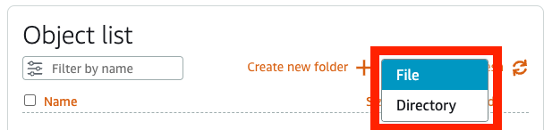
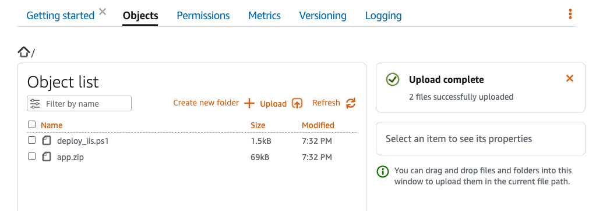
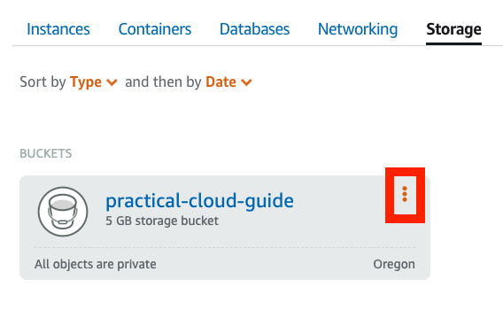

Deploying applications is a fundamental task for IT Pros. The Run in the Cloud stage of the Practical Cloud Guide for IT Professionals uses AWS Lightsail - a managed service for Virtual Private Servers (VPS), containers, databases, storage, and networking. The goal of the Run in the Cloud is to gain experience working in the cloud without building a cloud infrastructure.

## Lightsail Overview

For this task you will deploy an ASP.NET Core application on IIS in Windows Server. The application is simple web applications but requires installing and configuring IIS in addition to deploying it. Let’s begin with a AWS Lightsail overview to familiarize working with this service.

Open the AWS Console in a browser and use the search bar to find AWS Light Sail.


The Lightsail menu displays an option for **Instances**, or Virtual Private Servers. Choose **Instances**, then choose **Create instance**.


**Create an instance** has several options. First, choose the **Instance location**, you can leave the default or choose the closest AWS Region. Second, choose either Linux or Windows Server for the VPS. Third, you can choose a blueprint, which is a VPS with a pre-configured application for Linux instance; or you choose a OS Only VPS. For Windows Server, you can choose a blueprint for SQL Server or choose a version of Windows Server.


You can choose the Instance plan. One of the advantages of Lightsail is a fixed monthly cost for a VPS.


This is a brief overview of AWS Lightsail. As we progress through the tasks, we’ll go in depth with Lightsail’s other services.

## Getting started

In this tutorial you will create a Windows Server 2022 instance and deploy a ASP.NET Core application on IIS

### Overview details table

| Attributes                |                                   |
| ------------------- | -------------------------------------- |
| ✅ AWS Level | Intermediate - 200 |
| ⏱ Time to complete  | 45 mins|	
| 💰 Cost to complete| Free Tier eligible |
|  🧩 Prerequisites | - An AWS account: If you don't have an account, follow the [Setting Up Your AWS Environment](https://aws.amazon.com/getting-started/guides/setup-environment/) tutorial for a quick overview. For a quick overview for creating account follow [Create Your AWS Account](https://aws.amazon.com/getting-started/guides/setup-environment/module-one/).<br>
- AWS credentials: Follow the instructions in [Access Your Security Credentials](https://aws.amazon.com/blogs/security/how-to-find-update-access-keys-password-mfa-aws-management-console/#:~:text=Access%20your%20security%20credentials) to get your AWS credentials <br>
- A git client: Follow the instructions to [Install Git](https://github.com/git-guides/install-git) for your operating system. |
| 💻 Code Sample         | Code sample used in tutorial on [GitHub](<link if you have a code sample associated with the post, otherwise delete this line>)                             |
| 📢 Feedback            | <a href="https://pulse.buildon.aws/survey/DEM0H5VW" target="_blank">Any feedback, issues, or just a</a> 👍 / 👎 ?    |
| ⏰ Last Updated     | 2023-06-16                             |

| ToC |
|-----|

---
## Module 1: Create an S3 bucket and upload files

### Overview

In [DevOps](/concepts/devops-essentials), applications are typically built with Continuous Integration (CI) software. Code is pushed into the CI by developers where it is built and tested and released into cloud storage.

### What you will accomplish

In this module, the software and deployment script is in a GitHub repository. You will clone the repository to copy the files to your local drive. The next step is to create an S3 bucket to store the files that can be accessed by a Windows Server and deployed.

### Implementation Instructions

Step 1: Clone the `practical-cloud-guide` repository.

```bash
git clone <repo url>
```

Step 2: Open the AWS Console and choose Lightsail.


Step 3: Create an S3 bucket

Choose **Storage**.


In the **Create a new bucket** page choose the **5GB storage plan** and name the bucket `practical-cloud-guide`. Select **Create Bucket**.


You will see a menu page for the `practical-cloud-guide` bucket, choose **Objects**.


The **Object list** displays the objects in the bucket. Choose **Upload** to put the application and deployment file in the bucket.


Choose **File**.



Select `app.zip` and `deploy_iis.ps1` from the `path\to\files` and choose **Open**.


The files will be added to the **Object list**.



## Module 2: Deploy Windows 2022 Server

### Overview

A common task is to deploy a Windows Server configured with IIS. We will use the AWS Lightsail console to instantiate Windows Server 2000 and configure it to install .NET core and IIS with a Powershell script

### What you will accomplish

Using AWS Lightsail, you will deploy a Windows Server 2022 instance with IIS installed using a Powershell script.

### Implementation instructions

Step 1: Deploy Windows Server 2022

Choose **Create instance**.


Choose **Microsoft Windows**, then choose **Windows Server 2022**.


Choose an instance plan, for this tutorial you can use the smallest plan, but larger plans are more responsive.


Name your instance `Windows_Server_IIS`. Then choose **Create Instance**.

## Module 3: Deploy an ASP.NET Core application

### Overview

In the previous module, you created a Windows 2022 server with Lightsail. The next step is to provision the server with IIS and deploy a web application written in C#.

### What you will accomplish

This module shows how to install and configure IIS in Windows Server 2022., and deploy a ASP.NET Core application from an S3 bucket with a Powershell Script

### Implementation instructions

Step 1: Add your AWS Credentials

You can use an RDP client or **Use your browser** to log into the Windows server. You will download a deployment Powershell script and the ASP.NET Core application from the S3 bucket. Downloading files from S3 requires your AWS credentials, i.e. the Access Key and the Secret Key.

Open a Powershell terminal from either the Windows menu bar or by searching for Powershell. The Lightsail Windows Server instances include [AWS Tools for Powershell](https://docs.aws.amazon.com/powershell/), which are a set of Window cmdlets for creating and managing AWS resources.  Set your AWS credentials with Powershell.

```powershell
$YourAccessKey = "your_access_key"
$YourSecretKey = "your)secret_key"
Set-AwsCredential -AccessKey $YourAccessKey -SecretKey $YourSecretKey -StoreAs default
```

Check that your credentials were created. You should see `default` as the ProfileName.

```powershell
Get-AWSCredentials -ListProfileDetail

ProfileName StoreTypeName         ProfileLocation
----------- -------------         ---------------
default     NetSDKCredentialsFile
```

Step 2: Download the IIS install and configuration script from S3.

Create a directory from the root of the C:\ drive and name it `deploy`. Download the `deploy_iis.ps1` script from S3 with the `Copy-S3Object` cmdlet.

```powershell
New-Item -Path C:\deploy -ItemType Directory
cd C:\deploy
$YourBucketName = “practical-cloud-guide”
$YourAppKey = “deploy_iis.ps1”
Copy-S3Object -BucketName $YourBucketName -Key $YourAppKey -LocalFile C:\deploy\$YourAppKey
```

Step 3: Deploy IIS and an ASP.NET Core application

The deploy_iis.ps1 Powershell script automates the process of installing IIS and its management tools., configuring a new website and deploying a ASP.NET Core Razor application. Let’s break down the script before running it.

The first part of the script installs IIS and the management tools. To host the ASP.NET Core application, IIS requires ASP.NET Core hosting bundle. To learn more about IIS configuration see the IIS documentation. Note that the script sets ProgressPreference to SilentlyContinue to prevent cmdlet outputs from writing to the terminal.

Set-Variable $global:ProgressPreference SilentlyContinue

```powershell
# Install IIS
Install-WindowsFeature Web-Server -IncludeManagementTools

# Download and install the ASP.NET Core 6.0 Hosting Bundle
$filein = "https://download.visualstudio.microsoft.com/download/pr/7ab0bc25-5b00-42c3-b7cc-bb8e08f05135/91528a790a28c1f0fe39845decf40e10/dotnet-hosting-6.0.16-win.exe"
Invoke-WebRequest -Uri $filein -OutFile "$(pwd)\dotnet-hosting-6.0.16-win.exe"

Start-Process -FilePath "$(pwd)\dotnet-hosting-6.0.16-win.exe" -Wait -ArgumentList /passive

# Stop and start IIS
net stop was /y
net start w3svc
```

The second part of the script creates an directory for the application. The script downloads  app.zip from the S3 bucket you created earlier and unzips it on the directory.

```powershell
# download and unzip the application
$YourBucketName = "practical-cloud-guide-3"
$AppKey = "app.zip"
New-Item -Path 'c:\inet\newsite' -ItemType Directory
Copy-S3Object -BucketName $YourBucketName -Key $AppKey -LocalFile C:\inet\newsite\$AppKey
Expand-Archive C:\inet\newsite\$AppKey -DestinationPath C:\inet\newsite

The third part of the script disables the default IIS website, configures an ApplicationPool, a website, and deploys the application. If the script runs successfully, it opens Microsoft Edge and displays the application. See the Microsoft documentation for website configuration.

# Create application pool
$appPoolName = 'DemoAppPool'
New-WebAppPool -Name $appPoolName -force

# Create website
New-Item IIS:\Sites\DemoSite -physicalPath C:\inet -bindings @{protocol="http";bindingInformation=":8080:"}
Set-ItemProperty IIS:\Sites\DemoSite -name applicationPool -value $appPoolName

# Add application to website
New-Item IIS:\Sites\DemoSite\DemoApp -physicalPath C:\inet\newsite -type Application
Set-ItemProperty IIS:\sites\DemoSite\DemoApp -name applicationPool -value $appPoolName

# start new website
Start-WebAppPool -Name $appPoolName
Start-WebSite -Name "DemoSite"

# Open application on Edge
start microsoft-edge:http://localhost:8080/DemoApp
```

Run the script to complete the installation and deployment.

```powershell
C:\deploy\deploy_iis.ps1
```

## Module 4: Clean up

To prevent additional costs, delete the Windows Server 2022. Deleting the S3 bucket is optional. You can keep the S3 bucket to use with other tutorials.

Step 1: Delete Windows Server 2022

Choose **Instances** in the Lightsail Menu and select the three red dots.


Choose **Delete**.


Choose **Yes, delete**.


Step 2: Delete the S3 bucket (Optional)

Choose **Storage** on the Lightsail menu. Select the three vertical dots.



Choose **Delete**.


Choose **Force Delete** to delete the files and the S3 bucket.


## What did you accomplish?

The first cloud resource you created was an S3 bucket to store files that are accessible to cloud services. S3 is an object storage which is different from a file system which supports file read and write. You had to copy files from S3 to the Windows server to work with them.

The second cloud resource you created was a Virtual Private Server running Windows Server 2022. The Lightsail service provisions networking services within AWS that support connecting to other services such as S3. The Windows Server instance includes AWS Tools for Powershell and by adding your credentials, you can access other AWS services.

The `deploy_iis.ps1` Powershell script shows how you can use familiar scripting tools and commands to automate configuring Windows services such as IIS while interacting with AWS resources. Although a simple example, this shows how to implement a common DevOps workflow of deploying an application from an object store and automating the process with a script.

## What’s next?

In the next section of the Practical Cloud Guide, you will deploy a Java application on a Linux server with AWS Lightsail.
