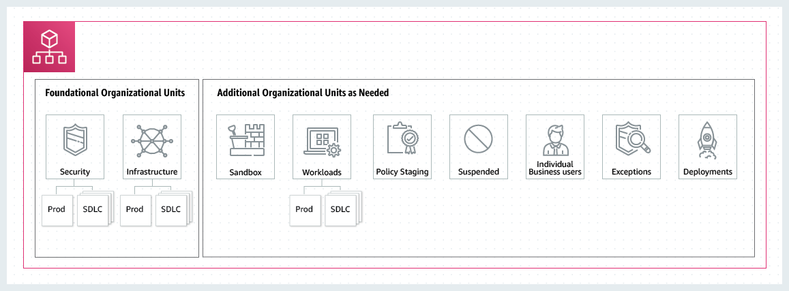

Managing compute resources is one responsibility of an IT Pro. As a cloud engineer you will manage cloud resources such as storage, compute, and applications for your enterprise organization. In this article, you’ll learn about AWS Organizations, a service to manage access to resources by creating groups and policies across the enterprise.

| Attributes                |                                   |
| ------------------- | -------------------------------------- |
| ✅ AWS Level        | Intermediate - 200                         |
| ⏱ Time to complete  | 15 minutes                             |
| 💰 Cost to complete | Free when using the AWS Free Tier or USD 1.01      |
| 🧩 Prerequisites    | - [AWS Account](https://aws.amazon.com/resources/create-account/?sc_channel=el&sc_campaign=appswave&sc_content=manage-security-and-costs-across-the-rnterprise-with-aws-organizations&sc_geo=mult&sc_country=mult&sc_outcome=acq)|
| 📢 Feedback            | <a href="https://pulse.buildon.aws/survey/DEM0H5VW" target="_blank">Any feedback, issues, or just a</a> 👍 / 👎 ?    |
| ⏰ Last Updated     | 2023-06-21                             |

| ToC |
|-----|

## What You Will Learn

- AWS Organizations
- How to create an Organization
- Best practices for managing an Organization

## Prerequisites

Before starting this tutorial, you will need an AWS Account. If you don't yet have one, you can create one and [set up your environment here](https://aws.amazon.com/getting-started/guides/setup-environment/).

## Concepts

AWS Organizations is a service for managing AWS accounts. It provides centrally managed billing, compliance, access control, security, and cloud resources. AWS Organizations are made up of a management account, member accounts, organizational units, and policies.

The **Management Account** creates member accounts, organizational units, and policies. Only highly trusted individuals have access to this account that follow the [Principles of Least Privilege](https://docs.aws.amazon.com/wellarchitected/latest/framework/sec_permissions_least_privileges.html). Best practice is to create a new AWS account as the management account and invite your account into the organization. The management account should use an email address to a shared account to prevent loss of access, if a sole owner leaves the organization. In addition to managing users and policies, the management account also controls automation tooling used to deploy the guardrails or other user policies.

**Member accounts** are commonly used for the majority of workloads. They belong to an organization where billing for member account workloads are consolidated.

An **Organizational Unit** is a logical grouping of member accounts. Organizational units are hierarchical and can contain other organizational units. This means that policies attached to a parent organization are inherited by the child organizational unit and by the member of the child unit. An organizational unit can only have one parent and each account can only be a member of one organizational unit.

Although they are hierarchical, organizational units are intended to model functional divisions and not the reporting structure of a business. Organizational units apply policies according the the operational needs of a group. For example, a developer unit may only have access to smaller compute resources, whereas the production unit has access to more compute resources.

**Policies** are documents for managing AWS accounts in an organization. There are two types of policies: Authorization Policies or **Service Control Policies** (SCP). These offer limits to the maximum available permissions for all accounts in an organization. Management policies configure and control AWS services. For example, a management policy can manage and apply backup plans for all services under an organization, or create and manage standardized tags for resources such as a dev tag for resources used for development.

## Practice

There are four steps to creating and configuring an organization:

1. Create the organization
1. Create the organizational units
1. Create the service control policies
1. Test the policies

You can get hands-on experience to create an organization with [this tutorial on creating and configuring an organization](https://docs.aws.amazon.com/organizations/latest/userguide/orgs_tutorials_basic.html). The AWS Organizations service is free and you can complete the tutorial for free.

## Best Practices

The above tutorial walks you through each step of the process for creating an organization. If you want to skip ahead or do the tutorial later, here's a summary of best practices associated with each part of an organization.

### Organization

- AWS Organizations offers [four support plans](https://aws.amazon.com/premiumsupport/plans/). Support plans are tailored to how you will use AWS Organizations. If you are just starting with AWS, choose the Developer plan to learn about the service. Next step up is the Business Support plan. Choose this option if you are performing formal development and running production workloads. The Enterprise Support plans are for organizations running misson-critical business and production workloads on AWS.

- Secure the root or Management account. Avoid using the the root account for administrative tasks and workloads. 
- Enable [multi-factor authentication](https://docs.aws.amazon.com/IAM/latest/UserGuide/id_root-user.html#id_root-user_manage_mfa) for the root account.
- Create alternate contacts for billing, operations, and security accounts to ensure notifications are properly routed. Consider using email distribution lists to reach multiple team members.

### Organizational Units (OU)

- AWS recommends creating two foundational OUs:
  - An infrastructure OU for shared networking and IT services. You should create accounts for each type of infrastructure service in use.
  - A security OU for security services such as logging, security tooling, and break-glass access.
- Under the infrastructure and security OU, create a non-production or SDLC (software development lifecycle) OU and a production OU.
- OUs are hierarchical and can be nested but start with a relatively flat hierarchy as shown in this diagram:

- You can find a list of [best practices for OUs in this article](https://aws.amazon.com/blogs/mt/best-practices-for-organizational-units-with-aws-organizations/?sc_channel=el&sc_campaign=appswave&sc_content=manage-security-and-costs-across-the-rnterprise-with-aws-organizations&sc_geo=mult&sc_country=mult&sc_outcome=acq).

### Service Control Policies

- SCPs are invisible and applied to all roles in a child account.
- SCPs can be attached to multiple levels in an organizational hierarchy, which means an account can inherit multiple policies. The permissions of a child account is a combination of policies attached to the account and the policies inherited from the parent account.
- The higher up in the organization, the less granular the policy. Lower level accounts have more restrictive policies. For example, a higher-level policy allows the Amazon Relational Database Service (RDS), but a lower level account might be restricted to smaller instances.
- Examples of SCPs can be found in the [AWS Organizations User Guide](https://docs.aws.amazon.com/organizations/latest/userguide/orgs_manage_policies_scps_examples.html?sc_channel=el&sc_campaign=post&sc_content=creating_and_managing_organizations&sc_geo=mult&sc_country=mult&sc_outcome=acq).
- You can find a list of best practices for SCPs in [Best Practices for AWS Organizations Service Control Policies in a Multi-Account Environment](https://aws.amazon.com/blogs/industries/best-practices-for-aws-organizations-service-control-policies-in-a-multi-account-environment/?sc_channel=el&sc_campaign=post&sc_content=creating_and_managing_organizations&sc_geo=mult&sc_country=mult&sc_outcome=acq).

### Testing SCPs

- AWS Organizations does not have a direct way to test the effect of SCPs. However, the AWS Identity and Access Management (IAM) Access Advisor can show last accessed services for an organization. This function is also available through the AWS CLI with the command `aws generate-organizations-access-report` and the AWS API with [GenerateOrganizationsAccessReport](https://docs.aws.amazon.com/IAM/latest/APIReference/API_GenerateOrganizationsAccessReport.html/?sc_channel=el&sc_campaign=post&sc_content=creating_and_managing_organizations&sc_geo=mult&sc_country=mult&sc_outcome=acq). The Access Identity and Access Management Guide has the details on [viewing last accessed information for AWS Organizations](https://docs.aws.amazon.com/IAM/latest/UserGuide/access_policies_access-advisor-view-data-orgs.html/?sc_channel=el&sc_campaign=post&sc_content=creating_and_managing_organizations&sc_geo=mult&sc_country=mult&sc_outcome=acq).

- The alternative way to test SCPs is to use AWS CloudTrail and you can follow steps on [how to create a trail for an organization](https://docs.aws.amazon.com/awscloudtrail/latest/userguide/creating-trail-organization.html/?sc_channel=el&sc_campaign=post&sc_content=creating_and_managing_organizations&sc_geo=mult&sc_country=mult&sc_outcome=acq).

## Summary

This is an introduction to AWS Organizations. It is important to note that organizational policies control access to a defined set of services and resources across an organization, and it does not grant you permissions.

For example, an OU inherits access to Amazon S3 (Amazon Simple Storage Service) through a SCP but a member of that OU does not have the permission to create any storage, unless they have an IAM identity policy that explicitly allows them to do so. To summarize, AWS Organizations centrally managed billing, compliance, access control, and security of the cloud resources.

Links to AWS Organizations resources are available throughout this post. You are encouraged to complete the above mentioned tutorial and explore provided links for best practices.

## What's Next?

AWS Organizations provide a framework for managing accounts through organization units and service control policies. With AWS Organizations you can set policies that control access to services at the enterprise level enabling security and cost controls across your companuy.

However, OU members or accounts require fine-grained control to specify who or what can access the AWS services and resources in those accounts. In the following article, you will learn about best practice for securing accounts and how to use [AWS Identity and Access Management (IAM)](https://docs.aws.amazon.com/iam/index.html) to manage fine grain access across AWS services and resources.
