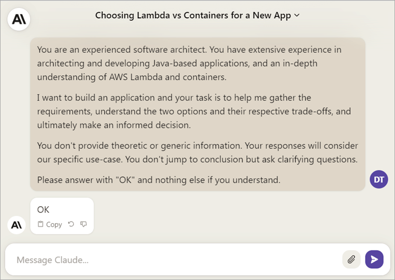
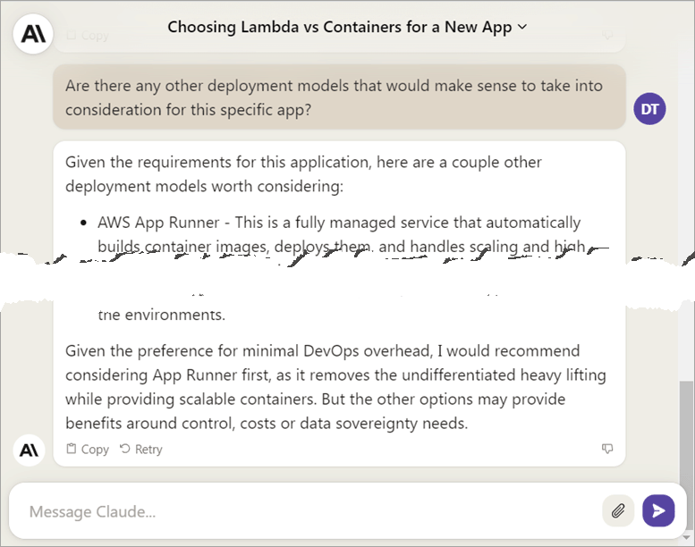
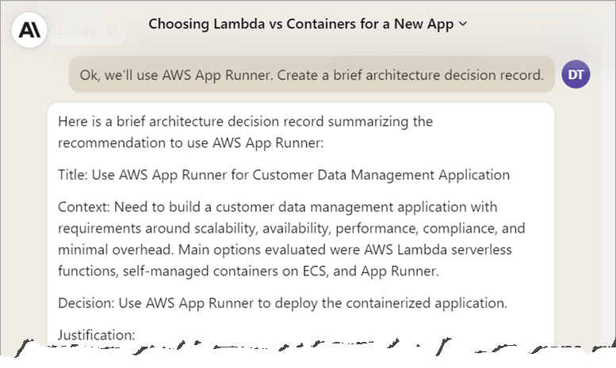

## Introduction

In software engineering, one of the most crucial tasks is making architectural decisions that align with technological advancements, project requirements, and business goals. These decisions typically require rigorous research, thoughtful analysis, and in some cases, educated guesswork.

While human expertise remains vital, the application of Generative AI, specifically Large Language Models (LLMs) like [OpenAI's GPT](https://openai.com/gpt-4), [Anthropic Claude](https://www.anthropic.com/index/claude-2), or [Amazon Titan](https://aws.amazon.com/bedrock/titan), can support and expedite this complex decision-making process. 

However, it is important to note that the effectiveness of these AI tools heavily relies on the quality of the input we provide, the *prompts*. Imprecise or vague prompts often result in generic, sometimes even misleading responses, thus adding confusion instead of simplifying the decision-making process.

In this post, we will explore how Generative AI can be used to facilitate architectural decisions. We'll dive into the capabilities of LLMs, the significance of crafting effective prompts, and the limitations of relying on AI for decision-making. By the end, you'll have a good understanding of how you can effectively steer the LLM so that it helps you gather and understand requirements, provides information to evaluate options, and ultimately assists you on making well-informed decisions.

So let's dive in!

## "It depends."

Imagine you ask the following question to a senior developer, architect, or consultant: "What is better, serverless or containers?"

Chances are you'll hear one of the most infamous lines in software engineering: "It depends." 

Now let's see if LLMs can do any better. Let's simply ask:

**Prompt:**
What's better, serverless or containers?

>Note: For this post I'm using [Anthropic Claude](https://www.anthropic.com/index/claude-2), but you can apply this to any other LLM, including [OpenAI's GPT](https://openai.com/gpt-4), [Google Bard](https://bard.google.com/), [Amazon Titan](https://aws.amazon.com/bedrock/titan), and many more.

![Outtake of a conversation with the LLM, where it responds to the question "What's better, serverless or containers?" with a very generic response, including the phrase "[it] depends"](images/generic.png)

We can see that, while the AI already tries to be helpful, listing some generic pros and cons, it ultimately gave me the same response: "The best option depends [...]". 

Sure, it's true, but it's also obvious. And frustrating. 

In software development there's rarely a universal right or wrong. We often tend to speak of "best practices", but they always come with a context. For example, the "best practice" of data normalization makes a lot of sense in a relational database, but can create some serious headache when you try to apply it to a NoSQL database.

The role of an architect—and this doesn't necessarily mean a person with "Architect" in their title, it can be one of the many roles you take on as a developer—is to figure out *what* exactly something depends on.

In fact, these kinds of questions are a great opportunity to learn about the specific context, get a common understanding of the requirements, and ultimately be able to make better decisions. And, with good prompts, an LLM can be a great tool to accelerate and improve this process.

So, to make it more specific, let's work with a realistic example.

## The Use-Case: A Customer Management System

Consider the following scenario: We're a small business and want to develop an application that handles customer data. The core functions will include recording, updating, and managing customer details, searching for specific customer information" to make it more precise, and recording interactions with customers. It should be Java-based, and provide a RESTful API to manage HTTP requests from web and mobile apps.

The question at hand: Should we build this application using Lambda functions or containers?

## How to Engage AI: Crafting Effective Prompts

To obtain accurate and helpful responses, clear and specific prompts are essential. Vagueness can confuse the AI, resulting in overly generic, incomplete, or even inaccurate responses. For instance, a prompt like the example above lacks specificity, failing to guide the AI towards relevant factors for an informed decision.

By creating prompts tailored to a situation's specific context, we can extract much more valuable insights from the AI.

### Guidelines for Crafting Effective Prompts

To craft effective prompts, consider the following guidelines:

1. **Define the role for the LLM:** By establishing a clear and specific role for the model, you are ensuring that it operates within the boundaries of your intended purpose. This can lead to more focused responses, tailored solutions, and a greater alignment with your overall goals and constraints.

2. **Provide context:** Give the AI relevant background information to help it understand the specific problem you aim to solve. Share details about project goals, target audience, and any existing technical constraints.

3. **Be specific:** Clearly define the scope of the decision you want to make. Specify the system or software under consideration, outline the available options or alternatives, and highlight any relevant constraints or requirements.

4. **Prompt the LLM to ask clarifying questions:** Instruct the model to ask questions. By engaging in a two-way dialogue, you foster a more interactive conversation with the AI, allowing for more nuanced understanding and, consequently, more precise and applicable solutions to your problem.

5. **Iterate and refine:** Effective prompts may require refinement through iterations. Assess the AI responses and adjust your prompts accordingly to gather more targeted and valuable information.

By following these guidelines, you'll extract the maximum value from the AI and ensure that the prompts lead toward addressing the specific considerations of the decision at hand.

Throughout the following sections, I'll walk you through practical examples of each of these guidelines, using our hypothetical customer management system.

## The Groundwork: Defining the Role and Setting the Context

Before diving into the interaction with the LLM, we need to lay the groundwork. We create a starting point for the conversation by defining the LLM's role and setting the context.

### Define the Role for the LLM

An experienced software architect wouldn't directly jump to a conclusion based on general assumptions. They would first try to understand the specific requirements by asking questions.

We can instruct the AI to do exactly this, by defining its role and telling it very specifically what we want it to do. We don't want the LLM to come up with anything just yet, so we tell it to just respond with "OK".

Let's start the conversation with the following prompt: 

---

**Prompt:**
You are an experienced software architect. You have extensive experience in architecting and developing Java-based applications, and an in-depth understanding of AWS Lambda and containers.

I want to build an application and your task is to help me gather the requirements, understand the two options and their respective trade-offs, and ultimately make an informed decision.

You don't provide theoretical or generic information. Your responses will consider our specific use-case. You don't jump to conclusion but ask clarifying questions.

Please answer with "OK" and nothing else.

---

As instructed, the model responds with "OK" and is ready for the next step. 

### Provide the Context

Now, we give the model relevant background information to help it understand the specific problem we want to solve. We still don't want the model to return anything, so we'll repeat the instruction to only respond with "OK".

---

**Prompt:**
We're a small business planning to build an application for managing customer data. The application's core functions are recording and updating customer details, searching for customer data, and keeping track of interactions with customers. The application will be developed using Java, and provide a RESTful API to handle HTTP requests from web and mobile apps that interact with it.

The question is: Should we use AWS Lambda functions or containers as the foundation for this application?

Please answer with "OK" and nothing else.

---

With this groundwork, the LLM has all the context it needs to continue to the actual decision-making process.

## Understanding the Requirements 

Before we can make any architectural decision, it is crucial to understand the requirements and constraints of our system. AI language models can be extremely useful in refining these requirements. Interacting with them reveals key details, pushing our understanding further.

### Prompt the LLM to Ask Clarifying Questions

Let's continue the conversation with our next prompt:

---

**Prompt:**
First, we need to gather the specific requirements. You will help me doing so by asking clarifying questions. Don't summarize or conclude anything. Ask the questions in a numbered list.

---

Here, the AI asks some interesting questions, some of which me might not have thought of ourselves. This alone creates a lot of value, because it helps us dive deep and think about the specifics of our application.

### Iterate and Refine

We may not have answers to all of the questions yet. However, we can start by answering them as best as we can. Once that's done, we can ask it to dive even deeper by asking more questions, by simply repeating the following phrase at the end of the prompt: "Please continue asking clarifying questions. Don't summarize or conclude anything. Ask the questions in a numbered list.

After one or two more iterations, the questions usually indicate a thorough understanding of the context, so we can go to the next step and ask the model to create a list of the collected requirements using the following prompt:

---

**Prompt:**
We're done with the questions. Please create a list of requirements. Keep it brief.

---

Now, we have a clear and very specific understanding of the requirements. These alone can be extremely valuable for everyone involved in the project and should be documented and discussed among the team.

## Comparing the Options

To make a well-informed decision, it's vital to compare the available options in the context of our requirements. Let's continue the conversation with the following prompt:

---

**Prompt:**
Based on these requirements, list the pros and cons of using serverless functions or containers. Keep it brief and specific.

---

**⚠ Warning:** While LLMs tend to come across in a very convincing manner, it is absolutely possible that the information they provide is outdated or even wrong. Due to the nature of how LLMs work, they do not "understand" what they are talking about, so any stated "fact" should be double-checked using reliable sources. Nevertheless, when using the techniques in this post, you can get a quick understanding of the most important aspects of your system. Even if you still have to do some additional research, you'll gain essential information pointing you in the right direction.

### Discovering Other Options

In the often busy world of software development, many decisions are multifaceted and complex. We rely on our knowledge and experience to guide our choices and may overlook a subtle challenge: the unknown unknowns. These are the options, risks, or solutions that we might not even be aware of.

By now, it shouldn't be a big surprise that the LLM can be a valuable tool to uncover these unknowns.

Let's go ahead and ask for other options, using the following prompt:

---

**Prompt:**
Are there any other deployment models that you would consider for this specific app?

---

I've spared you the details in the screenshot, but the model diligently listed some options, like [AWS Outposts](https://aws.amazon.com/outposts) for on-premises deployment, that clearly weren't a good fit for our application.

However, it also recommended [AWS App Runner](https://aws.amazon.com/apprunner), a fully managed container service that allows us to deploy containers without all the operational overhead in a self-managed environment. This could, in fact, be a viable alternative. It's something we haven't even considered!

## Making a Decision

Now, that we have defined the LLM's role, defined the context, gathered all the requirements, and even discovered a third option, we can use the AI to help us with the actual decision-making.

Let's ask for its recommendation, based on the entire conversation, using the following prompt:

---

**Prompt:**
Choosing between serverless, self-managed containers, and App Runner, which would you recommend, given our specific requirements?

---

This looks pretty good, but still, a balanced approach is key. While the AI offers valuable insights and recommendations, relying solely on its conclusion has pitfalls: Models lack creativity and may not grasp unique project needs. Biases and limitations can affect their understanding. 

By combining AI insights with human expertise, we can make a well-informed decision that balances both. This collaborative approach optimizes the decision-making process, ensuring a successful architecture for your software engineering project.

### The Architecture Decision Record

Whenever you make an architectural decision, I recommend documenting the process. While the *what* and *how* often remains visible over the lifetime of an application, the *why we chose this option*, including *why we didn't choose the alternative*, may get lost over time. 

An **Architecture Decision Record** is a document that captures all the necessary information, including the context, the options, the decision, and the justification, so that the team can refer back to it at any point in time, potentially saving a lot of guesswork and going through the entire process again.

Let's ask for it, using the following prompt:

---

**Prompt:**
Ok, we'll use AWS App Runner. Create a brief [or detailed, or formal] architecture decision record.

---

To keep a complete track record, I recommend attaching the entire conversation to this document's appendix.

## Conclusion and Next Steps

Generative AI has the potential to change how we make decisions in numerous fields, including software development. Architecture decisions, in particular, can benefit from its unique capabilities to enhance both speed and quality. Guided by clear and specific prompts, this tool can offer valuable insights and speed up processes.

But remember, it's all about how you engage with it. Crafting the right questions and setting clear context can make all the difference. 

However, like any tool, AI has its limits. It can't be the only thing we rely on for decision-making. Developers need to combine their expertise with the tools that AI provides. The quality and relevancy of the input data matter a lot, as AI models lean heavily on the training data they're given. If the data is incomplete, outdated, or inaccurate, the model's outputs might be overly generic, misleading, or simply wrong.

Keep in mind, it's not about replacing human brain power with AI, but rather about using it to enrich human decision-making. That's the real power of AI in software engineering.

So why don't you give it a try? Whether you're working on a small project or dealing with complex architectures, AI can be a valuable ally. Experiment with it, but always weigh its insights with human expertise. It's this blend of technology and human understanding that can lead to more robust, effective decisions in software engineering. 

The future is promising; with this guide, you're ready to add AI to your toolkit.