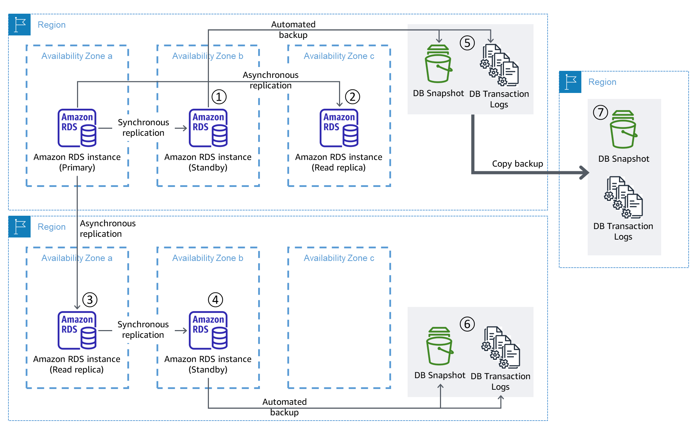
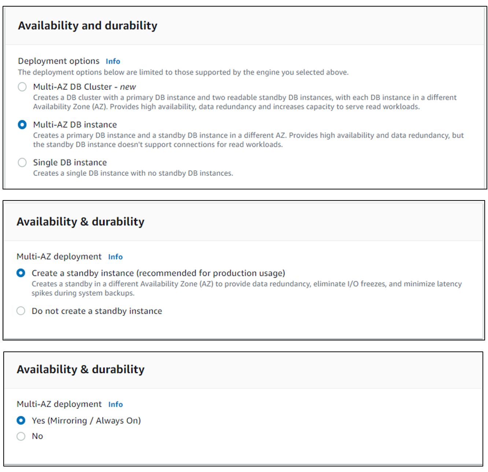
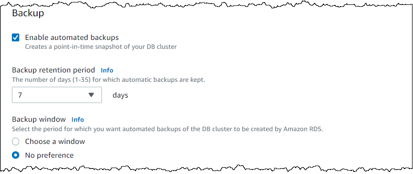
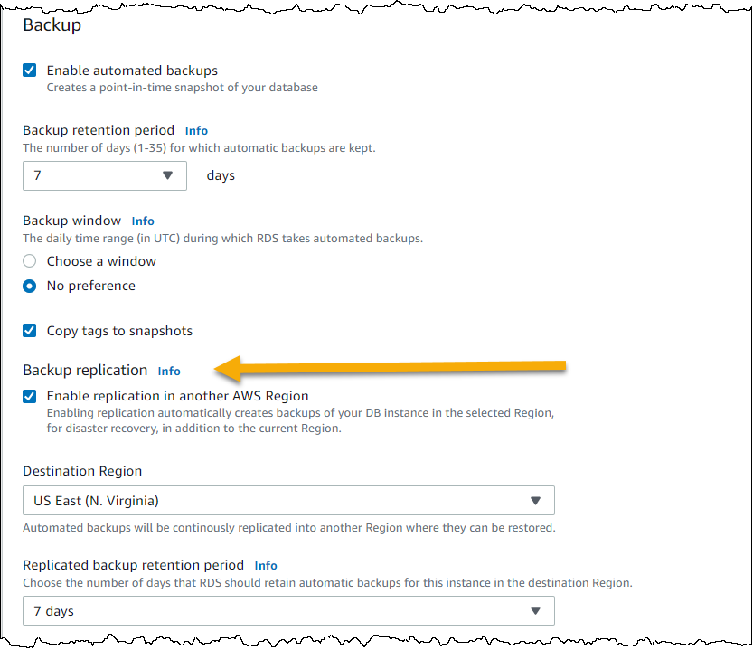

In this guide we will show how to protect data stored in [Amazon Relational Database Service (Amazon RDS)](https://docs.aws.amazon.com/AmazonRDS/latest/UserGuide/Welcome.html) from [major disaster events](https://docs.aws.amazon.com/whitepapers/latest/disaster-recovery-workloads-on-aws/what-is-a-disaster.html). Disasters occur infrequently, but when they happen it is crucial you have a strategy that enables you to protect your data.  Amazon RDS is a managed service, which means AWS manages tasks for you such as server maintenance, and software (operating system, database system) installation and patching. With RDS, you then setup and run the database engine of your choice from among MariaDB, Microsoft SQL Server, MySQL, Oracle, or PostgreSQL, with just a few commands.

When you think about data protection, consider two mechanisms. *Backup is* a batch operation on your entire data store or on incremental changes since the last full backup. *Replication* happens in real, or near-real, time as either logical transactions or physical blocks copied to a replica. The replica or backup should be in another location such as another Availability Zone (which is a distinct, separate set of data centers) or even another AWS Region (a physical location in the world where AWS has multiple Availability Zones).  Backups protect against deletion or corruption, and allow you to restore to the last known good state. Therefore it is a best practice to always backup your data in addition to replication.

A *defense in depth* approach means there are several layers of protection. Workload criticality will determine whether you need all layers for a specific database. Figure 1 shows the several layers of RDS data protection this guide will cover. This guide will show you how to do this using the AWS Console, however these configurations can also be done using the [AWS CLI](https://aws.amazon.com/cli/) or [AWS SDK](https://aws.amazon.com/developer/tools/)

Figure 1. Database replication and backup with Amazon RDS

## Replication to a standby instance

Our first layer of protection is in-Region, synchronous replication.  Using [Multi-AZ Deployment](https://docs.aws.amazon.com/AmazonRDS/latest/UserGuide/Concepts.MultiAZSingleStandby.html), a primary database instance located in one Availability Zone (AZ), is synchronously replicated to a standby database in another AZ (Figure 1-①). In case of a failure of the primary instance, the standby takes over. This can be implemented at DB creation, or an existing DB can be modified to become Multi-AZ

1. Open the Amazon RDS console at https://console.aws.amazon.com/rds/
2. In the navigation pane, choose **Databases**
3. To create a new DB click **Create Database** / To modify an existing DB, click the radio button next to the DB name and then click **Modify**
4. Under **Availability and durability**, make the selection for Multi-AZ DB. The wording of this selection will vary based database engine (Figure 2)
   1. For MySQL or PostGres DB, select **Multi-AZ DB instance**
   2. For MariaDB and Oracle DBs, select **Create a standby instance**
   3. For a SQL Server DB select **Yes (Mirroring / Always on).** This is because SQL Server DB instances [use SQL Server Database Mirroring (DBM) or Always On Availability Groups (AGs)](https://docs.aws.amazon.com/AmazonRDS/latest/UserGuide/USER_SQLServerMultiAZ.html).
5. Select your other options and continue the prompts to create or modify your DB

Figure 2. Availability and durability options for Amazon RDS

The [Multi-AZ DB cluster](https://docs.aws.amazon.com/AmazonRDS/latest/UserGuide/multi-az-db-clusters-concepts.html) option is another way to deploy Multi-AZ. It consists of a read/write instance plus two standby DB instances. Each standby is read-only, and the cluster presents read and write endpoints that handle load-balancing and rerouting connections when some DB instances aren't available. If the writer instance fails one of the read instances is promoted to become the new writer. This is available for RDS for MySQL and RDS for PostgreSQL

## Replication to one or more read replica instances

The next layer of protection is still in-Region, and enables asynchronous replication to one or more [read replicas](https://docs.aws.amazon.com/AmazonRDS/latest/UserGuide/USER_ReadRepl.html). By replicating to an instance in a different Availability Zone than your primary and standby instances, you can achieve additional  fault isolation to protect your database data (Figure 1-②).  Read replicas are created from an already existing RDS DB instance.

1. Open the Amazon RDS console at https://console.aws.amazon.com/rds/
2. In the navigation pane, choose **Databases**
3. Click the radio button next to the DB name and then click **Actions**, then **Create read replica**
4. Supply the required options. Consider the following when supplying these values
   1. We recommend that you use the same DB instance class and storage type as the source DB instance for the read replica.
   2. Under **Network & Security** is where you can specify the Availability Zone. In Figure 3 we place it in Availability Zone c, as shown in Figure 1.

Figure 3. Configuring Availability Zone when adding a read replica

## Replication to another AWS Region

Amazon RDS also supports cross-Region Read Replicas (Figure 1-③) for all database engines except for SQL Server. Like all read replicas, a read replica that is cross-Region can be set up with its own standby instance in a different Availability Zone (Figure 1-④). Regions are separated by large distances and are designed to be isolated from the other Regions. Therefore, securing a copy of your data in another Region provides another layer of fault isolation to our defense in depth.

To create a read replica in another AWS Region, under **Network & Security** select the **Destination region** for the replica (Figure 3).

## Backup within the same AWS Region

The strategies so far provide a high degree of protection for your database data. However they are all replication strategies, and therefore do not protect your data from disaster events that involve the loss or corruption of a large set of data (or the entire database) due to either accidental or malicious action. To add a layer of protection against this, you must create data backups. Automated backups provide the ability for point in time recovery (PITR) to the last known good state of your data.

Amazon RDS automated backups create a periodic snapshot of your database and also backup transaction logs between snapshots (Figure 1-⑤) to enable PITR. The transaction logs are saved every five minutes, therefore the latest restorable time should be no more than five minutes before the present. Backups are stored in Amazon S3 in-Region by default.

1. Open the Amazon RDS console at https://console.aws.amazon.com/rds/
2. In the navigation pane, choose **Databases**
3. To create a new DB click **Create Database** / To modify an existing DB, click the radio button next to the DB name and then click **Modify**
4. Click to expand **Additional configuration**
5. Under **Backup**, supply the following (Figure 4):
   1. **Enable automated backups** is checked
   2. **Backup retention period** is set from 1 to 35 days - this will determine the oldest point you can restore from
   3. **Backup window** is then the daily snapshot will be taken. You can use the [default values here](https://docs.aws.amazon.com/AmazonRDS/latest/UserGuide/USER_WorkingWithAutomatedBackups.html#USER_WorkingWithAutomatedBackups.BackupWindow), or set your own
   4. Note: when using the CLI or SDK you enable automated backups by using a positive nonzero value for retention period

Figure 4. Configuring automated backups for RDS

## Backup to another AWS Region

A discussed earlier, securing data in another Region provides another layer of protection. Amazon RDS database can copy snapshots and transaction logs to a different AWS Region (Figure 1-⑦) when using [Oracle, PostgreSQL and Microsoft SQL Server](https://docs.aws.amazon.com/AmazonRDS/latest/UserGuide/Concepts.RDS_Fea_Regions_DB-eng.Feature.CrossRegionAutomatedBackups.html) database engines.

During DB creation you enable this feature and specify the destination Region and retention period of the copied backup, as part of creation (Figure 5).

Figure 5. Configuring backup replication to another Region during DB creation

You can also modify an existing DB to enable cross-Region backup copying (Figure 6):

1. Open the Amazon RDS console at https://console.aws.amazon.com/rds/
2. In the navigation pane, choose **Automated backups**.
3. On the **Current Region** tab, Click the radio button next to the DB name and then click **Actions**, then  **Manage cross-Region replication**.
4. Under **Backup replication**, choose **Enable replication to another AWS Region**.
5. Choose the **Destination Region**.
6. Choose the **Replicated backup retention period**.

Figure 6. Configuring backup replication to another Region by modifying an existing DB

To prevent any impact on your primary DB during the automatic backup window, the backup is taken from the standby instance (as shown in Figure 1), when using MariaDB, MySQL, Oracle, or PostgreSQL engines. Otherwise, storage I/O might be suspended briefly while the backup process initializes (typically under a few seconds).

For database engines that do not enable the copying of automated backups, you can instead implement the strategy shown in Figure 1-⑥. Here we use the cross-Region read replica as the source for automated backup. This backup will provide he PITR needed if we need to restore to a known good state prior to data deletion or corruption.

## Summary

Replicas provide the ability to restore data quickly and with minimal data loss. Backups provide the ability to restore to a specific point in time, and therefore to a known good state prior to data corruption or deletion. The guide shows you how to use a combination of both approaches, putting your data in different Availability Zone and AWS Regions, to achieve the highest degree of fault isolation to protect your relational database data in RDS.

## Recommended next steps

- AWS Documentation
  - [Amazon RDS: Backing up and restoring an Amazon RDS DB instance](https://docs.aws.amazon.com/AmazonRDS/latest/UserGuide/CHAP_CommonTasks.BackupRestore.html)
  - [Amazon RDS: Working with read replicas](https://docs.aws.amazon.com/AmazonRDS/latest/UserGuide/USER_ReadRepl.html)
- Hot-to guide
  - [Amazon RDS Backup & Restore Using AWS Backup](https://aws.amazon.com/getting-started/hands-on/amazon-rds-backup-restore-using-aws-backup/)
- Well-Architected workshop
  - [Testing Resilience of EC2, RDS, and AZ USing Chaos Engineering](https://wellarchitectedlabs.com/reliability/300_labs/300_testing_for_resiliency_of_ec2_rds_and_s3/) - This lab illustrates how RDS fails over to the standby instance to maintain availability
 