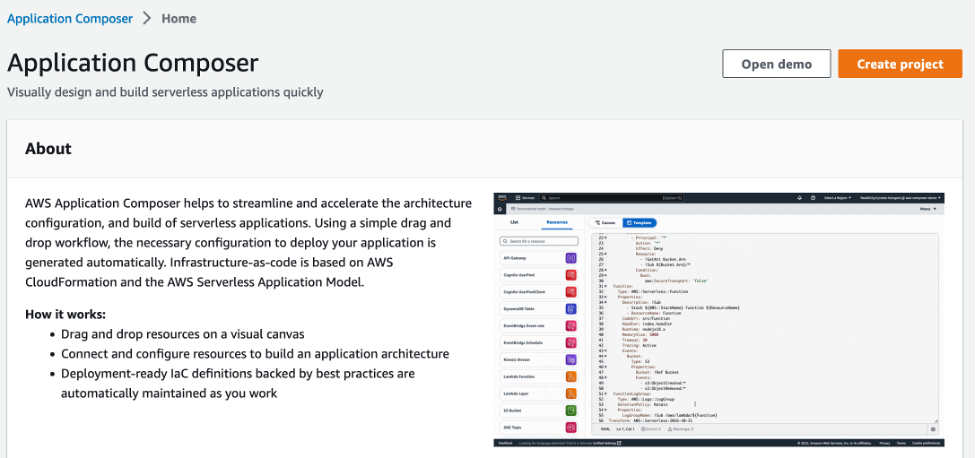

Building a serverless application can be a challenging task for developers. It requires a good understanding of serverless computing, AWS services, and the technical skills to design and deploy the application. However, with [AWS Application Composer](https://aws.amazon.com/application-composer/), the process of building a serverless application becomes much easier.

In this post, I will share how I built a prototype application to easily analyze meetup data. This will be an intermediate level guide, so some knowledge of AWS, Bash, and Python will be required to follow along. I will walk through the steps to build a workload that displays [Meetup](https://aws.amazon.com/developer/community/usergroups/) information with the following components:

* A scheduled Lambda function that gets Meetup data and stores it in a database
* An API to get the Meetup data
* A prototype front-end application to display the data

To get started, open [AWS Application Composer console](https://console.aws.amazon.com/composer/home) and create a new project.



## Part 1: Designing the Scheduled Lambda Function

The first step is to design a scheduled Lambda function that will retrieve Meetup data on a daily basis and store it in a DynamoDB table. Using AWS Application Composer, we can easily drag and connect resources to create a template for deployment.


Then we'll configure each resource based on our use case. For the EventBridge Schedule, we'll change the unit to "Days" to trigger a daily invocation of the function.


Next, we will configure the properties for the Lambda Function. We will create a folder called ‘functions’ later that will hold the code, and we use the python3.9 runtime. Because the Lambda is connected to the DynamoDB Table, we get the necessary IAM policy and environment variables added to access the table. Finally, we add one more environment variable for the [Meetup API Key](https://www.meetup.com/api/general/).


For DynamoDB, we will just change the ID of the Table.


Now we have everything we need to create a template to deploy our function. We can click `Save changes` from the drop-down menu to get the `template.yaml` file.


## Part 2:  Deploying the Scheduled Lambda Function

It’s important to note that Application Composer does not create code or deploy infrastructure for you, but rather helps you design the interface for your workflow. We'll still need to write the code for the Lambda function. In this section, we'll create the functions folder and create the Lambda function code and requirements.


The `get_meetup_data.py` handler function will call the Meetup GraphQL endpoint to retrieve data and store it in the DynamoDB table. You can view the code [here](https://github.com/aws-banjo/serverless_meetup_example/blob/main/functions/load_meetup_data.py).

Next, we can deploy the Lambda Function using the [AWS Serverless Application Model (SAM)](https://aws.amazon.com/serverless/sam/). AWS Application Composer already did the hard work of designing the infrastructure components that we need to create, so we can focus on the code so we can have a “push button” deploy.

We can run the following to deploy the application:

```bash
sam build
sam deploy --guided
```


Once deployed, we can navigate to the Lambda Console, test the function, and verify that the data is in the DynamoDB table.


## Part 3: Updating our Design to add the Get API

With AWS Application Composer, we can import our `template.yaml` to update our design as we need more features for the application. In this section, we'll add a `GetMeetupData` function that will read from the DynamoDB table and return data.

Just like before we will drag a Lambda Function onto the Canvas, connect the function to our DynamoDB Table, and then update the properties. Since this will be an API, we will enable a Function URL, so there is an endpoint that can be reached.


We can now download the `template.yaml` and update the project with the code for the new function in the get_meetup_data.py. To view the code, check [here](https://github.com/aws-banjo/serverless_meetup_example/blob/main/functions/get_meetup_data.py).


## Part 4: Create a Prototype Front End

Now we can use my favorite Python tool for creating quick prototypes for front end applications: Streamlit. Streamlit is a powerful open-source framework for building interactive and web-based applications. With Streamlit, we can create beautiful web apps in minutes, all in pure Python with no front-end experience needed.

For this prototype, we are going to have a dropdown with a list of meetups, and then a button that gets the data for the selected meetup from DynamoDB.

```python
import streamlit as st
import requests

def call_api(meetup_group):
    data = {"meetup_id": meetup_group}
    api_endpoint = (
        "YOUR ENDPOINT”
    )

    resp = requests.post(api_endpoint, json=data)
    return resp.json()

def main() -> None:
    """
    Purpose:
        Controls the flow of the app
    Args:
        N/A
    Returns:
        N/A
    """

    # Start the app
    st.header("Meetup Data")

    meetup_groups = [
        "amazon-web-services-dmv",
        "the-boston-amazon-web-services-meetup-group",
        "AWS-NYC",
    ]

    selected_meetup = st.selectbox("Meetups", meetup_groups)

    if st.button("Get Meetup Data"):
        data = call_api(selected_meetup)
        st.write(data)

if __name__ == "__main__":
    main()
```

Once we have the code, we can start the Streamlit app from the command line.

```bash
pip install streamlit
streamlit run meetup_st.py
```


### Conclusion

In this post, I showed a step-by-step workflow on how to successfully achieve the following:

* Design a Serverless Python Application with AWS Application Composer
* Deploy the Application using SAM
* Create a Prototype Application using Streamlit

By leveraging AWS Application Composer and AWS SAM, developers can focus on creating code instead of writing YAML, and fiddling with IAM polices and other tedious “grunt work.”

This prototype solution can be adapted to gain insights into engaging with Meetup communities. If you’re interested in participating in your local AWS community, check out the AWS User Group page [here](https://aws.amazon.com/developer/community/usergroups/).

Follow me on Twitter [@banjtheman](https://twitter.com/banjtheman) and [@AWSDevelopers](https://twitter.com/awsdevelopers) for more useful tips and tricks about the cloud in general and about AWS.

## About the Author

Banjo is a Senior Developer Advocate at AWS, where he helps builders get excited about using AWS. Banjo is passionate about operationalizing data and has started a podcast, a meetup, and open-source projects around utilizing data. When not building the next big thing, Banjo likes to relax by playing video games, especially JRPGs, and exploring events happening around him.
