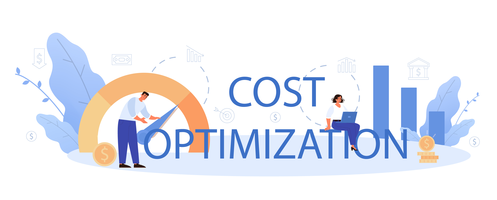

## Who am I ?

 I am a Senior AWS Technical Account Manager, and in my role I provide consultative architectural and operational guidance delivered in the context of customers' applications and use-cases to help them achieve the greatest value from AWS. My role is not just about providing technical support but also helping our valued customers optimize their cloud resources to achieve cost-efficiency without sacrificing performance. In this blog post, we'll explore various strategies, tactics, and real-world examples of how I've assisted our large enterprise customers in their cost optimization endeavors. I'll share real-life use cases, metrics, and strategies that have proven effective. Stay tuned for a **Bonus** strategy at the end.

## The Cost Optimization Framework

In the ever-evolving landscape of cloud computing, Enterprises are continually seeking ways to maximize the benefits of AWS while keeping costs in check. Before diving into specific customer cases, let's outline the fundamental framework for AWS cost optimization. It involves several key pillars:

### Implementing Cloud Financial Management

Implementing Cloud Financial Management starts with the customer identifying key stakeholders from Finance and Technology, thus forming a cost optimization function that's responsible to establish and maintain cost awareness internally. A suite of AWS Services can help the customer achieve this, such as [AWS Budgets](https://aws.amazon.com/aws-cost-management/aws-budgets/?sc_channel=el&sc_campaign=costwave&sc_content=real-stories-of-cost-optimization-on-aws&sc_geo=mult&sc_country=mult&sc_outcome=acq) and [AWS Cost Anomaly Detection](https://aws.amazon.com/aws-cost-management/aws-cost-anomaly-detection/?sc_channel=el&sc_campaign=costwave&sc_content=real-stories-of-cost-optimization-on-aws&sc_geo=mult&sc_country=mult&sc_outcome=acq) to accurately forecast AWS spend. Tools like [AWS Cost Explorer](https://aws.amazon.com/aws-cost-management/aws-cost-explorer/?sc_channel=el&sc_campaign=costwave&sc_content=real-stories-of-cost-optimization-on-aws&sc_geo=mult&sc_country=mult&sc_outcome=acq) and [AWS Billing Console](https://aws.amazon.com/aws-cost-management/aws-billing/?sc_channel=el&sc_campaign=costwave&sc_content=real-stories-of-cost-optimization-on-aws&sc_geo=mult&sc_country=mult&sc_outcome=acq) can be leveraged to derive real-time insights into AWS spend , while [AWS Cost and Usage reports](https://docs.aws.amazon.com/cur/latest/userguide/what-is-cur.html?sc_channel=el&sc_campaign=costwave&sc_content=real-stories-of-cost-optimization-on-aws&sc_geo=mult&sc_country=mult&sc_outcome=acq) serve an excellent source to obtain fine-grain usage metrics. Additionally, customers can subscribe to AWS Blogposts to stay relevant to Roadmap items of interest.

### Expenditure and Usage Awareness

Expenditure and Usage awareness among internal teams, can be enabled via a unified Account structure with AWS Organizations, allowing customers to seamlessly allocate costs and usage to the various Business Units within the company. Customers can setup and enable Cost Allocation tags as part of their charge-back strategy to hold internal product teams accountable for their AWS Costs and Usage.

### Cost Effective Resources

Using purpose-built resource types for specific workloads is going to be key to cost savings. Other opportunities includes, Instance resizing for both Cost and Performance or leveraging managed services such as [Amazon Aurora](https://docs.aws.amazon.com/AmazonRDS/latest/AuroraUserGuide/CHAP_AuroraOverview.html?sc_channel=el&sc_campaign=costwave&sc_content=real-stories-of-cost-optimization-on-aws&sc_geo=mult&sc_country=mult&sc_outcome=acq), [Amazon ElastiCache](https://aws.amazon.com/elasticache/?sc_channel=el&sc_campaign=costwave&sc_content=real-stories-of-cost-optimization-on-aws&sc_geo=mult&sc_country=mult&sc_outcome=acq) and [Amazon DynamoDB](https://aws.amazon.com/dynamodb/?sc_channel=el&sc_campaign=costwave&sc_content=real-stories-of-cost-optimization-on-aws&sc_geo=mult&sc_country=mult&sc_outcome=acq) to minimize the overhead of managing and maintaining the servers. Customers can also take advantage of AWS' cost-effective pricing options such as [Savings Plans](https://aws.amazon.com/savingsplans/?sc_channel=el&sc_campaign=costwave&sc_content=real-stories-of-cost-optimization-on-aws&sc_geo=mult&sc_country=mult&sc_outcome=acq), [Reserved Instances](https://aws.amazon.com/ec2/pricing/reserved-instances/?sc_channel=el&sc_campaign=costwave&sc_content=real-stories-of-cost-optimization-on-aws&sc_geo=mult&sc_country=mult&sc_outcome=acq) or [Spot](https://aws.amazon.com/ec2/spot/?sc_channel=el&sc_campaign=costwave&sc_content=real-stories-of-cost-optimization-on-aws&sc_geo=mult&sc_country=mult&sc_outcome=acq) for their workloads, saving significant amount of costs as compared to OnDemand.

### Manage Demand and Supply

It is paramount for customers to keep their operating costs low. To facilitate that, customers can consider adopting [auto-scaling](https://aws.amazon.com/autoscaling/?sc_channel=el&sc_campaign=costwave&sc_content=real-stories-of-cost-optimization-on-aws&sc_geo=mult&sc_country=mult&sc_outcome=acq) across key AWS services such as Amazon EC2, Amazon DynamoDB and Amazon ElastiCache. This ensures that the customer only pays for the computing resources they need, and not have to overpay.

### Optimizing over Time

In AWS, you optimize over time by reviewing new services and implementing them in your workload. As AWS releases new services and features, it is a best practice to review your existing architectural decisions to ensure that they remain cost effective. As your requirements change, be aggressive in decommissioning resources, components, and workloads that you no longer require.

## Real-world Cost Optimization Stories

### Case Study 1: Leveraging various AWS Pricing Options

A Digital AdExchange realized over 60% in cost savings by adopting AWS EC2 Spot for their real-time bidding application, while maintaining the same throughput. The customer updated their application to use disparate Instance Types (~20) and over 50% of those Instance types were used in the spot fleets that replaced the original auto-scaling groups, thus providing a significant amount of resistance to fluctuations in the spot market. The customer also implemented a log recovery pipeline to combat the problem of losing log data on terminated spot instances. The customer had unpredictable traffic patterns but needed cost predictability. So, in addition to Spot, we helped them implement a mixed Reservations strategy, combining EC2 Savings Plans for steady-state workloads and Compute Savings Plans for flexibility. While the EC2 Instance Savings Plans provided the customer with over 65% price benefits, the Compute Savings Plans unlocked over 60% in potential cost savings. This led to annual cost savings of over $1 million. Furthermore, Advertising technology (ad tech) companies use Amazon DynamoDB to store various kinds of marketing data, such as user profiles, user events, clicks, and visited links. Some of the use cases include real-time bidding (RTB), ad targeting, and attribution. These use cases require a high request rate (millions of requests per second), low and predictable latency, and reliability. As a fully managed service, DynamoDB allows ad tech companies to meet all of these requirements without having to invest resources in database operations. With accelerated DynamoDB costs Month-over-month, the customer quickly adopted DynamoDB Reserved Capacity to receive a significant discount over Provisioned Capacity (Read and Write) and this helped the customer save an estimated $1M annually. Lastly, the customer was also able to save ~$300k with ElastiCache RIs and $150k with OpenSearch RIs.

### Case Study 2: Utilizing native AWS tools to optimize costs

One of our largest social media customers experienced a sudden but sustained spike in their AWS costs for a specific Business Unit. We implemented a comprehensive tagging strategy, enabling them to allocate costs with precision. This led to better cost accountability and improved budget management. 
We also set up AWS Cost and Usage reports to provide granular insights into Cost and Usage, and we were able to identify the key driver behind the cost increase. This proactive approach allowed the company to identify and address cost anomalies in real-time, saving them thousands of dollars. Additionally, it helped the customer gain visibility into escalating Compute and Database costs. AWS Trusted Advisor is a service that inspects your AWS environment and provides recommendations for optimizing your resources. For one of our largest social media customers, we utilized AWS Trusted Advisor, which identified Underutilized and Idle resources that could potentially be terminated savings the customer $200k monthly across Amazon EC2, EBS, RDS and Load Balancers. Furthermore, the tool also provided recommendations around. Lastly with AWS Compute Optimizer, the customer was able to uncover $60k in monthly savings achieved through EC2 Rightsizing recommendations.

## As promised, here's the Bonus

[AWS Graviton](https://aws.amazon.com/ec2/graviton/?sc_channel=el&sc_campaign=costwave&sc_content=real-stories-of-cost-optimization-on-aws&sc_geo=mult&sc_country=mult&sc_outcome=acq) is a game-changer for cost optimization and performance in Cloud Computing. Graviton instances, powered by Arm-based processors, offer a compelling value proposition. Graviton instances typically come at a lower price point compared to their x86 counterparts, making them a cost-effective choice. They also consume less power and have a smaller carbon footprint, reducing operational costs and contributing to an organization's sustainability goals. For businesses with demanding workloads, this can translate into significant savings over time. Along with the cost benefits, the Graviton instances are also designed for performance  and efficiency making it a lucrative choice for many types of workloads, especially those that are highly parallelizable, like web servers and microservices. A major streaming company whose key workloads are hosted on AWS were able to assess $1M in monthly net savings (20%) by adopting Graviton across Amazon EC2, RDS, ElastiCache and OpenSearch. This allowed the customer actively re-invest the realized savings into other growth areas such as [Generative AI](https://aws.amazon.com/generative-ai/?sc_channel=el&sc_campaign=costwave&sc_content=real-stories-of-cost-optimization-on-aws&sc_geo=mult&sc_country=mult&sc_outcome=acq) that helped accelerate their business outcomes.

## Conclusion

As a AWS Technical Account Manager, I'm committed to staying at the forefront of these developments, ensuring that our customers have access to the latest cost optimization strategies and technologies. Cost optimization on AWS isn't a one-time task but a continuous journey. By leveraging rightsizing, reserved instances, spot instances, lifecycle policies, and effective cost allocation, we've helped numerous enterprise customers unlock substantial savings while maintaining or even improving their cloud workloads. The key takeaway is that cost optimization on AWS is achievable with the right strategies, tools, and a commitment to ongoing monitoring and improvement. As your partner in the cloud, I'm here to guide you on this journey, ensuring that your AWS infrastructure remains cost-efficient, agile, and aligned with your business objectives. In the world of AWS, the path to cost optimization is paved with data-driven insights, smart resource management, and a collaborative partnership between AWS and our valued customers. Together, we'll continue to optimize and thrive in the cloud.
