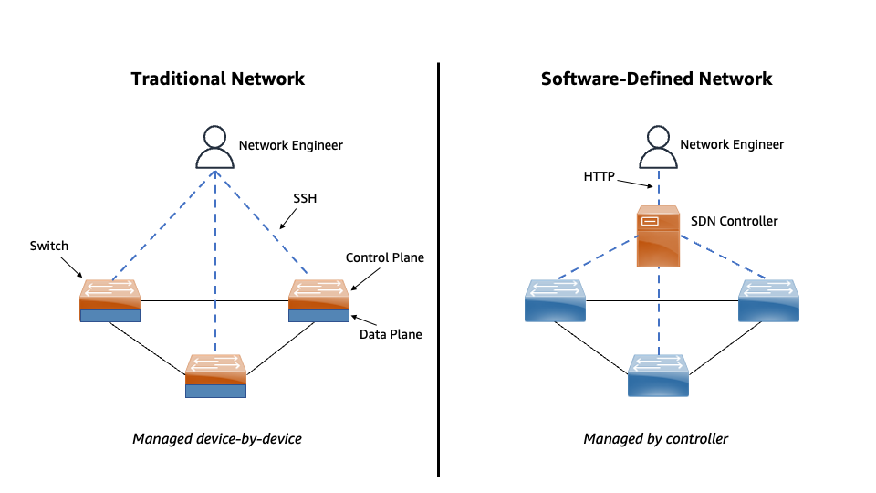

|ToC|
|---|

The state of network engineering has evolved. If we look back, we can see that this evolution started around 2009. At that time, virtualization began to take over the tech industry. And since then, so much has changed. Because of this, I decided to release a three-part blog series on re:Imagining the Network Engineer.

In this post, Part 1 - Why?, we will focus on the three reasons why network engineering no longer looks like it once looked. In Part 2 - Transforming, we will discuss the skills needed for the re:Imagined Network Engineer. Finally, in Part 3 - Performing and Staying Ahead, we will focus on optimizing your skills to prepare for the future.

Now, some of you may have noticed that I have been silent in regards to network engineering. People that know me know how passionate I am about the field. Normally, I am mentoring and helping IT pros update their skills to land new network engineering roles. But something changed during the pandemic -- I noticed organizations realized they could no longer operate the way they use to. They realized they needed to, in the words of Stephen Orban, "Evolve or die!" And for me it was a reality check. Having been in the industry since the days of Windows NT, I have seen major shifts like this before. Just not this fast.

Before we can talk about the impact the pandemic had on IT, I think it’s important to talk about the first pivotal change to network engineering.

## Automation

Traditionally, network engineers managed the network infrastructure on a device-by-device basis. This meant if you had to install or update 50 routers, you would have to either physically console into the router or remotely SSH into the router. Either way, you had to do it manually. This process was slow, time consuming, and often led to incidents of human error due to the manual mistyping configurations. This led to downtime, failed changeovers, and failed releases which costs a company money and loss of competitive advantage.

With the introduction of DevOps around 2008, software development teams began to improve their speed, agility, and processes for developing and deploying applications. DevOps teams implemented automation to automate things like software updates, testing and deployments. Because of this shift, the operations teams needed to implement automation as well so they would not be a bottle neck in the process. Automation allowed server teams to automate the creation of virtual machines, server builds, DNS changes, and IP address assignments. But behind the scenes there was still one challenge holding DevOps back -- the physical network infrastructure.

Luckily around 2011, networking had begun to make changes as well with the release of SDN or Software-Defined Networking. With SDN rather than managing network devices one-by-one. The network is controlled or managed by a central controller. This allows for the ability to centrally manage your network and provides engineers the capability to leverage automation through Application Programming Interfaces (APIs) and code. Think of an API as a waiter that takes an HTTP request and forwards the request to a device so the device can perform the requested task. An example would be `GET` a list of interfaces on a router or UPDATE the routing table on a router.

Previously, large organizations would have several network engineering teams. You would have a LAN team, a WAN team, a data center team, a corporate networking team, a wireless team, and a firewall team. All of these teams would have several engineers that specialize in that specific area of networking. And many smaller organizations would be structured the same way. With SDN and SD-WAN which is Software-Defined Wide Area Network, teams are smaller because you have less devices that need to be individually managed. And you also have the ability to leverage automation. This frees up time for engineers to focus on higher-level tasks while also preventing errors when updating the network.

### Now you may be asking "Will network engineers will lose jobs?"

Possibly. Fewer network engineers are needed in today’s workforce. This is not to say that networking engineering skill set is not needed - it is needed now more than ever. The good thing is that network engineers can easily transfer those skills to areas like cloud and security. We will talk more about this in Part 2.

Now, let’s talk about the second why:

## Speed, Agility, and Scalability

Previously in this post, I mentioned two things: The first was the pandemic which we will cover in a moment, and the second was DevOps. If you have not read the book _The Phoenix Project_, you should take time to do so. It will give you a clear understanding on why DevOps has changed the IT industry so much. But until then, companies are in a business landscape that is more competitive than ever. If a company launches a new application, and that application has lag or their web app can't support the number of users of that app, their competitors can. This means the company will lose those customers. Or if a company sees an opportunity to deliver a new feature in their market, but they have to wait for infrastructure before they can deliver, then that company will lose to a competitor that can deliver those features faster.

Everything that I have mentioned above was on full display during the pandemic. More people than ever were using streaming services. Companies like Netflix had to deliver services fast, while being able to scale, and adapt to demand. Another example is how businesses, schools, and hospitals needed to scale their VPN infrastructure for their remote users. Many companies could not do this fast enough due to supply chain issues and manual processes.

Companies have learned so much from this time and they are now making a shift. That shift focuses on having an infrastructure that delivers on the speed, agility, and scale that they need. Anytime and anywhere. More often than not, that solution is the cloud.

### Why does this matter to network engineers?

This means that since organizations are shifting how they deliver their applications and services, they need a workforce who can build and support this infrastructure. The re:Imagined network engineer will need to understand the infrastructure and the applications that run on that infrastructure better than anyone else. Don't worry, we will talk all about how you can make that shift in Part 2.

Now, let’s talk about the final why:

## Costs

One thing I have learned in my career about managing infrastructure is that it is expensive. And if you have ever built out infrastructure on-premises, a real challenge is in getting enough hardware capacity for your current and expected worst case scenario needs. Those capacity needs are everywhere from server load capacity, to network bandwidth, to switch port capacity and switch port density, and I have not even covered power and cooling needs.

Buying hardware this way leads to waste. Often the servers never reach a quarter of their load capacity. Or even worse -- they reach capacity and fail.

### Why does infrastructure cost matter to network engineers?

Companies are finding ways to save on up-front infrastructure capital expenditures. This means less hardware to install and support. The re:Imagined network engineer will need to be able to know the cost to run on the infrastructure and provide ways to save on data transfers, along with knowing the tools that can be used. But this is something we will also cover in Part 2.

## Conclusion

In the book _Ahead in the Cloud_, Stephen Orban mentions how he transitioned his teams at Dow Jones to DevOps from 400 employees and 1,100 contractors to 450 employees and 300 contractors. During this time, network engineers and systems engineers were able to transition into new roles on the DevOps team. Unfortunately, their old positions were not back filled.

This is where we are in today’s industry. Organizations have transformed and we as network engineers are being challenged to evolve or die. My goal in Part 2 of this series to help you evolve!
