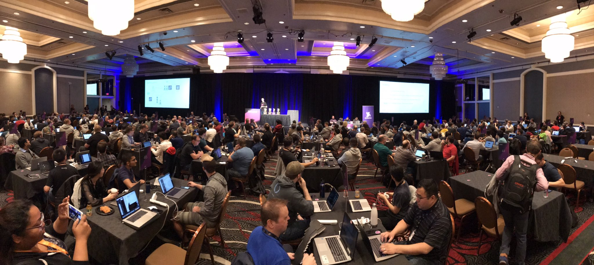
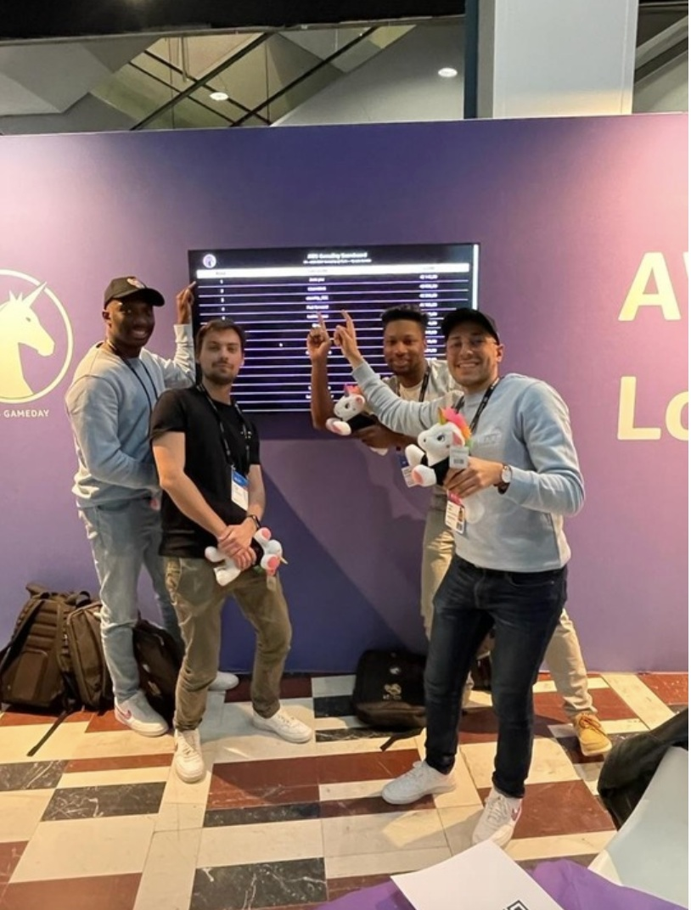
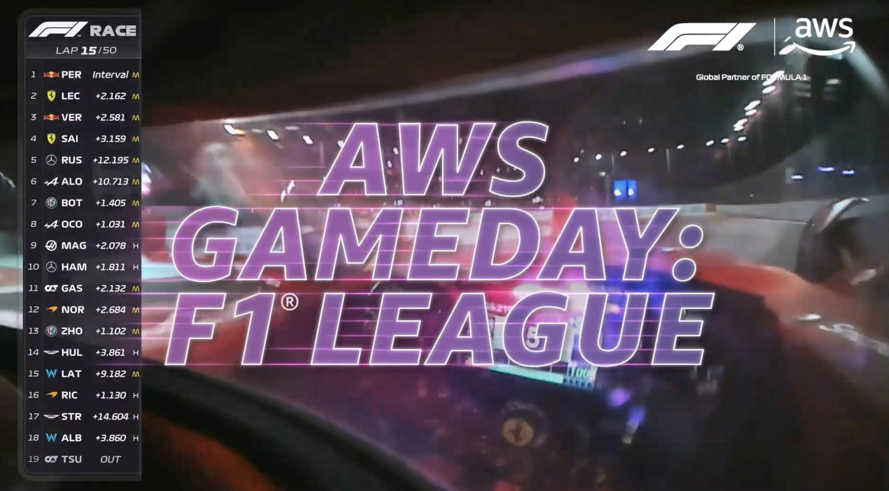

|ToC|
|---|

Hey builders, it's that time of the year again, [AWS re:Invent](https://reinvent.awsevents.com/) is just around the corner! And you know what that means? GameDays are back and better than ever. If you're like me and you love to get your hands on real-world AWS challenges, then you're in for a treat.

## What's a GameDay?

Think of AWS GameDay as the ultimate AWS playground. It's not just another workshop or training session. This gamified event dives deep into real-world challenges, giving you the freedom to experiment, make mistakes, and learn—all in a risk-free setting. So, why should you sign up?

* **Learn by Doing, Worry-Free:** No more passive learning. Here, you get to tackle real-world scenarios without any of the real-world fallout. Think of it as your professional AWS sandbox.

* **Your Rules, Your Game:** Whether you're a beginner or an AWS veteran, GameDay lets you pick your challenges. You're in control of your learning journey.

* **Teamwork Makes the Dream Work:** You'll team up with other builders to tackle challenges. It’s a collaborative and fun way to learn, so you get the best of both worlds.

## GameDay Sessions to Look Out For

So, let's dive into the details. Here's a breakdown of this year's GameDay sessions, along with what you need to know to choose the one that's right for you.

### GHJ302 | Network Topology Titans

Master your AWS networking skills by architecting a secure landing zone for Unicorn.Rentals. If you're into network security and infrastructure, this challenge is for you. It even features a special quest from Lacework focused on AWS environment protection.

#### How to Prepare for GHJ302

Before attending, make sure to brush up on your AWS networking fundamentals. A quick review of Amazon VPC, AWS Transit Gateway, and AWS Network Firewall documentation will go a long way. Consider running through some AWS Hands-On Labs related to networking for a practical refresher.

* **Topic:** Networking & Content Delivery
* **Area of Interest:** Network & Infrastructure Security, Global Infrastructure, Threat Detection & Incident Response
* **Level:** 300 - Advanced
* **Role:** IT Administrator, Solution/Systems Architect, DevOps Engineer
* **AWS Services:** AWS Transit Gateway, AWS Network Firewall, Amazon VPC
* **Industry:** Cross Industry

### GHJ303 | The Frugality Fest

Tackle cost optimization challenges for Unicorn.Rentals' rapidly growing app. Perfect for DevOps engineers and architects who are into cloud economics. Plus, a Red Hat quest on OpenShift Service on AWS.

#### How to Prepare for GHJ303

Get ready by diving into AWS cost optimization best practices. Look into services like Amazon CloudWatch, EC2, S3, and Amazon RDS to understand how costs can be controlled and optimized. If you're new to Red Hat OpenShift Service on AWS, a brief overview would be beneficial.

* **Topic:** Cloud Operations, Compute, Databases
* **Area of Interest:** Cost Optimization, Management & Governance, Sustainability
* **Level:** 300 - Advanced
* **Role:** DevOps Engineer, IT Professional, Solution/Systems Architect
* **AWS Services:** Amazon VPC, Amazon CloudWatch, EC2, S3, Amazon RDS
* **Industry:** Cross Industry

### GHJ201 | League of Legends Esports Edition

Dive into the world of e-sports with League of Legends challenges. This one's for the gaming geeks who are also data enthusiasts. Exclusive SWAG and epic prizes await!

#### How to Prepare for GHJ201

Familiarize yourself with Amazon SageMaker, AWS Lambda, and AWS App Runner. If you're new to the e-sports world, maybe spend some time understanding the basics of [League of Legends](https://www.leagueoflegends.com/en-us/) to get the most out of the gaming challenges.

* **Topic:** AI/ML, Analytics
* **Area of Interest:** Innovation on AWS
* **Level:** 200 - Intermediate
* **Role:** Developer/Engineer, Data Engineer, Data Scientist
* **AWS Services:** Amazon SageMaker, AWS Lambda, AWS App Runner
* **Industry:** Games, Cross Industry

### GHJ202 | Formula 1

Join Team Unicorn.Rentals.Racing and use real Formula 1 data to improve race performance. If you're a sports fan who loves to code, you won't want to miss this one.

#### How to Prepare for GHJ202

Take a look at AWS services like AWS Glue, Amazon API Gateway, and AWS Amplify. A basic understanding of data analytics and how it applies to sports performance will help you hit the ground running.

* **Topic:** Analytics, Architecture
* **Area of Interest:** Front-End Web & Mobile, Application Integration, BuildOn.AWS
* **Level:** 200 - Intermediate
* **Role:** Solution/Systems Architect, Developer/Engineer, Tech Explorer
* **AWS Services:** AWS Glue, Amazon API Gateway, AWS Amplify
* **Industry:** Sports, Cross Industry

### GHJ301 | Building F.O.C.U.S.

Build a complete social media platform, F.O.C.U.S., for Unicorn.Rentals' unicorn community. Ideal for those into serverless architecture and generative AI. Features a quest from Datadog on security risks.

#### How to Prepare for GHJ301

Get comfortable with AWS Amplify, Amazon Location Service, and AWS Cloud9. If you're into generative AI, a quick review of Amazon SageMaker would be advantageous. Don't forget to check out Datadog for some context on the security quest.

* **Topic:** Serverless Compute, DevOps, AI/ML
* **Area of Interest:** Generative AI, Innovation, Front-End Web & Mobile
* **Level:** 300 - Advanced
* **Role:** Solution/Systems Architect, Developer/Engineer, DevOps Engineer
* **AWS Services:** Amazon Location Service, EventBridge, AWS Amplify, AWS Cloud9, Amazon SageMaker
* **Industry:** Cross Industry

### GHJ304 | Building with gen AI and Amazon Bedrock

Explore the power of generative AI with Amazon Bedrock. For those who are keen to push the boundaries of AI, this GameDay is an absolute must-attend.

#### How to Prepare for GHJ304

Make sure you're familiar with generative AI concepts and how to build with Amazon Bedrock. This [quick start guide](/posts/amazon-bedrock-quick-start) will get you up to speed.

* **Topic:** AI/ML
* **Area of Interest:** Generative AI
* **Level:** 300 - Advanced
* **Role:** Solution/Systems Architect, Developer/Engineer, Data Scientist
* **AWS Services:** Amazon S3, Amazon Bedrock, AWS Lambda
* **Industry:** Cross Industry

## Let's Build

So, what are you waiting for? Whether you're into networking, cost optimization, e-sports, or AI, there's a GameDay waiting for you. Level up your AWS skills by choosing the session that aligns with your interests and expertise. Remember, most GameDays run for about 4 hours, but don't feel compelled to stay the whole time. These sessions are designed for you to play at your own pace.

Ready to game on? [Register for your chosen GameDay here](https://hub.reinvent.awsevents.com/attendee-portal/catalog/).

See you at re:Invent 2023! 🚀