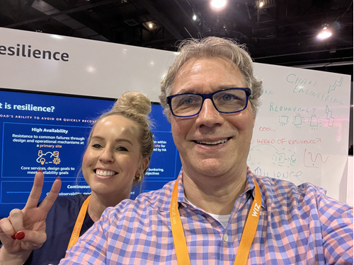
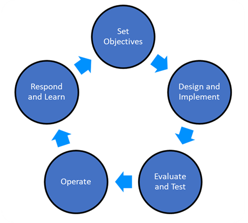
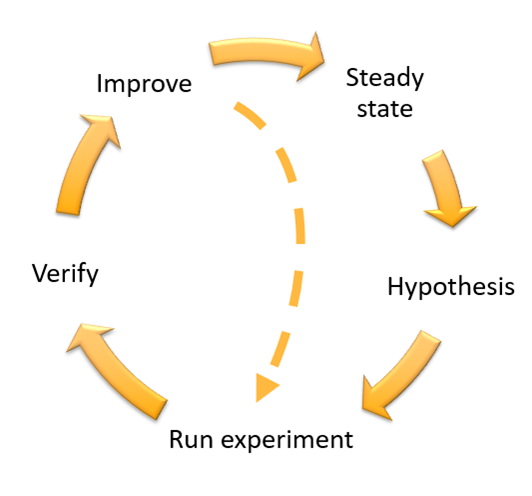

|ToC|
|---|

_Before we start, if you are looking for suggestions related to Cloud Operations sessions at re:Invent, check out Darko's post [HERE](/posts/cloudops-at-reinvent23)._

Running your application can be a challenge. Unexpected usage patterns, component failures, network issues, and flaky dependencies are part of the [chaos of production](/posts/chaos-engineering-2-minutes). Fortunately, running your application on AWS cloud gives you many tools and techniques to design resilience into your application, and it is [resilience that enables your application to resist or recover from all these challenges](/concepts/should-know-resilience).

If you’re attending re:Invent 2023, there’s plenty to learn about designing resilient applications. Here we’ll share our picks of what you should check out.

## The resilience kiosk: Get help from AWS resilience experts

One of our favorite parts of re:Invent is meeting with AWS customers and helping them them with their resilience challenges. An easy way to meet with a resilience expert (maybe one of us, if you time it right) is to visit the **resilience kiosk** located in the AWS Village, as part of the [2023 re:Invent Expo](https://reinvent.awsevents.com/learn/expo?sc_channel=el&sc_campaign=reinvent&sc_geo=mult&sc_country=mult&sc_outcome=acq&sc_content=resilience-at-reinvent) in The Venetian. It opens at 4PM on Monday, the first day of re:Invent, and closes at 3PM on Thursday. This may be free advice, but it is super valuable, as you can ask questions and even whiteboard with an expert to solve specific resilience challenges of your application. There is also a chaos engineering demo, and the friendly folks there will be happy to show you how to use the newly released resilience lifecycle framework — and what is that?  Well, read on!

## The Resilience Lifecycle Framework — learn about this new roadmap to better resilience

The [resilience lifecycle framework](https://docs.aws.amazon.com/prescriptive-guidance/latest/resilience-lifecycle-framework?sc_channel=el&sc_campaign=reinvent&sc_geo=mult&sc_country=mult&sc_outcome=acq&sc_content=resilience-at-reinvent) is a new (released October 2023) AWS-authored whitepaper that shares resilience strategies, services, and mechanisms you can use to improve your resilience posture. We’ve captured *years* worth of learnings from AWS working with its customers on resilience to bring this to you. In addition to stopping by the kiosk, you can learn all about it at this session:

1. **[ARC312](https://hub.reinvent.awsevents.com/attendee-portal/catalog/?search=ARC312&sc_channel=el&sc_campaign=reinvent&sc_geo=mult&sc_country=mult&sc_outcome=acq&sc_content=resilience-at-reinvent) | Resilience lifecycle: A mental model for resilience on AWS**. 

## Everyone wants to talk about disaster recovery (DR)

In our years of talking with AWS customers about resilience, almost half of those conversations include [disaster recovery (DR)](https://aws.amazon.com/blogs/architecture/disaster-recovery-dr-architecture-on-aws-part-i-strategies-for-recovery-in-the-cloud?sc_channel=el&sc_campaign=reinvent&sc_geo=mult&sc_country=mult&sc_outcome=acq&sc_content=resilience-at-reinvent). Folks want to know how they can protect their applications from the biggest of events, with the biggest potential impact, such as natural disasters like earthquakes or floods, technical failures such as power or network loss, and human actions. Here are some sessions where you can learn how to use DR to protect your applications:

2. **[ARC302](https://hub.reinvent.awsevents.com/attendee-portal/catalog/?search=arc302&sc_channel=el&sc_campaign=reinvent&sc_geo=mult&sc_country=mult&sc_outcome=acq&sc_content=resilience-at-reinvent) | Drive resilience with Amazon Route 53 Application Recovery Controller** — Let’s start by getting hands-on. In this workshop, your mission is to implement the tools and processes to ensure a tic-tac-toe game is resilient to even the biggest adverse events. In our experience, folks will sometimes neglect to make their resilience strategy itself...resilient. This workshop shows you how to do that using [Route 53 Application Recovery Controller](https://docs.aws.amazon.com/r53recovery/latest/dg/what-is-route53-recovery.html?sc_channel=el&sc_campaign=reinvent&sc_geo=mult&sc_country=mult&sc_outcome=acq&sc_content=resilience-at-reinvent), a highly-available [data-plane API](https://docs.aws.amazon.com/wellarchitected/latest/reliability-pillar/rel_withstand_component_failures_avoid_control_plane.html?sc_channel=el&sc_campaign=reinvent&sc_geo=mult&sc_country=mult&sc_outcome=acq&sc_content=resilience-at-reinvent) you can use to fail over to your recovery site when you need it. We also like that this workshop covers both multi-Region and in-Region recovery options.
3. **[ARC208](https://hub.reinvent.awsevents.com/attendee-portal/catalog/?search=ARC208&sc_channel=el&sc_campaign=reinvent&sc_geo=mult&sc_country=mult&sc_outcome=acq&sc_content=resilience-at-reinvent) | Backup and disaster recovery strategies for increased resilience** — This breakout session will give you a good understanding of disaster recovery basics. But then it takes you deeper, showing how you can use [AWS Elastic Disaster Recovery](https://docs.aws.amazon.com/drs/latest/userguide/what-is-drs.html?sc_channel=el&sc_campaign=reinvent&sc_geo=mult&sc_country=mult&sc_outcome=acq&sc_content=resilience-at-reinvent) to protect your applications whether hosted on AWS, on-prem, or even on other cloud providers.
4. **[ARC320](https://hub.reinvent.awsevents.com/attendee-portal/catalog/?search=ARC320&sc_channel=el&sc_campaign=reinvent&sc_geo=mult&sc_country=mult&sc_outcome=acq&sc_content=resilience-at-reinvent) | Using business metrics to make failover decisions** — This is a chalk talk, so most of the conversation will be driven by audience questions. While **ARC302** shows you how to implement effective failover, this session will share the sometimes harder problem of determining *when* to failover and how to use business metrics to determine that the failover was successful.

 using a multi-Region architecture")

## Keeping your application highly available

We like to help customers understand resilience as defense-in-depth, with resilience strategies at multiple layers. There are several layers *before* DR you should be thinking about to protect your application from the [smaller, more common faults](/concepts/should-know-resilience#2-how-to-prevent-faults-from-becoming-failures) that can impact your application availability. 

5. **[ARC301](https://hub.reinvent.awsevents.com/attendee-portal/catalog/?search=ARC301&sc_channel=el&sc_campaign=reinvent&sc_geo=mult&sc_country=mult&sc_outcome=acq&sc_content=resilience-at-reinvent) | Advanced Multi-AZ resilience patterns: Mitigating gray failures** — Sure, you already know to [use multiple Availability Zones (AZs)](https://docs.aws.amazon.com/wellarchitected/latest/reliability-pillar/rel_fault_isolation_multiaz_region_system.html?sc_channel=el&sc_campaign=reinvent&sc_geo=mult&sc_country=mult&sc_outcome=acq&sc_content=resilience-at-reinvent) as fault isolation boundaries to achieve high availability. But in this hands-on workshop you’ll learn how to take your multi-AZ strategy to the next level. Sometimes failures are intermittent, or not easily detectable by metrics and alarms that look broadly at you application — we call these [gray failures](/posts/what-happened-to-my-car). In this workshop, you’ll implement [differential observability](https://docs.aws.amazon.com/whitepapers/latest/advanced-multi-az-resilience-patterns/gray-failures.html?sc_channel=el&sc_campaign=reinvent&sc_geo=mult&sc_country=mult&sc_outcome=acq&sc_content=resilience-at-reinvent) to detect gray failures, and then [implement resilience strategies](https://docs.aws.amazon.com/whitepapers/latest/advanced-multi-az-resilience-patterns/availability-zone-evacuation-patterns.html?sc_channel=el&sc_campaign=reinvent&sc_geo=mult&sc_country=mult&sc_outcome=acq&sc_content=resilience-at-reinvent) to protect against these failures. This is not your grandparents’ multi-AZ strategy.
6. **[ARC309](https://hub.reinvent.awsevents.com/attendee-portal/catalog/?search=ARC309&sc_channel=el&sc_campaign=reinvent&sc_geo=mult&sc_country=mult&sc_outcome=acq&sc_content=resilience-at-reinvent) | Build applications that recover from an Availability Zone impairment** — This session and **ARC301** are a great pair together. In this breakout, you’ll learn about [Amazon Route 53 Application Recovery Controller zonal shift](https://docs.aws.amazon.com/r53recovery/latest/dg/arc-zonal-shift.html?sc_channel=el&sc_campaign=reinvent&sc_geo=mult&sc_country=mult&sc_outcome=acq&sc_content=resilience-at-reinvent). OK, that service is a mouthful, but what it does is super-powerful — it gives you control over which AZs are in or out for your application (which ones are receiving traffic). Using the monitoring techniques covered in this session, you’ll be able to detect when an AZ needs to be taken out-of-service, learn how to take it out, and keep healthy AZs online to serve your customer traffic.
7. **[ARC306](https://hub.reinvent.awsevents.com/attendee-portal/catalog/?search=ARC306&sc_channel=el&sc_campaign=reinvent&sc_geo=mult&sc_country=mult&sc_outcome=acq&sc_content=resilience-at-reinvent) | Reducing your area of impact and surviving difficult days** — In this breakout session, you’ll learn about cell-based architectures and sharding. These are two ways you can structure your AWS resources (like compute, storage, and network) to improve resilience. These advanced techniques give you control over the fault isolation boundaries in your architecture, constraining faults to a small number of resources while the rest continue to serve requests from your customers.

## Chaos engineering is a must for your resilience strategy

OK, you’ve attended all the other sessions and built in the design strategies necessary for a resilient application. But how do you know your design will even work?  [Chaos Engineering in the cloud](https://aws.amazon.com/blogs/architecture/chaos-engineering-in-the-cloud?sc_channel=el&sc_campaign=reinvent&sc_geo=mult&sc_country=mult&sc_outcome=acq&sc_content=resilience-at-reinvent) is a powerful tool to simulate faults and load spikes, and assess how your design for resilience will respond.

8. **[ARC317](https://hub.reinvent.awsevents.com/attendee-portal/catalog/?search=ARC317&sc_channel=el&sc_campaign=reinvent&sc_geo=mult&sc_country=mult&sc_outcome=acq&sc_content=resilience-at-reinvent) | Improve application resilience with AWS Fault Injection Simulator** —  There are lots of good tools out there for fault injection, but if you’re running applications on AWS, then [AWS Fault Injection Simulator](https://docs.aws.amazon.com/fis/latest/userguide/what-is.html?sc_channel=el&sc_campaign=reinvent&sc_geo=mult&sc_country=mult&sc_outcome=acq&sc_content=resilience-at-reinvent) (FIS) offers a lot of great functionality, built right in to AWS. This breakout session takes you on a deep dive of FIS, and covers how implementing chaos engineering can supercharge your resilience. 
9. **[ARC321](https://hub.reinvent.awsevents.com/attendee-portal/catalog/?search=arc321&sc_channel=el&sc_campaign=reinvent&sc_geo=mult&sc_country=mult&sc_outcome=acq&sc_content=resilience-at-reinvent) | Improve the resilience of AWS workloads using chaos engineering** — If you want a quick overview of chaos engineering with a lot more time to ask questions, then check out this chalk talk session too.
10. **[ARC303](https://hub.reinvent.awsevents.com/attendee-portal/catalog/?search=ARC303&sc_channel=el&sc_campaign=reinvent&sc_geo=mult&sc_country=mult&sc_outcome=acq&sc_content=resilience-at-reinvent) | Navigate the storm: Unleashing controlled chaos for resilient systems** - Get hands-on with chaos engineering in this workshop, and learn firsthand to create safe and controlled chaos experiments that you can incorporate into your day-to-day operations. 
11. **[ARC314](https://hub.reinvent.awsevents.com/attendee-portal/catalog/?search=ARC314&sc_channel=el&sc_campaign=reinvent&sc_geo=mult&sc_country=mult&sc_outcome=acq&sc_content=resilience-at-reinvent) | Anticipating failures with resilience modeling** — Almost all materials on chaos engineering focus on the experiments themselves. We like this session because it moves the focus to what happens *before* we can even design an experiment. In this chalk talk, you’ll get the chance to ask questions about how to use resilience modelling to identify what’s missing from your resilience plans, and get a handle on the scenarios that can lead to “bad stuff” for your application’s resilience. Equipped with this knowledge, now you are better informed to determine what you should even be testing with your chaos experiments.

## Hear from AWS operational leaders

12. **[ARC327](https://hub.reinvent.awsevents.com/attendee-portal/catalog/?search=ARC327&sc_channel=el&sc_campaign=reinvent&sc_geo=mult&sc_country=mult&sc_outcome=acq&sc_content=resilience-at-reinvent) | 5 things you should know about resilience at scale** —  What happens when you get a senior principal engineer, distinguished engineer, and VP with combined experience of over 30 years operating AWS to give a talk on how to build mitigations for when things go wrong? Well, if you want to find out, then make sure to attend this can’t-miss breakout session. They will take you "beyond the 9s" -- talking about how, particularly at AWS's scale, 9s are important, but time-to-recovery and blast-radius containment are even more important.

## Bonus: Learning by example

And a note from Seth... I am not counting this among the 12, but while you’re at re:Invent, I think you will get a lot out of this breakout session that I and my colleagues are delivering:

* **[ARC305](https://hub.reinvent.awsevents.com/attendee-portal/catalog/?search=ARC305&sc_channel=el&sc_campaign=reinvent&sc_geo=mult&sc_country=mult&sc_outcome=acq&sc_content=resilience-at-reinvent) | Resilient architectures at scale: Real-life use cases from Amazon.com** — I find I learn best by example, which is why I seek out different Amazon teams and services each year to share their architectures and processes with you on how they design for scale and resilience using AWS. This is the third year for this crowd pleaser — you can also check out previous years here: [2021](https://bit.ly/amazon-reinvent2021); [2022](https://bit.ly/reliable2022).

## Bonus: Mini-lists

When we [filter the list of re:Invent topics for resilience,](https://hub.reinvent.awsevents.com/attendee-portal/catalog/?filters=71E545FA-F796-4782-B3F6-14F04624D0F0&sc_channel=el&sc_campaign=reinvent&sc_geo=mult&sc_country=mult&sc_outcome=acq&sc_content=resilience-at-reinvent) it returns about 120 sessions! In addition to the 12 sessions above, we wanted to share some mini-lists of resilience sessions that may be helpful to you. Each list is presented in no particular order.

### AWS services purpose-built for resilience  

AWS is always releasing new services and features, and their stable of services purpose-built for resilience is getting to be impressive. Learn about these services at these sessions:

* **ARC201 | Monitoring resilient architectures with AWS Resilience Hub**
* **ARC208 | Backup and disaster recovery strategies for increased resilience (AWS Elastic Disaster Recovery)**
* **ARC302 | Drive resilience with Amazon Route 53 Application Recovery Controller**
* **STG306 | Protect AWS resources with AWS Backup**
* **ARC317 | Improve application resilience with AWS Fault Injection Simulator**

### Resilience of specific AWS services and resources  

Depending on which AWS services you’re using in your architectures, you may want to check out one or more of these sessions, each focused on how to use specific AWS services in a resilient way:

* **CON401 | Deep dive into Amazon ECS resilience and availability**
* **STG318 | Deploying Amazon S3 in multiple Regions to support global applications**
* **STG319 | Beyond 11 9s of durability: Data protection with Amazon S3**
* **STG208 | Build resilient architectures with Amazon EBS**
* **STG344 | How to protect unstructured files to achieve data resiliency (Amazon FSx family and Amazon EFS)**
* **HYB310 | Building highly available and fault-tolerant edge applications (AWS Local Zones, AWS Outposts, and the AWS Snow Family)**
* **COM308 | Serverless data streaming: Amazon Kinesis Data Streams and AWS Lambda**
* **DAT306 | Improve resilience of database workloads by using chaos engineering (Amazon RDS and Amazon Aurora)**
* **SVS323 | I didn’t know Amazon API Gateway did that**

## In conclusion

Stop by the resilience kiosk, gets hands-on with a workshop, and then ask questions at a chalk talk! You really can’t go wrong with any of the sessions at re:Invent, but we hope this guide helps you to make the best use of your time in your journey to build resilient applications on AWS.

## Also see
The [reliability engineering attendee guide](https://reinvent.awsevents.com/learn/attendee-guides/reliability-engineering/) by [Sathyajith Bhat](https://aws.amazon.com/developer/community/heroes/sathyajith-bhat)
