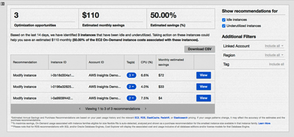
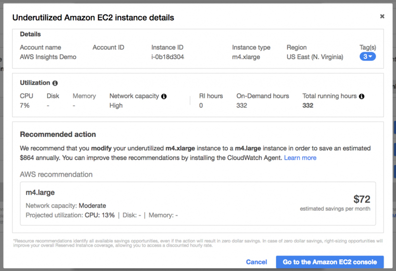
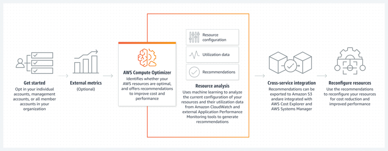
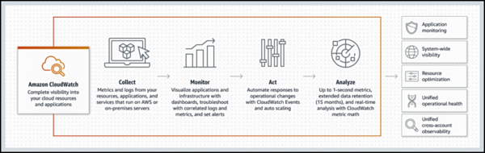
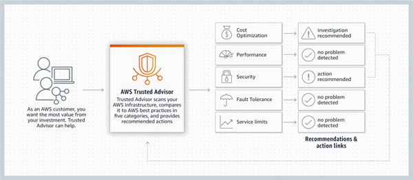
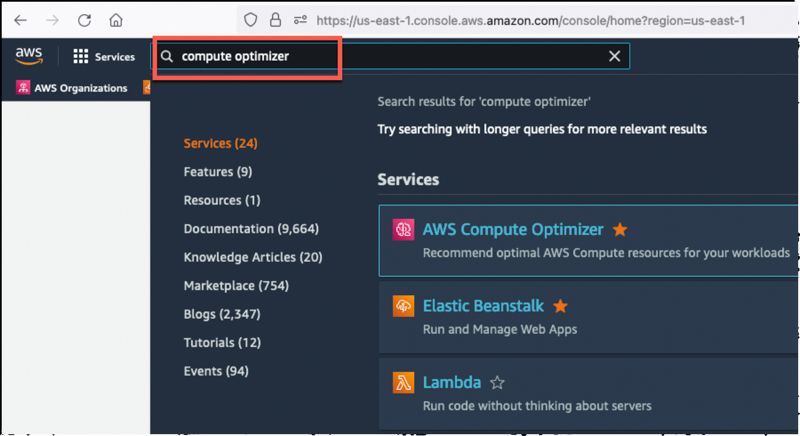
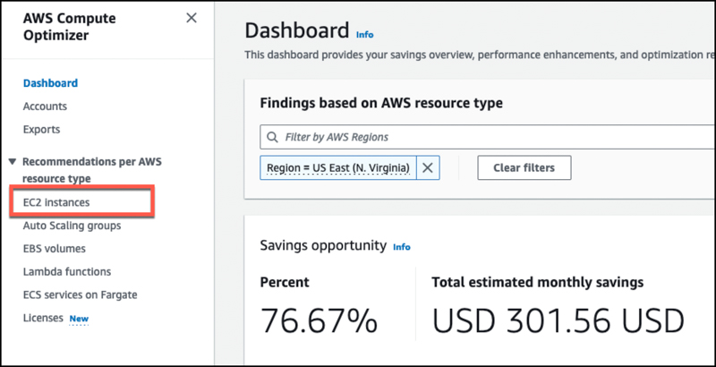
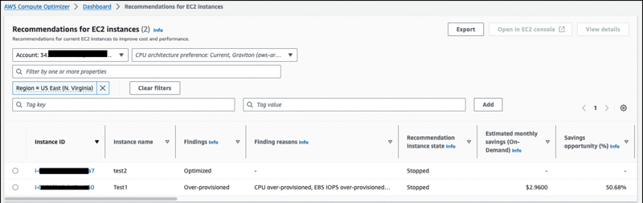
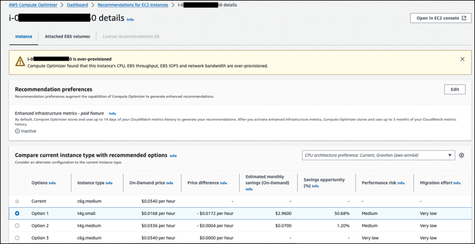

## Introduction

There are many tools in the market which can help you to reduce your cloud costs and their major recommendations are about using the resources with the right sizes and types based on your usage metrics. It is critical to optimize resource types and sizes to meet your workload's performance and capacity needs while minimizing expenses. Right sizing is a key mechanism for optimizing AWS costs, yet it frequently goes overlooked by organizations, especially during their initial transition to the AWS Cloud. Reviewing deployed instances to find chances for reduction or downsizing, all while maintaining capacity and other prerequisites, resulting in cost savings.

“Good intentions don't work; mechanisms do” (reference Jeff Bezos). No matter what is the root cause of oversized or undersized resource usage, there should be a mechanism and playbook in organizations to right-size their resources based on their business needs.

## What does rightsizing mean?

Rightsizing in cloud computing refers to the process of optimizing the resources allocated to compute and other infrastructure to match their actual utilization needs. This involves adjusting the amount of CPU, memory, storage, and other resources to ensure that you are paying for, and utilizing, the cloud resources efficiently. In essence, rightsizing can be summarized as the practice of meeting business requirements (KPIs) at the anticipated performance level by utilizing specific resource types, all while minimizing any wastage. Rightsizing involves aligning your cloud resources with your business requirements and performance expectations, all while minimizing waste and inefficiency.

## Why rightsizing is important?

Oversized resources can lead to unnecessary expenses, as you are paying for more resources than you actually need. Rightsizing helps you align your resource allocation with your application's requirements, minimizing costs while still delivering the required performance. Undersized resources can lead to performance bottlenecks and slowdowns, negatively affecting your application's performance. Rightsizing ensures that your application has the necessary resources to operate optimally, avoiding performance degradation.

Unnecessary resource usage will cause waste and cost you more than you should pay. Right sizing is the most effective way to control cloud costs. It involves continually analyzing instance performance and usage needs and patterns—and then turning off idle instances and right sizing instances that are either over-provisioned or poorly matched to the workload. Because your resource needs are always changing, right sizing must become an ongoing process to continually achieve cost optimization.

By selecting the best resource type, size, and number of resources, you meet the technical requirements with the lowest cost resource. Right-sizing activities takes into account all of the resources of a workload, all of the attributes of each individual resource, and the effort involved in the right-sizing operation. Right-sizing can be an iterative process, initiated by changes in usage patterns and external factors, such as AWS price drops or new AWS resource types. Right-sizing can also be one-off if the cost of the effort to right-size, outweighs the potential savings over the life of the workload.

## Forecasting

Understanding your application requirements, user/customer behaviors, business requirements and cost of right-sized resources will allow you to calculate forecasting accurately for future costs. With rightsizing, you can accurately forecast your cloud costs since you'll be using the resources that you actually need. This predictability is crucial for budgeting and financial planning.

To achieve effective rightsizing, you should monitor your application's resource usage over time, analyze performance metrics, and use tools provided by AWS or third-party solutions to recommend appropriate instance types and resource allocations. Regularly reviewing and adjusting your resource allocation ensures that your cloud environment remains optimized and cost-effective.

## What can be rightsized?

There are multiple AWS resources can be rightsized but usually compute resources (such as AWS EC2 or AWS RDS) are the ones which has high cost saving opportunities. Here is the example list of AWS services you can rightsize:

- EC2 -> instance types and sizes
- RDS -> instance types and sizes
- Redshift -> instance types and sizes
- Lambda -> memory sizes and processor types
- S3 -> storage classes
- EFS -> storage classes
- EMR -> number and type of nodes

## How to start effective rightsizing activities

A well-defined process exists to rightsize resources in all environments, and is performed on a regular basis, thereby ensuring efficient use of cloud resources. The process includes the use of tools (i.e., native AWS services such as AWS Cost Explorer Rightsizing Recommendations, AWS Compute Optimizer, AWS Trusted Advisor, as well as AWS Partner tools, open-source tools, or DIY tools) to identify resources which are unused, idle or over-provisioned, target resource types that are better fits, return-on-investment calculations to help prioritize resource modifications, clear lines of ownership during the process, functional and performance tests prior to modifying resources, and a standard operating procedure to modify identified resources. Rightsizing decisions and outcomes are reported as part of this cadence, and an effort is made to automate as much of the process to increase the return-on-investment associated with rightsizing.

To start effective rightsizing activity, you need to understand your business requirements, application behaviour and expected traffic to your workload (definition of workload url).

1. **Gather information**: Understand your application's requirements, workload patterns, and performance goals. Collect data on resource usage, such as CPU, memory, storage over a period of time and identify who owns the resources.
2. **Analyze usage needs**: Review the collected data to identify usage patterns and peak periods. Determine which resources are consistently overutilized or underutilized.
3. **Use the performance data**: Define Key Performance Indicators (KPIs) for your application's performance. This could include response times, latency, throughput, and other relevant metrics. Use the recent data since usage pattern may changed since its initial deployment.
4. **Choose Monitoring Tools**: Select monitoring and analytics tools provided by AWS or third-party solutions to track resource usage and performance metrics in real-time.
5. **Use right tools to right-size**: Leverage cloud management tools that provide insights and recommendations for rightsizing, making the process more efficient.
6. **Identify oversized resources**: Identify instances or resources that are consistently using more resources than required. These are potential candidates for downsizing.
7. **Identify undersized resources**: Identify instances that experience performance bottlenecks due to insufficient resources. These are potential candidates for upsizing.
8. **Evaluate instance types**: Examine the various [instance types](https://docs.aws.amazon.com/AWSEC2/latest/WindowsGuide/instance-types.html?sc_channel=el&sc_campaign=costwave&sc_content=rightsizing-the-right-way&sc_geo=mult&sc_country=mult&sc_outcome=acq) offered by AWS. Instance types are named based on their family, generation, processor family, additional capabilities, and size. Consider factors like CPU, memory, storage, and networking capabilities. Choose instances that align with your workload's requirements. You can right size an instance by migrating to a different model within the same instance family or by migrating to another instance family. When migrating within the same instance family, you only need to consider vCPU, memory, network throughput, and ephemeral storage.
9. **Test changes**: Before making changes in production, test resizing on non-production environments. Monitor performance during and after resizing to ensure the desired improvements are achieved.
10. **Start with Idle instances**: Turn off instances that are no longer being used. If you find instances that have been idle for more than two weeks, it’s safe to stop or even terminate them.
11. **Ignore burstable instance families (T types)**: These families are designed to typically run at low CPU percentages for significant periods of time and shouldn’t be part of the instance types being analyzed for rightsizing.
12. **Implement changes**: Resize the instances or resources based on your analysis. For underutilized instances, downsize to reduce resource waste. For instances facing performance issues, upscale to meet performance requirements.
13. **Optimize storage**: Rightsizing isn't limited to just compute resources. Evaluate storage usage as well and consider optimizing storage types and configurations based on access patterns and performance requirements.
14. **Monitor performance**: Continuously monitor performance after rightsizing. Compare actual performance against your defined KPIs. Adjust as needed to ensure the desired outcomes.
15. **Automate scaling if possible**: Set up auto-scaling mechanisms to dynamically adjust resources based on workload demands. This ensures that you can maintain optimal performance even during traffic spikes.
16. **Periodic reviews**: Workload requirement and environments changes over time, so periodically review your application's resource usage and performance. Adjust instances and resource allocations accordingly.
17. **Educate team members**: Creating cost-aware culture is probably the hardest one in organizations. Ensure that your team is aware of the importance of rightsizing and the process involved. Encourage a culture of resource efficiency and optimization.

## Rightsizing tools

There are multiple tools you can use to rightsize your resources on AWS Cloud. For Compute resources, [AWS Cost Explorer](https://docs.aws.amazon.com/cost-management/latest/userguide/ce-what-is.html?sc_channel=el&sc_campaign=costwave&sc_content=rightsizing-the-right-way&sc_geo=mult&sc_country=mult&sc_outcome=acq) and [AWS Compute Optimizer](https://docs.aws.amazon.com/compute-optimizer/latest/ug/what-is-compute-optimizer.html?sc_channel=el&sc_campaign=costwave&sc_content=rightsizing-the-right-way&sc_geo=mult&sc_country=mult&sc_outcome=acq) tools can provide recommendations that can help you identify opportunities to modify your instances and save money. Both AWS Compute Optimizer and Cost Explorer Rightsizing recommendations use the same engine to provide rightsizing recommendations.

[AWS Cost Explorer](https://docs.aws.amazon.com/cost-management/latest/userguide/ce-what-is.html?sc_channel=el&sc_campaign=costwave&sc_content=rightsizing-the-right-way&sc_geo=mult&sc_country=mult&sc_outcome=acq) **Rightsizing recommendations** focuses on cost reduction providing recommendations only for over-provisioned resources.

[AWS Compute Optimizer](https://docs.aws.amazon.com/compute-optimizer/latest/ug/what-is-compute-optimizer.html?sc_channel=el&sc_campaign=costwave&sc_content=rightsizing-the-right-way&sc_geo=mult&sc_country=mult&sc_outcome=acq) aggregates over and under provisioned resources on their recommendations. In addition to EC2 Rightsizing it also covers Auto-Scaling Groups, Lambda functions, and EBS volumes.

[AWS CloudWatch](https://docs.aws.amazon.com/AmazonCloudWatch/latest/monitoring/WhatIsCloudWatch.html?sc_channel=el&sc_campaign=costwave&sc_content=rightsizing-the-right-way&sc_geo=mult&sc_country=mult&sc_outcome=acq) shows you network throughput, disk I/O and cpu utilization as well. Once you analyze the metrics via CloudWatch, you can rightsize your resource to match the observed metrics.

[AWS Trusted Advisor](https://aws.amazon.com/premiumsupport/technology/trusted-advisor/?sc_channel=el&sc_campaign=costwave&sc_content=rightsizing-the-right-way&sc_geo=mult&sc_country=mult&sc_outcome=acq) is a service provided by Amazon Web Services (AWS) that helps users optimize their AWS resources by identifying idle and underutilized resources, providing insights into service usage, and suggesting ways to save money while improving system performance, reliability, and security.

There are open source or partner tools in the market which can help you for your rightsizing activities such as [Apptio](https://www.apptio.com/products/cloudability/rightsizing/), [Centilytics](https://www.centilytics.com/), [CloudCheckr](https://www.stormit.cloud/enterprise-cloud-management-platform/), [CloudHealth VMware](https://cloudhealth.vmware.com/),and [CloudZero](https://www.cloudzero.com/).

Once you identify the right sizing opportunities, you can sort your recommendations by low complexity and higher savings. Prioritize idle or previous generation resources which are less complex cases where you may want to start the rightsizing exercises for your organization. As you gain more confidence, collect more metrics and learn more about environments, you can take actions on other cases to rightsize the workloads.

If you prefer to develop your own Right-Sizing tool for your AWS resources, especially for Compute resources. To optimize cost and performance in your cloud infrastructure, start by analyzing instances that have been running for at least half of your desired time frame while prioritizing those with lower Reserved Instance coverage. Exclude resources that are currently switched off to streamline your search process and avoid conversions to older-generation instances whenever possible. Implement a savings threshold to determine when right sizing is worth considering, ensuring that the cost reduction justifies the effort. Additionally, before switching to a new instance, verify that your new instance can meet 80% of your resource utilizations for vCPU, Memory, IOPS and networks traffics to ensure a seamless transition and maintain optimal operational efficiency.

As an example, assuming one of these tools provides you rightsizing opportunity for one of your EC2 instance, general rule for EC2 instances is that if your maximum CPU and memory usage is less than 40% over a four-week period, you can safely cut the machine in half. For example, if you are using a `c7gn.xlarge` EC2, you can move to a `c7gn.large`, which will allow you to **_reduce your cost by 50%_** for this instance.

_Instance type naming convention_

## How to find rightsizing opportunity for ec2 instance with Compute Optimizer

1. Navigate to the AWS Compute Optimizer page. You can review saving opportunity and the summary of the findings in the dashboard.
   

2. Check **Recommendations per AWS resource types** on the left menu and review each one of them. We will check **EC2 instances** recommendations.
   

3. Click one of the Instance ID identified as an opportunity to rightsize or recommendation instance state whether stopped or optimization is recommended.
   

4. Check **current instance type with recommended options** and how much estimated monthly saving for On-Demand instances
   
5. Make sure you review the steps provided in the **effective rightsizing activity** section above

## Summary

“Rightsizing does not mean downsizing only”. There are variety of instance types with varying amounts of CPU, memory for EC2 instances and different types and classifications for other resources like for storage. Selecting the right instance type for your workload ensures that you are using resources efficiently. If you oversize, you might be wasting resources that could be used by other workloads. If you undersize, then you might be creating performance bottlenecks and slowdowns. Rightsizing ensures that your application has the necessary resources to operate optimally, avoiding performance degradation. You can make right sizing a smooth process by establishing a right-sizing schedule for each team, enforcing tagging for all instances, and taking full advantage of the powerful tools that AWS and others provide to simplify resource monitoring and analysis. Know your workload behaviours, know your business requirements and tailor for the best fit for your organization.

## References

- [AWS RightSizing](https://aws.amazon.com/aws-cost-management/aws-cost-optimization/right-sizing/?sc_channel=el&sc_campaign=costwave&sc_content=rightsizing-the-right-way&sc_geo=mult&sc_country=mult&sc_outcome=acq)
- [Cost Optimization Rightsizing](https://docs.aws.amazon.com/whitepapers/latest/cost-optimization-right-sizing/cost-optimization-right-sizing.html?sc_channel=el&sc_campaign=costwave&sc_content=rightsizing-the-right-way&sc_geo=mult&sc_country=mult&sc_outcome=acq)
- [AWS Instance types](https://docs.aws.amazon.com/AWSEC2/latest/UserGuide/instance-types.html?sc_channel=el&sc_campaign=costwave&sc_content=rightsizing-the-right-way&sc_geo=mult&sc_country=mult&sc_outcome=acq)
- [List of available CloudWatch metrics for EC2 instances](https://docs.aws.amazon.com/AWSEC2/latest/UserGuide/viewing_metrics_with_cloudwatch.html?sc_channel=el&sc_campaign=costwave&sc_content=rightsizing-the-right-way&sc_geo=mult&sc_country=mult&sc_outcome=acq)
