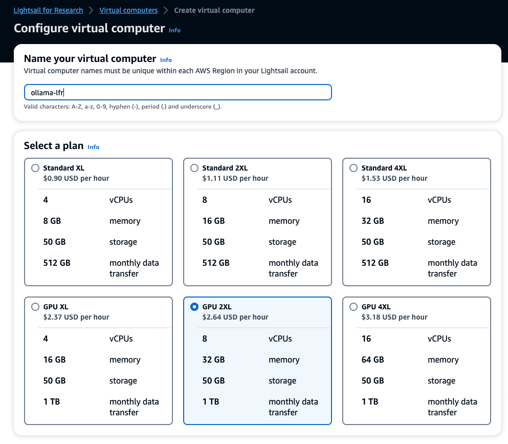

I recently taught a prompt engineering workshop at a conference. The venue could not confirm if the WiFi network could meet the requirements of the workshop. Attendees are often frustrated by slow Internet and fail to get the full value of the course. As an instructor, having to find workarounds to infrastructure shortcomings is equally frustrating. I decided to have the attendees run the workshop on their personal computers.

I looked at several options. such as [llama.cpp](https://github.com/ggerganov/llama.cpp), but choose [Ollama](https://github.com/jmorganca/ollama) for its ease of installation and use, and simple integration. Ollama lets you run large language models  (LLMs) on a desktop or laptop computer. Although it is often used to run LLMs on a local computer, it can deployed in the cloud if you don’t have a computer with enough memory, disk space, or a GPU. This article shows you how to run Ollama on Lightsail for Research and get started with generative AI and LLMs.

## Run Ollama Locally

Running Ollama locally is the  common way to deploy it. On a computer with modest specifications, such as a minimum of 8 gb of RAM, a recent CPU (Intel i7), 10 gb of storage free, and a GPU, you can run a small LLM. Below are instructions for installing Ollama on Linux, macOS, and Windows.

### Linux and macOS

1. Download and install Ollama: https://ollama.ai/download
2. Open a terminal and start ollama.
    ```bash
    $ ollama serve
    ```

3. Check to see if it is installed.
    ```bash
    $ ollama –version
    ```

4. Choose and pull a large language model from the list of available models. For a local install, use `orca-mini` which is a smaller LLM. 
    ```bash
    $ ollama pull orca-mini
    ```

5. Run the model in the terminal.
    ```bash
    $ ollama run orca-mini
    ```

### Windows

Windows currently does not have a native client, but you can run ollama from a Docker container.

1. Install Docker using these [instructions](https://docs.docker.com/desktop/install/windows-install/).
2. Open a Powershell window as Administrator.
3. Pull the ollama container image from Docker Hub. Copy and paste this command in the Powershell window.
    ```powershell
    > docker pull ollama/ollama
    ```

4. Start the ollama container. Copy and paste this command in the Powershell window.
    ```powershell
    > docker run -d -v ollama:/root/.ollama -p 11434:11434 —name ollama ollama/ollama
    ```

5. To run a model locally, copy and paste this command in the Powershell window.
    ```powershell
    > docker exec -it ollama ollama run orca-mini
    ```

6. Choose and pull a LLM from the list of available models. For a local install, use `orca-mini` which is a smaller LLM.
    ```powershell
    > ollama pull orca-mini
    ```

7. Run a model in the Powershell console.
    ```powershell
    > ollama run orca-mini
    ```

## Running Ollama on AWS Lightsail for Research

[Lightsail for Research](https://docs.aws.amazon.com/lightsail-for-research/latest/ug/what-is-lfr.html?sc_channel=el&sc_campaign=post&sc_content=run-large-language-models-with-ollama-and-lightsail-for-research&sc_geo=mult&sc_country=mult&sc_outcome=acq) provides instances designed for compute intensive tasks such as machine learning. Instances are bundled with RStudio, JupyterLab, SciLab, VSCodium, and Ubuntu for installing your own machine learning stack. To get started with Lightsail for Research, use the search bar in the AWS console home page.


Choose the **Ubuntu** instance.


LLMs are compute intensive and work with a minimum 16 GB of memory and a GPU. For this example, choose the **GPU 2XL** plan and name the instance.



It can take several minutes to launch and initialize the instance. When it is in a **Running** state, choose **Launch Ubuntu** to open the desktop interface in a browser window.


Choose the defaults (**Next**) for the desktop setup.


With the desktop setup complete, choose **Activities** on the top left of the desktop to display the application tool bar.


To display the installed applications, choose the icon on the far right.


Choose the **Terminal** icon to open a terminal.


With a terminal open, install Ollama and download llama2 LLM.

```bash
$ sudo curl https://ollama.ai/install.sh | sh
$ ollama pull llama2
```

Ollama starts after the install. To use Ollama and llama2 in the terminal, enter the following.

```bash
$ ollama run llama2
```

The Ollama client runs in the terminal and you can enter prompts.

## Running llama2 in a Jupyter Notebook

Ollama runs as a server whether you are running it locally or on a Lightsail for Research instance. We can use a Jupyter Notebook to connect to llama2 via Ollama and run a prompt program. First, check that you have Python 3.10 installed. If Python 3 is available, install pip-env to create an environment for the project.

```bash
$ which python3
$ sudo apt install python3.10-venv
```

Next create a virtual environment and activate it so you can install Python packages.

```bash
$ mkdir ollama && cd ollama
$ python -m venv venv
$ source venv/bin/activate
```

Install the python packages. We will use langchain to connect to Ollama in this example.

```bash
$ pip install jupyter
$ pip install langchain
```

Start a Jupyter notebook.

```bash
$ jupyter notebook
```

Jupyter will open a browser window.


Choose **New**, then **Notebook**.


Select **Python 3 (ipykernel)**,


In the first cell of the notebook, use the following code to connect to Ollama using langchain and send a prompt. Choose **Run** in the menu bar on top to execute the program.

```python
# langchain connects to Ollama - https://ollama.ai/
from langchain.llms import Ollama
from langchain.callbacks.manager import CallbackManager
from langchain.callbacks.streaming_stdout import StreamingStdOutCallbackHandler
llm = Ollama(model="llama2",
callback_manager = CallbackManager([StreamingStdOutCallbackHandler()]))

llm("Why is the sky blue?")
```

Llama2 will return a response to the prompt.


## Clean Up

Stop and delete the Ubuntu instance when you are finished to avoid additional charges.


## Summary

Whether you choose to run Ollama locally or in the cloud with AWS Lightsail for Research, you can try different LLMs to learn about generative AI and prompt engineering. However, Ollama is not limited to just prompts, with langchain you explore other techniques such retrieval-augmented generation (RAG) against live data and extending LLMs to domain specific topics. Ollama lets you build a generative AI playground with a minimum of effort.
