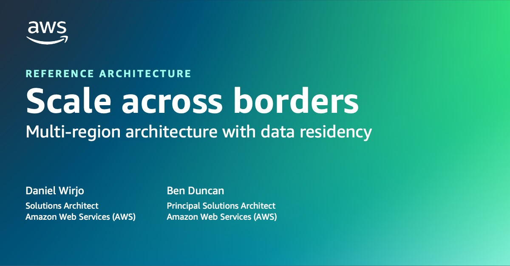

|ToC|
|---|

## Overview

In a world where data security and privacy requirements are becoming increasingly stringent, businesses face the challenge of expanding globally while maintaining compliance with data residency requirements. In this post, we cover a high-level reference architecture to illustrate how you can deploy a multi-region architecture while maintaining data residency. We provide accompanying [code sample](https://github.com/aws-samples/multi-region-data-residency) using [AWS Cloud Development Kit (CDK)](https://aws.amazon.com/cdk/?sc_channel=el&sc_campaign=appswave&sc_content=scale-beyond-borders&sc_geo=mult&sc_country=mult&sc_outcome=acq) as well as considerations and best-practices to assist with your implementation.

This architecture is suitable for scaling startups and businesses operating in regulated industries such as Healthcare and Life Sciences (HCLS) and Financial Services (FinTech). And, those who are building the foundation for a global business, or seeking to scale from a single-region architecture.

## AWS reference architecture for multi-region with data residency

The example high-level architecture covers a full-stack web application. It uses a [silo](https://docs.aws.amazon.com/wellarchitected/latest/saas-lens/silo-pool-and-bridge-models.html?sc_channel=el&sc_campaign=appswave&sc_content=scale-beyond-borders&sc_geo=mult&sc_country=mult&sc_outcome=acq) model with isolated infrastructure stacks for each region. With this architecture, businesses can securely handle sensitive data like Personally Identifiable Information (PII) or Personal Health Information (PHI) while adhering to regional compliance standards.

Let’s walk through the components of the high-level architecture:

1. User connects to application hosted on [AWS Amplify](https://aws.amazon.com/amplify/?sc_channel=el&sc_campaign=appswave&sc_content=scale-beyond-borders&sc_geo=mult&sc_country=mult&sc_outcome=acq). [Amazon CloudFront](https://aws.amazon.com/cloudfront/?sc_channel=el&sc_campaign=appswave&sc_content=scale-beyond-borders&sc_geo=mult&sc_country=mult&sc_outcome=acq) provides global edge caching to minimize end-user latency.  

2. [Amazon Cognito](https://aws.amazon.com/cognito/?sc_channel=el&sc_campaign=appswave&sc_content=scale-beyond-borders&sc_geo=mult&sc_country=mult&sc_outcome=acq) is used for authentication including login and sign up. It is a regional service and can be deployed to each region. The application can integrate to Cognito using [Amplify UI Authenticator](https://ui.docs.amplify.aws/react/connected-components/authenticator?sc_channel=el&sc_campaign=appswave&sc_content=scale-beyond-borders&sc_geo=mult&sc_country=mult&sc_outcome=acq).  

3. [Amazon DynamoDB Global Tables](https://docs.aws.amazon.com/amazondynamodb/latest/developerguide/GlobalTables.html) is used to store the user’s data residency and replicated across regions. [Amazon Cognito Lambda Triggers](https://docs.aws.amazon.com/cognito/latest/developerguide/cognito-user-identity-pools-working-with-aws-lambda-triggers.html?sc_channel=el&sc_campaign=appswave&sc_content=scale-beyond-borders&sc_geo=mult&sc_country=mult&sc_outcome=acq) (pre-auth and pre-signup) will use the data to ensure that the user is allocated to the appropriate region.  

4. [Amazon Route 53 Geolocation Routing](https://docs.aws.amazon.com/Route53/latest/DeveloperGuide/routing-policy-geo.html?sc_channel=el&sc_campaign=appswave&sc_content=scale-beyond-borders&sc_geo=mult&sc_country=mult&sc_outcome=acq) (alternatively [Latency Routing](https://docs.aws.amazon.com/Route53/latest/DeveloperGuide/routing-policy-latency.html?sc_channel=el&sc_campaign=appswave&sc_content=scale-beyond-borders&sc_geo=mult&sc_country=mult&sc_outcome=acq)) provides a global API endpoint based on the user’s geolocation, and failover capability.  

5. [Amazon API Gateway Regional Endpoint](https://docs.aws.amazon.com/apigateway/latest/developerguide/api-gateway-api-endpoint-types.html#api-gateway-api-endpoint-types-regional?sc_channel=el&sc_campaign=appswave&sc_content=scale-beyond-borders&sc_geo=mult&sc_country=mult&sc_outcome=acq) (alternatively [Application Load Balancer](https://docs.aws.amazon.com/elasticloadbalancing/latest/application/introduction.html?sc_channel=el&sc_campaign=appswave&sc_content=scale-beyond-borders&sc_geo=mult&sc_country=mult&sc_outcome=acq)) provides an endpoint for each region. See #8 for more details.  

6. [AWS Lambda](https://aws.amazon.com/lambda/?sc_channel=el&sc_campaign=appswave&sc_content=scale-beyond-borders&sc_geo=mult&sc_country=mult&sc_outcome=acq) (or alternative compute services such as [Amazon ECS with Fargate](https://docs.aws.amazon.com/AmazonECS/latest/developerguide/AWS_Fargate.html?sc_channel=el&sc_campaign=appswave&sc_content=scale-beyond-borders&sc_geo=mult&sc_country=mult&sc_outcome=acq)) provides the backend for the API.  

7. Storage and databases (such as [Amazon Simple Storage Service (S3)](https://aws.amazon.com/s3/?sc_channel=el&sc_campaign=appswave&sc_content=scale-beyond-borders&sc_geo=mult&sc_country=mult&sc_outcome=acq) and Amazon [Relational Database Service (RDS)](https://aws.amazon.com/rds/?sc_channel=el&sc_campaign=appswave&sc_content=scale-beyond-borders&sc_geo=mult&sc_country=mult&sc_outcome=acq), and [Amazon DynamoDB](https://aws.amazon.com/dynamodb/?sc_channel=el&sc_campaign=appswave&sc_content=scale-beyond-borders&sc_geo=mult&sc_country=mult&sc_outcome=acq)) is used to store sensitive data. These are isolated to each region.  

8. Optionally, the regional API endpoint can be accessed directly for the user to access their desired region, bypassing the default. For additional security, consider [Amazon CloudFront](https://aws.amazon.com/cloudfront/?sc_channel=el&sc_campaign=appswave&sc_content=scale-beyond-borders&sc_geo=mult&sc_country=mult&sc_outcome=acq) and [AWS WAF](https://aws.amazon.com/waf/?sc_channel=el&sc_campaign=appswave&sc_content=scale-beyond-borders&sc_geo=mult&sc_country=mult&sc_outcome=acq).

For more details on the implementation, see the [code sample](https://github.com/aws-samples/multi-region-data-residency) for demo application.

## Preparing for a multi-region architecture

Adopting multi-region is a significant undertaking, consider the following before taking the plunge:

### Be wary of added cost and complexity

Adopting a multi-region architecture can bring additional costs, complexities across your application design and [operations](https://docs.aws.amazon.com/whitepapers/latest/aws-multi-region-fundamentals/multi-region-fundamental-4-operational-readiness.html?sc_channel=el&sc_campaign=appswave&sc_content=scale-beyond-borders&sc_geo=mult&sc_country=mult&sc_outcome=acq). As such, we typically advise startups to challenge and dive deep on the the necessity for a multi-region architecture, including understanding specific compliance requirements, and key drivers. Expanding your business globally does *not* necessarily  require a multi-region architecture.

### Deep dive into regulatory and compliance requirements

Compliance is a shared responsibility between AWS and the customer (you). On the AWS side, we publish our compliance reports on [AWS Artifact](https://aws.amazon.com/artifact/?sc_channel=el&sc_campaign=appswave&sc_content=scale-beyond-borders&sc_geo=mult&sc_country=mult&sc_outcome=acq), and [AWS Compliance Center](https://aws.amazon.com/financial-services/security-compliance/compliance-center/?sc_channel=el&sc_campaign=appswave&sc_content=scale-beyond-borders&sc_geo=mult&sc_country=mult&sc_outcome=acq) provides research cloud-related regulatory requirements and how they impact your industry. On the customer side, ensure that you are aware of your responsibilities. To assist with this, we publish guidance such as [navigating GDPR compliance](https://docs.aws.amazon.com/whitepapers/latest/navigating-gdpr-compliance/welcome.html?sc_channel=el&sc_campaign=appswave&sc_content=scale-beyond-borders&sc_geo=mult&sc_country=mult&sc_outcome=acq). As at time of writing, compliance to [GDPR](https://aws.amazon.com/compliance/gdpr-center/?sc_channel=el&sc_campaign=appswave&sc_content=scale-beyond-borders&sc_geo=mult&sc_country=mult&sc_outcome=acq) does *not* necessarily mandate data residency. In fact, many regulations are principles-based and does *not* mandate specific requirements. If data residency is *not* strictly required, then implementing general security controls may be of higher priority to mitigate against more important risks. Here, consider working towards compliance to a recognised international security standard (such as ISO27001, SOC II, and NIST800-53) which provides guidance on security for your overall organization. For your compliance journey, we provide AWS-native tools such as [AWS Config](https://aws.amazon.com/config/?sc_channel=el&sc_campaign=appswave&sc_content=scale-beyond-borders&sc_geo=mult&sc_country=mult&sc_outcome=acq) and [AWS Audit Manager](https://aws.amazon.com/audit-manager/?sc_channel=el&sc_campaign=appswave&sc_content=scale-beyond-borders&sc_geo=mult&sc_country=mult&sc_outcome=acq), as well as partner solutions such as [Drata](https://aws.amazon.com/marketplace/seller-profile?id=f717f717-faab-4726-bb7f-b09cbac8508c?sc_channel=el&sc_campaign=appswave&sc_content=scale-beyond-borders&sc_geo=mult&sc_country=mult&sc_outcome=acq). In addition, our marketplace also has a wealth of security and data protection solutions, such as [DataMasque](https://aws.amazon.com/marketplace/seller-profile?id=2f3af275-ed6c-43dd-8463-cf52d94fc354?sc_channel=el&sc_campaign=appswave&sc_content=scale-beyond-borders&sc_geo=mult&sc_country=mult&sc_outcome=acq) and [Skyflow](https://aws.amazon.com/marketplace/pp/prodview-zysz3tjic76qg?sr=0-1&ref_=beagle&applicationId=AWSMPContessa?sc_channel=el&sc_campaign=appswave&sc_content=scale-beyond-borders&sc_geo=mult&sc_country=mult&sc_outcome=acq). 

### Consider a simpler architecture

To achieve the best performance and user experience for customers in the new region, you may think that a multi-region architecture is required. However, let’s challenge this assumption. Consider starting with a simplified architecture such as introducing [Amazon CloudFront](https://aws.amazon.com/cloudfront/?sc_channel=el&sc_campaign=appswave&sc_content=scale-beyond-borders&sc_geo=mult&sc_country=mult&sc_outcome=acq) to a single-region architecture. CloudFront has global points-of-presence to reduce end-user latency to your global users. Similarly, for availability and Disaster Recovery (DR), we recommend to first consider a multi-AZ architecture. At AWS, we define an [availability zone (AZ)](https://docs.aws.amazon.com/AWSEC2/latest/UserGuide/using-regions-availability-zones.html?sc_channel=el&sc_campaign=appswave&sc_content=scale-beyond-borders&sc_geo=mult&sc_country=mult&sc_outcome=acq) as isolated locations with redundancy. The risk of outage of multiple availability zones is very low.

### Automate, automate, automate

If you have not adopted infrastructure as code and automated your deployment process, consider implementing this first. In the reference architecture, we have used [AWS Cloud Development Kit (CDK)](https://aws.amazon.com/cdk/?sc_channel=el&sc_campaign=appswave&sc_content=scale-beyond-borders&sc_geo=mult&sc_country=mult&sc_outcome=acq) which allows you to define your infrastructure with familiar programming languages such as TypeScript or Python.

## Considerations and best-practices when adopting a multi-region architecture

If a multi-region architecture is required, consider the following factors:

### Think big, but start small

The fastest path to get your application into a new region is to replicate your infrastructure stack to the new region. Starting with this approach allows you to get your product in market and into the hands of users in your target region. This allows you to iterate your product,  obtain feedback from customers, and localize your product offering for the new region.

### Support local requirements through global customization

If you are required to release updates specific to the local region, consider introducing the feature as a configurable feature. This allows consistent application source code and infrastructure across regions. To implement, consider using [feature flags using AWS AppConfig](https://aws.amazon.com/blogs/mt/using-aws-appconfig-feature-flags/?sc_channel=el&sc_campaign=appswave&sc_content=scale-beyond-borders&sc_geo=mult&sc_country=mult&sc_outcome=acq) which also facilitates fast iteration through [trunk-based development](https://aws.amazon.com/builders-library/cicd-pipeline/?sc_channel=el&sc_campaign=appswave&sc_content=scale-beyond-borders&sc_geo=mult&sc_country=mult&sc_outcome=acq).

### Build foundation for efficiency using SaaS design principles

As you grow, it is important to review [software-as-a-service (SaaS) design principles](https://docs.aws.amazon.com/wellarchitected/latest/saas-lens/general-design-principles.html?sc_channel=el&sc_campaign=appswave&sc_content=scale-beyond-borders&sc_geo=mult&sc_country=mult&sc_outcome=acq). The example reference architecture draws upon some of the concepts outlined such as [tenant](https://docs.aws.amazon.com/wellarchitected/latest/saas-lens/tenant.html?sc_channel=el&sc_campaign=appswave&sc_content=scale-beyond-borders&sc_geo=mult&sc_country=mult&sc_outcome=acq). In a SaaS, typically a tenant corresponds to a customer, and data is partitioned accordingly. For example, *Customer 1* cannot see data for *Customer 2*. The same principle can be applied to this architecture where *Region 1* is isolated from *Region 2*. As each tenant uses its own separate infrastructure, the architecture uses a [silo isolation](https://docs.aws.amazon.com/wellarchitected/latest/saas-lens/silo-isolation.html?sc_channel=el&sc_campaign=appswave&sc_content=scale-beyond-borders&sc_geo=mult&sc_country=mult&sc_outcome=acq) model. For cost efficiency, infrastructure resources can be [pooled](https://docs.aws.amazon.com/wellarchitected/latest/saas-lens/pool-isolation.html?sc_channel=el&sc_campaign=appswave&sc_content=scale-beyond-borders&sc_geo=mult&sc_country=mult&sc_outcome=acq) over time.

### Bind user identity to tenant identity

It is highly likely that every layer of the application will need to be aware of this tenant context. The most efficient approach is to introduce the context is through the identity layer. In the reference architecture, we use `custom:region` user attribute which is then passed to the application via JSON Web Tokens (JWT) tokens as a custom claim. As the application is expanded to multiple services, each service can simply use the token to gain tenant awareness. Without relying on another service, each service can decrypt the tokens to determine the context, apply the appropriate isolation logic, connect to the relevant data source as well as pass data to monitoring and logging tools. The logic can be abstracted from developers for development efficiency and simplicity.

### Implement additional security controls as your grow

As your team grows, there can be more room for mistakes. Consider layering security controls over time to improve protection of sensitive data. For example, you can consider [data residency controls](https://docs.aws.amazon.com/controltower/latest/userguide/data-residency-controls.html?sc_channel=el&sc_campaign=appswave&sc_content=scale-beyond-borders&sc_geo=mult&sc_country=mult&sc_outcome=acq) using [AWS Control Tower](https://aws.amazon.com/controltower/?sc_channel=el&sc_campaign=appswave&sc_content=scale-beyond-borders&sc_geo=mult&sc_country=mult&sc_outcome=acq), performing a [Well-Architected: Security](https://docs.aws.amazon.com/wellarchitected/latest/security-pillar/welcome.html?sc_channel=el&sc_campaign=appswave&sc_content=scale-beyond-borders&sc_geo=mult&sc_country=mult&sc_outcome=acq) review for a holistic assessment, and [evolving your security capabilities at key growth stages](https://www.youtube.com/watch?v=_i4YcLkZrLc&t=494s).

https://www.youtube.com/watch?v=_i4YcLkZrLc&t=494s

## Conclusion

In this post, we explored the significance of data residency, particularly in regulated industries such as healthcare, life sciences and financial services, where protecting sensitive customer data is paramount. We covered a high-level reference architecture which allows you to establish a solid foundation for your global business, enabling expansion to new regions, while maintaining compliance, and safeguarding sensitive data. If you would like to learn more, we encourage you to explore the accompanying [code sample](https://github.com/aws-samples/multi-region-data-residency) and demo application, and diving deeper into the links to resources posted throughout the post.

If you are plotting for world domination or looking to expand to a new region, feel free to [watch our AWS On-Air episode on the topic](https://www.youtube.com/watch?v=k9SJfMgzAkc) or contact your [AWS account team](https://aws.amazon.com/blogs/startups/meet-your-aws-account-team/?sc_channel=el&sc_campaign=appswave&sc_content=scale-beyond-borders&sc_geo=mult&sc_country=mult&sc_outcome=acq) to learn more about the programs we offer and alternative multi-region architecture patterns.

https://www.youtube.com/watch?v=k9SJfMgzAkc