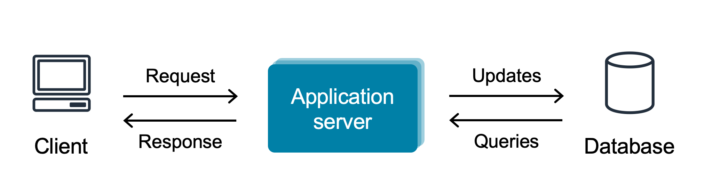
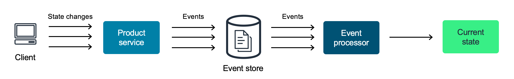
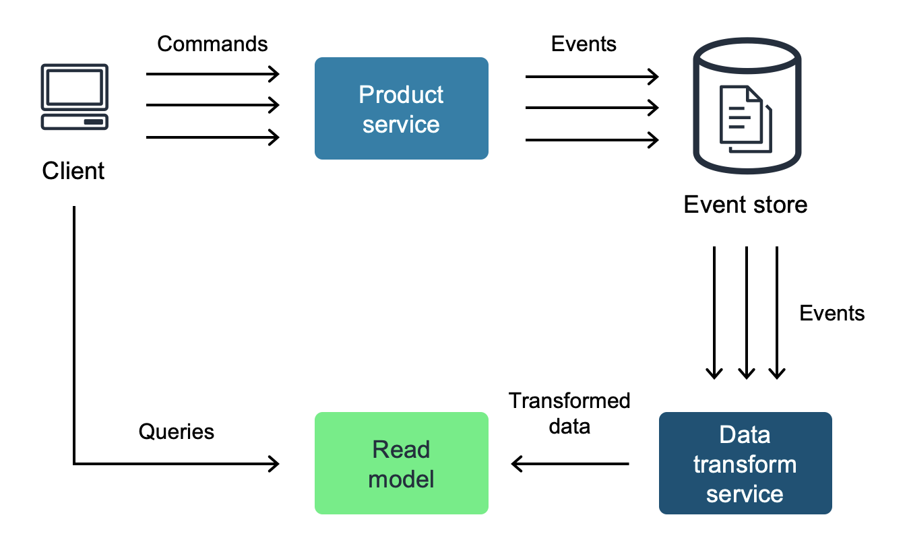
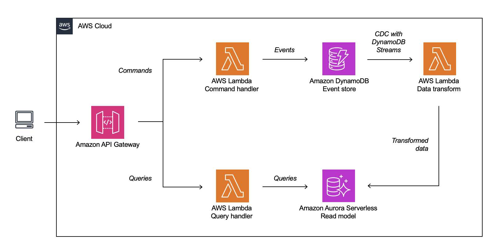
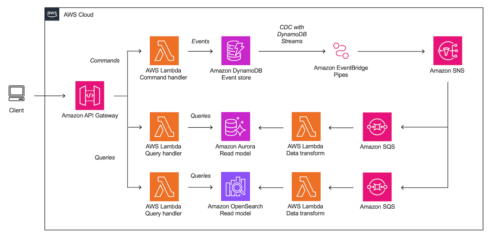

When building scalable distributed systems, it is important to understand the different architecture patterns available and when to apply them. Among these patterns, Command Query Responsibility Segregation (CQRS) has emerged as a popular choice, especially when combined with event sourcing. This article introduces CQRS and event sourcing, highlights why AWS serverless services align well with these architectural patterns, and provides guidance on determining whether they are the right choice for a given scenario.

## Starting out with CRUD

Many systems start out with a Create, Read, Update, and Delete (CRUD) data access pattern. In case of a CRUD, the current state of the system is typically stored in a database. For relational databases, operations in CRUD are synchronous, blocking access to the specific data being updated until the operation completes. This ensures data consistency by preventing multiple simultaneous updates on the same data from causing conflicts or inconsistencies.

CRUD provides a simple and consistent way to interact with data and is well supported by popular frameworks such as [Ruby on Rails](https://rubyonrails.org/), [Spring](https://spring.io/) or [Django](https://www.djangoproject.com/). A typical CRUD system looks like this:

As load increases and business logic becomes more complex, CRUD-based systems can begin to show shortcomings. Because transactions are handled synchronously, the data model must manage competing transactions which can strain its resources and hinder scalability. When response times increase due to this load, the blocking nature of these results also leads to a poor user experience.

Simple CRUD-based systems also lack reproducibility because they typically story only the latest state of the system in their data model. When an update is made, the older state is forgotten and it becomes difficult to retrace how the data model got to its current state.

## Enter event sourcing

One architecture pattern that addresses some of the challenges of CRUD is event sourcing. With event sourcing, the current state of the system is not stored as a snapshot in a database as is the case with CRUD. Instead, the current state of the system is derived from a set of atomic, immutable events. These events are stored in an append-only log, the event store.

Each event represents an important fact that has happened in the context of the system, caused by a change in system state. For example, in the case of an e-commerce product catalog, `ProductCreated` would be such an event. Because events are stored in an append-only log, they cannot be modified or deleted. Instead, if you want to delete an event, you must create a new one that offsets the previous event.

With all past events available in the event store, the entire history and context of the system can be accessed at any time. This means that you can compute any previous state of the system based on the stored events. Similarly, you can reconstruct the state of the system at any point in time. The event store can provide valuable insight as a source for analytics and it’s immutability makes it a good audit log.

However, the nature of event sourcing also presents a scalability challenge. Let’s say you need to render a website view for a user to see all the products currently available. Following the previous explanation of event sourcing, the system would need to retrace all previous `ProductCreated` events, as well as, for example, related `ProductDeleted` events, to arrive at the current list of products. With many of these events in the event store, this becomes a computationally intensive operation to perform each time this website view is requested by a client.

## Scaling with CQRS

Command Query Responsibility Segregation (CQRS) is an architecture pattern that separates read and write operations in a system.

In the context of CQRS, events are the results of _commands_. A command represents an intent such as `CreateProduct`. Commands are derived from the business logic of the system and set business processes in motion. Each command either produces an event, throws an error, is rejected, or has no effect. Commands are triggered by a client, such as the user interface of an application.

_Queries_, such as `GetProducts`, interact only with a read data store and only return data without causing any side effects. On the other hand, commands that change the state of the system interact with a different write-optimized data store. By separating these concerns, you can optimize each type of operation independently, allowing for greater flexibility and scalability.

CQRS can be combined with event sourcing to overcome some of its scalability issues. In this case, the events produced by commands are once again stored in an event store. Events being written to the event store are asynchronously pushed into a separate read data store and undergo a transformation step to fit the read data model.

This approach has several advantages. By separating the read and write sides of the system, they can be scaled independently. Since reads are often more frequent than writes, scaling the read side independently can be more efficient and cost-effective. When implemented correctly, downtime or performance degradation on one side does not have to affect the other, resulting in improved availability and resiliency of the system.

The separation of concerns between reads and writes also allows for the use of different technologies, such as databases or frameworks. It also allows for more than one read model, making it possible to use multiple specialized read models for different use cases in the same system.

Because the read data store now always contains a current state of the system, there is no need to compute the system state based on all the events in the event store. Still, the event store can be used to replay available events if the read datastore missed them, or if you want to hydrate a new read data model.

## A first look at serverless CQRS

You can use a variety of technologies to implement event sourcing and CQRS. When combined with AWS serverless services, the benefits of event sourcing and CQRS become even more pronounced.

With serverless services, you can automatically and independently scale both the read and write sides of a system, using the auto-scaling capabilities of serverless. In addition, serverless services natively provide high availability, reducing the challenges and complexities associated with hands-on infrastructure management and fault tolerance. A key benefit of serverless is its pay-per-use pricing model, which, combined with automatic scaling, makes it a cost-effective option for CQRS.

Because serverless services like AWS Lambda are event-driven, they can respond to triggers such as commands or database changes. This can streamline CQRS architectures and maximize cost effectiveness.

A simple architecture for implementing serverless event sourcing and CQRS looks like this:

- [Amazon API Gateway](https://aws.amazon.com/api-gateway/?sc_channel=el&sc_campaign=post&sc_content=scaling-distributed-systems-event-sourcing-cqrs-serverless&sc_geo=mult&sc_country=mult&sc_outcome=acq) serves as a highly scalable and managed entry point to the system, routing commands and queries to their respective handlers.
- [AWS Lambda](https://aws.amazon.com/lambda/?sc_channel=el&sc_campaign=post&sc_content=scaling-distributed-systems-event-sourcing-cqrs-serverless&sc_geo=mult&sc_country=mult&sc_outcome=acq), a serverless, event-driven compute service, is used to implement command and query handlers that perform tasks such as validating data, triggering business logic, and storing events in the event store.
- [Amazon DynamoDB](https://aws.amazon.com/dynamodb/?sc_channel=el&sc_campaign=post&sc_content=scaling-distributed-systems-event-sourcing-cqrs-serverless&sc_geo=mult&sc_country=mult&sc_outcome=acq) is used as the event store. DynamoDB is a fully managed, serverless, key-value NoSQL database. The flexible schema of NoSQL databases makes them well suited for storing the events with widely varying properties that exist in complex systems. Because DynamoDB does not need to optimize for complex joins between tables or relations, it is highly scalable for writes.
- [DynamoDB Streams](https://docs.aws.amazon.com/amazondynamodb/latest/developerguide/Streams.html?sc_channel=el&sc_campaign=post&sc_content=scaling-distributed-systems-event-sourcing-cqrs-serverless&sc_geo=mult&sc_country=mult&sc_outcome=acq) is a feature of DynamoDB that provides a near real-time flow of information about changes to items in a DynamoDB table that can be accessed by applications. The combination of DynamoDB and DynamoDB Streams is well suited for implementing a serverless event store. For more detailed guidance, see also the AWS blog post [Build a CQRS event store with Amazon DynamoDB](https://aws.amazon.com/blogs/database/build-a-cqrs-event-store-with-amazon-dynamodb/?sc_channel=el&sc_campaign=post&sc_content=scaling-distributed-systems-event-sourcing-cqrs-serverless&sc_geo=mult&sc_country=mult&sc_outcome=acq).
- A Lambda function [is triggered by events on the DynamoDB stream](https://docs.aws.amazon.com/amazondynamodb/latest/developerguide/Streams.Lambda.html). The function performs the necessary data transformations and updates the current system state in the read model. [Lambda event source mappings](https://docs.aws.amazon.com/lambda/latest/dg/invocation-eventsourcemapping.html?sc_channel=el&sc_campaign=post&sc_content=scaling-distributed-systems-event-sourcing-cqrs-serverless&sc_geo=mult&sc_country=mult&sc_outcome=acq) can be used to automatically poll new events from the DynamoDB stream in batches for processing.
- In this sample architecture, the read model is implemented using an [Amazon Aurora Serverless](https://aws.amazon.com/rds/aurora/serverless/?sc_channel=el&sc_campaign=post&sc_content=scaling-distributed-systems-event-sourcing-cqrs-serverless&sc_geo=mult&sc_country=mult&sc_outcome=acq) database.

## Scaling to multiple read models

As a system grows in complexity, implementing multiple read models can maintain scalability and support new use cases. Multiple read models allow you to accommodate different user needs by providing specific views of the data. But how do you do this without overburdening the underlying infrastructure?

To enable the sample architecture introduced earlier to scale to multiple read models without introducing performance bottlenecks or concentrating too much business logic in a single place, you can rely on the principles of event-driven architecture.

This means that the components of your application communicate asynchronously, resulting in loose coupling. This decoupling ensures that the failure of one component doesn't cascade throughout the system, making it more resilient. At the same time, you retain the flexibility to integrate new components, such as new read models, without disrupting existing processes. Because components are not interdependent, they can scale, evolve, and fail independently.

- Instead of pushing data directly to read models, it is published to an [Amazon Simple Notification Service (Amazon SNS)](https://aws.amazon.com/sns/) topic via [Amazon EventBridge Pipes](https://aws.amazon.com/eventbridge/pipes/?sc_channel=el&sc_campaign=post&sc_content=scaling-distributed-systems-event-sourcing-cqrs-serverless&sc_geo=mult&sc_country=mult&sc_outcome=acq) which provides serverless point-to-point integrations between event producers and consumers. The SNS topic can then fan out the transformed data to any number of read models. Learn more about decoupling event publishing with EventBridge Pipes [in this blog post](https://aws.amazon.com/blogs/compute/decoupling-event-publishing-with-amazon-eventbridge-pipes/?sc_channel=el&sc_campaign=post&sc_content=scaling-distributed-systems-event-sourcing-cqrs-serverless&sc_geo=mult&sc_country=mult&sc_outcome=acq).
- Each read model has its own [Amazon Simple Queue Service (Amazon SQS)](https://aws.amazon.com/sqs/?sc_channel=el&sc_campaign=post&sc_content=scaling-distributed-systems-event-sourcing-cqrs-serverless&sc_geo=mult&sc_country=mult&sc_outcome=acq) queue. This queue subscribes to the SNS topic and receives change data on new events. [SNS message filtering](https://docs.aws.amazon.com/sns/latest/dg/sns-message-filtering.html?sc_channel=el&sc_campaign=post&sc_content=scaling-distributed-systems-event-sourcing-cqrs-serverless&sc_geo=mult&sc_country=mult&sc_outcome=acq) can be applied to only receive only a subset of messages from the event store. This architectural pattern is known as [topic queue chaining](https://docs.aws.amazon.com/prescriptive-guidance/latest/patterns/chain-aws-services-together-using-a-serverless-approach.html?sc_channel=el&sc_campaign=post&sc_content=scaling-distributed-systems-event-sourcing-cqrs-serverless&sc_geo=mult&sc_country=mult&sc_outcome=acq).
- For each read model, an AWS Lambda function reads polls the SQS queues and updates the current state of each read model. The function applies necessary data transformations. Lambda event source mappings can simplify polling the SQS queue.
- [Amazon OpenSearch](https://aws.amazon.com/opensearch-service/?sc_channel=el&sc_campaign=post&sc_content=scaling-distributed-systems-event-sourcing-cqrs-serverless&sc_geo=mult&sc_country=mult&sc_outcome=acq) is added as a second sample read model.

The elements selected for the above sample architecture represent only one way to implement serverless CQRS. AWS services are building blocks that can be implemented flexibly depending on the requirements of a specific use case. You may also want to consider routing events to an [Amazon EventBridge](https://aws.amazon.com/eventbridge/?sc_channel=el&sc_campaign=post&sc_content=scaling-distributed-systems-event-sourcing-cqrs-serverless&sc_geo=mult&sc_country=mult&sc_outcome=acq) event bus to allow other teams within your organization to consume them.

## Evaluating event sourcing and CQRS

Event sourcing and CQRS offer compelling benefits, such as scalability, separation of concerns, and resiliency. However, adopting these architectural patterns doesn't come without its own set of challenges. They introduce eventual consistency, meaning that after data updates, different parts of the system might momentarily see different versions of data until eventually syncing. This can lead to a temporary state where not all components reflect the latest data changes. Additionally, their event-driven nature requires handling message failures, retries, and dead letter queues, adding further complexity.

Therefore, it is important to carefully evaluate on a case-by-case basis whether the benefits outweigh the additional effort. Event sourcing and CQRS should be applied sparingly and in a targeted manner only to those parts of a system that have a clear pain point that can be addressed with these architecture patterns.

This might be the case for parts of a system with unique scalability requirements for read and write operations, or those that require multiple read models with varied technological needs to enable different use cases such as reporting, caching, and search.

It might also be the case for environments with complex business logic, especially if there's a discernible difference between read and write logic, or in environments with hundreds of microservices and teams.

On the other hand, if your system is comfortably aligned with the CRUD data model and doesn't face scalability challenges or complex business logic, implementing CQRS can introduce unnecessary complexity without sufficient benefit. Similarly, if your system requires strong consistency and cannot tolerate eventual consistency, CQRS is not a good choice.

## Conclusion

Event sourcing and CQRS are powerful architecture patterns but they are not a one-size-fits-all solution. This article introduces CQRS and event sourcing, describes how AWS serverless services can be used to implement these patterns, and provides guidance for evaluating whether event sourcing and CQRS are appropriate for a particular situation.

With AWS serverless services, you can focus on architecting and building scalable and resilient systems instead of managing infrastructure. Automatic scaling, built-in high availability, and a pay-for-use billing model make AWS serverless services well suited for implementing event sourcing and CQRS.

To learn more about AWS serverless services and how you can use them to implement various architecture patterns, including event sourcing and CQRS, visit [Serverless Land](https://serverlessland.com/). Follow the [Event Driven Architecture learning path](https://serverlessland.com/event-driven-architecture) to dive deeper into how you can use events and asynchronous communication to loosely couple the components of an application.
